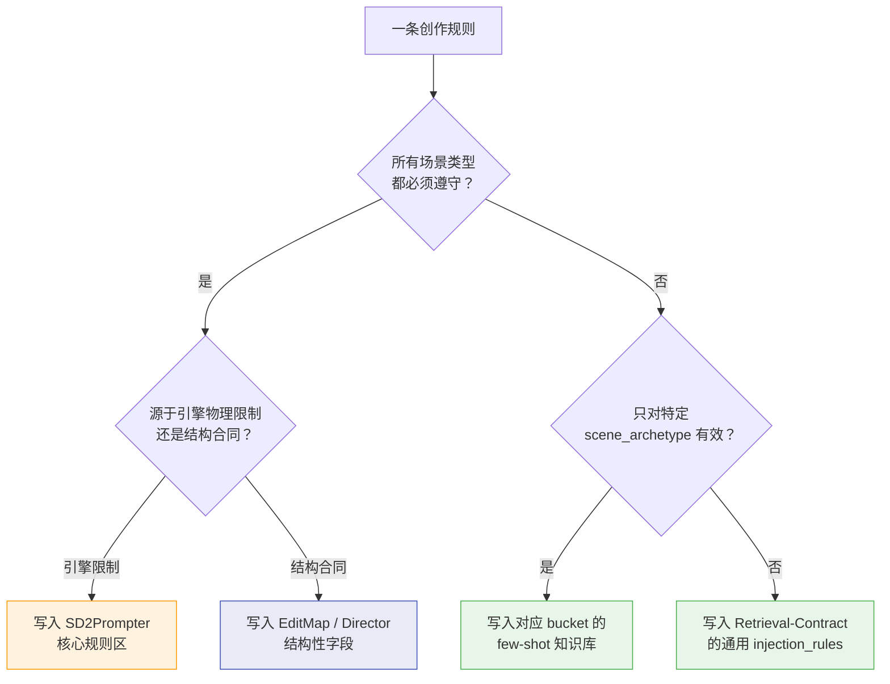
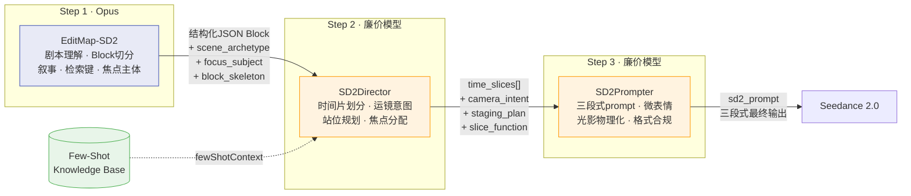
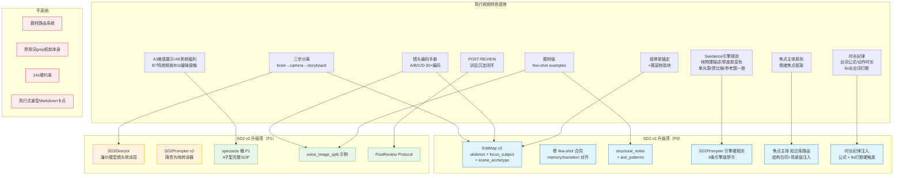

# SD2Workflow v2 升级计划

**基于风行视频 (fengxing-video) 项目对比分析**
**日期：2026-04-15**

---

## 一、对比分析背景

本文档基于对 `fengxing-video` 项目的深度分析，提炼出可应用于 SD2Workflow 的改进方向。

### 1.1 两个项目的架构对比

| 维度 | 风行视频 | SD2Workflow v1（当前） |
|------|---------|----------------------|
| **步骤数** | **3步**：brain → camera → storyboard（+ 可选 asset-prompt） | **2步**：EditMap-SD2 → SD2Prompter（+ 编排层检索） |
| **阶段间接口** | 落盘 Markdown，下游不读上游 SOP | JSON Block，编排层注入 fewShotContext |
| **题材管理** | 多题材隔离（REGISTRY 路由 + 每题材独立知识库） | 题材无关（通用 bucket 设计） |
| **知识库** | SOP 文档 + examples/ 目录（按题材分） | 结构化 bucket（6 桶 + Retrieval Contract） |
| **质量闭环** | POST-REVIEW 训后沉淀协议 | 无对应机制 |
| **防护机制** | 禁用词 grep 硬阻断 + 组骨架锚定 + 尾部校验块 | prompt_risk_flags + 引擎边界表 + 自检清单 |
| **镜头知识** | A/B/C/D 四大类 30+ 镜头类型编码手册 | 无独立镜头知识体系，依赖 few-shot 间接传递 |

### 1.2 风行视频的核心特色

#### 特色 1：三步分离的"认知分层"

风行把三步拆得很硬：

- **brain**（大脑）只管叙事理解：给剧本段落标注类型编码（A1-揭示式开场、C1-声画分离四段切、B7-特效释放...）、决定全集组数、产出禁用词清单、声明主角主体性
- **camera**（镜头语言）只管镜头设计：景别、运镜、组内切镜、14s 约束。严格 1:1 对齐 brain 的组骨架，禁止二次拆组
- **storyboard**（分镜）只管最终提示词：微表情、Seedance 字段顺序、画面描写细节

设计理念是 **"阶段之间只通过落盘文件通信"**——下游 agent 不读上游 SOP，避免认知污染。

#### 特色 2：镜头类型编码手册

这是风行最有特色的知识资产。四大类约 30 种编码：

- **A 类（场景氛围型）**：A1 揭示式开场、A2 速度氛围、A3 美感展示、A4 威压/权力登场、A5 夜戏/暗场悬疑、A6 闺蜜/日常温馨、A7 回忆/闪回、A8 豪华空间首次展示、A9 男频视觉福利
- **B 类（事件驱动型）**：B1 车辆到达、B2 角色首次登场、B3 一招制敌、B4 危机快切连击、B5 潜入/夜袭、B6 物件/道具揭示、B7 特效释放、B8 升格慢动作、B9 多人群战、B10 电话/通讯、B11 身体接触/暧昧、B12 偷听/窥视、B13 下跪/恳求
- **C 类（情绪节奏型）**：C1 声画分离四段切、C2 喜剧快切对话、C3 内心独白、C4 情绪转折点、C5 威压对峙、C6 悬念定格收尾、C7 独立表演组、C8 蒙太奇/时间压缩、C9 命令+连锁响应
- **D 类（转场/过渡型）**：D1 速度匹配转场、D2 视线匹配转场、D3 声音先行转场、D4 穿越物体转场、D5 闪回进出、D6 定格闪白硬切

brain 阶段给每个段落打编码，camera 看编码后按预定义运镜模板执行。实现了**"语义到技法的可控映射"**。

#### 特色 3：POST-REVIEW 训后沉淀

每集 Seedance 生成后执行闭环：

1. MAKALO 标注反馈（可用度、成功点、失败点、新规律）
2. 知识提炼（成功 → SOP 正式条目，失败 → 禁止项，新规律 → 判断是否通用）
3. 样本库更新（优秀组提取到 examples/，比现有样本更好则替换）
4. MATURITY.md 更新（追踪知识库成熟度）

核心原则：只沉淀可复现的规律；更好的样本替换旧样本，不累积；跨集验证 3 次以上才升级为"验证版"。

#### 特色 4：组骨架锚定 + 尾部校验块

针对模型"说 12 组写 18 组"的顽疾，设计了结构性防护：

- **组骨架锚定**：brain 输出固定格式骨架（`### 第X组 → [场次] [核心事件]`），camera 必须逐行继承标题作为前缀，标题数量不一致 = 产物作废
- **尾部校验块**：所有产物的校验信息写在文件最末尾（全部正文写完后再填）。要求模型回查"数一下有几个标题"、"逐条报告禁用词"，比开头预填更接近真实回查

#### 特色 5：题材级 few-shot 示例

`examples/` 里的样本来自真实产出验证，每个 sample 带：

- `【选取原因】`：为什么选这个样本
- `【结构观察点】`：这个样本要学什么——子镜头数量、间接叙事手法、微表情递进步数等

明确告诉 agent "学结构和品味，不学具体内容"。

---

## 二、核心问题判断

### 2.1 两步要不要变三步？

**结论：建议拆成轻量三步。**

但这里的"三步"不是风行那种**重型三 Agent + Markdown 落盘 + 人工卡点确认**，而是继续保持工程化 JSON 接口的**轻量三阶段**：

1. **EditMap-SD2（Opus 等高价模型）**
   只负责剧本理解与结构规划：Block 切分、叙事职责、资产锚定、few-shot 检索键、风险标记、焦点主体判断。

2. **SD2Director（廉价模型）**
   只负责镜头意图转译：时间片切分、站位、反应节点、运镜意图、连续性护栏、时间片级风险压缩。

3. **SD2Prompter（廉价模型）**
   只负责最终三段式 Seedance prompt：微表情、物理细节、风格措辞、技术合规。

#### 核心驱动力：模型分层策略（Opus + 廉价模型）

三步拆分的最根本理由是**模型成本分层**：

- **EditMap-SD2 用最贵的 Opus**：剧本理解、叙事拆解、Block 切分、商业钩子诊断——这些需要深度语义理解的任务，只有最强模型才能稳定执行。
- **SD2Director 和 SD2Prompter 用廉价模型**：只要上游给了足够的结构化约束，后两步的工作本质上是"受约束的转译"，廉价模型完全能胜任。

这个策略直接消除了"拆三步会把成本抬高"的顾虑——总 token 量可能增加，但**单价 × 数量的总成本反而更低**，因为最贵模型只跑一次。

#### 当前 SD2Prompter v1 的认知负载分析

以下是现有 `SD2Prompter` 各 Step 的认知类型拆解：

| Step | 任务 | 认知类型 | 模型要求 |
|------|------|---------|---------|
| Step 0 | 输入解析 + few-shot 激活 | 结构理解 | 中 |
| Step 0.5-0.6 | phase 节奏约束 | **叙事判断** | **高** |
| Step 1 | 时间片划分（2-8个） | **结构决策** | **高** |
| Step 2 | 八大要素审查 | **结构决策** | **高** |
| Step 3 | 光影物理化描写 | 文笔转译 | 低 |
| Step 4 | 材质交互 | 文笔转译 | 低 |
| Step 5 | 运镜推理 | 结构+转译混合 | 中 |
| Step 6 | 组装三段式 | 纯组装 | 低 |

**问题出在哪**：Step 1（时间片划分）和 Step 2（要素审查）是结构性决策，和 EditMap 同属"需要理解叙事意图"的任务。但 Step 3/4/6 是表面语言实现，相对机械。把这两类混在一个 Agent 里：

- 用 Opus 跑 → 后半段的文笔转译浪费钱
- 用廉价模型跑 → 前半段的结构决策容易出错（时间片切错、运镜选错、焦点主体判断偏差）

**三步拆分后**：Step 0.5-1-2 + 运镜推理的结构部分 → 归入 SD2Director（廉价模型，但有 EditMap 的强约束兜底）。Step 3-4-6 + 运镜措辞 → 归入 SD2Prompter（廉价模型，纯转译）。

#### 为什么廉价模型能稳定执行 SD2Director

关键在于 **EditMap-SD2（Opus）已经给出了足够多的结构化约束**。当前 v1 的 EditMap 输出已包含：

- `sd2_scene_type`（文戏/武戏/混合）→ 直接决定时间片策略
- `dialogue_time_budget`（每句对白的时长和拆分建议）→ 锚定对白时间片
- `beats[]`（trigger/payoff）→ 锚定关键节拍
- `few_shot_retrieval`（场景桶 + 结构标签）→ 运镜倾向参考
- `staging_constraints`（站位）→ 已锁定空间关系
- `continuity_hints`（光线/轴线/末尾状态）→ 已锁定连续性

v2 再加上 `scene_archetype`、`focus_subject`、`block_skeleton` 后，SD2Director 需要做的**真正创造性决策**就非常少——它更多是"按照上游的结构化意图，做精确的时间分配和运镜选型"。这是廉价模型能稳定执行的"受约束优化"问题。

**SD2Prompter v2 就更简单**——它拿到 SD2Director 已经切好的时间片 + 运镜意图 + 焦点主体，只需要转译成自然语言三段式。这是典型的"受约束的文笔任务"。

#### 信息丢失风险与应对

三步的主要风险是**每多一层传递，上游的微妙意图可能被稀释**。但 SD2 的 JSON 结构化接口已经大幅降低了这个风险——不像风行那样靠 Markdown 自然语言传递，SD2 的每个字段都是显式的。

**关键保障**：SD2Director 不是"理解剧本后自由发挥"，而是"消费 EditMap 的结构化 JSON 后做精确展开"。它的输入已经被 Opus 充分约束，它的输出会被 SD2Prompter 逐字段消费。这是两段**管道式转译**，不是两段**开放式创作**。

#### 其他支撑理由

1. **当前过载点就在第二步。** 现有 `SD2Prompter` 同时承担时间片规划、运镜决策、微表情、最终措辞，既像 `camera` 又像 `storyboard`，对廉价模型不友好。
2. **后两步本质上是不同类型的转译。** `SD2Director` 是"结构化镜头规划"，`SD2Prompter` 是"自然语言表面实现"。这两个问题拆开后，便宜模型更容易稳定。
3. **仍然可以保持工程效率。** 三步不等于三轮 Markdown 落盘，也不等于人工逐步确认；完全可以继续用 JSON、按 Block 并发、自动串联。

#### 与风行不同的地方

- 不做题材路由，不做多题材知识隔离
- 不强制每步落 Markdown
- 不要求每步人工卡点确认
- 不照搬 14s 组逻辑，而是保留 SD2 的 Block/时间片体系

#### 过渡方案

如果 v2 首轮不想立刻改执行接口，也可以先在 `SD2Prompter` 内部做一次 **Director Pass → Prompt Pass** 的双相推理；但从目标架构看，仍然建议尽快外显成三步。

### 2.2 Few-shot 知识库要不要更新或增加？

**结论：必须更新，但顺序不是"先加新桶"，而是"先修合同，再补检索，再扩内容"。**

当前 few-shot 库已经出现两类基础问题：

1. **规则与示例冲突**
   - `memory` 合同要求示例是独立记忆 Block，但现有示例仍在单 prompt 内写"现实 → 记忆 → 现实"
   - `transition` 规则禁止迁移装饰性细节，但现有示例自己带了高风险装饰元素

2. **示例缺少"如何学"的显式拆解**
   - 目前有 `pattern_summary` 和 `must_cover`
   - 但缺少风行 examples 那种"结构观察点 / 反例提醒 / 迁移边界"

所以 v2 的 P0 优先级包含四个并行项：

- 修复现有 bucket 合同
- 为示例补上 `structural_notes`
- 增加 `scene_archetype`
- **建立创作规则双层体系**（引擎硬规则 + 场景级知识库路由注入——详见 3.10）

---

## 三、v2 具体升级项

### 3.1 修复现有 few-shot 合同冲突

**问题**：当前知识库内部已经存在"规则说一套，示例演一套"的冲突。如果先扩容，错误模式会被继续固化。

**方案**：

1. **修复 `memory` 桶**
   - 明确规定：示例必须是**独立记忆 Block**
   - 把现有"现实 → 记忆 → 现实"的示例改成：
     - 现实触发块属于 `emotion` / `transition`
     - 纯记忆块属于 `memory`
     - 现实回落块回到 `emotion` / `reveal`

2. **修复 `transition` 桶**
   - 现有示例中所有未在输入白名单显式出现的高风险装饰元素，统一删除或标注为**不得迁移**
   - 建立段示例只保留空间主结构、入口出口、方向线

3. **给所有示例增加负迁移说明**
   - 新增 `anti_patterns` 或 `forbidden_transfers`
   - 明确指出"不要从这个示例迁移哪些东西"

### 3.2 拆出轻量 Step 2：`SD2Director`

**问题**：当前 `SD2Prompter` 同时承担镜头规划和最终提示词表述，职责过重，尤其不适合用廉价模型稳定执行。

**方案**：新增中间阶段 `SD2Director`，输入为 `EditMap-SD2 Block + assetTagMapping + fewShotContext`，输出结构化镜头导演稿。

**`SD2Director` 负责**：

- `time_slices[]` 的最终划分
- 每个时间片的 `slice_function`（建立 / 输出 / 承接 / 爆发 / 收尾）
- `focus_subject` 与 `reaction_priority`
- `staging_plan`（站位、前后景、方向锁定）
- `camera_intent`（固定 / 缓推 / 跟随 / 甩镜等）
- `continuity_guardrails`
- `director_risk_flags`

**`SD2Prompter` 退化为纯转译器**：

- 把 `SD2Director` 输出翻译成三段式 `sd2_prompt`
- 写微表情、口型、材质、光影物理化
- 执行引擎边界自检与格式合规

**模型分配**：

| 阶段 | 模型 | 理由 |
|------|------|------|
| EditMap-SD2 | Opus（最贵） | 剧本理解 + 叙事拆解 + 商业钩子诊断需要深度语义能力 |
| SD2Director | 廉价模型 | 上游已给出 `sd2_scene_type` / `dialogue_time_budget` / `beats` / `staging_constraints` / `scene_archetype` / `focus_subject` 等强约束，Director 只做"受约束的展开" |
| SD2Prompter | 廉价模型 | 拿到 Director 切好的时间片 + 运镜意图 + 焦点主体，只做自然语言三段式转译 |

### 3.3 强化 EditMap-SD2：骨架、焦点主体、结构化禁用

`EditMap-SD2` 继续保留为最强语义理解层，但要补三个结构化字段：

1. **`block_skeleton[]` / `skeleton_label`**
   - 先锚定 Block 骨架，再填充细节
   - 下游必须能校验"最终 Block 数 = 骨架数"

2. **`focus_subject` / `reaction_priority`**
   - 不是照搬风行的"主角主体性"整套规则
   - 但要明确当前 Block 的情绪接收中心是谁，避免下游平均分配注意力

3. **结构化禁用项**
   - 不采用风行的 grep 硬阻断
   - 但建议增加 `episode_forbidden_patterns[]` 或 `block_forbidden_patterns[]`
   - 由上游语义层把"本集不适合的手法/画面模式"显式下传给下游

**为什么这些新字段对廉价模型至关重要**：这些字段的本质是**把 Opus 的判断力"固化"成结构化数据下传**。SD2Director 不需要自己理解"这个场景的情绪中心是谁"——Opus 已经在 `focus_subject` 里告诉它了。SD2Director 只需要确保时间片分配和运镜选择服务于这个既定焦点。

### 3.4 增加 `scene_archetype` 检索维度

**问题**：SD2 的 `scene_bucket` 只有 6+1（mixed）种粗粒度分类，无法区分同一 bucket 内差异很大的场景（如 dialogue 下的"喜剧互怼"vs"威压审讯"）。

**方案**：

在 EditMap-SD2 的 `few_shot_retrieval` 中增加可选字段 `scene_archetype`：

```json
{
  "scene_bucket": "dialogue",
  "scene_archetype": "power_confrontation",
  "structural_tags": ["two_person_confrontation", "listener_reaction"],
  "visual_tags": ["low_key_interior"],
  "injection_goals": ["axis_stability", "micro_expression"]
}
```

**精简版原型标签**（从风行 30+ 编码中提炼，合并同类项）：

| scene_archetype | 对应风行编码 | 适用 bucket |
|----------------|------------|------------|
| `opening_reveal` | A1 | transition |
| `speed_atmosphere` | A2 | action / transition |
| `beauty_reveal` | A3, A9 | **spectacle** |
| `power_entrance` | A4 | dialogue / transition / **spectacle** |
| `dark_suspense` | A5 | emotion / transition |
| `warm_daily` | A6 | dialogue / emotion |
| `flashback_sequence` | A7, D5 | memory |
| `space_showcase` | A8 | transition / **spectacle** |
| `instant_defeat` | B3 | action |
| `crisis_burst` | B4 | action |
| `prop_reveal` | B6 | reveal |
| `vfx_release` | B7 | action / **spectacle** |
| `group_battle` | B9 | action |
| `voice_image_split` | C1 | dialogue |
| `comedy_fastcut` | C2 | dialogue |
| `inner_monologue` | C3 | emotion |
| `emotion_turning` | C4 | emotion / reveal |
| `power_confrontation` | C5 | dialogue |
| `suspense_freeze` | C6 | reveal / emotion |
| `solo_performance` | C7 | emotion |
| `montage_compress` | C8 | transition |

这个字段是**可选的**——EditMap-SD2 不强制填写，但如果填了，编排层可以用它做更精准的桶内排序。

### 3.5 给所有示例增加 `structural_notes`

**问题**：风行 examples 的 `【结构观察点】` 非常有效——明确拆解示例要学什么。SD2 现有示例有 `pattern_summary` 和 `must_cover` 但缺少这种结构化拆解。

**方案**：在每个 `example_prompt` 后增加 `structural_notes` 数组：

```json
{
  "example_id": "dialogue_voice_split_fourcut_v1",
  "pattern_summary": "...",
  "example_prompt": "...",
  "structural_notes": [
    "四段切时间分配：A说4s → B反应(A声音)3s → A最后一句2s → B沉默3s",
    "声画分离段：画面只写B的一个清晰反应状态，不要太复杂",
    "沉默段是全组最重要的镜头，描写密度不能低于台词段",
    "整组只用近景和大特写两种景别，不切中景/远景"
  ]
}
```

这需要遍历更新所有 6 个现有桶中的示例。

### 3.6 新增独立示例：声画分离四段切

**问题**：风行的 C1（声画分离四段切）是一个成熟且通用的模式——A 说 → 切 B 反应（A 声音继续）→ 回 A → B 沉默。这在 SD2 的 `dialogue` 桶里虽有涉及但缺少显式的专项示例。

**方案**：

1. 在 `structural_tags` 词表中增加 `voice_image_split`
2. 在 `1_Dialogue-v2.md` 中增加专项示例 `dialogue_voice_split_fourcut_v1`
3. 配套 `structural_notes` 重点演示：
   - 四段切时间分配
   - 说话者 / 听者的主次关系
   - 沉默段的画面密度
   - 何时必须停在"情绪承接方"而不是"信息输出方"

### 3.7 新增 POST-REVIEW 沉淀协议

**问题**：SD2 知识库是静态的，没有从实际 Seedance 生成结果反哺的机制。

**方案**：新增 `4_FewShotKnowledgeBase/8_PostReview-Protocol-v1.md`。

核心内容：

**触发条件**：SD2Prompter 产出的 `sd2_prompt` 被实际送入 Seedance 2.0 生成视频后。

**流程**：
1. **标注反馈**：记录每个 Block 的生成可用度（优/良/差）、成功模式、失败模式、新发现
2. **知识提炼**：
   - 成功模式 → 如果是某个 few-shot 示例的直接应用，标记该示例为"验证版"
   - 失败模式 → 检查是否与现有 `injection_rules` 冲突，追加规则或修改示例
   - 新发现 → 判断是否通用（跨剧本验证 ≥3 次才升级为"验证版"）
3. **示例更新**：优秀 Block 可提炼为新示例或替换现有示例
4. **Retrieval Contract 更新**：如果新发现涉及受控词表变化，同步更新 `0_Retrieval-Contract`

**沉淀原则**（借鉴风行）：
- 只沉淀可复现的规律，个案不沉淀
- 更好的示例替换旧示例，不累积
- 每个示例标注来源和验证状态：`draft`（初版）/ `verified`（跨场景验证 ≥3 次）

### 3.8 新增 `spectacle` 桶：视觉奇观与福利（列为 P1）

> **v2 修订说明**：原方案曾把 spectacle 列为 P2，后来又上调为 P0。当前版本最终定稿为 **P1**：它确实重要，但必须建立在 `SD2Director` 输入输出合同已经冻结的前提上，否则 bucket 内的结构模板会反复返工。

#### 为什么仍然要尽快做

1. **商业价值最高**：A3（美感展示）、A9（男频视觉福利）、B7（特效释放）是短剧观众停留和付费的直接驱动力
2. **当前完全缺失**：SD2 现有 6 个桶没有任何一个专门处理"怎么拍好看/怎么拍福利/怎么拍特效爆发"
3. **模型最容易出错的领域**：没有显式 SOP 时，模型要么概括为一句话（"女主很美"），要么脑补过度（添加不存在的服装细节）

#### 为什么放在 P1 而不是 P0

1. `spectacle` 的结构模板要被 `SD2Director` 和 `SD2Prompter` 消费，必须先冻结 Director 合同
2. 当前更基础的问题仍是 `memory` / `transition` 合同冲突与 few-shot 反迁移说明缺失
3. 先把接口和规则层定稳，再写奇观类 SOP，返工最少

#### 7_Spectacle-v1.md 核心内容规划

**新桶定位**：为 SD2Director 和 SD2Prompter 提供"视觉奇观/福利/特效爆发"场景的结构化拍摄模板。

**覆盖 4 个核心子型（从风行 A3/A9/B7/B11 提炼）**：

##### 子型 1：`beauty_reveal`（美感展示）— 源自风行 A3

**触发条件**：女性角色需要被唯美呈现的场景——下车、走路、躺卧、沐浴后、换装后。

**SD2 运镜模板（转译为 SD2Director 可消费的结构）**：

```json
{
  "spectacle_type": "beauty_reveal",
  "phase_template": [
    {
      "phase": "scan",
      "duration_range": [5, 8],
      "description": "从局部特写开始极缓慢扫描身体，揭示式入画",
      "camera": "tilt_up 或 tilt_down（站/坐时）; dolly_along_axis（躺时俯拍推轨）",
      "scan_paths": [
        "手指→手臂→锁骨→脖颈→侧颜",
        "脚踝→小腿→膝盖→大腿→腰部→上半身"
      ],
      "mandatory_elements": ["浅景深背景虚化", "每个身体部位停留2-3s", "扫描速度极慢"],
      "atmosphere_interaction": ["发丝飘动", "汗珠滑下", "别发到耳后", "阳光勾勒轮廓"]
    },
    {
      "phase": "hold",
      "duration_range": [5, 8],
      "description": "定格近景 + 台词或动作",
      "camera": "fixed 或 slow_push"
    }
  ],
  "iron_rules": [
    "所有描写必须用纯物理描述，禁止比喻",
    "必须详写不可概括（'女主很美'是严重错误）",
    "禁止描写具体服装——外观由参考图定义"
  ]
}
```

##### 子型 2：`fan_service`（男频视觉福利）— 源自风行 A9

**触发条件**：女性角色下车/弯腰/躺卧/穿睡衣/沐浴后/被救治/身体接触/近距离暧昧等。

**SD2 运镜模板**：

```json
{
  "spectacle_type": "fan_service",
  "phase_template": [
    {
      "phase": "body_scan",
      "duration_range": [3, 5],
      "description": "女主身体扫描镜头，从上半身扫到腿部或反向",
      "camera": "tilt_up/tilt_down（站/坐）; dolly_along_axis（躺时俯拍推轨）",
      "mandatory_details": [
        "身体局部特写：锁骨、脖颈线条、腰部曲线、大腿、背部轮廓",
        "环境元素与身体的互动必须详写"
      ],
      "atmosphere_examples": [
        "发丝从肩头滑落拉出弧线",
        "汗珠顺着脖颈线条滑下在锁骨处闪光",
        "阳光从侧后方勾勒身体轮廓",
        "微风吹动裙摆/睡衣/长发",
        "弯腰时逆光勾勒身体曲线"
      ]
    },
    {
      "phase": "detail_closeup",
      "duration_range": [2, 3],
      "description": "局部特写停留",
      "camera": "fixed_closeup"
    },
    {
      "phase": "atmosphere_hold",
      "duration_range": [4, 6],
      "description": "氛围互动 + 浅景深虚化背景突出人物",
      "camera": "slow_push 或 fixed"
    }
  ],
  "iron_rules": [
    "纯物理描述，禁止比喻",
    "绝对不可概括为一句话",
    "禁止描写具体服装",
    "救治/查看伤口场景必须有男主POV视角镜头（角色躺时用俯拍推轨）",
    "同一角色连续不超过两个切镜，必须穿插女主镜头",
    "男女近距离时强调距离感：发丝交织、呼吸可闻、肌肤接近"
  ],
  "trigger_scenarios": [
    "女性角色下车（发丝+身体轮廓+高跟鞋）",
    "女性角色躺卧/倒地（长发铺散+身体曲线+光斑流淌）",
    "男主救治/查看女主身体（POV俯拍推轨）",
    "男女身体接触（升格慢动作+接触部位局部特写）",
    "女性穿睡衣/换装后（暖光勾勒轮廓+湿发+裸露皮肤光影）",
    "女性弯腰/蹲下（逆光轮廓+发丝滑落弧线）",
    "两个女性角色同框（交替切镜两人的身体细节）"
  ]
}
```

##### 子型 3：`vfx_release`（特效释放）— 源自风行 B7

**触发条件**：剧本中有法术、异能、超自然现象需要视觉呈现。

**SD2 运镜模板**：

```json
{
  "spectacle_type": "vfx_release",
  "phase_template": [
    {
      "phase": "charge",
      "duration_range": [3, 4],
      "description": "蓄力：近景→特效从小到大逐层展开",
      "camera": "slow_pullback（缓慢后退揭示特效全貌）"
    },
    {
      "phase": "burst",
      "duration_range": [4, 5],
      "description": "释放：特效爆发，机位急速运动跟随",
      "camera": "crane_up（追流光）或 rapid_pullback（躲冲击波）"
    },
    {
      "phase": "impact",
      "duration_range": [2, 3],
      "description": "大远景展示特效对环境的影响",
      "camera": "extreme_wide_static",
      "examples": ["声波冲击树林", "地面龟裂", "云海涟漪"]
    },
    {
      "phase": "return",
      "duration_range": [3, 4],
      "description": "切回角色大特写，从壮阔回归安静",
      "camera": "closeup_static"
    }
  ],
  "iron_rules": [
    "只增强原剧本已有的特效场景，不凭空添加新特效",
    "蓄力→释放→环境影响→角色收尾四阶段不可缺",
    "收尾阶段是情绪落点，不能被特效淹没"
  ]
}
```

##### 子型 4：`intimate_contact`（身体接触/暧昧）— 源自风行 B11

**SD2 运镜要点**：

- 关键瞬间升格慢动作（2-4s 实际时间）
- 接触部位局部特写
- 女主身体扫描穿插（站着 tilt_up/tilt_down，躺着俯拍推轨）
- 发丝飞扬、衣袂展开等慢动作微细节

#### spectacle 桶的检索与注入规则

在 `0_Retrieval-Contract-v2.md` 中新增：

```json
{
  "bucket": "spectacle",
  "trigger_conditions": [
    "scene_archetype 包含 beauty_reveal / fan_service / vfx_release / intimate_contact",
    "block_script_content 中包含美感展示/身体接触/特效释放的叙事内容",
    "few_shot_retrieval.scene_bucket 为 spectacle，或为 mixed 且 scene_archetype 命中 spectacle 子型"
  ],
  "injection_goals": [
    "scan_path_template（扫描路径模板）",
    "phase_structure（阶段结构）",
    "atmosphere_interaction_vocabulary（氛围互动词汇）",
    "physical_description_discipline（纯物理描述纪律）"
  ]
}
```

**接口边界说明**：

- `spectacle` 只新增到 **few-shot 检索层**（`scene_bucket` / `scene_archetype`）
- `sd2_scene_type` **不新增枚举**，仍保持 `文戏 / 武戏 / 混合`
- 当一个 Block 同时具有动作或情绪属性时，`sd2_scene_type` 继续按现有逻辑填写，`spectacle` 只负责补充“如何拍出奇观感/付费感”的检索模式

### 3.9 扩展现有 bucket 的子原型覆盖

以下是现有 6 个桶中建议补充的示例方向：

| 桶 | 现有示例方向 | 建议新增方向 | 理由 |
|----|------------|------------|------|
| `dialogue` | 双人对峙、群体施压 | **喜剧快切对话**、**声画分离四段切** | 风行 C2、C1 高频场景，当前完全缺失 |
| `emotion` | 单人凝视、沉默 | **情绪转折点**（平静→被击中的瞬间） | 风行 C4，当前 emotion 桶偏"静态情绪"，缺"情绪突变" |
| `reveal` | 身份翻转、权力反转 | **道具揭示驱动的真相**（信件/手机/证据） | 风行 B6，reveal 桶目前偏"人物级别翻转"，缺"物件驱动翻转" |
| `action` | 追逐、打斗 | **一招制敌**（碾压式快结）、**危机快切**（紧急事件爆发） | 风行 B3/B4，当前 action 桶偏"持续对抗"，缺"瞬间爆发" |
| `transition` | 建立环境、进出场 | **先修合同与反迁移规则**，再决定是否补例 | 当前不是"覆盖够了"，而是"先把例子修对" |
| `memory` | 闪回、回忆碎片 | **先拆分现实触发 / 纯记忆 / 现实回落三类范式** | 当前最大问题是边界混用，不是数量不足 |

### 3.10 创作规则体系：Agent 硬规则 vs 知识库路由注入（P0）

> **架构原则**：SD2 的核心优势是 `scene_archetype + scene_bucket → 路由 → fewShotContext 注入`。创作规则分两层——**引擎级硬规则**写在 Agent prompt 中（Seedance 2.0 的物理限制，所有场景都适用），**场景级创作指导**放在 few-shot 知识库中（按场景类型路由注入，不同场景拿到不同指导）。

#### 3.10.1 引擎级硬规则（写入 Agent prompt）

以下规则源于 Seedance 2.0 的**引擎行为特性**——不管什么场景类型都必须遵守，写在 SD2Prompter 核心规则区：

| # | 规则 | 原因（引擎行为） | 写入位置 |
|---|------|----------------|---------|
| 1 | **纯物理描述，禁止比喻** | AI 会把比喻当字面指令执行 | SD2Prompter 核心规则 |
| 2 | **禁止描写皮肤变色** | "面颊泛红"被生成为脸上涂红色色块 | SD2Prompter 核心规则 + 替代方案表 |
| 3 | **单人画面禁止水平标位** | 单人写"画左/画中/画右"导致齐轴居中；该规则**只禁止水平标位**，不禁止 `前景/后景/上方/下方` 这类纵深或垂直构图描述 | SD2Prompter 自检项 |
| 4 | **大远景中在场角色不能消失** | AI 只生成描述中提到的元素 | SD2Prompter 自检项 |
| 5 | **禁止同一时间片内色温变化** | 引擎无法在连续片段内做色温过渡 | SD2Prompter 光影规则 |
| 6 | **每个时间片只写一个稳定主光源** | 多光源导致光影冲突 | SD2Prompter 光影规则 |
| 7 | **场景描述须与参考图物理形态一致** | 文字和图片矛盾时文字权重压过图片 | SD2Prompter 反脑补规则 |
| 8 | **禁止描写具体服装** | 与角色参考图冲突 | SD2Prompter 反脑补规则 |

**这些规则与场景类型无关**——无论 `scene_bucket` 是 dialogue 还是 spectacle 都必须遵守，所以写在 Agent prompt 中是正确的。

**与现有构图合同的优先级说明**：单人镜头仍然可以使用 `前景/后景/上方/下方` 描述空间层次；只有 `画左/画中/画右` 这类水平站位词在单人画面中被禁用。

#### 3.10.2 场景级创作指导（写入知识库，路由注入）

以下规则**只对特定场景类型有意义**，必须放在 few-shot 知识库中，通过 `scene_archetype + scene_bucket → fewShotContext` 路由注入：

| 创作指导 | 适用场景 | 知识库位置 | 路由条件 |
|---------|---------|----------|---------|
| **对峙戏中焦点角色镜头时长 ≥ 对手** | `power_confrontation` | `1_Dialogue` 桶 | `scene_archetype ∈ {power_confrontation}` |
| **焦点角色沉默段描写密度 ≥ 台词段** | 双人对峙、情绪承接 | `1_Dialogue` / `2_Emotion` 桶 | `structural_tags ∈ {listener_reaction}` |
| **对手台词中途插入焦点角色反应镜头** | 双人对话 | `1_Dialogue` 桶 | `structural_tags ∈ {two_person_confrontation}` |
| **美感展示扫描路径模板** | `beauty_reveal` / `fan_service` | `7_Spectacle` 桶 | `scene_archetype ∈ {beauty_reveal, fan_service}` |
| **特效释放四阶段模板** | `vfx_release` | `7_Spectacle` 桶 | `scene_archetype ∈ {vfx_release}` |
| **声画分离四段切节奏模板** | `voice_image_split` | `1_Dialogue` 桶 | `scene_archetype ∈ {voice_image_split}` |
| **一招制敌升格模板** | `instant_defeat` | `4_Action` 桶 | `scene_archetype ∈ {instant_defeat}` |

**为什么不能写死在 Agent 里**：如果把"对峙戏焦点角色镜头时长 ≥ 对手"写在 Director 里，那 Director 处理 `beauty_reveal`（可能只有一个角色）时这条规则就是噪声。通过路由注入，Director 处理对峙戏时拿到对峙指导，处理美感展示时拿到扫描路径指导——**同一个 Agent，不同场景拿到不同知识**。

#### 3.10.3 时长纪律的归属（已完成）

时长规则属于**结构性合同**（与场景类型无关），已直接写入 Agent prompt：

| 规则 | 已写入位置 | 状态 |
|------|----------|------|
| 台词时长公式（字数÷3 + 表演前置 + 余韵） | EditMap-SD2 v2 §1.4 | ✅ 已完成 |
| 无台词动作时长基准 | EditMap-SD2 v2 §1.4 | ✅ 已完成 |
| 长台词 8s/24字 硬打断 | EditMap-SD2 v2 §1.4 + SD2Director §3 | ✅ 已完成 |

#### 3.10.4 规则归属决策流程



---

## 四、不采纳的风行特色（及理由）

| 风行特色 | 不采纳理由 |
|---------|----------|
| **题材路由系统**（REGISTRY + 多题材隔离） | SD2 定位为通用引擎适配层，题材感知由上游剧本/圣经提供，不应在 SD2 层做硬隔离 |
| **禁用词 grep 硬阻断** | 不照搬 grep 机制，但会吸收其核心思想，改成结构化 `forbidden_patterns` / `anti_patterns` 下传 |
| **14s 硬约束** | SD2 Block 默认 15s 有自己的弹性逻辑（[4,12] Block 区间），不需要对齐风行的严格 14s |
| **风行式重型三 Agent + Markdown 卡点** | SD2 会采用轻量三阶段，但继续走 JSON 接口和自动编排，不复制风行的交互模式 |
| **完整 Markdown 落盘** | SD2 用 JSON 传递更适合工程化和并发 |
| **完整"焦点主体"框架原样移植** | 不原样移植三段硬规则，而是将其**拆分为结构性合同（写入 Agent）+ 场景级创作指导（写入知识库路由注入）**——通过 `focus_subject` + `reaction_priority` 结构化字段驱动，具体创作指导按 `scene_archetype` 路由到对应 bucket 的 fewShotContext（详见 3.10.2） |

---

## 五、实施优先级与版本规划

### 优先级排序

| 优先级 | 升级项 | 涉及文件 | 预估工作量 |
|--------|-------|---------|----------|
| **P0** | 修复 `memory` / `transition` 合同冲突 | 修改 `5_Transition`、`6_Memory`、`0_Retrieval-Contract` → v2 | 中 |
| **P0** | 增加 `scene_archetype`、`focus_subject`、`block_skeleton` | 修改 `1_EditMap-SD2`、`0_Retrieval-Contract` → v2 | 中 |
| **P0** | 给所有示例增加 `structural_notes` + `anti_patterns` | 修改全部 bucket → v2 | 中 |
| **P0** | **建立创作规则双层体系（8 条引擎硬规则 + 场景级知识库路由注入）** | 修改 `SD2Prompter`、知识库各 bucket → v2 | **中** |
| **P0** | **冻结 `SD2Director` 输入输出合同**（`time_slices` / `slice_function` / `staging_plan` / `camera_intent` / `director_risk_flags`） | 在计划文档中定稿 schema，同步约束 `EditMap-SD2` / `SD2Prompter` 接口 | **中** |
| **P1** | 新增 `SD2Director` 中间阶段 | 新建 `2_SD2Director-v1.md`，同步升级 `SD2Prompter` | 中到大 |
| **P1** | **新增 `spectacle` 桶（4 个核心子型 SOP）** | 新建 `7_Spectacle-v1.md`，更新 `0_Retrieval-Contract`；依赖 P0 已冻结的 `SD2Director` 合同 | **中到大** |
| **P1** | 增加声画分离四段切示例 | 修改 `1_Dialogue-v2.md` | 小 |
| **P1** | 新增 POST-REVIEW 沉淀协议 | 新建 `8_PostReview-Protocol-v1.md` | 小 |
| **P2** | 扩展现有桶的子原型示例 | 修改 dialogue/emotion/reveal/action → v2 | 大 |

### 版本文件命名规则

升级后的文件命名建议如下，与 v1 并存：

```
1_SD2Workflow/
├── 1_EditMap-SD2/
│   ├── 1_EditMap-SD2-v1.md          # 保留
│   └── 1_EditMap-SD2-v2.md          # 升级版（scene_archetype / focus_subject / skeleton）
├── 2_SD2Director/
│   └── 2_SD2Director-v1.md          # 新增中间阶段（廉价模型）
├── 3_SD2Prompter/
│   ├── 3_SD2Prompter-v1.md          # 由现有 2_SD2Prompter 迁移
│   └── 3_SD2Prompter-v2.md          # 降责后的纯转译器（廉价模型）
├── 4_FewShotKnowledgeBase/
│   ├── 0_Retrieval-Contract-v1.md   # 保留
│   ├── 0_Retrieval-Contract-v2.md   # 升级版（增加 scene_archetype / anti_patterns 等）
│   ├── 1_Dialogue-v1.md             # 保留
│   ├── 1_Dialogue-v2.md             # 升级版（增加声画分离示例 + structural_notes）
│   ├── 2_Emotion-v1.md              # 保留
│   ├── 2_Emotion-v2.md              # 升级版
│   ├── 3_Reveal-v1.md               # 保留
│   ├── 3_Reveal-v2.md               # 升级版
│   ├── 4_Action-v1.md               # 保留
│   ├── 4_Action-v2.md               # 升级版
│   ├── 5_Transition-v1.md           # 保留
│   ├── 5_Transition-v2.md           # 修合同 + structural_notes + anti_patterns
│   ├── 6_Memory-v1.md               # 保留
│   ├── 6_Memory-v2.md               # 修合同 + structural_notes + anti_patterns
│   ├── 7_Spectacle-v1.md            # 新增桶（P1，4个核心子型SOP）
│   └── 8_PostReview-Protocol-v1.md  # 新增协议
└── docs/
    └── SD2Workflow-v2-升级计划.md    # 本文档
```

如果目录整体重排成本过高，也可以先保留当前目录编号，只新增 `2_SD2Director/` 并把其余迁移推迟到下一轮。

---

## 六、流程图

### 6.1 三阶段模型分层架构



### 6.2 风行特色到 SD2 v2 升级项的映射



颜色说明：蓝色 = P0（合同修复 + 规则体系）、橙色 = P1（三阶段拆分）、绿色 = P1（知识库扩展 + spectacle + 闭环）、红色 = 不采纳

---

## 附录 A：风行视频关键文件索引

供后续参考，不需要每次都重新分析整个仓库。

| 文件路径 | 内容 | SD2 参考价值 |
|---------|------|------------|
| `fengxing-video/SOUL.md` | 路由器 + 三步流水线编排 | 理解三步分离设计理念 |
| `fengxing-video/共享规则.md` | **引擎规则 + 时长公式 + 声画分离模板 + 光影规则 + 焦点主体 + 组骨架 + 尾部校验** | **创作规则体系的参考来源（3.10 节）** |
| `fengxing-video/knowledge/shared/镜头类型编码手册.md` | A/B/C/D 30+编码完整定义，**含 A3/A9/B7/B11 详细 SOP** | scene_archetype 设计来源 + **spectacle 桶 SOP 模板来源（3.8 节）** |
| `fengxing-video/genres/urban-drift/examples/*.md` | 5 个验证过的 few-shot 样本 | structural_notes 格式参考 |
| `fengxing-video/genres/urban-drift/knowledge/POST-REVIEW.md` | 训后沉淀协议完整定义 | PostReview Protocol 设计来源 |
