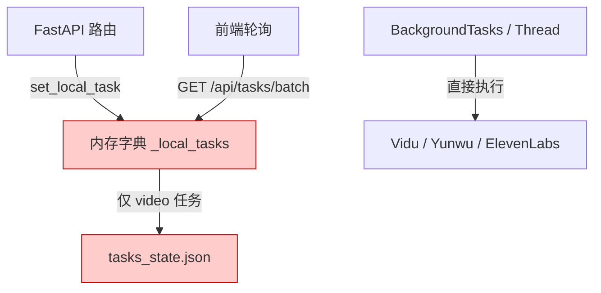
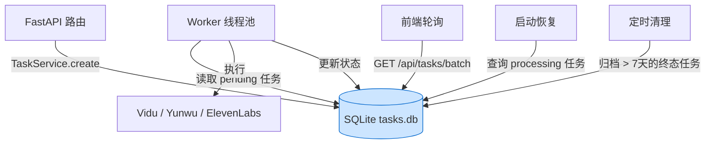
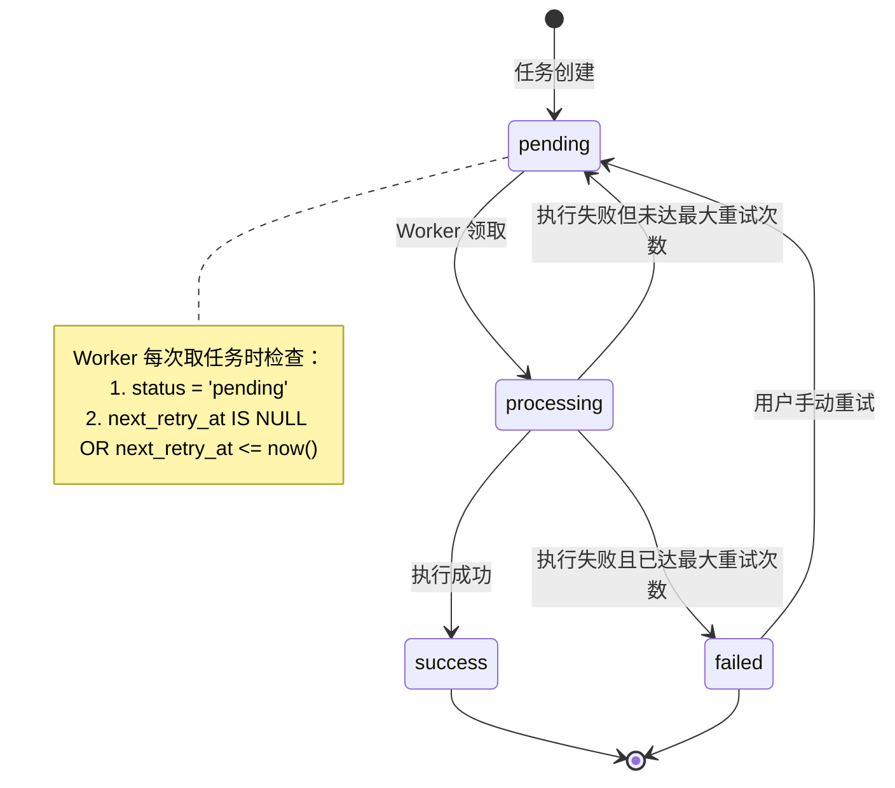
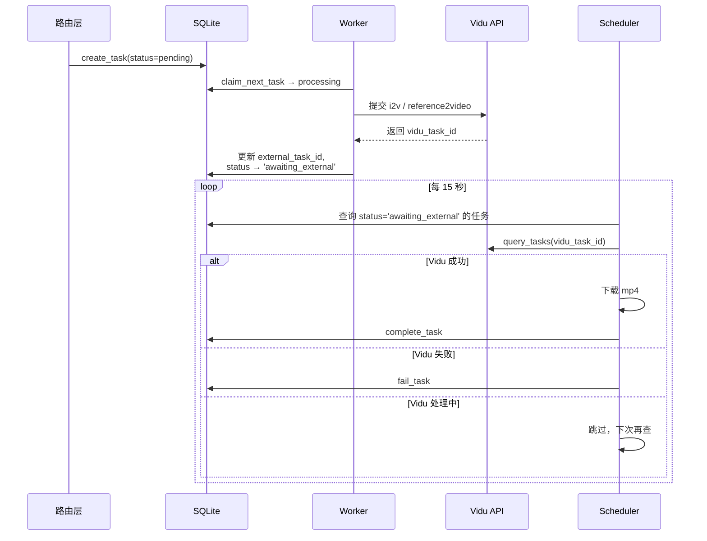
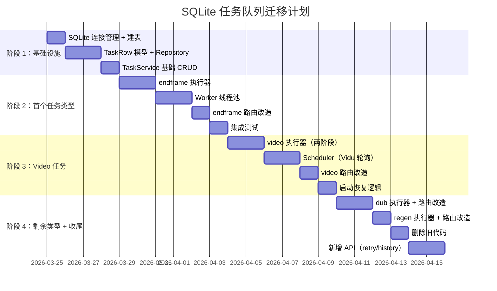
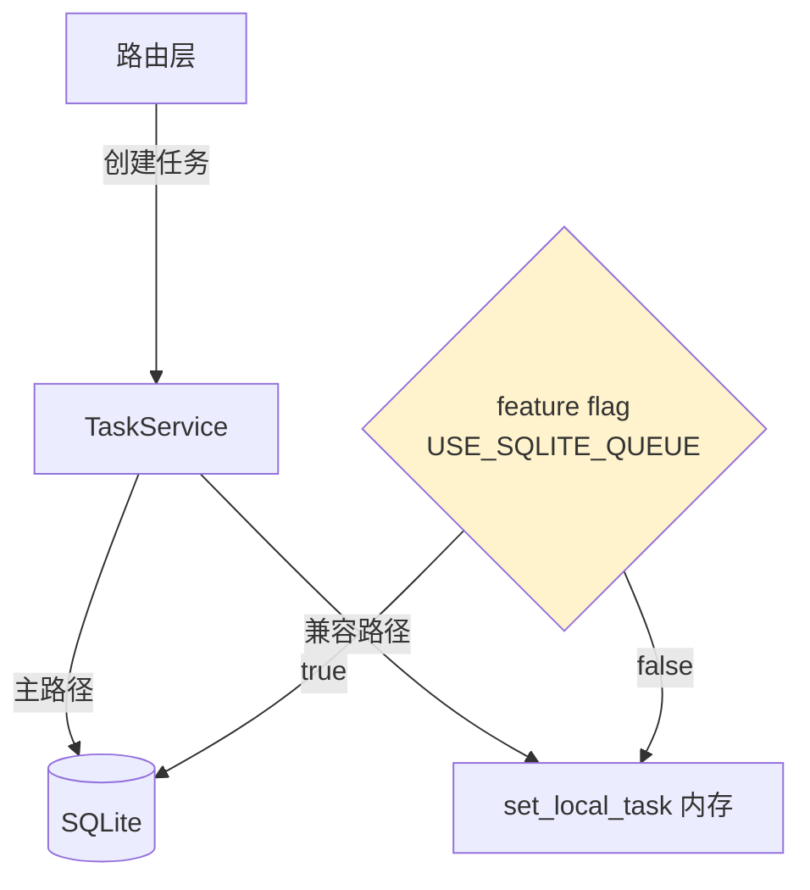

# SQLite 任务队列方案

> 执行优先级说明：本文件保留为**完整任务队列目标态**。当前阶段请优先执行同目录 [`最小可落地版.md`](/Users/zuobowen/Documents/GitHub/fv_autovidu/docs/SQLite任务队列方案/最小可落地版.md)。

> **文档目的**：将当前基于内存字典 + JSON 文件的任务管理升级为 SQLite 本地任务队列，解决服务重启丢失任务、缺乏重试机制、任务历史不可查等问题。  
> **适用范围**：`web/server/` 后端服务中的所有异步任务（endframe、video、dub、regen）。  
> **非目标**：不引入 Redis/Celery 等外部依赖；不改变"本地单用户工具"的定位。

---

## 一、方案总览

### 1.1 为什么选 SQLite

| 对比维度 | 当前方案（内存 + JSON） | SQLite 方案 | Redis/Celery |
|----------|------------------------|-------------|--------------|
| 额外依赖 | 无 | 无（Python 标准库） | Redis 进程 + Celery |
| 持久化 | 仅 video 任务部分持久化 | 全部任务持久化 | 全部持久化 |
| 重启恢复 | endframe/dub/regen 丢失 | 全部可恢复 | 全部可恢复 |
| 历史查询 | 不支持 | 支持（SQL 查询） | 支持（Flower 面板） |
| 并发安全 | threading.Semaphore | SQLite WAL + 行级状态机 | 原生支持 |
| 部署复杂度 | 零 | 零 | 需运维 Redis 进程 |
| 适用规模 | < 20 并发任务 | < 200 并发任务 | 无上限 |

**结论**：SQLite 是当前阶段的最优选择，零额外依赖、天然持久化、支持 SQL 查询，且与项目"本地工作站"定位一致。

### 1.2 整体架构变化

**迁移前：**



**迁移后：**



### 1.3 核心设计原则

1. **最小侵入**：保持现有 API 接口不变，前端零改动
2. **渐进迁移**：可逐个任务类型切换，不需要一次性全部改完
3. **向下兼容**：迁移期间 JSON 持久化可保留为备份
4. **可观测**：所有任务的完整生命周期可通过 SQL 查询

---

## 二、SQLite 表结构设计

### 2.1 主表：`tasks`

```sql
CREATE TABLE IF NOT EXISTS tasks (
    id               TEXT PRIMARY KEY,
    kind             TEXT NOT NULL,
    status           TEXT NOT NULL DEFAULT 'pending',

    episode_id       TEXT,
    shot_id          TEXT,
    candidate_id     TEXT,

    external_task_id TEXT,

    payload          TEXT DEFAULT '{}',

    result           TEXT DEFAULT '{}',
    error            TEXT,

    retry_count      INTEGER NOT NULL DEFAULT 0,
    max_retries      INTEGER NOT NULL DEFAULT 3,
    next_retry_at    REAL,

    priority         INTEGER NOT NULL DEFAULT 0,
    worker_id        TEXT,

    created_at       REAL NOT NULL,
    updated_at       REAL NOT NULL,
    started_at       REAL,
    completed_at     REAL
);

CREATE INDEX IF NOT EXISTS idx_tasks_status ON tasks(status);
CREATE INDEX IF NOT EXISTS idx_tasks_kind_status ON tasks(kind, status);
CREATE INDEX IF NOT EXISTS idx_tasks_episode ON tasks(episode_id);
CREATE INDEX IF NOT EXISTS idx_tasks_retry ON tasks(status, next_retry_at)
    WHERE next_retry_at IS NOT NULL;
```

### 2.2 字段说明与设计决策

#### `payload`，输入参数快照

将任务提交时的完整参数以 JSON 存储，用于：

- **重试时重放**：失败后可用相同参数重新执行
- **调试追溯**：出问题时可以查看当时提交了什么参数

```json
{
  "mode": "first_last_frame",
  "model": "viduq3-turbo",
  "duration": 4,
  "resolution": "720p",
  "aspect_ratio": "9:16",
  "first_frame_path": "frames/S003.png",
  "end_frame_path": "endframes/S003_end.png",
  "video_prompt": "角色走向镜头，表情从严肃变为微笑"
}
```

#### `result`，输出结果

```json
{
  "vidu_task_id": "task_abc123",
  "videoPath": "videos/shot001_cand-xyz.mp4",
  "creations": [{"url": "https://..."}]
}
```

#### 重试策略字段

| 字段 | 说明 |
|------|------|
| `retry_count` | 当前已重试次数，每次失败 +1 |
| `max_retries` | 上限，不同任务类型可设不同值 |
| `next_retry_at` | 下次可重试的 Unix 时间戳，用于指数退避 |

退避公式：`next_retry_at = now + base_delay * (2 ^ retry_count)`

| 任务类型 | 默认 max_retries | base_delay |
|----------|-----------------|------------|
| video | 2 | 30s |
| endframe | 3 | 10s |
| dub | 2 | 15s |
| regen | 3 | 10s |

### 2.3 任务状态机



**与当前状态的映射**：

| SQLite status | 前端看到的 status | 说明 |
|---------------|------------------|------|
| `pending` | `pending` | 等待执行 / 等待重试 |
| `processing` | `processing` | 执行中 |
| `success` | `success` | 成功 |
| `failed` | `failed` | 最终失败 |

---

## 三、Service 层设计

### 3.1 模块结构

```text
web/server/services/
├── task_queue/
│   ├── __init__.py
│   ├── db.py
│   ├── models.py
│   ├── repository.py
│   ├── service.py
│   ├── worker.py
│   ├── executors.py
│   └── scheduler.py
└── task_persistence.py
```

### 3.2 `db.py`，连接管理

```python
"""
SQLite 连接管理

- 使用 WAL (Write-Ahead Logging) 模式，允许并发读写
- 数据库文件位于 DATA_ROOT/tasks.db
- 每个线程使用独立连接（SQLite 不支持跨线程共享连接）
"""
import sqlite3
import threading
from pathlib import Path

import config

DB_PATH: Path = config.DATA_ROOT / "tasks.db"
_thread_local = threading.local()


def get_connection() -> sqlite3.Connection:
    """获取当前线程的 SQLite 连接（懒初始化）。"""
    conn = getattr(_thread_local, "conn", None)
    if conn is None:
        DB_PATH.parent.mkdir(parents=True, exist_ok=True)
        conn = sqlite3.connect(str(DB_PATH), timeout=30.0)
        conn.execute("PRAGMA journal_mode=WAL")
        conn.execute("PRAGMA busy_timeout=5000")
        conn.execute("PRAGMA synchronous=NORMAL")
        conn.row_factory = sqlite3.Row
        _thread_local.conn = conn
    return conn


def init_db() -> None:
    """建表（幂等）。服务启动时调用一次。"""
    conn = get_connection()
    conn.executescript(_SCHEMA_SQL)
    conn.commit()
```

### 3.3 `models.py`，数据模型

```python
from __future__ import annotations
import json
import time
from dataclasses import dataclass, field
from typing import Any, Optional


@dataclass
class TaskRow:
    id: str
    kind: str
    status: str = "pending"
    episode_id: Optional[str] = None
    shot_id: Optional[str] = None
    candidate_id: Optional[str] = None
    external_task_id: Optional[str] = None
    payload: dict[str, Any] = field(default_factory=dict)
    result: dict[str, Any] = field(default_factory=dict)
    error: Optional[str] = None
    retry_count: int = 0
    max_retries: int = 3
    next_retry_at: Optional[float] = None
    priority: int = 0
    worker_id: Optional[str] = None
    created_at: float = field(default_factory=time.time)
    updated_at: float = field(default_factory=time.time)
    started_at: Optional[float] = None
    completed_at: Optional[float] = None

    def to_api_response(self) -> dict[str, Any]:
        frontend_status = "processing" if self.status == "awaiting_external" else self.status
        return {
            "taskId": self.id,
            "status": frontend_status,
            "result": self.result if self.result else None,
            "error": self.error,
        }
```

### 3.4 `repository.py`，数据访问层

```python
def create_task(conn, task: TaskRow) -> None:
    """插入一条新任务。"""
    conn.execute("""
        INSERT INTO tasks (
            id, kind, status, episode_id, shot_id, candidate_id,
            external_task_id, payload, result, error,
            retry_count, max_retries, next_retry_at, priority,
            worker_id, created_at, updated_at, started_at, completed_at
        ) VALUES (?, ?, ?, ?, ?, ?, ?, ?, ?, ?, ?, ?, ?, ?, ?, ?, ?, ?, ?)
    """, (
        task.id, task.kind, task.status, task.episode_id, task.shot_id,
        task.candidate_id, task.external_task_id,
        json.dumps(task.payload, ensure_ascii=False),
        json.dumps(task.result, ensure_ascii=False),
        task.error, task.retry_count, task.max_retries, task.next_retry_at,
        task.priority, task.worker_id, task.created_at, task.updated_at,
        task.started_at, task.completed_at,
    ))
    conn.commit()


def claim_next_task(conn, kind: str, worker_id: str) -> TaskRow | None:
    """原子领取一条待执行任务。"""
    now = time.time()
    row = conn.execute("""
        SELECT id FROM tasks
        WHERE kind = ? AND status = 'pending'
          AND (next_retry_at IS NULL OR next_retry_at <= ?)
        ORDER BY priority DESC, created_at ASC
        LIMIT 1
    """, (kind, now)).fetchone()
    if not row:
        return None
    task_id = row["id"]
    conn.execute("""
        UPDATE tasks
        SET status = 'processing', worker_id = ?, started_at = ?, updated_at = ?
        WHERE id = ? AND status = 'pending'
    """, (worker_id, now, now, task_id))
    conn.commit()
    return get_task_by_id(conn, task_id)


def complete_task(conn, task_id: str, result: dict, external_task_id: str = None) -> None:
    """标记任务为成功。"""
    now = time.time()
    conn.execute("""
        UPDATE tasks
        SET status = 'success', result = ?, external_task_id = COALESCE(?, external_task_id),
            completed_at = ?, updated_at = ?, error = NULL
        WHERE id = ?
    """, (json.dumps(result, ensure_ascii=False), external_task_id, now, now, task_id))
    conn.commit()


def fail_task(conn, task_id: str, error: str, base_delay: float = 10.0) -> None:
    """标记任务失败。"""
    now = time.time()
    row = conn.execute(
        "SELECT retry_count, max_retries FROM tasks WHERE id = ?", (task_id,)
    ).fetchone()
    if not row:
        return
    new_count = row["retry_count"] + 1
    if new_count < row["max_retries"]:
        delay = base_delay * (2 ** new_count)
        conn.execute("""
            UPDATE tasks
            SET status = 'pending', retry_count = ?, next_retry_at = ?,
                error = ?, updated_at = ?, worker_id = NULL
            WHERE id = ?
        """, (new_count, now + delay, error, now, task_id))
    else:
        conn.execute("""
            UPDATE tasks
            SET status = 'failed', retry_count = ?, error = ?,
                completed_at = ?, updated_at = ?, worker_id = NULL
            WHERE id = ?
        """, (new_count, error, now, now, task_id))
    conn.commit()
```

### 3.5 `service.py`，业务逻辑层

```python
class TaskService:
    RETRY_CONFIG = {
        "video":    {"max_retries": 2, "base_delay": 30.0},
        "endframe": {"max_retries": 3, "base_delay": 10.0},
        "dub":      {"max_retries": 2, "base_delay": 15.0},
        "regen":    {"max_retries": 3, "base_delay": 10.0},
    }

    def create_task(
        self, task_id: str, kind: str, *,
        episode_id: str = None, shot_id: str = None,
        candidate_id: str = None, payload: dict = None,
        priority: int = 0,
    ) -> TaskRow:
        cfg = self.RETRY_CONFIG.get(kind, {"max_retries": 3, "base_delay": 10.0})
        task = TaskRow(
            id=task_id,
            kind=kind,
            status="pending",
            episode_id=episode_id,
            shot_id=shot_id,
            candidate_id=candidate_id,
            payload=payload or {},
            max_retries=cfg["max_retries"],
            priority=priority,
        )
        conn = get_connection()
        repository.create_task(conn, task)
        return task

    def get_task(self, task_id: str) -> TaskRow | None:
        conn = get_connection()
        return repository.get_task_by_id(conn, task_id)

    def get_tasks_batch(self, task_ids: list[str]) -> list[TaskRow]:
        conn = get_connection()
        return repository.get_tasks_by_ids(conn, task_ids)

    def get_episode_tasks(self, episode_id: str, kind: str = None) -> list[TaskRow]:
        conn = get_connection()
        return repository.get_tasks_by_episode(conn, episode_id, kind)

    def retry_task(self, task_id: str) -> bool:
        conn = get_connection()
        return repository.manual_retry(conn, task_id)
```

### 3.6 `worker.py`，Worker 线程池

```python
import threading
import time
import uuid
from concurrent.futures import ThreadPoolExecutor


class TaskWorkerPool:
    CONCURRENCY = {
        "video": int(os.getenv("VIDEO_CONCURRENCY", "5")),
        "endframe": int(os.getenv("ENDFRAME_CONCURRENCY", "5")),
        "dub": int(os.getenv("DUB_CONCURRENCY", "2")),
        "regen": int(os.getenv("REGEN_CONCURRENCY", "3")),
    }

    POLL_INTERVAL = 1.0

    def __init__(self):
        self._executors: dict[str, ThreadPoolExecutor] = {}
        self._running = False
        self._poll_thread: threading.Thread | None = None

    def start(self) -> None:
        self._running = True
        for kind, concurrency in self.CONCURRENCY.items():
            self._executors[kind] = ThreadPoolExecutor(
                max_workers=concurrency,
                thread_name_prefix=f"worker-{kind}",
            )
        self._poll_thread = threading.Thread(
            target=self._poll_loop, daemon=True, name="task-poller"
        )
        self._poll_thread.start()

    def stop(self) -> None:
        self._running = False
        for executor in self._executors.values():
            executor.shutdown(wait=False)

    def _poll_loop(self) -> None:
        worker_id = f"w-{uuid.uuid4().hex[:8]}"
        while self._running:
            for kind, executor in self._executors.items():
                conn = get_connection()
                task = repository.claim_next_task(conn, kind, worker_id)
                if task:
                    executor.submit(self._execute_task, task)
            time.sleep(self.POLL_INTERVAL)

    def _execute_task(self, task: TaskRow) -> None:
        from . import executors
        executor_fn = executors.get_executor(task.kind)
        try:
            executor_fn(task)
        except Exception as e:
            conn = get_connection()
            base_delay = TaskService.RETRY_CONFIG.get(
                task.kind, {}
            ).get("base_delay", 10.0)
            repository.fail_task(conn, task.id, str(e), base_delay)
```

### 3.7 `executors.py`，任务执行器

```python
def execute_video(task: TaskRow) -> None:
    """
    视频生成执行器

    1. 从 payload 中读取参数
    2. 调用 vidu_service 提交任务
    3. 将 vidu_task_id 写入 external_task_id
    4. 注意：Vidu 是异步的，提交后需要轮询。
       这里只负责提交，轮询由 scheduler 的 finalize 逻辑处理。
    """
    ...


def execute_endframe(task: TaskRow) -> None:
    """
    尾帧生成执行器

    1. 从 payload 中读取 episode_id, shot_id
    2. 调用 yunwu_service.generate_tail_frame
    3. 保存图片到 endframes/
    4. 更新 episode.json
    5. 调用 complete_task
    """
    ...


def execute_dub(task: TaskRow) -> None:
    """
    配音执行器

    1. 从 payload 中读取参数
    2. 调用 elevenlabs_service
    3. 保存音频到 dub/
    4. 更新 episode.json
    5. 调用 complete_task
    """
    ...


def execute_regen(task: TaskRow) -> None:
    """
    单帧重生执行器

    1. 从 payload 中读取参数
    2. 调用 yunwu_service.regenerate_first_frame
    3. 覆写首帧文件
    4. 重置 shot 状态
    5. 调用 complete_task
    """
    ...


_EXECUTORS = {
    "video": execute_video,
    "endframe": execute_endframe,
    "dub": execute_dub,
    "regen": execute_regen,
}


def get_executor(kind: str):
    fn = _EXECUTORS.get(kind)
    if not fn:
        raise ValueError(f"未知任务类型: {kind}")
    return fn
```

---

## 四、路由层改造

### 4.1 改造原则

路由层只做两件事：

1. **创建任务** -> `TaskService.create_task()`
2. **查询任务** -> `TaskService.get_task()` / `get_tasks_batch()`

**不再**直接调用 `BackgroundTasks` 或 `threading.Thread`。

### 4.2 `generate.py` 改造示例

```python
@router.post("/generate/video")
def generate_video(req):
    task_service = TaskService()
    for shot_id in req.shotIds:
        task_id = f"video-{uuid.uuid4().hex[:12]}"
        task_service.create_task(
            task_id, "video",
            episode_id=req.episodeId,
            shot_id=shot_id,
            payload={
                "mode": req.mode,
                "model": req.model,
                "duration": req.duration,
                "resolution": req.resolution,
                "reference_asset_ids": req.referenceAssetIds,
            },
        )
```

### 4.3 `tasks.py` 改造示例

```python
@router.get("/tasks/{task_id}")
def get_task_status(task_id: str):
    task_service = TaskService()
    task = task_service.get_task(task_id)
    if not task:
        return TaskStatusResponse(taskId=task_id, status="pending")
    return TaskStatusResponse(**task.to_api_response())
```

### 4.4 API 接口不变

| 端点 | 方法 | 改造内容 | 前端影响 |
|------|------|---------|---------|
| `/api/generate/endframe` | POST | 内部改用 TaskService.create_task | 无 |
| `/api/generate/video` | POST | 同上 | 无 |
| `/api/generate/regen-frame` | POST | 同上 | 无 |
| `/api/dub/process` | POST | 同上 | 无 |
| `/api/tasks/{task_id}` | GET | 改查 SQLite | 无 |
| `/api/tasks/batch` | GET | 改查 SQLite | 无 |
| `/api/tasks/{task_id}/retry` | POST | **新增** | 前端可选接入 |
| `/api/tasks/history` | GET | **新增** | 前端可选接入 |

---

## 五、Video 任务的特殊处理

### 5.1 两阶段执行流程



### 5.2 新增状态：`awaiting_external`

| 状态 | 含义 |
|------|------|
| `pending` | 待 Worker 领取 |
| `processing` | Worker 正在提交到 Vidu |
| `awaiting_external` | 已提交 Vidu，等待轮询 |
| `success` / `failed` | 终态 |

前端映射：`awaiting_external` -> `processing`。

### 5.3 `scheduler.py`，轮询调度

```python
class TaskScheduler:
    VIDU_POLL_INTERVAL = 15.0
    CLEANUP_INTERVAL = 3600.0

    def start(self) -> None:
        threading.Thread(
            target=self._vidu_poll_loop, daemon=True,
            name="vidu-poller"
        ).start()
        threading.Thread(
            target=self._cleanup_loop, daemon=True,
            name="task-cleanup"
        ).start()

    def _vidu_poll_loop(self) -> None:
        while True:
            try:
                conn = get_connection()
                tasks = repository.get_tasks_by_status(
                    conn, "awaiting_external", kind="video"
                )
                if tasks:
                    vidu_ids = [t.external_task_id for t in tasks if t.external_task_id]
                    resp = vidu_client.query_tasks(vidu_ids)
                    for vt in resp.get("tasks", []):
                        self._handle_vidu_result(conn, tasks, vt)
            except Exception:
                pass
            time.sleep(self.VIDU_POLL_INTERVAL)
```

---

## 六、前端影响评估

### 6.1 零改动项

| 前端模块 | 影响 | 说明 |
|----------|------|------|
| `taskStore.ts` | 无 | 轮询接口和响应格式不变 |
| `StoryboardPage.tsx` | 无 | 批量提交接口不变 |
| `ShotDetailPage.tsx` | 无 | 单任务提交接口不变 |
| `DubPanel.tsx` | 无 | 配音接口不变 |

### 6.2 可选增强项

| 功能 | 新 API | 前端改动 |
|------|--------|---------|
| 手动重试失败任务 | `POST /api/tasks/{id}/retry` | 失败提示旁加重试按钮 |
| 查看任务历史 | `GET /api/tasks/history?episode_id=xxx` | 新增任务历史面板 |
| 查看重试详情 | `GET /api/tasks/{id}` 返回 `retry_count` | 显示重试次数 |

---

## 七、迁移实施计划

### 7.1 分阶段迁移



### 7.2 阶段 1：基础设施（预计 3-4 天）

**交付物**：

- `web/server/services/task_queue/db.py`
- `web/server/services/task_queue/models.py`
- `web/server/services/task_queue/repository.py`
- `web/server/services/task_queue/service.py`

**Done 定义**：

- `init_db()` 可成功建表
- `create_task` -> `get_task_by_id` 完整往返
- `claim_next_task` 并发安全
- `fail_task` 的重试逻辑正确

### 7.3 阶段 2：首个任务类型，`endframe`（预计 5-6 天）

**为什么先做 `endframe`**：

- 逻辑最简单
- 无需额外轮询
- 验证 Worker 拉取模式可行

**交付物**：

- `web/server/services/task_queue/worker.py`
- `web/server/services/task_queue/executors.py`（endframe 部分）
- `web/server/routes/generate.py` 中 endframe 路由改造

**Done 定义**：

- 前端提交尾帧 -> SQLite 创建任务 -> Worker 领取 -> Yunwu 调用 -> 成功写回
- 服务重启后，pending 状态的 endframe 任务自动继续执行
- 前端轮询行为不变

### 7.4 阶段 3：Video 任务（预计 5-6 天）

**特殊挑战**：两阶段执行 + Vidu 轮询

**交付物**：

- `executors.py` 中 video 部分
- `web/server/services/task_queue/scheduler.py`
- `web/server/routes/tasks.py` 改造

**Done 定义**：

- 视频提交 -> Vidu 提交成功 -> `awaiting_external` -> Scheduler 轮询 -> 下载 -> success
- 服务重启后 `awaiting_external` 的任务自动恢复轮询
- 前端无感知

### 7.5 阶段 4：收尾（预计 4-5 天）

**交付物**：

- dub、regen 执行器
- 删除 `task_persistence.py`、`_local_tasks`
- 新增 `POST /api/tasks/{id}/retry`
- 新增 `GET /api/tasks/history`

**Done 定义**：

- 所有 4 种任务类型走 SQLite
- 旧 JSON 持久化代码完全移除
- 手动重试可用

---

## 八、回滚方案

迁移期间保留双写能力：



在 `.env` 中增加开关：

```bash
USE_SQLITE_QUEUE=false
```

**回滚步骤**：

1. 设置 `USE_SQLITE_QUEUE=false`
2. 重启服务
3. 系统回到内存字典模式，SQLite 数据不受影响

---

## 九、监控与运维

### 9.1 健康检查增强

```python
@app.get("/api/health")
def health():
    conn = get_connection()
    stats = repository.get_task_stats(conn)
    return {
        "status": "ok",
        "tasks": {
            "pending": stats["pending"],
            "processing": stats["processing"],
            "awaiting_external": stats["awaiting_external"],
            "failed_last_hour": stats["failed_last_hour"],
        },
    }
```

### 9.2 SQLite 直接查询

```bash
sqlite3 data/tasks.db "SELECT id, kind, error, retry_count FROM tasks WHERE status='failed'"
sqlite3 data/tasks.db "SELECT kind, status, COUNT(*) FROM tasks WHERE episode_id='ep-001' GROUP BY kind, status"
sqlite3 data/tasks.db "SELECT id, kind, retry_count, datetime(next_retry_at, 'unixepoch', 'localtime') FROM tasks WHERE next_retry_at IS NOT NULL AND status='pending'"
sqlite3 data/tasks.db "UPDATE tasks SET status='pending', worker_id=NULL WHERE status='processing' AND updated_at < unixepoch() - 600"
```

---

## 十、风险与缓解

| 风险 | 概率 | 影响 | 缓解措施 |
|------|------|------|---------|
| SQLite 在高并发写入时锁等待 | 低 | 任务创建延迟 | WAL 模式 + busy_timeout=5000 |
| Worker 领取任务后崩溃导致僵尸 processing | 中 | 任务永远 processing | Scheduler 定期扫描，超时重置 |
| 迁移期间新旧系统状态不一致 | 中 | 任务丢失 | Feature flag 控制，一种类型完全切换后再切下一种 |
| SQLite 文件损坏 | 极低 | 全部任务丢失 | 定期备份 tasks.db；episode.json 仍是业务数据主源 |

---

## 十一、与自动化流水线的关系

本方案与 [`自动化流水线计划.md`](/Users/zuobowen/Documents/GitHub/fv_autovidu/docs/自动化流水线计划/自动化流水线计划.md) 中的规划对齐：

| 流水线计划中的缺口 | 本方案如何解决 |
|-------------------|---------------|
| P1-1: `_local_tasks` 仅内存 | SQLite 全量持久化 |
| P1-2: 轮询失败静默 | Scheduler + 重试机制 |
| P2-4: 无统一重试 | `fail_task` 自动指数退避重试 |
| 风险项: 轮询与下载在 GET /tasks 中 | Scheduler 独立线程处理，不阻塞 API 请求 |

当 CLI 流水线需要提交和追踪任务时，也可复用 `TaskService`：

```python
from web.server.services.task_queue import TaskService

service = TaskService()
task = service.create_task("video-xxx", "video", episode_id=ep_id)
```

---

## 十二、变更记录

| 日期 | 说明 |
|------|------|
| 2026-03-23 | 初版：完整方案设计，含表结构、Service 层、Worker、迁移计划 |

