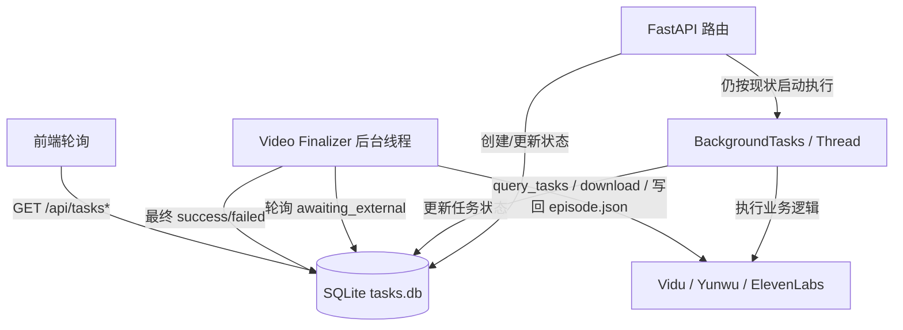
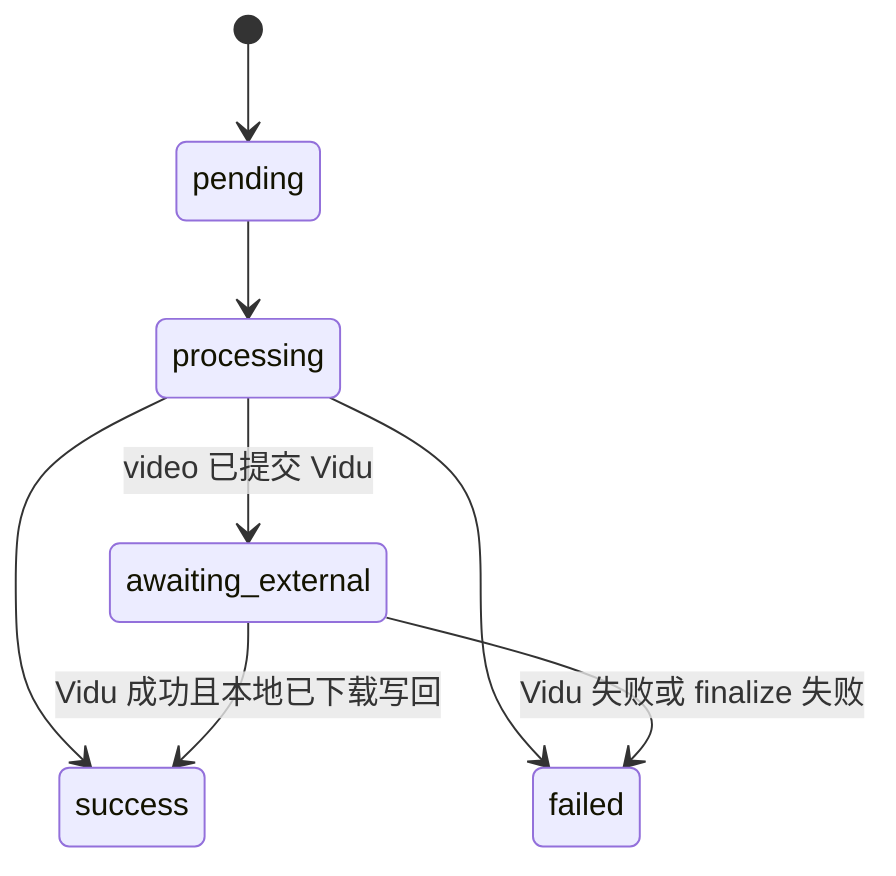

# SQLite 任务状态最小可落地版

> 推荐优先级：**优先执行本文件**。  
> 说明：本文件用于当前阶段落地；同目录 [`README.md`](/Users/zuobowen/Documents/GitHub/fv_autovidu/docs/SQLite任务队列方案/README.md) 保留为后续完整任务队列目标。

> 文档目的：把当前基于 `_local_tasks + tasks_state.json` 的任务追踪，收敛成一版当前仓库可以直接实施的 SQLite 方案。  
> 适用范围：`web/server/` 后端中的 `video / endframe / dub / regen` 任务。  
> 核心目标：先解决“状态会丢、恢复边界不清、video finalize 挂在 GET /tasks 上”的问题。  
> 非目标：本阶段不一次性引入完整通用任务队列、自动重试调度、历史归档、优先级调度。

---

## 一、结论

这件事有必要做，但要收敛范围。

当前最值得落地的，不是“完整 SQLite 队列”，而是：

1. 用 SQLite 统一持久化所有任务状态，替换 `_local_tasks` 和 `tasks_state.json`
2. 保留现有执行模型：`BackgroundTasks` / `threading.Thread`
3. 把 `video` 的 Vidu 补查、下载、写回 `episode.json` 从 `GET /tasks` 挪到后台线程
4. 明确恢复语义：本阶段承诺“弱恢复 + 强可见”，不承诺“进程重启后所有任务无感继续”

一句话概括：

> 先把 SQLite 当作**任务状态库**，不是一上来就当**完整任务队列**。

---

## 二、为什么要收敛

原方案的问题不在方向，而在范围过大。

当前代码现状：

- `video-*` 只有弱持久化，依赖 [`task_persistence.py`](/Users/zuobowen/Documents/GitHub/fv_autovidu/web/server/services/task_persistence.py)
- `endframe-* / dub-* / regen-*` 重启后会丢
- `video` 的 finalize 逻辑挂在 [`GET /tasks`](/Users/zuobowen/Documents/GitHub/fv_autovidu/web/server/routes/tasks.py#L127)，API 读请求里混入了外部查询、下载文件、写业务数据
- 前端轮询退避和失败提示已经存在，不需要再把“前端无退避”当作方案前提

所以真正需要补的是：

- 统一状态持久化
- 恢复边界清晰
- `video` finalize 后台化
- 任务结果可追溯

而不是立刻补齐：

- 通用 worker claim 机制
- 自动重试队列
- 优先级调度
- 历史归档
- feature flag 双系统并跑

---

## 三、本阶段目标与非目标

### 3.1 目标

| 目标 | 说明 |
|------|------|
| 全量持久化 | `video / endframe / dub / regen` 都写入 SQLite |
| 重启后可见 | 服务重启后，历史任务状态仍可查询 |
| video 后台 finalize | `Vidu query + 下载 mp4 + 更新 episode.json` 不再放在 `GET /tasks` |
| 接口兼容 | 现有前端继续使用 `/api/tasks/{id}` 与 `/api/tasks/batch` |
| 渐进改造 | 尽量少动现有执行链，不重写全部路由模型 |

### 3.2 非目标

| 非目标 | 原因 |
|--------|------|
| 完整通用任务队列 | 当前执行逻辑还在路由层，先统一状态比先重写调度更重要 |
| 自动指数退避重试 | 先把状态、恢复、幂等边界理清，再谈通用重试 |
| 优先级和多 worker 抢占 | 当前单机本地工具阶段不是第一痛点 |
| 任务历史页面 | 可以后续基于 SQLite 很容易补，但不阻塞首版 |

---

## 四、方案边界

### 4.1 本次落地后的运行模型



### 4.2 不做的事

本阶段不改成下面这种模型：

```text
路由只 create_task -> worker claim -> executor 分发 -> scheduler 重试
```

这条路可以保留为下一阶段，但现在不做。

---

## 五、落地后的状态机

### 5.1 统一状态

| 状态 | 含义 | 前端显示 |
|------|------|----------|
| `pending` | 任务已创建，尚未真正开始执行 | `pending` |
| `processing` | 本地代码正在执行 | `processing` |
| `awaiting_external` | 已提交到 Vidu，等待外部完成 | `processing` |
| `success` | 本地已完成收敛 | `success` |
| `failed` | 本地已明确失败 | `failed` |

### 5.2 状态转移



### 5.3 恢复语义

| 场景 | 本阶段行为 |
|------|------------|
| 服务重启前任务已 `success/failed` | 原样可查 |
| 服务重启时任务是 `awaiting_external` | 启动后继续后台补查 |
| 服务重启时任务是 `processing` | 标记为 `failed`，错误信息说明“服务重启中断，请手动重试” |
| 服务重启时任务是 `pending` | 可继续查询；是否自动继续执行由任务类型决定，首版不强承诺 |

这点要写清楚：  
**本阶段不是完整“强恢复”，而是“状态不丢 + video 外部态可继续收敛”。**

---

## 六、SQLite 表设计

首版只需要一张主表，不做归档表。

```sql
CREATE TABLE IF NOT EXISTS tasks (
    id               TEXT PRIMARY KEY,
    kind             TEXT NOT NULL,             -- video | endframe | dub | regen
    status           TEXT NOT NULL,             -- pending | processing | awaiting_external | success | failed

    episode_id       TEXT,
    shot_id          TEXT,
    candidate_id     TEXT,

    external_task_id TEXT,                      -- vidu_task_id 等
    payload          TEXT NOT NULL DEFAULT '{}',
    result           TEXT NOT NULL DEFAULT '{}',
    error            TEXT,

    created_at       REAL NOT NULL,
    updated_at       REAL NOT NULL,
    started_at       REAL,
    completed_at     REAL
);

CREATE INDEX IF NOT EXISTS idx_tasks_status ON tasks(status);
CREATE INDEX IF NOT EXISTS idx_tasks_kind_status ON tasks(kind, status);
CREATE INDEX IF NOT EXISTS idx_tasks_episode ON tasks(episode_id);
CREATE INDEX IF NOT EXISTS idx_tasks_external ON tasks(external_task_id);
```

### 6.1 字段说明

| 字段 | 说明 |
|------|------|
| `payload` | 任务创建时的输入快照，方便恢复和排查 |
| `result` | 任务中途/成功输出，例如 `vidu_task_id`、`videoPath`、`audioPath` |
| `external_task_id` | 便于单独索引 video 外部任务 |
| `error` | 失败原因文本 |

### 6.2 为什么首版不放重试字段

原方案设计了 `retry_count / next_retry_at / priority / worker_id`。  
这些字段只有在“真正队列化调度”时才有意义。

本阶段还保留现有执行模型，所以先不放，避免表结构超前。

---

## 七、后端模块设计

### 7.1 新增模块

```text
web/server/services/
├── task_store/
│   ├── __init__.py
│   ├── db.py            # SQLite 连接与建表
│   ├── models.py        # TaskRow dataclass
│   ├── repository.py    # 纯 SQL 读写
│   ├── service.py       # TaskStoreService：供路由和后台线程调用
│   └── video_finalizer.py
└── task_persistence.py  # 迁移完成后删除
```

### 7.2 模块职责

#### `db.py`

- 初始化 `data/tasks.db`
- 启用 WAL
- 每线程独立连接

#### `repository.py`

- `create_task`
- `update_task`
- `get_task_by_id`
- `get_tasks_by_ids`
- `get_tasks_by_status`
- `mark_processing_interrupted_on_startup`

#### `service.py`

- 提供现在 `set_local_task` 的替代接口
- 把 API 需要的响应格式集中在这里做映射

建议接口：

```python
create_task(...)
set_processing(...)
set_awaiting_external(...)
set_success(...)
set_failed(...)
get_task(...)
get_tasks_batch(...)
```

#### `video_finalizer.py`

后台线程定期做三件事：

1. 查 `status='awaiting_external'` 的 `video` 任务
2. 调 Vidu `query_tasks`
3. 若成功则下载并写回 `episode.json`，然后置 `success`

注意：

- 这里只处理 `awaiting_external` 的 `video`
- 不处理 `endframe/dub/regen`
- 不做自动重试，只做状态收敛

---

## 八、对现有代码的改造方式

### 8.1 `tasks.py`

当前问题：

- 内存 `_local_tasks` 是主状态源
- `GET /tasks` 会顺手做 finalize

改造后：

- `GET /tasks/{id}` 和 `GET /tasks/batch` 只读 SQLite
- 删除 `_local_tasks`
- 删除 `maybe_finalize_video_task()` 在查询接口中的副作用

### 8.2 `generate.py`

改造原则：

- 仍然可以继续使用 `BackgroundTasks`
- 但任务创建、状态更新都走 `TaskStoreService`

以 `video` 为例：

1. 路由创建任务：`status=pending`
2. 后台函数启动时标记 `processing`
3. 提交 Vidu 成功后写入 `external_task_id` 与 `result.vidu_task_id`
4. 状态置为 `awaiting_external`
5. 后续由 `video_finalizer` 负责完成下载和业务写回

### 8.3 `dub_route.py`

改造原则：

- 仍保留现有 `threading.Thread`
- 任务状态统一写 SQLite
- 由于 `dub` 是同步完成型任务，不需要额外 finalizer

### 8.4 `main.py`

启动时新增两件事：

1. `init_db()`
2. 启动 `video_finalizer`

并在 startup 时执行：

- 将遗留 `processing` 任务标记为中断失败
- 保留 `awaiting_external` 任务，交给 finalizer 继续处理

---

## 九、与当前前端的兼容策略

前端接口不需要改。

| 端点 | 是否改 URL | 是否改响应结构 |
|------|------------|----------------|
| `/api/tasks/{task_id}` | 否 | 否 |
| `/api/tasks/batch` | 否 | 否 |
| `/api/generate/endframe` | 否 | 否 |
| `/api/generate/video` | 否 | 否 |
| `/api/generate/regen-frame` | 否 | 否 |
| `/api/dub/process` | 否 | 否 |

前端只需要继续把 `awaiting_external` 当成 `processing` 看待。

---

## 十、实施顺序

### 阶段 1：先把 SQLite 变成状态源

交付物：

- `db.py`
- `models.py`
- `repository.py`
- `service.py`

Done：

- 可以创建任务、更新状态、批量查询
- `/api/tasks/{id}` 和 `/api/tasks/batch` 从 SQLite 返回
- `video/endframe/dub/regen` 都能落库

### 阶段 2：迁移 `video`

交付物：

- `video_finalizer.py`
- `generate.py` 中 `video` 状态更新改造
- startup 恢复逻辑

Done：

- `video` 提交后进入 `awaiting_external`
- 后台线程完成 Vidu 补查、下载、写回
- `GET /tasks` 不再做副作用操作

### 阶段 3：迁移其余任务类型

交付物：

- `generate.py` 中 `endframe/regen`
- `dub_route.py`

Done：

- 所有任务不再依赖 `_local_tasks`
- 删除 `task_persistence.py`

---

## 十一、首版不做自动重试的原因

自动重试不是不能做，而是现在做风险高于收益。

原因有三点：

1. 现有执行链里存在文件写入和 `episode.json` 更新，未先梳理幂等性前，自动重试容易重复写结果
2. `video` 任务分为“提交外部任务”和“本地 finalize”两段，重试边界还没统一
3. 先把“状态可见、恢复可控”做出来，已经能明显提升可用性

后续要加自动重试，前提是先补齐：

- 幂等写入规则
- “提交失败”和“finalize 失败”的区分
- 人工重试 API

---

## 十二、主要风险与规避

| 风险 | 说明 | 缓解 |
|------|------|------|
| 服务重启时同步任务中断 | `processing` 中的 endframe/dub/regen 无法无缝续跑 | 启动后统一标记失败，提示手动重试 |
| finalize 重复执行 | `video_finalizer` 可能重复下载或重复写回 | 先检查 `videoPath` / candidate 状态，确保幂等 |
| SQLite 锁等待 | 多线程同时写状态 | WAL + `busy_timeout` |
| 迁移期状态源混乱 | 新旧方案并存时容易读错 | 一旦切 SQLite，`/tasks*` 只读 SQLite |

---

## 十三、后续扩展路线

当这版稳定后，再考虑第二阶段：

1. 手动重试 API：`POST /api/tasks/{id}/retry`
2. 任务历史查询
3. `processing` 超时扫描
4. 真正的 worker claim 模型
5. 自动重试字段：`retry_count / next_retry_at`

到那时，再把 `task_store` 升级为真正的 `task_queue`，会更稳。

---

## 十四、验收标准

首版完成后，应满足以下验收：

1. 任意任务创建后都能在 SQLite 中查到
2. 服务重启后，已完成任务状态仍可查询
3. 服务重启后，`awaiting_external` 的 `video` 任务能继续收敛
4. `GET /api/tasks*` 不再触发外部 API 调用、下载文件、修改 `episode.json`
5. `task_persistence.py` 和 `_local_tasks` 已不再作为主状态源

---

## 十五、变更记录

| 日期 | 说明 |
|------|------|
| 2026-03-23 | 将原“完整 SQLite 队列方案”收敛为“最小可落地版” |

