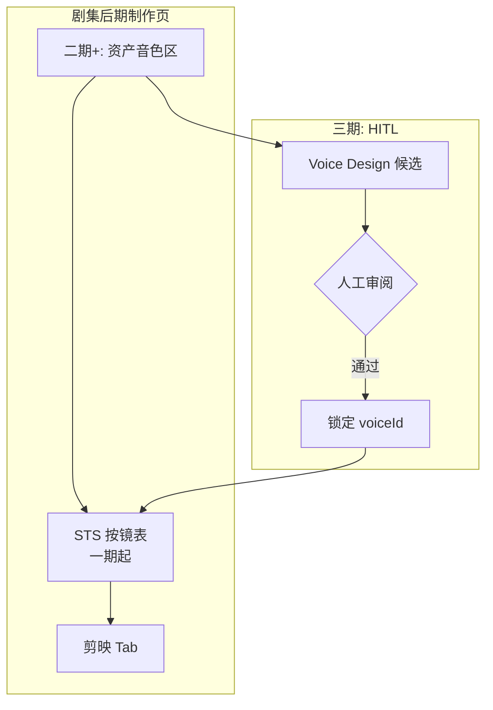

# STS 后期制作工作台与资产音色设计 — 设计说明

**日期**：2026-03-30（2026-03-30 修订：分阶段落地结论）  
**状态**：设计稿 — **可落地，但不得按本文「一次性原样全落」**；须按 **一期 / 二期 / 三期** 拆分执行。  
**关联文档**：

- [`../后期制作单页、首帧精出与剪映字幕/2026-03-27-post-production-and-promote-design.md`](../后期制作单页、首帧精出与剪映字幕/2026-03-27-post-production-and-promote-design.md) — 路由、配音/剪映 Tab、localStorage、分镜入口收口原则  
- [`../剪映与配音接入方案/接入方案.md`](../剪映与配音接入方案/接入方案.md) — ElevenLabs 分层（L1 STS / L2 TTS / L3 Voice Design P2）

---

## 0. 分阶段落地结论（必读）

**总体判断**：**STS 工作台 + 剪映联动** 与当前代码架构 **接得住**；**资产级音色绑定 + Voice Design + HITL** 也能做，但**缺模型、API、UI 与外部账号能力前提**，应 **单独拆成二期、三期**，避免与一期绑死。

### 0.1 三期边界

| 阶段 | 范围 | 说明 |
|------|------|------|
| **一期** | 后期制作页 **配音区 → 真 STS 工作台** | **集默认音色 + 单镜音色覆盖 + 按镜列表 + 试听 + 原声/生成声对比 + 懒加载播放器**；与剪映 Tab 联动（导出侧已支持独立音频轨）。**一期字段拍板**：`Episode.dubDefaultVoiceId` 保存集默认音色，`Shot.dubVoiceIdOverride` 保存镜头级覆盖；两者都落 `episode.json`，**不**使用仅前端态或侧车映射。 |
| **二期** | **资产模型 + 编辑 API/UI + 批量解析 voiceId** | `ShotAsset` 增加 `voiceId` / 展示名等；新增 **专用资产接口** `PATCH /episodes/{episodeId}/assets/{assetId}` 持久化资产音色绑定；**批量/单镜配音** 统一按镜解析最终 voiceId（镜头覆盖 → 资产默认 → 集默认）。 |
| **三期** | **Voice Design + HITL** | 依赖 ElevenLabs **账号能力与配额** 确认后再接；服务端封装 Voice Design、审阅门禁与落库。 |

### 0.2 为何「前半段」能落：已有代码证据

| 能力 | 位置（便于跳转） |
|------|------------------|
| 后期制作单页与路由 | `web/frontend/src/pages/PostProductionPage.tsx`、`web/frontend/src/utils/routes.ts`（`postProduction`） |
| ElevenLabs 基础链路 | `web/server/routes/dub_route.py` — 列音色、批量/单镜 STS/TTS、后台任务 |
| TTS 优先读译文 | `dub_route.py` 内 TTS 文本解析（优先 `dialogueTranslation` 等），与「台词心智」一致 |
| 配音与当前选中候选绑定 | `data_service.py` — 切换视频候选时旧配音标 **stale**（`sourceCandidateId` 不一致） |
| 剪映独立音频轨 + 原视频静音 | `web/server/services/jianying_service.py` — 有配音时原视频音量置 0、独立音频轨构建 |

### 0.3 当前真正卡住的点（一期要补 / 二期要补）

| 卡点 | 位置 | 一期/二期 |
|------|------|-----------|
| `DubPanel` 仍是「全局一个 voiceId + 批量」，无按镜列表、试听、对比、懒加载 | `DubPanel.tsx` | **一期** 升级 UI/交互 |
| 批量接口 **强制全集同一 `voiceId`**，与「按资产自动带音色 / 镜级覆盖」不兼容 | `schemas.py`（如 `DubProcessRequest`）、`dub_route.py` `dub_process` | **一期** 先支持 **镜级覆盖**（请求体或解析规则）；**二期** 与资产解析打通 |
| 资产模型 **无** `voiceId` / `voiceName` | `schemas.py` `ShotAsset` | **二期** |
| 资产库页 **只读**，非可编辑工作台 | `AssetLibraryPage.tsx` | **二期** |
| `PATCH /episodes/{id}` **仅** `dubTargetLocale`、`sourceLocale` | `web/server/routes/episodes.py` `_ALLOWED_EPISODE_PATCH_KEYS` | **二期** 扩展或新资产 PATCH |
| ElevenLabs 仅 list / STS / TTS，**无** Voice Design | `elevenlabs_service.py` | **三期** |
| 选片「后期制作 + `shotId` 深链」：videopick 有 `?shotId=`，**post-production 未接** | `routes.ts` | **一期** 必补（与选片入口一致） |

### 0.4 建议落地顺序（与 0.1 一致）

1. **一期**：后期制作配音区 → 真 STS 工作台（集默认 + 单镜覆盖 + 试听 + 剪映导出）。  
2. **二期**：资产字段 + 编辑 API/UI + 批量「按镜解析最终 voiceId」。  
3. **三期**：Voice Design + HITL（先确认 ElevenLabs 账号与配额）。

### 0.5 一期实现进展（2026-03-30）

| 项 | 状态 |
|----|------|
| `Episode.dubDefaultVoiceId` + `Shot.dubVoiceIdOverride` 持久化字段 | 已落地（`schemas.py`、`episode.ts`） |
| `POST /dub/process` 后端按 `episode.json` 解析最终音色 | 已落地（`dub_route._voice_id_for_shot`；不再依赖 `voiceOverrides`） |
| 按镜表、展开试听、视频静音开关、原声/生成音频 | 已落地（`DubShotRow` + `DubPanel`） |
| `post-production?shotId=` 深链 | 已落地（`PostProductionPage` + `DubPanel.initialHighlightShotId`） |
| 选片页链到后期制作 | 已落地（`VideoPickPage` 工具栏「后期制作」；选片模式中附当前镜 `?shotId=`） |

---

## 1. 背景与目标

### 1.1 要解决什么（长期愿景，分阶段兑现）

- 在 **后期制作单页** 将 **配音 Tab** 升级为 **STS 工作台**（一期能力见 §0.1）。
- **人物 / 资产**侧音色与「简介→音色」、**HITL** —— **二期 / 三期**（见 §0）。
- **自动化 + HITL**（三期）：候选生成可自动，**写入资产并参与批量** 前需人工审阅。

### 1.2 非目标

- 整集连续时间线精剪式配音（**粗剪工作台**）。
- 无成片视频场景的「仅导出音频成片」；在 **已有视频** 下可只生成音频、不重新生成视频。

---

## 2. 信息架构决策

### 2.1 路由

**沿用** `/project/:projectId/episode/:episodeId/post-production`。  
在 **配音 Tab** 内扩展 STS 工作台；**不**把完整 STS 塞进分镜表（与 2026-03-27 §11.2 一致）。

### 2.2 分镜 / 选片接入口

| 位置 | 职责 |
|------|------|
| **后期制作页** | 全量 STS 工作台 |
| **选片** | 接入口 + 本镜状态；**深链** `post-production?shotId=`，一期必须与 `routes`、页面展开逻辑和验收项对齐实现 |

**禁止**：选片复制整套 `DubPanel`。

### 2.3 流程概览（长期愿景，含二期资产与三期 HITL）

### 2.4 一期范围流程（精简）

### 2.5 一期音色数据归属与解析规则（拍板）

- **集默认音色**：新增 `Episode.dubDefaultVoiceId: string = ""`，由后期制作页顶部统一编辑并持久化到 `episode.json`。
- **镜头级覆盖**：新增 `Shot.dubVoiceIdOverride: string = ""`；空字符串表示“未覆盖，回退到集默认”。
- **一期明确不采用**：仅前端内存态、localStorage-only、侧车 JSON 映射；避免刷新丢失与任务不可复算。
- **一期批量配音解析规则**：`POST /dub/process` 不再要求请求体携带全局 `voiceId`；后端逐镜解析 `resolvedVoiceId = shot.dubVoiceIdOverride || episode.dubDefaultVoiceId`。若解析后为空，则该镜头返回明确错误并不入队。
- **一期单镜配音解析规则**：`POST /dub/process-shot` 允许请求体显式传 `voiceId` 作为一次性覆盖；未传时走与批量相同的解析规则。
- **一期 PATCH 归属**：
  - `PATCH /episodes/{episodeId}` 白名单扩展 `dubDefaultVoiceId`
  - `PATCH /episodes/{episodeId}/shots/{shotId}` 允许更新 `dubVoiceIdOverride`

---

## 3. 资产与音色设计（二期 / 三期）

> **§0 已说明**：本节**不**要求在一期全部实现。

### 3.1 数据心智（二期）

- 简介（prompt）作为 **推荐或展示**；资产上持久 **`voiceId`**（及可选名）。
- 镜头绑定角色资产后，**默认**用资产 `voiceId`（二期）；**镜头级覆盖**与产品策略在二期锁死。
- **二期接口拍板**：**不**复用 `PATCH /episodes/{episodeId}` 做资产局部编辑；新增 **专用接口** `PATCH /episodes/{episodeId}/assets/{assetId}`，仅更新该资产的 `voiceId`、`voiceName`、`voiceNote` 等音色字段，再由后端写回 `episode.json`。

### 3.2 API 与 Voice Design（三期）

- 当前仅有 list / STS / TTS；Voice Design **未封装**。
- 官方参考：[ElevenLabs API Introduction](https://elevenlabs.io/docs/api-reference/introduction)、[TTS Convert](https://elevenlabs.io/docs/api-reference/text-to-speech/convert)、[List voices v2](https://elevenlabs.io/docs/api-reference/voices/search)。

### 3.3 HITL（三期）

- 自动出候选 → 人工确认 → 锁定 `voiceId` 再参与批量；不经审阅不落库（除非单独开「无人值守」产品）。

---

## 4. STS 与台词

- STS 为主；TTS 文本与 `dialogueTranslation` 等对齐（见 `dub_route.py`）。
- 不做整集连续时间线；粗剪承担。

### 4.1 预览与性能（一期）

- **懒加载**；仅展开当前镜挂载播放器。

---

## 5. 视频预览与剪映导出

### 5.1 站内预览（一期）

- 同镜 **视频 + 音频开关**，便于对比。

### 5.2 剪映草稿（已具备能力，一期验收对齐）

- 独立音频轨、有配音时原视频静音 —— 见 `jianying_service.py`；一期 **验收用例** 与文档一致即可。

---

## 6. 导航与管线顺序

- 逻辑顺序：**分镜表 → 尾帧（可选）→ 视频候选 → STS（可选）**，可局部并行。
- 左侧栏：**配音可选但常显状态**。

---

## 7. 数据模型与 API（按阶段）

| 阶段 | 项 |
|------|-----|
| **一期** | `Episode.dubDefaultVoiceId`、`Shot.dubVoiceIdOverride`；`PATCH /episodes/{episodeId}` 扩展 `dubDefaultVoiceId`；`PATCH /episodes/{episodeId}/shots/{shotId}` 更新 `dubVoiceIdOverride`；`POST /dub/process` 按镜解析 `resolvedVoiceId = shot override || episode default` |
| **二期** | `ShotAsset.voiceId` / `voiceName` / `voiceNote`；新增 `PATCH /episodes/{episodeId}/assets/{assetId}`；批量解析升级为 `shot override || asset default || episode default` |
| **三期** | Voice Design 任务与 HITL 状态；可选 `request-id` / 字符成本日志 |

---

## 8. 验收要点（按阶段）

### 8.1 一期

- [ ] 后期制作配音区：**集默认 + 单镜覆盖 + 按镜列表 + 试听 + 原声/生成声对比 + 懒加载**。
- [ ] 剪映导出与现有行为一致（独立音轨、原片静音）。
- [ ] `post-production` 支持 `?shotId=`，并能从选片页跳转后自动定位与展开指定镜头。

### 8.2 二期

- [ ] 资产可编辑并持久化 `voiceId`；批量 STS 按镜解析最终音色。

### 8.3 三期

- [ ] Voice Design + HITL 与账号配额确认；未经审阅不写资产。

---

## 9. 自审记录

- 本文 **已显式** 与「一次性全落」脱钩；**一期/二期/三期** 与代码卡点表 **一致**。
- 一期音色字段已拍板为 `Episode.dubDefaultVoiceId` + `Shot.dubVoiceIdOverride`；二期资产落库接口已拍板为专用 `PATCH /episodes/{episodeId}/assets/{assetId}`，避免继续停留在二选一。

---

## 10. 相关代码索引

- `PostProductionPage.tsx`、`routes.ts`、`DubPanel.tsx`
- `dub_route.py`、`data_service.py`、`jianying_service.py`
- `episodes.py`（PATCH 白名单）、`schemas.py`（`ShotAsset`、`DubProcessRequest`）
- `elevenlabs_service.py`
- `AssetLibraryPage.tsx`
