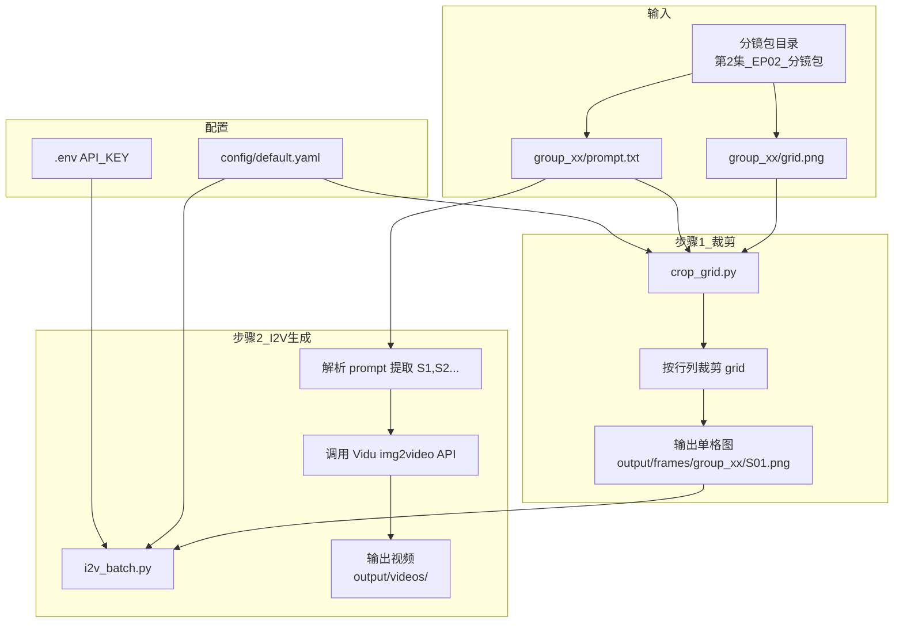

# fv_autovidu 项目架构说明

## 流程图



## 项目结构

```
fv_autovidu/
├── config/                    # 配置
│   └── default.yaml           # 默认配置（模型、时长等）
├── scripts/                   # 可执行脚本
│   ├── crop/
│   │   └── crop_grid.py       # 将 grid.png 按网格裁剪成单格
│   ├── i2v/
│   │   ├── batch.py           # 批量 i2v（prompt.txt）
│   │   ├── prompt_test.py     # 3×2 提示词对比（prompt.md）
│   │   └── selected_1080p.py  # 选定任务固定种子 1080p
│   ├── task/
│   │   ├── poll.py            # 轮询任务状态
│   │   └── download.py        # 下载视频
│   ├── run_full_test.py       # 完整测试：提交→轮询→下载
│   └── run.sh                 # 一键：裁剪 → i2v
├── src/                       # 核心模块（Python 包）
│   └── vidu/
│       ├── __init__.py
│       └── client.py          # Vidu API 封装
├── public/                    # 资源（已有）
│   └── img/shot/第2集_EP02_分镜包/
├── output/                    # 输出目录（脚本生成）
│   ├── frames/                # 裁剪后的单格图
│   │   └── {episode}/{group}/S{nn}.png
│   └── videos/                # 生成的视频
│       └── {episode}/{group}/S{nn}.mp4
├── docs/
│   └── vidu/i2v.md
├── requirements.txt
├── .env.example               # API Key 模板
└── README.md
```

## 网格布局规则

根据 prompt 中的场景数量自动推断 grid 行列：

| 场景数 | 布局 (行×列) | 说明 |
|--------|--------------|------|
| 3 | 1×3 | 横向或纵向 3 格 |
| 4 | 2×2 | 标准四宫格 |
| 5 | 2×3 | 2 行 3 列，用前 5 格 |
| 6 | 2×3 或 3×2 | 六宫格 |

## 使用流程

1. **配置**：复制 `.env.example` 为 `.env`，填入 Vidu API Key
2. **裁剪**：`python scripts/crop_grid.py` 将分镜包内的 grid 裁成单格
3. **生成**：`python scripts/i2v_batch.py` 批量提交 i2v 任务
4. **或一键**：`./scripts/run.sh` 依次执行裁剪与生成
