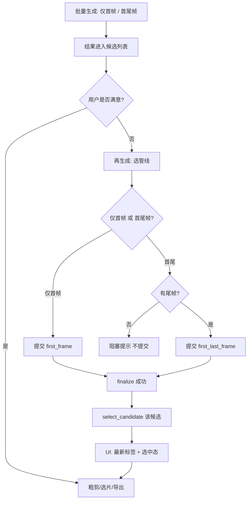

# 视频生成模式与「再生成」策略 — 设计说明

**日期**：2025-03-26  
**状态**：v1 已收口，可开工；延伸项与后续需求见文末  

---

## 0. 评审结论（实现前必读）

当前代码已具备大半能力：**批量首帧 / 首尾帧**、**候选追加非覆盖**、**人工选定**（`StoryboardPage`、`generate.py` 视频提交、`data_service.select_candidate` 等）。  
以下 **5 点在收口前会卡住实现**，本文 **§11 v1** 已逐项定死或移出验收，避免临场拍脑袋。

| 风险点 | v1 结论 |
|--------|---------|
| 首尾帧「再生成」但无尾帧 | **阻塞提示，不自动补尾帧**（与现有后端 `generate.py` 行为一致：任务失败并提示先生成尾帧） |
| 「最新」与「自动选中」的数据规则 | **见 §6.1**，不引入 `isLatest` 字段亦可落地 |
| 手动删除旧候选 | **移出 v1 验收**，单列后续需求（当前无删除 API/UI） |
| 「重试」一词歧义 | **见 §5 术语表**：失败任务 vs 质量不满意 |
| 键盘快捷 | **v1 以按钮为主**；快捷键可跟 §12 后续迭代 |

---

## 1. 背景与目标

- 实际使用中发现：**不一定需要「首尾帧」全自动跑通**；有时**仅首帧 i2v** 质量已可接受。
- 目标：让用户能 **自选批量管线**、在结果不满意时 **显式再生成新候选**，并 **省掉不必要的尾帧生产**（仅在需要首尾语义或用户选择首尾帧管线时再走尾帧）。
- 与现有能力的关系：工程内已有 `first_frame` / `first_last_frame`、候选列表、粗剪/选片、`promote`（预览档 → 精出档）等；本设计约束 **产品行为与交互**，实现时对接现有 API 与 `VideoCandidate` 模型。

---

## 2. 批量生成：用户自选模式

- 用户在一次批量操作中 **明确选择**：
  - **仅首帧（i2v）批量**，或
  - **首尾帧批量**（依赖尾帧）。
- **v1（无尾帧时）**：若用户选择首尾帧批量但某镜 **无尾帧或文件缺失**，行为与现网一致：**该次请求失败并提示需先生成尾帧**，**不**在 v1 自动排队尾帧。

---

## 3. 尾帧策略

- **默认不强制**「先有尾帧再谈视频」：若用户以 **仅首帧** 为主路径，可 **不生成尾帧**。
- 当用户需要 **首尾语义** 或发起 **首尾帧管线再生成** 时：若尚无尾帧，**先完成尾帧生产**（用户操作），再提交首尾视频；**v1 不在服务端自动补尾帧**。

---

## 4. 质量不满意：用户驱动 + 两种管线

- 当 **多版候选都不合适** 时，由用户发起 **再生成**（追加新候选），而非系统自动判定「不合理」。
- **输入方式（v1）**：**界面按钮** 为主（见 §11）；键盘快捷为增强项，见 §12。
- **两种管线（必须区分文案与入口）**：
  - **仅首帧再生成**：`mode=first_frame`。
  - **首尾帧再生成**：`mode=first_last_frame`；**无尾帧时不得提交**：前端 **禁用 + 说明**，与后端 `需要先生成尾帧后再使用首尾帧模式` 一致。

---

## 5. 术语表（避免与失败任务混淆）

| 概念 | 推荐用语 | 禁止/慎用 | 说明 |
|------|----------|-----------|------|
| Vidu/任务 **失败** 后的批量补救 | **重试失败镜头** | 与质量不满意混用 | 沿用 `BatchResultSummary` 等「失败任务」语义 |
| 质量不满意，要 **新一条候选** | **再生成**、**追加候选** | 单独使用「重试」 | 接口与任务汇总中避免单写「重试」 |

---

## 6. 再生成执行方式与候选生命周期

- **触发后立即提交**（不采用「先进入待办列表再统一执行」为 v1 主路径）。
- **新结果**：以 **追加** 方式进入候选列表（`VideoCandidate`），**不覆盖** 历史条目。
- **历史生成（v1）**：**保留**；**不**在 v1 要求「用户手动删除」（无删除能力前，本项 **不作为验收**）。删除能力见 §12。

### 6.1 「最新」与自动选中 — 数据规则（无新字段 v1）

- **`VideoCandidate` 已有 `createdAt`（ISO 字符串）**。  
  **「物理最新」候选**：同一镜下 `createdAt` **字典序最大**（或与写入顺序一致时等价于 **列表最后一项**，实现时需与后端 `add_video_candidate` 追加语义对齐，**以 `createdAt` 比较为准更稳**）。
- **自动选中**：在 **视频 finalize 成功**、已写入 `videoPath` 之后，将该 **本次完成的 `candidate_id`** 设为当前选中（调用现有 `data_service.select_candidate`）。  
  **推荐落点**：`web/server/services/task_store/video_finalizer.py` 在 `update_video_candidate` 成功后调用 `select_candidate`（需传入与其它路径一致的 `namespace_root`），保证 **单写入口**、避免前端轮询竞态。  
  若产品确认「仅再生成任务自动选中、首次批量不选中」，可在后续迭代用任务元数据收窄；**v1 默认**：凡本镜 **新视频落盘成功** 即选中该候选（与 §11 四句一致）。

### 6.2 视觉：长期区分「最新」与「当前选中」

- **「最新」标签**：指向 **§6.1 物理最新**（`createdAt` 最大者），**即使用户手动选回旧候选**，仍可显示「最新」在对应卡片上（满足「长期」与无障碍 **颜色 + 文案**）。
- **选中态**：沿用现有 `selected` 样式；可与「最新」叠加样式区分（具体色板跟设计体系）。

---

## 7. 流程图（Mermaid）

---

## 8. 相关延伸（非 v1 硬验收）

- **分镜表展示时长**：需数据层有可用字段或推导规则后再做 UI。
- **批量前显式选择分辨率与模型**（如候选 540+turbo、正式 1080+pro）：与 `promote` 策略对齐，独立需求。

---

## 9. 自审记录

- v1 边界与延伸项已分离；术语表与后端现网错误文案对齐。
- 与「手动删除」相关的矛盾已消除（移出 v1）。

---

## 10. v1 验收要点（可测试）

- [ ] 批量入口可区分 **仅首帧** 与 **首尾帧**，依赖尾帧处有清晰说明。
- [ ] 用户可发起 **仅首帧再生成** / **首尾帧再生成**；无尾帧时 **首尾帧再生成** 被 **阻止**（前端），且不与「重试失败镜头」文案混淆。
- [ ] **再生成** 立即提交；新结果 **追加**。
- [ ] 新候选 **finalize 成功后自动选中**（见 §6.1）。
- [ ] UI：**物理最新** 候选有 **非纯颜色** 的「最新」标识；选中态正常。

**不作为 v1 验收：**

- 候选 **手动删除**。
- **键盘** 快捷再生成（可 §12 跟进）。

---

## 11. v1 收口（四句）

1. **首尾帧再生成遇到无尾帧**：**阻塞提示，不自动补尾帧**（前后端一致）。
2. 质量不满意后的动作统一称 **再生成 / 追加候选**；失败任务称 **重试失败镜头**。
3. **新候选成功落盘后**：**自动选中该候选**（实现位置 §6.1）。
4. **手动删除旧候选** 移出本期验收，单列后续需求。

---

## 12. 后续需求（ backlog ）

- 候选 **删除** API + UI。
- **键盘**：再生成快捷键（与 `useVideoPickKeyboard` 扩展或分镜页局部 hotkey）。
- 若需 **仅再生成自动选中**、首次批量不改变选中：任务级 `autoSelectOnComplete` 元数据。
