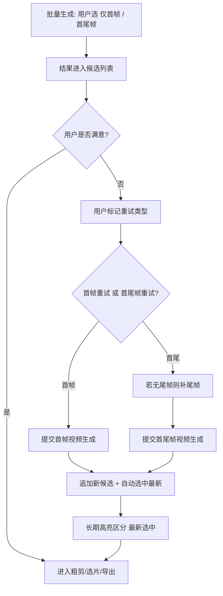

# 视频生成模式与重试策略 — 设计说明

**日期**：2025-03-26  
**状态**：已对齐脑暴结论，待实现评审  

## 1. 背景与目标

- 实际使用中发现：**不一定需要「首尾帧」全自动跑通**；有时**仅首帧 i2v** 质量已可接受。
- 目标：在不过度牺牲自动化能力的前提下，让用户能 **自选批量管线**、在结果不满意时 **显式重试**，并 **省掉不必要的尾帧生产**（仅在需要首尾语义或用户选择首尾重试时再走尾帧）。
- 与现有能力的关系：工程内已有 `first_frame` / `first_last_frame`、候选列表、粗剪/选片、`promote`（预览档 → 精出档）等；本设计主要约束 **产品行为与交互**，实现时对接现有 API 与 `VideoCandidate` 模型。

## 2. 批量生成：用户自选模式

- 用户在一次批量操作中 **明确选择**：
  - **仅首帧（i2v）批量**，或
  - **首尾帧批量**（依赖尾帧；无尾帧时行为在实现阶段定义：提示先跑尾帧 / 自动排队尾帧等）。
- 不要求用户在同一镜上「双线并行」两种抽象；重点是 **批量策略可选**，而非强行统一流水线。

## 3. 尾帧策略（与「省尾帧」一致）

- **默认不强制**「先有尾帧再谈视频」：若用户以 **仅首帧** 为主路径，可 **不生成尾帧**。
- 当用户需要 **首尾语义** 或选择 **首尾帧重试** 时，再 **补尾帧** 并提交首尾视频任务。

## 4. 重试：用户驱动 + 两种类型

- 当 **多版候选都不合适** 时，由用户标记需要重试，而非系统自动判定「不合理」。
- **输入方式**：**键盘快捷键** 与 **界面按钮** 并存（具体键位与组件布局在 UI 方案中定稿）。
- **两种重试类型（必须区分）**：
  - **首帧重试**：按仅首帧管线再次生成。
  - **首尾帧重试**：按首尾帧管线再次生成；若尚无尾帧，需先走尾帧生成或给出明确阻塞提示（实现时二选一或分阶段落地）。

## 5. 重试执行方式与候选生命周期

- **触发后立即提交**（不采用「先进入待办列表再统一执行」为第一版主路径）。
- **新结果**：以 **追加** 方式进入 **待选/候选清单**（`VideoCandidate` 列表语义），**不覆盖** 历史条目。
- **历史生成**：**不自动删除**；由用户 **手动删除** 不需要的候选，避免误触丢片。

## 6. 选中态与视觉：自动选中 + 长期高亮

- 重试任务 **成功落盘并产生新候选** 后：**自动将「最新一条」设为当前选中**（`selectCandidate` 语义），便于直接进入粗剪/时间线。
- **视觉要求**：
  - 对 **当前选中** 且 **本轮新增/最新** 的条目，使用 **与旧候选明显不同的颜色** 进行区分（描边/背景等，遵循现有设计体系）。
  - **无障碍**：**不得仅依赖颜色**；需配合 **文案标签**（如「最新」）或 **图标**，保证色弱可辨。
  - **持久性**：该区分方式为 **长期保留**（非「看过即消失」的一次性高亮），直到用户切换选中或删除/数据变更等后续规则在实现中明确。

## 7. 流程图（Mermaid）

## 8. 相关延伸（本 spec 范围外 / 后续可单列）

以下条目在脑暴中提及，**不作为本文件的验收硬条件**，实现时可拆独立需求：

- **分镜表展示时长**：需在数据层有可用的时长字段或推导规则后再做 UI。
- **批量前显式选择分辨率与模型**：候选阶段例如 **540p + turbo 并保留种子**，正式生成 **1080p + pro**，与现有 `promote` 策略对齐；需在批量弹窗与请求体上 **显式展示** 默认与可选项。

## 9. 自审记录

- **占位符**：无 TBD 段落；未决项已归入第 8 节「延伸」。
- **一致性**：重试追加、不删旧、自动选中、长期视觉区分之间无矛盾。
- **范围**：本文件聚焦模式选择与重试；不展开服务端并发度与任务队列细节。

## 10. 验收要点（摘要）

- [ ] 批量入口可区分 **仅首帧** 与 **首尾帧**，且文案与依赖（尾帧）清晰。
- [ ] 用户可对不满意结果发起 **首帧重试** / **首尾帧重试**，且两种入口可区分。
- [ ] 重试 **立即执行**；新结果 **追加**；旧结果保留至用户删除。
- [ ] 新结果 **自动选中**；UI **长期** 以 **颜色 + 非纯颜色** 方式区分最新选中项。
