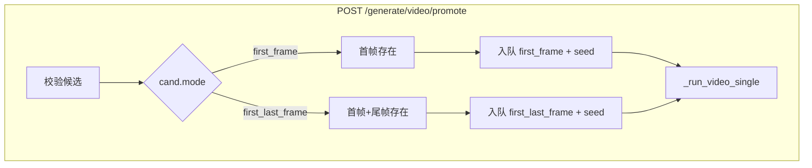

# 后期制作单页、首帧精出与剪映字幕 — 设计说明

**日期**：2026-03-27  
**状态**：已与产品讨论确认，可进入实现规划  
**前置讨论**：信息架构选 **单页「后期制作」**；首帧精出选 **锁 seed + 1080p + viduq3-pro + 首帧 i2v，不依赖尾帧**；字幕默认值 **v1 使用 localStorage**（跨设备持久化见 §7）。

---

## 0. 评审结论

| 决策点 | 结论 |
|--------|------|
| 导航结构 | 单一 **「后期制作」** 路由页，内含 **配音** 与 **剪映（字幕 + 导出）** 两个主区块（Tab 或等价分区） |
| 首帧候选精出 | 扩展 `POST /generate/video/promote`：`mode=first_frame` 的预览成功候选可精出；入队 **`first_frame`**，**不**校验尾帧 |
| 首尾帧候选精出 | 行为与现网一致：`mode=first_last_frame`，校验尾帧存在并入队首尾帧任务 |
| 字幕 / 画布参数 | 导出请求携带可配置字段；**v1** 默认值存 **localStorage**（按 `episodeId` 作用域） |
| Tab「批量精出」 | **不在本期**；精出入口仍在分镜 / 选片等现有位置，与现网一致 |

---

## 1. 背景与目标

- **首帧管线** 已支持仅首帧 i2v，但 **精出** 接口仅放行 `first_last_frame`，导致预览档无法按同一心智升级 1080p pro。
- **配音（STS/TTS）** 与 **剪映字幕** 能力部分在后端已有，但缺少 **聚合的前端页面** 与 **字幕/画布可调项**。

**目标**：

1. 后端：首帧与首尾帧 **统一精出入口**，按候选 `mode` 分流。
2. 前端：新增 **后期制作页**，承载配音与剪映配置 + 导出。
3. 剪映：扩展请求体与 `jianying_text_track` 构建逻辑，使 **画布尺寸** 与 **字幕样式** 可配。

---

## 2. 首帧精出（后端）

### 2.1 校验规则（`promote_video`）

对每条 `items[]` 中指向的候选：

- **共用**：`taskStatus=success`、`seed>0`、`isPreview=true`、首帧文件存在。
- **`cand.mode == "first_frame"`**：
  - **不**要求 `shot.endFrame` 或尾帧文件。
  - 入队任务 `mode` 为 **`"first_frame"`**，`seed` 取自候选，`model`/`resolution` 来自请求（默认 `viduq3-pro` / `1080p`），`is_preview=false`，`promoted_from=candidateId`。
- **`cand.mode == "first_last_frame"`**：
  - 与现网一致：要求 `endFrame` 及文件存在；入队 **`"first_last_frame"`**。

### 2.2 显式不支持

- **`reference` 等其它 mode** 的预览候选：**本期不**支持精出；返回 400 说明仅支持 `first_frame` / `first_last_frame`。

### 2.3 前端

- **分镜 / 选片**：当候选为 `first_frame` 且为可精出的预览成功态时，展示 **「精出 1080p」**，调用同一 promote API。
- **`usePromoteCandidate`**：请求体可保持不变；由服务端根据候选类型分流。

---

## 3. 「后期制作」单页（前端信息架构）

### 3.1 路由与入口

- **路径**（建议）：`/episodes/:episodeId/post-production`（与现有 React Router 模式对齐，最终以工程内路由定义为准）。
- **入口**：剧集详情页增加主按钮 **「后期制作」**（或「配音与字幕」），传入当前 `episodeId`。

### 3.2 页面结构

- **顶栏**：返回剧集详情、剧集标题（只读）。
- **主体**：两个 Tab（或锚点 + 滚动）：
  - **配音**：ElevenLabs 配置状态、音色列表、STS / TTS、批量配音、任务轮询与状态表（逻辑对齐现有 `DubPanel`，可抽成 `DubSection` 复用）。
  - **剪映**：`canvasSize`（720p / 1080p）、字幕样式表单、**导出草稿**（调用 `jianyingDraft`，并传画布 + 字幕参数）。

### 3.3 与现有组件关系

- **剪映导出**：现有 `JianyingExportDialog` 以弹窗 + 路径为主；本期可在 **后期制作 Tab** 内嵌 **同 API** 的表单（路径 + 画布 + 字幕），或保留弹窗但从本页打开并预填 —— 实现阶段选 **重复最少** 的一种（优先抽 **共享表单组件**）。

---

## 4. 配音（STS / TTS）

- **行为不变**：无音轨时 STS 失败、提示改 TTS（本期 **不** 强制做自动降级，可作为后续优化）。
- **位置迁移**：从仅挂在某面板 → **后期制作页首 Tab** 可见；避免功能分散。

---

## 5. 剪映字幕与画布（后端 + 请求体）

### 5.1 `JianyingExportRequest` 扩展（字段名在实现时与 Pydantic 命名风格一致）

- **`canvasSize`**：已有，默认 `1080p`；前端在后期制作页 **暴露** 720p / 1080p。
- **字幕样式**（建议最小集，与 `pyJianYingDraft` 对齐）：
  - 字号（映射 `TextStyle.size`）
  - 对齐（映射 `align`）
  - 是否自动换行（`auto_wrapping`）
  - 纵向位置（映射 `ClipSettings.transform_y` 或等价参数）

具体数值范围与默认值在实现前对照 `jianying_text_track.build_text_track_payload` 与库类型定义 **锁死**，避免剪映客户端解析失败。

### 5.2 持久化策略（v1）

- **默认项**：按 `episodeId` 存 `localStorage`（键名需加项目前缀，与 `LS_JIANYING_DRAFT_PATH` 风格一致）。
- **导出请求**：每次提交时带当前表单值（不依赖仅本地存储才能导出）。

### 5.3 v2（后续）

- 将字幕 / 画布默认值写入 `episode.json` 或专用字段，支持多机一致。

---

## 6. 数据流（精出）

---

## 7. 非目标与后续 backlog

- 候选 **删除**、精出 **批量专用页**。
- STS **无音轨自动切 TTS**。
- 字幕 **字体族 / 颜色 / 描边**（若库支持不足则后续迭代）。
- **v2** episode 级持久化字幕预设。

---

## 8. 验收要点（可测试）

- [ ] `first_frame` 预览成功候选可 **精出**，生成非预览候选，**无需**尾帧。
- [ ] `first_last_frame` 精出行为与升级前一致。
- [ ] `reference` 等 mode 调用 promote 返回 **明确 400**。
- [ ] 后期制作页可完成：**配音批量**、**剪映导出**（含画布与字幕参数），且默认值在刷新后可从 localStorage 恢复（同 episode）。
- [ ] 剧集详情 **入口** 可进入后期制作页并返回。

---

## 9. 相关文档

- `docs/superpowers/specs/2025-03-26-video-generation-modes-retry-design.md`（再生成与候选生命周期）
- `web/server/routes/generate.py`（`promote_video`、`_run_video_single`）
- `web/server/services/jianying_text_track.py`

---

## 10. 自审记录

- 已消除歧义：首帧精出 **不** 要求尾帧；首尾帧精出 **仍** 要求尾帧。
- 范围：单页 + promote 扩展 + 剪映请求扩展；无「批量精出 Tab」。
- 持久化：默认 **v1 localStorage**，v2 单列 backlog。
