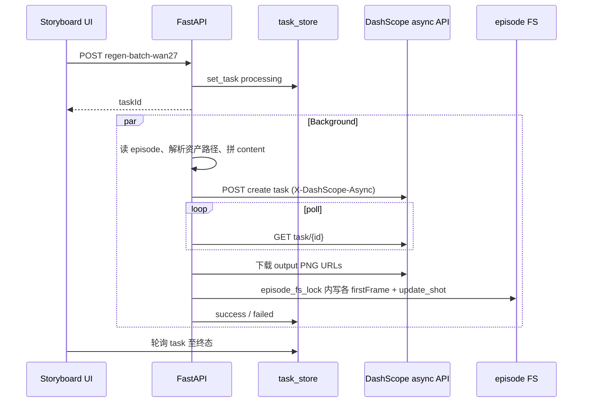

# 万相 Wan 2.7 分镜批量重生 — 设计说明

**日期**：2026-04-03  
**状态**：设计已定稿（待实现）  
**关联**：`reference/wan2.7api/wan2.7_api.md`、`docs/单帧重生.md`、现有 `POST /generate/regen-frame`（yunwu）

---

## 1. 背景与目标

- 团队已在参考脚本中跑通 **DashScope 万相 2.7**：异步建任务、轮询、`enable_sequential` 组图、多参考图 + 长文本 prompt。
- 目标：在 **不替代** 现有「单帧重生（yunwu / Gemini）」的前提下，增加一条 **可选路径**：对用户 **选中的一批镜头** 发起 **一次（或受 API 限制下的多次）组图生成**，按顺序写回各镜 `firstFrame`，并清空尾帧与视频候选（与单帧重生语义对齐）。
- **执行栈结论**：主 API 仍为 **Python FastAPI**；Wan 2.7 调用在 **`src/` + `web/server/services/`** 内用 **HTTP 客户端**（`requests` 或 `httpx`）实现，**不**新增 Node 微服务。瓶颈主要在百炼排队与限流，而非语言层并发。

---

## 2. 范围与非目标

### 2.1 v1 范围内

- 新后端路由：例如 `POST /generate/regen-batch-wan27`（名称实现时可微调，须与前端 `generateApi` 一致）。
- 请求体：`episodeId`、`shotIds: string[]`（顺序 **即组图顺序**）、可选 `assetIds`（与单帧重生一致的资产解析规则）、可选 `size` / `model`（默认 `wan2.7-image-pro`、`2K` 或与剧集 `aspectRatio` 映射后的合法 `size`）。
- 后台任务：`task_store` 新 `kind`（如 `regen_wan27_batch`），与 `regen-*` 一样 **异步 + 前端轮询**。
- Prompt：**服务端组装** — 参考图（来自剧集资产路径，转 `data:image/...;base64,...` 或公网 URL 若未来有托管）+ 文本：头部说明 `image1=…` 与各 Shot 的 `imagePrompt`（及可选 `visualDescription` 片段）按镜序拼接；总长度遵守 API **5000 字符** 上限（超长需截断策略或报错，见 §6）。
- 成功落盘：对 `shotIds[i]` 写回 `episode_dir / shot.firstFrame`（与 `_run_regen_frame` 相同文件契约），并 `update_shot`：`imagePrompt` 可按镜更新、`endFrame: null`、`videoCandidates: []`、`status: "pending"`。
- 环境变量：沿用 `.env` 的 `DASHSCOPE_API_KEY`；地域与 `DASHSCOPE_REGION` / `base_url` 与官方文档一致（北京 / 新加坡 **不可混用**）。

### 2.2 v1 非目标

- 不在 v1 要求把 `reference/wan2.7api` 下的 **TypeScript `Wan27Client` + dist** 纳入生产构建；参考脚本可继续用于手工实验。
- 不在 v1 做「自动内容审核改写」；合规提示词策略由调用方（或后续独立模块）负责。
- 不在 v1 替换尾帧（endframe）或视频管线；仅 **首帧批量重生**。

---

## 3. 架构与数据流

- **HTTP 重试**：创建任务与轮询中的 **429 / 5xx** 可复用或对齐 `src/utils/retry.py` 的指数退避（注意轮询需区分「任务仍在 PENDING」与「HTTP 失败」）。
- **并发**：v1 **单任务单组图**；多用户并行由各自独立 `task_id` 与 DashScope 限流共同约束；不在 v1 引入复杂 Worker 池。

---

## 4. DashScope 调用约定（实现对照）

- **异步路径**（推荐组图）：`POST .../services/aigc/image-generation/generation`，Header `X-DashScope-Async: enable`；再 `GET .../tasks/{task_id}` 直至 `SUCCEEDED` / `FAILED`。
- **组图**：`parameters.enable_sequential: true`，`parameters.n` = 本批镜头数（见 §5）。
- **计费**：按成功出图张数计费；实现须在日志中记录 `usage.image_count`（若返回）便于对账。

---

## 5. 选中数量与 API 上限

- 官方组图模式：`n` 取值 **1–12**（最大生成张数，实际张数由模型决定且不超过 `n`）。
- **v1 规则**：`len(shotIds)` 必须 **≥1 且 ≤12**；否则 **400** 返回明确文案（前端在提交前做同样校验）。
- **后续（v2）**：可选「自动拆批」—— 例如每批最多 12 镜、多任务顺序或并行；需在 prompt 中处理跨批连续性，单独立项。

---

## 6. Prompt 与参考图

- **参考图顺序**：与 `content` 中 `image` 数组顺序一致；文本中 `image1`、`image2`… 与之一一对应（与 `wan27-walkingdead-12panel.mjs` 同源约定）。
- **资产来源**：与 `_resolve_regen_asset_paths` 或现有单帧重生逻辑 **复用同一解析规则**，避免两套路径语义。
- **文本**：开头简短说明组图数量、画幅（尽量与 `Shot.aspectRatio` 一致）、无字幕等；随后按 `shotIds` 顺序列出各镜描述（优先 `imagePrompt`，可附 `shotNumber` 便于人工对照）。
- **长度**：单条 `text` **≤5000 字符**；超出时 v1 采用 **拒绝请求并提示精简**（比静默截断更安全）。

---

## 7. 与现有「单帧重生」关系

| 维度 | yunwu `regen-frame` | Wan 2.7 批量（本设计） |
|------|---------------------|-------------------------|
| 入口 | 单镜 `RegenFramePanel` | 分镜板多选 + 新操作（文案需与「重试失败镜头」区分，见既有术语表） |
| 模型 | Gemini（图+文） | wan2.7-image-pro（组图+多参考） |
| 一致性 | 单镜最优 | **跨镜角色/风格** 更易一致 |
| 落盘副作用 | 清尾帧、清候选 | **相同** |

用户可在产品中 **二选一或分场景使用**；不在 UI 上强制替代。

---

## 8. 错误处理与可观测性

- **任务失败**：`task_store` 写入 `failed` + `error` 字符串（含 DashScope `code`/`message` 若可得）。
- **部分成功**：若 API 返回张数 **少于** `len(shotIds)`，v1 策略：**整任务失败**，不落盘任意一帧，错误信息说明「期望 N 张，实际 M 张」（避免 episode 处于不一致中间态）。
- **URL 时效**：生成图 URL **24h** 内有效；后台应在成功后 **立即下载** 再写本地。

---

## 9. 安全与配置

- **API Key**：仅服务端读取环境变量，不暴露给前端。
- **`.env`**：已配置的 `DASHSCOPE_API_KEY` 与地域保持一致；禁止北京 Key 打新加坡 `base_url`。

---

## 10. 前端（v1 最小集）

- 在 `StoryboardPage`（或现有批量操作区）增加：**多选镜头 →「万相组图重生」**（具体文案待定，避免与 Vidu「重试失败」混淆）。
- 调用新 API → `taskStore` 轮询 → 成功后 **刷新剧集** + **首帧 cache bust**（与 `RegenFramePanel` 行为一致）。
- 校验：`1 ≤ 选中数 ≤ 12`。

---

## 11. 测试建议（实现阶段）

- Mock DashScope：创建任务与查询返回固定 JSON，验证轮询与落盘顺序。
- 集成：单镜 1 张、多镜 3 张、边界 12 张；错误路径：API `FAILED`、张数不足。

---

## 12. 修订记录

| 日期 | 说明 |
|------|------|
| 2026-04-03 | 初稿：Python 直连、异步组图、与 yunwu 并行、n≤12、按选中顺序写回 |
