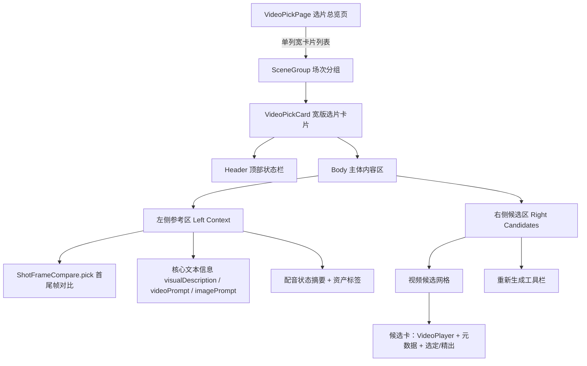

# 候选页（选片总览页）改版设计方案

## 1. 背景与目标

当前 `VideoPickPage` 的定位更接近“候选视频浏览页”：`VideoPickCard` 主要展示视频候选，而刻意不展示首尾帧和 prompt 文本。这样虽然节省了总览页空间，但用户在选片时，一旦要核对“生成结果是否符合首尾帧构图和原始提示词”，就必须跳转到镜头详情页，打断连续决策。

本次改版的目标不是单纯“加更多信息”，而是把选片页升级为真正的“轻量决策页”：

1. 在同一个卡片里同时看到参考信息和候选结果。
2. 让大多数选定动作都能在总览页完成。
3. 保持总览页可扫读，不把卡片堆成巨型详情页。

### 1.1 非目标

以下能力仍然不放进选片页首版：

1. 批量尾帧、批量视频、框选等批量工作流。
2. 配音任务配置面板。
3. 镜头级完整编辑能力。
4. 为了“收纳更多内容”而引入复杂的 Tabs / 弹窗 / 二级面板。

原则：选片页是“对照 + 决策”，不是“详情页搬运”。

## 2. 最终设计结论

### 2.1 页面级布局

`VideoPickPage` 从现有多列网格改为单列宽卡片列表：

1. 保留 `SceneGroup` 场次分组。
2. 每个场次内的镜头卡片改为 `flex flex-col gap-6` 单列堆叠。
3. 桌面端采用左右分栏宽卡片。
4. `lg` 以下退化为上下堆叠，不强行保持左右分栏。

这样做的核心原因是：选片行为更强调“单镜头内的横向对照”，而不是“多镜头同时扫缩略图”。

### 2.2 卡片级布局

每个 `VideoPickCard` 采用“两区一栏头”的结构：

1. 顶部信息栏：镜头身份与状态。
2. 左侧参考区：首尾帧 + 核心文本 + 资产。
3. 右侧候选区：候选视频 + 选定/精出 + 再生成工具栏。

桌面端优先保证右侧候选区可读性，因此左侧参考区应控制信息密度，不做“所有字段完整展开”。

## 3. 信息架构与展示规则

### 3.1 顶部信息栏 Header

保留并延续现有信息：

1. 镜头号 `Sxx`
2. 运镜
3. 时长
4. 画幅分组
5. 状态指示 `StatusIndicator`
6. 状态文本标签

若后续需要补充“已选中候选对应的配音状态”，优先以轻量徽标形式出现，不在 Header 中放长文本。

### 3.2 左侧参考区 Left Context

左侧参考区不是详情页缩编版，而是“选片判断所需的最小参考集”。

包含以下内容：

1. 首帧 / 尾帧对比。
2. 核心文本信息。
3. 资产标签。

#### 3.2.1 首尾帧展示

必须复用 `@/components/business/ShotFrameCompare`，但不直接复用当前 `card` 变体，而是新增一个面向选片页的 `pick` 变体。

新增 `pick` 变体的要求：

1. 保持双列对照，不改单帧。
2. 比 `card` 更紧凑，避免在左栏占据过高垂直空间。
3. 仍保留现有的占位、加载、失败重试语义。
4. 尺寸上以“适合左栏宽度”为第一目标，而不是追求大图展示。

不建议在首版中使用 Tabs 在“首尾帧 / 文本 / 资产”之间切换，因为这会重新引入一次额外交互，抵消总览页对照价值。

#### 3.2.2 文本信息优先级

左侧文本区不应把所有长文本平铺到底，必须做优先级控制。

默认展示优先级：

1. `visualDescription`：最高优先级，帮助快速理解镜头意图。
2. `videoPrompt`：第二优先级，帮助比对视频生成约束。
3. `imagePrompt`：补充参考，默认可比前两者更短。
4. `dub`：此处仅展示“配音状态”，不展示不存在于当前数据结构中的配音文案。

其中：

1. `visualDescription` 默认展示 3 行。
2. `videoPrompt` 默认展示 4 行。
3. `imagePrompt` 默认展示 2 行。
4. 超出部分使用截断，按需提供“展开更多”。

说明：

1. 当前 `shot.dub` 在数据结构中是状态对象，不是配音台词文本，因此文档中的“配音”统一解释为“配音状态摘要”。
2. 首版不做多层折叠容器，只为长文本提供轻量展开。

#### 3.2.3 资产标签

资产标签继续复用 `AssetTag`，但需要控制密度：

1. 默认展示前 3 个资产标签。
2. 超出时使用 `+N` 或“更多”提示，而不是把左栏撑满。
3. Hover 预览和跳转资产详情的既有行为保留。

### 3.3 右侧候选区 Right Candidates

右侧是卡片主体，优先级高于左侧。

包含以下内容：

1. 视频候选网格。
2. 每个候选的元数据与操作按钮。
3. 再生成工具栏。

#### 3.3.1 候选网格规则

候选视频不再简单按“数量 = 列数”机械平铺，而是按可读性排布：

1. 1 个候选：单列，大尺寸展示。
2. 2 个候选：双列展示。
3. 3 个及以上候选：默认最多 2 列，仅在超宽空间下才允许 3 列。

原因：

1. 当前选片页候选多为竖屏或接近竖屏内容。
2. 在右侧 2/3 宽度里直接铺 3 列，播放器可读性容易明显下降。
3. 选片场景更需要“看清楚”，不是“塞更多”。

已选定候选必须继续保留明显的视觉高亮。

#### 3.3.2 工具栏位置

保持当前交互逻辑：

1. 有候选时，工具栏放在候选网格下方。
2. 无候选时，工具栏优先展示，便于直接发起生成。
3. “重新生成视频”和“自定义参数”继续保留在卡片内，不额外弹出二级操作区。

## 4. 响应式与退化策略

### 4.1 桌面端

`lg` 及以上：

1. `VideoPickCard` 主体使用左右分栏。
2. 左侧参考区建议固定宽度或约 30%~35%。
3. 右侧候选区占剩余空间。

### 4.2 小屏与窄屏

`lg` 以下：

1. 卡片退化为上下堆叠。
2. 顺序保持“参考区在上，候选区在下”，不重新洗牌。
3. 不在小屏强做左右分栏，避免横向压缩导致文本与播放器同时不可读。

### 4.3 不采用的方案

以下方案不作为首版默认方案：

1. 左栏做 Tabs 切换。
2. 左栏做多级折叠面板。
3. 在移动端保留强制左右分栏。

这些方案会降低直观性，先解决“看得到”，再考虑“收纳得更巧”。

## 5. 边界情况与空状态规则

以下规则必须在实现前写死，避免出现“布局没崩，但体验很怪”。

### 5.1 无首帧

1. 左侧参考区仍然渲染。
2. 首帧位置显示“暂无”占位。
3. 右侧工具栏沿用当前逻辑：若无首帧则不能直接发起视频生成，并给出说明文案。

### 5.2 无尾帧

1. 尾帧位置显示“待生成”占位。
2. 若尾帧生成中，显示 loading skeleton。
3. 若尾帧失败且已有重试入口，保留重试语义。

### 5.3 无候选视频

1. 左侧参考区仍然显示，因为它本身就是“决定是否继续生成”的参考依据。
2. 右侧不展示空网格，直接展示工具栏和引导文案。
3. 引导文案不再强调“去详情页看 prompt”，因为 prompt 已在本页可见；只在需要深度编辑时引导去详情页。

### 5.4 无文本信息

1. 某个字段为空时不渲染该字段块。
2. 若所有文本字段均为空，显示“暂无提示词信息”占位文案。
3. 不因文本为空而移除整个左栏。

### 5.5 多资产 / 超长文本

1. 长文本必须截断并支持轻量展开。
2. 资产标签必须限制首屏数量。
3. 任何文本和标签区域都必须带 `min-w-0`，避免撑破 flex 布局。

## 6. 性能策略

本次改版会增加单卡片的 DOM、图片和视频内容，因此要有性能意识，但不在首版中预埋过度复杂的方案。

### 6.1 首版必须做到

1. 保持媒体组件复用，不新建重复实现。
2. 只在真实需要时再引入更重的懒加载策略。
3. 以真实剧集数据验证 40~50 个镜头时的滚动与首屏体验。

### 6.2 首版暂不做

以下不是 P0：

1. 为左侧参考区引入 `React.lazy + Suspense`。
2. 为文档首版设计引入复杂虚拟列表方案。
3. 为避免“可能的性能问题”提前拆碎交互结构。

如果后续在真实数据下确认性能不足，优先考虑：

1. 媒体进入视口后再加载或挂载。
2. 对图片/视频增加更明确的懒加载策略。
3. 再评估是否需要更重的列表优化。

结论：性能需要验证，但不应主导首版交互设计。

## 7. 架构与组件关系



## 8. 代码落地建议

### 8.1 页面级修改 (`VideoPickPage.tsx`)

将包裹 `VideoPickCard` 的容器从现有多列网格：

```tsx
grid grid-cols-1 md:grid-cols-2 xl:grid-cols-3
```

修改为单列垂直堆叠：

```tsx
flex flex-col gap-6
```

并同步调整页面顶部提示文案，去掉“需要看提示词请进详情”的旧表述。

### 8.2 卡片级修改 (`VideoPickCard.tsx`)

推荐结构：

```tsx
<article className="border-2 ... flex flex-col box-border" style={{ boxSizing: "border-box" }}>
  <header>...</header>

  <div
    className="flex flex-col lg:flex-row gap-4 p-4 box-border"
    style={{ boxSizing: "border-box" }}
  >
    {/* 左侧参考区：提供选片所需的最小参考集，而不是完整详情页 */}
    <aside
      className="w-full lg:w-[22rem] xl:w-[24rem] shrink-0 flex flex-col gap-3 min-w-0 box-border"
      style={{ boxSizing: "border-box" }}
    >
      <ShotFrameCompare variant="pick" ... />
      {/* visualDescription / videoPrompt / imagePrompt / dub status */}
      {/* asset tags */}
    </aside>

    {/* 右侧候选区：卡片主体，优先保证候选视频可读性 */}
    <main
      className="flex-1 min-w-0 flex flex-col gap-3 box-border"
      style={{ boxSizing: "border-box" }}
    >
      <div className={candidateGridClass(shot.videoCandidates.length)}>
        {/* 渲染视频候选 */}
      </div>
      {/* 重新生成工具栏 */}
    </main>
  </div>
</article>
```

### 8.3 `candidateGridClass` 调整建议

不要继续使用“3 个候选就强行 3 列”的简单策略。建议改为“最多 2 列为默认，超宽屏才 3 列”的规则。

### 8.4 `ShotFrameCompare` 调整建议

新增 `pick` 变体，而不是硬塞现有 `card` 或 `row`：

1. `card` 太高。
2. `row` 太小，更适合列表缩略，而不是选片参考。
3. `pick` 应该处于两者之间。

## 9. 样式与实现规范

1. 所有带 `padding` 的容器必须显式保证 `box-sizing: border-box`。
2. 所有左右分栏区域必须带 `min-w-0`，防止文本或标签把布局撑坏。
3. 必须复用 `ShotFrameCompare` 和 `AssetTag`，不要在 `VideoPickCard` 内重写重复 UI。
4. `VideoPickCard` 中应添加清晰的业务注释，说明“左侧是参考，右侧是决策主体”。
5. 代码完成后必须自查无首帧、无尾帧、无候选、无提示词、多资产、超长文本等场景。

## 10. 预期效果

通过这次改版，选片页应达到以下效果：

1. 用户的视线可以在“预期参考”和“生成结果”之间快速横向切换。
2. 大部分选片决策可以在总览页完成，不必反复跳镜头详情页。
3. 卡片信息虽然增加，但仍保持“能扫读、能比较、能操作”。
4. 页面成为真正的选片工作台，而不是仅展示候选缩略的浏览页。
