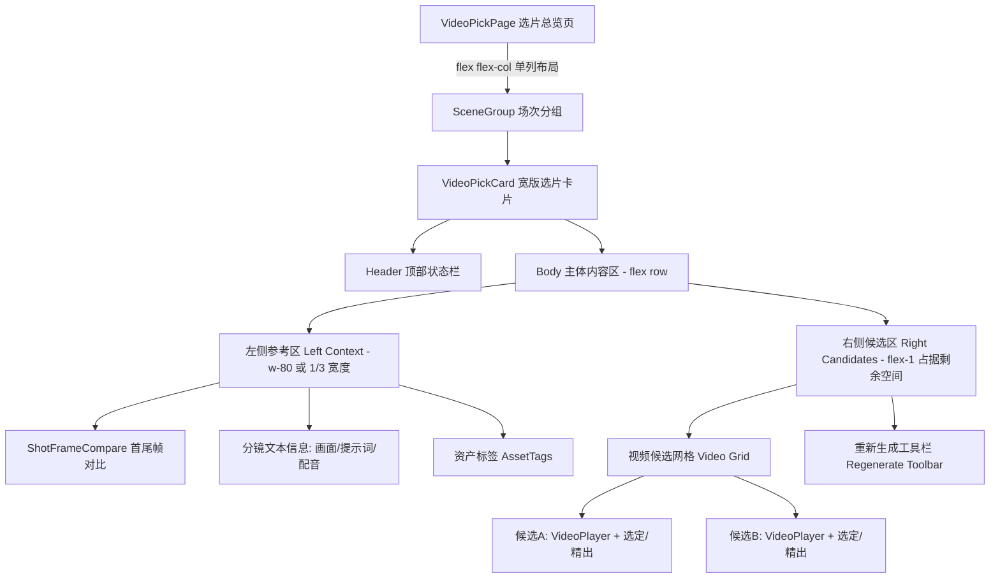

# 候选页（选片总览页）改版设计方案

## 1. 背景与目标

在当前的 `VideoPickPage`（选片总览页）设计中，为了节省空间，卡片（`VideoPickCard`）主要展示生成的视频候选（Video Candidates），而刻意隐藏了首尾帧（First/Last Frames）以及分镜表里的重要文本内容（画面描述、视频提示词、配音等）。
这导致用户在挑选视频时，如果需要核对“生成的视频是否符合原始提示词和首尾帧的构图”，必须点击进入“镜头详情页”才能查看，频繁的页面跳转打断了选片的心流。

**目标**：重新设计选片卡片的布局，使得用户在同一个视图内，能够**同时看到**：
1. 首帧与尾帧（视觉参考）
2. 分镜表重要内容（文本参考）
3. 视频候选列表（生成结果）

## 2. 核心设计思路：从“网格平铺”到“左右分栏宽卡片”

为了在不大幅增加垂直滚动负担的前提下展示更多信息，建议将 `VideoPickPage` 的布局从现在的“多列网格（Grid）”改为“单列宽行（List/Row）”。
每个 `VideoPickCard` 变成一个横向展开的宽卡片，采用**左右分栏布局**。

### 2.1 布局拆解

*   **顶部信息栏 (Header)**：
    *   横贯整个卡片顶部。
    *   保留现有的镜头号（Sxx）、运镜、时长、画幅、状态标签（StatusIndicator）。
*   **左侧参考区 (Left Context Area) - 固定宽度或占比约 1/3**：
    *   **首尾帧对比**：复用 `ShotCard.tsx` 中的 `<ShotFrameCompare />` 组件，直观展示首尾帧。
    *   **分镜文本信息**：以紧凑的排版展示 `visualDescription` (画面描述)、`imagePrompt` (图像提示词)、`videoPrompt` (视频提示词) 和 `dub` (配音)。
    *   **资产标签**：复用 `<AssetTag />` 展示该镜头关联的资产。
*   **右侧候选区 (Right Candidates Area) - 占据剩余空间约 2/3**：
    *   **视频候选网格**：根据候选数量（1个、2个或3个以上）自适应排列 `<VideoPlayer />`。
    *   **操作按钮**：每个候选下方保留“选定”、“精出”按钮及模型/分辨率等元数据。
    *   **底部工具栏**：在候选网格下方放置“重新生成视频”和“自定义参数”工具栏。

## 3. 架构与流程图 (Mermaid)

以下是改版后的组件结构与数据流向图：



## 4. 代码重构建议与规范

在实际落地代码时，请遵循以下规范（基于用户的自定义规则）：

### 4.1 页面级修改 (`VideoPickPage.tsx`)
*   将包裹 `VideoPickCard` 的容器从 `grid grid-cols-1 md:grid-cols-2 xl:grid-cols-3` 修改为单列垂直堆叠：`flex flex-col gap-6`。

### 4.2 卡片级修改 (`VideoPickCard.tsx`)
*   **DOM 结构调整**：
    ```tsx
    <article className="border-2 ... flex flex-col box-border" style={{ boxSizing: "border-box" }}>
      <header>...</header>
      <div className="flex flex-col lg:flex-row gap-4 p-4 box-border" style={{ boxSizing: "border-box" }}>
        {/* 左侧参考区 */}
        <aside className="w-full lg:w-80 shrink-0 flex flex-col gap-3 box-border" style={{ boxSizing: "border-box" }}>
          <ShotFrameCompare shot={shot} ... />
          <div className="text-xs text-[var(--color-muted)]">
            {/* 渲染 visualDescription, videoPrompt 等 */}
          </div>
        </aside>
        
        {/* 右侧候选区 */}
        <main className="flex-1 min-w-0 flex flex-col gap-3 box-border" style={{ boxSizing: "border-box" }}>
          <div className={candidateGridClass(shot.videoCandidates.length)}>
            {/* 渲染视频候选 */}
          </div>
          {/* 重新生成工具栏 */}
        </main>
      </div>
    </article>
    ```

### 4.3 样式与组件化规范
*   **Box-Sizing**：所有添加了 `padding` (`p-`, `px-`, `py-`) 的元素，必须显式加上 `box-sizing: border-box;`（可通过内联样式或 Tailwind 类名保证）。
*   **组件复用**：绝对不要在 `VideoPickCard` 中重新手写首尾帧的 UI，必须引入并复用 `@/components/business/ShotFrameCompare`。
*   **详细注释**：在修改 `VideoPickCard.tsx` 时，为左侧参考区和右侧候选区添加详细的业务逻辑注释，说明为什么这样分栏，以及各部分的数据来源。
*   **自我检查 (Self-Revolver)**：编码完成后，检查在没有候选视频、没有首帧、没有提示词等边界情况下的 UI 表现，确保不会出现布局崩塌（如使用 `min-w-0` 防止 Flex 子项溢出）。

## 5. 预期效果

通过这种“左右对照”的设计：
*   **视线移动最短**：用户的视线可以在左侧的“预期目标（首尾帧+提示词）”和右侧的“实际生成结果（视频）”之间水平快速切换，极大地提升了评估视频质量的效率。
*   **减少页面跳转**：绝大多数选片决策可以在当前页面直接完成，真正实现了“选片总览”的业务价值。
