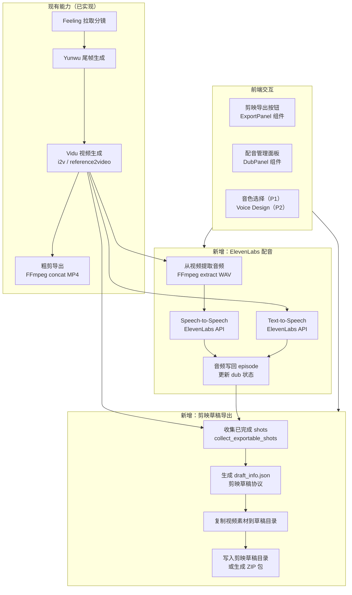
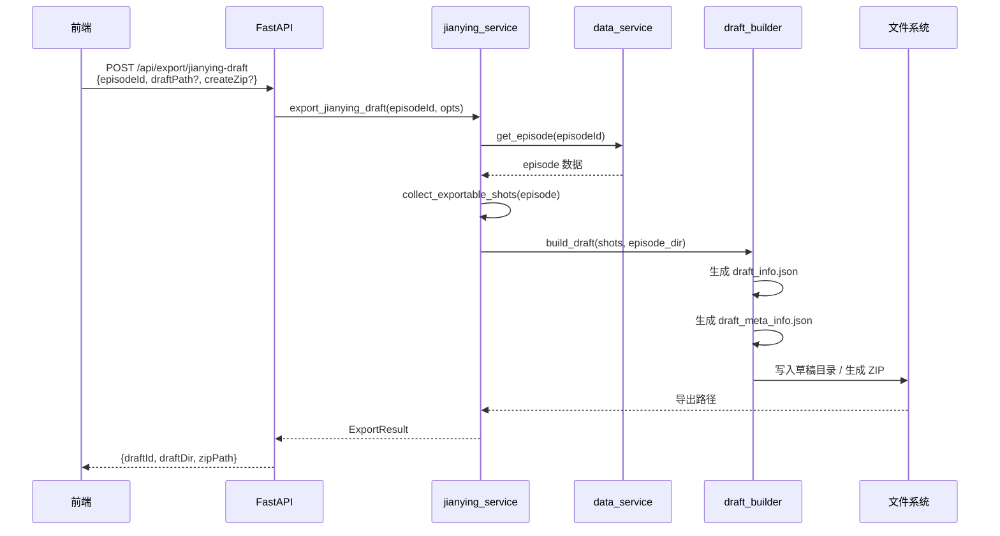
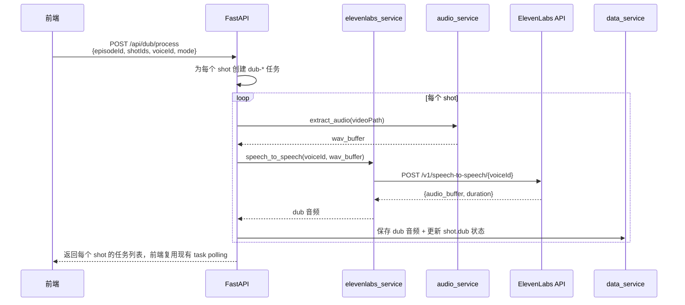

# 剪映草稿导出 & ElevenLabs 配音接入方案

> 基于 `reference/packages/ugc-export-integrations` 参考包分析，针对 fv_autovidu 项目的适配接入方案。

---

## 一、参考包功能分析

### 1.1 两大功能概览

| 功能 | 来源模块 | 核心能力 | 对 fv_autovidu 的价值 |
|------|----------|----------|----------------------|
| **剪映草稿导出** | `jianyingDraftExportService` | 将 VEO pipeline 视频 shots 打包为剪映可识别的 `draft_info.json` 草稿包 | 让用户一键将分镜视频导入剪映做精剪 |
| **ElevenLabs STS 配音** | `elevenLabsService` | Speech-to-Speech 声音替换、TTS 文本转语音、Voice Design 音色设计 | 为 Vidu 生成视频重新配音，替换 AI 音色或本地化 |

### 1.2 功能可行性评估

| 评估维度 | 剪映草稿导出 | ElevenLabs 配音 |
|----------|-------------|-----------------|
| **业务价值** | ⭐⭐⭐⭐⭐ 高 — 打通"AI 生成→剪映精剪"流程 | ⭐⭐⭐⭐ 高 — 解决 AI 配音质量不可控问题 |
| **技术可行性** | ⭐⭐⭐ 中高 — 能做，但剪映草稿协议非公开，必须实机验证 | ⭐⭐⭐⭐ 高 — HTTP API 明确，音频处理可复用现有 FFmpeg 能力 |
| **改造成本** | ⭐⭐⭐ 中等 — 不只是翻译代码，还要补协议验证与目录兼容 | ⭐⭐⭐ 中等 — API 简单，但要处理批量任务、音轨缺失、状态落盘 |
| **与现有架构兼容** | ⭐⭐⭐⭐ 高 — 复用现有 episode/shot 数据结构 | ⭐⭐⭐⭐ 高 — 可复用现有任务追踪体系 |
| **接入优先级** | P0（核心导出链路） | P1（增值能力） |

### 1.3 结论

**方案可以落地，但必须按“最小闭环优先”修订后再做。**

建议的落地判断如下：
1. **剪映导出可做，且值得先做**。当前仓库已经有 `POST /api/export/rough-cut`、`ffmpeg_service`、`data_service`，说明“从已选视频收集素材并导出”的主链路已存在，新增草稿导出属于同一能力面。
2. **ElevenLabs 配音也可做，但不建议首版直接上满**。STS/TTS 能独立落地，`Voice Design` 建议延后，否则首版会同时引入第三方音色管理、更多 UI、以及更复杂的状态模型。
3. **首版必须把高风险项降级**。包括：默认不直写剪映目录、先只支持已选视频候选、先只做最小可打开草稿包、批量配音返回每个 shot 的任务列表而不是单一大任务。

### 1.4 本文档需要先修改的点

| 问题 | 原方案风险 | 修订建议 |
|------|------------|----------|
| 将“写入剪映目录”当作默认导出方式 | Web 服务与剪映未必在同一台机器；目录权限和系统差异会导致失败 | **默认导出到 `episode/export/jianying/{draftId}` 并生成 ZIP**；直写剪映目录只作为同机部署时的可选项 |
| 将剪映协议简化为“写几个 JSON 即可” | 协议非公开，字段缺失时可能导出成功但剪映打不开 | 首版按“**最小必需字段 + 实机校验**”推进，`draft_meta_info.json` 视为必做，`draft_content.json` 是否必需以验证结果为准 |
| 配音状态只挂在 `shot.dub` 且未约束视频候选 | 一个 shot 可能有多个 `videoCandidates`，切换 selected 后配音可能失配 | **首版只允许对 selected candidate 配音**，并在 `shot.dub` 中记录 `sourceCandidateId`；切换候选后提示需重新配音 |
| 假设 dub 任务可直接复用现有任务持久化 | 当前 `task_persistence` 只对 `video-*` 做弱恢复 | 首版 dub 任务先按 `endframe/regen` 模式驻内存轮询；确认需要恢复能力后再扩展落盘 |
| 新接口单独放到 `/api/jianying/*` | 当前已有 `/api/export/rough-cut`，另起一套命名会让前后端分散 | 剪映导出接口并入 **`/api/export/*`**，前端复用现有 `web/frontend/src/api/export.ts` |
| 首版直接引入 `Voice Design` | 超出必要范围，且会推高配置、成本和页面复杂度 | `Voice Design` 下放到 P2；P1 只做 STS/TTS + 现有 voiceId 选择 |

---

## 二、架构流程图



---

## 三、技术适配方案

### 3.1 技术栈差异与对策

| 维度 | 参考包（UGCFlow） | fv_autovidu | 适配策略 |
|------|-------------------|-------------|----------|
| **后端语言** | Node.js (CommonJS) | Python (FastAPI) | 重写为 Python 模块 |
| **数据模型** | `manifest.veoOutputs` | `episode.json` (scenes → shots → videoCandidates) | 编写适配层映射 |
| **文件存储** | `runtime/{variantId}/` | `data/{projectId}/{episodeId}/` | 复用现有 `data_service` 路径 |
| **任务追踪** | 无独立系统 | `_local_tasks` + `task_persistence` | 复用现有任务体系 |
| **前端** | 未知 | React + Zustand + Tailwind | 新增组件与 Store |

### 3.2 数据模型映射

参考包 `VeoOutputExportable` → fv_autovidu `Shot + VideoCandidate`:

```python
# 参考包字段             → fv_autovidu 对应
# shotId                → shot.shotId
# status: "completed"   → candidate.taskStatus == "success"
# rawClip               → candidate.videoPath (相对 episode_dir)
# timelineWindow        → 新增字段（可从 shot.duration 推算）
# generatedDurationSec  → 可从视频 probe 获取
# dub                   → 新增字段 shot.dub（记录 sourceCandidateId 与音频路径）
```

---

## 四、模块拆分与新增文件

### 4.1 后端新增

首版建议**贴着现有 Web 服务结构实现**，不要先拆成新的顶层 `src/jianying` / `src/elevenlabs`。这样改动面更小，也更符合当前仓库的组织方式。

```
web/server/
├── models/
│   └── schemas.py                     # 补充导出/配音请求响应与可选 dub 字段
├── routes/
│   ├── export_route.py                # 在现有 rough-cut 基础上新增剪映导出接口
│   └── dub.py                         # 配音路由
├── services/
│   ├── jianying_service.py            # collect selected clips -> build draft -> write/zip
│   ├── jianying_protocol.py           # 剪映协议模板/常量
│   ├── elevenlabs_service.py          # ElevenLabs REST 封装
│   └── audio_service.py               # 音频提取/时长探测（FFmpeg/ffprobe）
```

### 4.2 前端新增

```
web/frontend/src/
├── components/business/
│   ├── ExportPanel.tsx                # 导出面板（粗剪 + 剪映统一）
│   ├── DubPanel.tsx                   # 配音管理面板
│   └── DubStatusBadge.tsx             # 配音状态标识
├── api/
│   ├── export.ts                      # 在现有导出 API 中追加 jianying draft 方法
│   └── dub.ts                         # 配音 API
├── stores/
│   └── dubStore.ts                    # 配音状态管理（可选；首版也可先复用 taskStore）
├── types/
│   └── dub.ts                         # 配音相关类型定义
```

---

## 五、剪映草稿导出 — 详细设计

### 5.1 剪映草稿协议简述

剪映（CapCut/Jianying 桌面版）读取本地草稿目录，但**目录位置与所需文件集合都应以目标机器实测为准**。参考包 README 只明确说明会生成 `draft_info.json` 等文件，并未在当前仓库内提供完整样例，因此这里不能把协议细节当成已验证事实。

首版按以下约束推进更稳妥：
1. 默认输出到 `data/{projectId}/{episodeId}/export/jianying/{draftId}/`
2. 默认同时生成 ZIP，供用户手动导入或复制到剪映目录
3. 只有在“Web 服务与剪映同机”的场景下，才开放“写入剪映目录”选项
4. `draft_info.json` 与 `draft_meta_info.json` 视为首版必做，`draft_content.json` 是否必需由实机验证决定

一个候选草稿目录形态如下：

```
{draftId}/
├── draft_info.json        # 核心：时间线、轨道、片段描述
├── draft_meta_info.json   # 草稿元数据（名称、缩略图等）
└── draft_content.json     # 是否必需待验证，不应先写死
```

`draft_info.json` 中首版至少要覆盖这些结构：

| 字段 | 说明 |
|------|------|
| `tracks[].segments[]` | 时间线片段（视频/音频/字幕轨） |
| `materials.videos[]` | 视频素材引用（`path` 指向本地文件） |
| `materials.audios[]` | 音频素材引用 |
| `canvas_config` | 画布尺寸（1280×720 或 1920×1080） |
| `duration` | 总时长（微秒），建议以实际视频 probe 结果累加，不要只信 `shot.duration` |

### 5.2 导出流程



### 5.3 核心代码骨架

```python
# web/server/services/jianying_service.py

import json
import uuid
from pathlib import Path
from datetime import datetime

# 剪映时间单位：微秒
USEC = 1_000_000

def build_draft_info(
    shots: list[dict],
    episode_dir: Path,
    canvas_width: int = 1280,
    canvas_height: int = 720,
) -> dict:
    """
    根据已完成的 shots 构建 draft_info.json 结构。

    Args:
        shots: 已完成 shots 列表，每项包含 videoPath、duration 等
        episode_dir: episode 根目录（用于解析视频绝对路径）
        canvas_width: 画布宽度
        canvas_height: 画布高度

    Returns:
        draft_info 字典，可直接 json.dumps 写入文件
    """
    materials_videos = []
    materials_audios = []
    video_segments = []
    audio_segments = []

    timeline_offset = 0  # 微秒

    for shot in shots:
        video_path = str(episode_dir / shot["videoPath"])
        # 首版建议优先使用 ffprobe 实际探测时长；无结果时才回退到 shot.duration
        duration_us = int(shot.get("duration", 5) * USEC)
        material_id = str(uuid.uuid4())

        # 视频素材
        materials_videos.append({
            "id": material_id,
            "path": video_path,
            "duration": duration_us,
            "type": "video",
        })

        # 视频轨道片段
        video_segments.append({
            "id": str(uuid.uuid4()),
            "material_id": material_id,
            "target_timerange": {
                "start": timeline_offset,
                "duration": duration_us,
            },
            "source_timerange": {
                "start": 0,
                "duration": duration_us,
            },
        })

        # 若有配音音频，添加音频轨
        dub_path = shot.get("dubAudioPath")
        if dub_path:
            audio_material_id = str(uuid.uuid4())
            materials_audios.append({
                "id": audio_material_id,
                "path": str(episode_dir / dub_path),
                "duration": duration_us,
                "type": "audio",
            })
            audio_segments.append({
                "id": str(uuid.uuid4()),
                "material_id": audio_material_id,
                "target_timerange": {
                    "start": timeline_offset,
                    "duration": duration_us,
                },
            })

        timeline_offset += duration_us

    return {
        "id": str(uuid.uuid4()),
        "name": "",
        "canvas_config": {
            "width": canvas_width,
            "height": canvas_height,
        },
        "duration": timeline_offset,
        "materials": {
            "videos": materials_videos,
            "audios": materials_audios,
        },
        "tracks": [
            {"type": "video", "segments": video_segments},
            {"type": "audio", "segments": audio_segments},
        ],
        "create_time": int(datetime.now().timestamp()),
        "update_time": int(datetime.now().timestamp()),
    }
```

### 5.4 API 设计

| 方法 | 路径 | 说明 |
|------|------|------|
| `GET` | `/api/export/jianying-draft/path` | 探测本机剪映草稿目录（可选） |
| `POST` | `/api/export/jianying-draft` | 执行草稿导出 |
| `GET` | `/api/export/jianying-draft/{episodeId}` | 查询上次导出状态（可选） |

**请求体**（POST）：

```json
{
  "episodeId": "string",
  "shotIds": ["string"],        // 可选，默认全部已完成 shots
  "draftPath": "/path/to/jianying/drafts",  // 可选
  "createZip": true,            // 可选
  "canvasSize": "720p"          // 可选，默认 720p
}
```

**响应体**：

```json
{
  "draftId": "uuid",
  "draftDir": "/absolute/path",
  "zipPath": "/relative/path.zip",
  "exportedShots": 12,
  "missingShots": [],
  "exportedAt": "2026-03-22T10:00:00Z"
}
```

---

## 六、ElevenLabs 配音 — 详细设计

### 6.1 功能分层

| 层级 | 功能 | 优先级 |
|------|------|--------|
| **L1 核心** | STS 语音替换（从视频提取音频 → 换声 → 写回） | P0 |
| **L2 增强** | TTS 文本转语音（用 shot.prompt 或自定义文本生成配音） | P1 |
| **L3 高级** | Voice Design 音色设计（文字描述 → 自定义音色） | P2，明确不进首版 |

### 6.2 STS 配音流程



### 6.3 核心代码骨架

```python
# web/server/services/elevenlabs_service.py

from pathlib import Path
import requests

class ElevenLabsClient:
    """
    ElevenLabs REST API 客户端。
    支持 STS、TTS、Voice Design 等功能。
    """

    BASE_URL = "https://api.elevenlabs.io"

    def __init__(self, api_key: str, base_url: str | None = None, timeout: int = 120):
        self.api_key = api_key
        self.base_url = base_url or self.BASE_URL
        self.timeout = timeout

    def is_configured(self) -> bool:
        """检查 API Key 是否已配置。"""
        return bool(self.api_key)

    def speech_to_speech(
        self,
        voice_id: str,
        audio_data: bytes,
        remove_background_noise: bool = True,
        model_id: str = "eleven_multilingual_sts_v2",
    ) -> dict:
        """
        Speech-to-Speech 声音替换。

        Args:
            voice_id: 目标音色 ID
            audio_data: 源音频 WAV 字节
            remove_background_noise: 是否去除背景噪声
            model_id: 模型 ID

        Returns:
            {"audio_data": bytes, "duration_sec": float, "content_type": str}
        """
        resp = requests.post(
            f"{self.base_url}/v1/speech-to-speech/{voice_id}",
            headers={"xi-api-key": self.api_key},
            data={
                "model_id": model_id,
                "remove_background_noise": str(remove_background_noise).lower(),
            },
            files={"audio": ("source.wav", audio_data, "audio/wav")},
            timeout=self.timeout,
        )
        resp.raise_for_status()
        return {
            "audio_data": resp.content,
            "content_type": resp.headers.get("content-type", "audio/mpeg"),
        }

    def text_to_speech(
        self,
        voice_id: str,
        text: str,
        model_id: str = "eleven_multilingual_v2",
    ) -> dict:
        """文本转语音。"""
        resp = requests.post(
            f"{self.base_url}/v1/text-to-speech/{voice_id}",
            headers={
                "xi-api-key": self.api_key,
                "Content-Type": "application/json",
            },
            json={"text": text, "model_id": model_id},
            timeout=self.timeout,
        )
        resp.raise_for_status()
        return {
            "audio_data": resp.content,
            "content_type": resp.headers.get("content-type", "audio/mpeg"),
        }

    def list_voices(self) -> list[dict]:
        """列出可用音色。"""
        resp = requests.get(
            f"{self.base_url}/v1/voices",
            headers={"xi-api-key": self.api_key},
            timeout=30,
        )
        resp.raise_for_status()
        return resp.json().get("voices", [])
```

### 6.4 音频服务（FFmpeg）

```python
# web/server/services/audio_service.py

import subprocess
from pathlib import Path

def extract_audio_from_video(video_path: Path, output_wav: Path) -> Path:
    """
    从视频文件提取音频为 WAV 格式。

    Args:
        video_path: 视频文件路径
        output_wav: 输出 WAV 文件路径

    Returns:
        输出文件路径
    """
    cmd = [
        "ffmpeg", "-y",
        "-i", str(video_path),
        "-vn",                     # 不要视频流
        "-acodec", "pcm_s16le",    # 16-bit PCM
        "-ar", "44100",            # 44.1kHz 采样率
        "-ac", "1",                # 单声道
        str(output_wav),
    ]
    subprocess.run(cmd, check=True, capture_output=True)
    return output_wav
```

### 6.5 API 设计

| 方法 | 路径 | 说明 |
|------|------|------|
| `GET` | `/api/dub/voices` | 列出可用音色 |
| `GET` | `/api/dub/status/{episodeId}` | 查询 episode 各 shot 配音状态 |
| `POST` | `/api/dub/process` | 批量配音（后台任务） |
| `POST` | `/api/dub/process-shot` | 单 shot 配音 |
| `POST` | `/api/dub/voice-design` | 音色设计（P2，可后置） |
| `GET` | `/api/dub/configured` | 检查 ElevenLabs 是否已配置 |

---

## 七、配置扩展

在 `config/default.yaml` 中新增或扩展：

```yaml
# 剪映草稿导出
jianying:
  # 本机剪映草稿目录（留空则由系统探测）
  draft_path: ""
  # 默认画布尺寸
  canvas_size: "720p"  # 720p | 1080p

# ElevenLabs 配音（API Key 通过 .env 管理）
elevenlabs:
  # API 端点（默认官方）
  base_url: "https://api.elevenlabs.io"
  # STS 超时（秒）
  sts_timeout: 120
  # 默认模型
  sts_model: "eleven_multilingual_sts_v2"
  tts_model: "eleven_multilingual_v2"
  # 批量配音并发数
  concurrency: 2
```

在 `.env` 中新增：

```bash
ELEVENLABS_API_KEY=your_api_key_here
ELEVENLABS_BASE=https://api.elevenlabs.io
```

说明：
1. `jianying.draft_path` 只在同机部署时有意义，不能假设所有环境都可用
2. 首版如继续沿用同步路由 + `requests`，无需新增 HTTP 客户端依赖
3. 如后续改为异步服务层，再考虑引入 `httpx`

---

## 八、数据模型扩展

### 8.1 Episode JSON 新增字段

`episode.json` 的扩展要尽量不破坏现有 `Shot` / `VideoCandidate` 契约。建议：
1. **`dub` 放在 `shot` 上，但仅表示当前 selected candidate 的配音结果**
2. `dub` 中必须记录 `sourceCandidateId`
3. **不要在 `shot` 上新增 `jianying` 字段**，因为导出是 episode 级动作，不是 shot 级状态

建议的 `shot` 增量字段：

```json
{
  "shotId": "shot_001",
  "dub": {
    "status": "completed",       // pending | processing | completed | failed
    "sourceCandidateId": "cand_001",
    "mode": "sts",               // sts | tts
    "voiceId": "xxx",
    "audioPath": "dub/shot_001_dub.mp3",
    "originalAudioPath": "dub/shot_001_original.wav",
    "taskId": "dub-shot_001",
    "error": null,
    "processedAt": "2026-03-22T10:00:00Z"
  }
}
```

若确实需要保留导出记录，更适合放到 episode 根层，例如：

```json
{
  "episodeId": "ep_001",
  "jianyingExport": {
    "lastExportedAt": "2026-03-22T10:30:00Z",
    "draftId": "uuid",
    "zipPath": "export/jianying/uuid.zip"
  }
}
```

### 8.2 Pydantic Schema 扩展

```python
# web/server/models/schemas.py 新增

class DubStatus(BaseModel):
    status: str = "pending"
    sourceCandidateId: Optional[str] = None
    mode: Optional[str] = None
    voiceId: Optional[str] = None
    audioPath: Optional[str] = None
    originalAudioPath: Optional[str] = None
    taskId: Optional[str] = None
    error: Optional[str] = None
    processedAt: Optional[str] = None

class JianyingExportRequest(BaseModel):
    episodeId: str
    shotIds: Optional[list[str]] = None
    draftPath: Optional[str] = None
    createZip: bool = False
    canvasSize: str = "720p"

class JianyingExportResponse(BaseModel):
    draftId: str
    draftDir: str
    zipPath: Optional[str] = None
    exportedShots: int
    missingShots: list[str] = Field(default_factory=list)
    exportedAt: str

class DubProcessRequest(BaseModel):
    episodeId: str
    shotIds: Optional[list[str]] = None
    voiceId: str
    mode: str = "sts"          # sts | tts
    concurrency: int = 2

class DubProcessResponse(BaseModel):
    tasks: list[dict[str, str]] = Field(default_factory=list)
```

---

## 九、前端设计

### 9.1 导出面板

在 `StoryboardPage` 的工具栏新增"导出"下拉菜单：

```
┌─────────────────────────────────┐
│  📤 导出                  ▼     │
├─────────────────────────────────┤
│  📹 粗剪 MP4（已有）           │
│  ✂️  剪映草稿包                 │
│     ├ 写入剪映目录              │
│     └ 下载 ZIP                  │
└─────────────────────────────────┘
```

### 9.2 配音面板

在 `ShotDetailPage` 或 `StoryboardPage` 侧边栏增加配音模块：

```
┌─────────────────────────────────┐
│  🎙 配音管理                    │
├─────────────────────────────────┤
│  音色: [下拉选择]               │
│  模式: ○ STS 换声  ○ TTS 配音  │
│                                 │
│  [批量配音] [单镜头配音]        │
│                                 │
│  Shot 001: ✅ 已完成            │
│  Shot 002: ⏳ 处理中            │
│  Shot 003: ⬜ 待处理            │
└─────────────────────────────────┘
```

---

## 十、实施计划

### Phase 1：剪映草稿导出（预计 3-4 天）

| 步骤 | 任务 | 输出 |
|------|------|------|
| 1.1 | 先做最小草稿构建器（只支持 selected 视频轨） | `jianying_service.py`, `jianying_protocol.py` |
| 1.2 | 接到现有 `/api/export/*` 体系 | `export_route.py`, `schemas.py` |
| 1.3 | 前端在现有导出面板中追加“剪映草稿 ZIP” | `ExportPanel.tsx`, `api/export.ts` |
| 1.4 | 用目标机器做“导出 -> 剪映打开”验证，记录必需字段 | 验证记录 + 修订协议模板 |

### Phase 2：ElevenLabs 配音（预计 4-5 天）

| 步骤 | 任务 | 输出 |
|------|------|------|
| 2.1 | 实现 STS/TTS 服务与音频抽取 | `elevenlabs_service.py`, `audio_service.py` |
| 2.2 | 批量返回每个 shot 的任务 ID，接入现有轮询 | `dub.py`, `taskStore` 复用 |
| 2.3 | 前端补一个基础配音面板 | `DubPanel.tsx`, `types/dub.ts` |
| 2.4 | 约束“仅 selected candidate 可配音”，补错误提示 | 前后端联调 |

### Phase 3：联调与优化（预计 2-3 天）

| 步骤 | 任务 | 输出 |
|------|------|------|
| 3.1 | 剪映导出 + 配音联动（配音后自动含 dub 轨道） | 端到端流程 |
| 3.2 | 错误处理与重试 | retry 逻辑 |
| 3.3 | 配置页面（剪映路径、ElevenLabs Key） | SettingsPage 扩展 |
| 3.4 | Voice Design 与直写剪映目录 | 明确下放到增强阶段 |

---

## 十一、依赖清单

### 后端新增

```txt
# 首版可不新增依赖
# 复用现有 requests 即可调用 ElevenLabs REST API
```

> FFmpeg 已为现有 `ffmpeg_service` 依赖，无需额外安装。

### 前端无需新增依赖

现有 axios + zustand + tailwind 足以支撑新功能。

---

## 十二、风险与注意事项

| 风险 | 影响 | 缓解措施 |
|------|------|----------|
| 剪映草稿协议非公开，版本更新可能破坏兼容性 | 导出的草稿无法被新版剪映识别 | 抽离协议版本常量，便于快速适配 |
| ElevenLabs API 费用 | STS 按字符计费 | 前端展示用量估算，支持单 shot 预览 |
| 大批量配音耗时长 | 用户等待体验差 | 后台异步处理 + 进度推送 |
| 视频无音轨时 STS 无法工作 | 部分 Vidu 视频可能静音 | 检测音轨，静音时提示用 TTS 模式 |
| 切换 selected candidate 后旧配音失配 | 导出到剪映时音画不一致 | `shot.dub` 记录 `sourceCandidateId`，选中项变化后将 dub 标记为失效 |
| 仅用 `shot.duration` 拼时间线会漂移 | 剪映时间轴与真实视频长度不一致 | 使用 `ffprobe` 读取实际时长，`shot.duration` 仅作兜底 |
| Web 服务不在本机时无法直写剪映目录 | “一键导入剪映”功能失效 | 首版默认 ZIP 导出，直写目录仅做本机增强功能 |

---

## 十三、台词与字幕（2025-03 实现摘要）

与 Feeling 分镜 API 对齐后，本地 `episode.json` 与 Web 分镜表支持以下能力：

| 字段 / 能力 | 说明 |
|-------------|------|
| `Shot.dialogue` | 平台原文台词行（拉取自 `dialogue` / `metadata` 等，见 `puller._get_dialogue_fields`） |
| `Shot.associatedDialogue` | 结构化 `{ role, content }`，可与 `dialogue` 并存 |
| `Shot.dialogueTranslation` | 目标语译文，用于 Vidu 提示词拼接（`append_dialogue_for_video_prompt`）与 TTS 缺省文案（`_resolve_tts_text`） |
| `Episode.dubTargetLocale` / `sourceLocale` | 剧集级语言元数据；`PATCH /api/episodes/:id` 白名单更新 |
| 剪映字幕轨 | 导出草稿时增加 **原文** 字幕（丙）：`jianying_text_track.subtitle_text_from_shot` 仅用 `dialogue` / `associatedDialogue`，与译文解耦；时间轴与每段已选视频 `target_timerange` 对齐，轨道顺序为 video → text → audio |

配音 TTS 文本优先级：`ttsText` 请求参数 → `dialogueTranslation` → `videoPrompt`（见 `dub_route._resolve_tts_text`）。

---

## 十四、参考资料

| 资源 | 链接 |
|------|------|
| ElevenLabs API 文档 | https://elevenlabs.io/docs/api-reference |
| ElevenLabs STS 端点 | `POST /v1/speech-to-speech/:voice_id` |
| 剪映草稿格式（社区逆向） | 基于 `draft_info.json` 结构分析 |
| 参考包源码 | `reference/packages/ugc-export-integrations/` |
