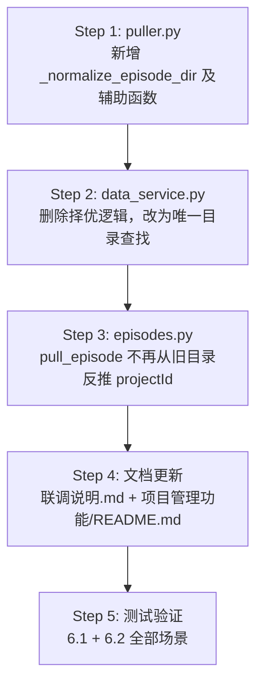

# 单副本归一化 — 实施文档

> **目标**：保证同一个 `episodeId` 在 `DATA_ROOT` 下只存在**唯一一份**磁盘数据，
> 消灭「多副本择优」逻辑带来的路径混乱、本地产物丢失、和平台对不上等问题。

---

## 1. 问题背景

### 1.1 当前磁盘结构

```
DATA_ROOT/
  ├── proj-default/
  │     └── {episodeId}/          ← 第一次没带 projectId 时落到这里
  │           ├── episode.json
  │           ├── frames/
  │           ├── endframes/
  │           ├── videos/
  │           └── ...
  └── {真实projectId}/
        └── {episodeId}/          ← 后来用正确 projectId 再拉一次
              ├── episode.json
              ├── frames/
              └── ...
```

**同一个 `episodeId` 可以有两份甚至多份目录。**

### 1.2 当前读取逻辑

`data_service._find_episode_dir(episode_id)` 扫描所有 `DATA_ROOT/{projectId}/{episodeId}/`，
发现多个后通过 `_pick_best_episode_dir()` 择优（画面描述多的 > 非 proj-default > pulledAt 更新）。

结果：
- 用户改了 A 目录的文件，界面读的是 B 目录 → **"对不上"**。
- 旧副本里已有视频/尾帧/配音产物，新副本里没有 → 看起来**"丢了"**。
- 拉取时从旧本地目录反推 `projectId`（`episodes.py` L50-55），若旧目录在错误项目下，错误被固化。

### 1.3 核心需求

**一个 `episodeId` = 磁盘上唯一一个目录，不管 `projectId` 是什么。**

---

## 2. 方案总览

保留 `data/{projectId}/{episodeId}/` 的两级目录结构（不动前端路由和 files API），
但通过以下三处改造保证「同一 episodeId 只有一份」：

```mermaid
flowchart TD
  A[拉取请求 POST /api/episodes/pull] --> B{本地是否已有<br>该 episodeId 目录?}
  B -->|否| C[正常写入<br>data/{projectId}/{episodeId}/]
  B -->|是| D{已有目录的 projectId<br>和本次一致?}
  D -->|是| E[原地覆盖更新<br>episode.json + frames]
  D -->|否| F[迁移旧目录产物<br>到新路径]
  F --> G{旧目录是否有<br>本地产物?}
  G -->|有 videos/endframes<br>/dub/export| H[逐子目录迁移<br>到新目录下]
  G -->|无| I[直接删除旧目录]
  H --> J[删除清空后的旧目录]
  I --> K[写入新 episode.json]
  J --> K
  E --> K
  K --> L[data_service 只认<br>唯一目录 不再择优]
```

---

## 3. 涉及文件与改动清单

### 3.1 必须修改

| 文件 | 改动内容 | 风险 |
|------|---------|------|
| **`src/feeling/puller.py`** | 拉取前检测同 episodeId 旧副本；迁移本地产物后删旧目录 | 中（需保护用户已有视频/配音） |
| **`web/server/services/data_service.py`** | 去掉 `_score_episode_dir` / `_pick_best_episode_dir` / `_collect_episode_dirs_for_id`；`_find_episode_dir` 改为精确匹配唯一目录，发现重复时 log 告警 | 低 |
| **`web/server/routes/episodes.py`** | `pull_episode` 不再用 `ep_dir.parent.name` 反推 projectId；改为要求前端传 projectId 或查平台接口 | 低 |

### 3.2 文档更新

| 文件 | 改动内容 |
|------|---------|
| **`docs/联调说明.md`** (L204) | 删除"同一 episodeId 多套目录 / 后端自动择优"段落，改为"单副本"说明 |
| **`docs/项目管理功能/README.md`** (L63) | 删除"目前只按 episodeId 查本地，并在多个项目副本中择优"描述 |

### 3.3 不需要修改

| 文件 | 原因 |
|------|------|
| 前端路由 `App.tsx` / `routes.ts` | URL 仍为 `/project/:projectId/episode/:episodeId`，不动 |
| `web/server/routes/files.py` | 仍按 `DATA_ROOT/{path}` 映射，不动 |
| `web/server/routes/generate.py` | 调用 `data_service.get_episode_dir()` 获取路径，接口不变 |
| `web/server/routes/export_route.py` | 同上 |
| `web/server/routes/dub_route.py` | 同上 |
| `web/server/services/task_store/` | 任务存在 SQLite，按 episodeId + shotId 索引，不依赖目录结构 |
| `web/frontend/src/` 所有页面组件 | `basePath` 取自 `currentEpisode.projectId + episodeId`，由接口返回，不依赖本地多副本 |

---

## 4. 各文件详细改造方案

### 4.1 `src/feeling/puller.py` — 写入端归一化

#### 当前代码（L189-191）

```python
proj_id = project_id or "proj-default"
ep_dir = output_dir / proj_id / episode_id
ep_dir.mkdir(parents=True, exist_ok=True)
```

#### 改造方案

在确定 `ep_dir` 后、写入前，新增 **`_normalize_episode_dir()`** 函数：

```python
def _normalize_episode_dir(
    output_dir: Path,
    episode_id: str,
    target_project_id: str,
) -> Path:
    """
    确保 episodeId 在 DATA_ROOT 下只有唯一一个目录。

    逻辑：
    1. 扫描 output_dir 下所有 {projectId}/{episodeId}/ 目录
    2. 若不存在 → 直接创建目标路径
    3. 若已存在且 projectId 一致 → 原地返回
    4. 若已存在但 projectId 不同 → 迁移旧目录产物到目标路径，删旧目录

    本地产物子目录（需迁移）：
    - videos/        视频候选
    - endframes/     尾帧
    - dub/           配音
    - export/        导出产物

    只含 episode.json + frames/ + assets/ 的旧目录视为「纯拉取副本」，可安全删除。
    """
```

**迁移策略**：

```mermaid
flowchart LR
  subgraph old_dir [旧目录 proj-default/{episodeId}]
    OJ[episode.json]
    OF[frames/]
    OV[videos/]
    OE[endframes/]
    OD[dub/]
    OX[export/]
  end
  subgraph new_dir [新目录 {realProjectId}/{episodeId}]
    NJ[episode.json ← 新拉取覆盖]
    NF[frames/ ← 新拉取覆盖]
    NV[videos/ ← 从旧迁移]
    NE[endframes/ ← 从旧迁移]
    ND[dub/ ← 从旧迁移]
    NX[export/ ← 从旧迁移]
  end
  OV -->|shutil.move| NV
  OE -->|shutil.move| NE
  OD -->|shutil.move| ND
  OX -->|shutil.move| NX
```

**迁移规则**：

| 子目录 | 旧目录有，新目录无 | 旧目录有，新目录也有 | 旧目录无 |
|--------|-------------------|---------------------|---------|
| `videos/` | 整体 move | 逐文件 move，不覆盖已有 | 跳过 |
| `endframes/` | 整体 move | 逐文件 move，不覆盖已有 | 跳过 |
| `dub/` | 整体 move | 逐文件 move，不覆盖已有 | 跳过 |
| `export/` | 整体 move | 逐文件 move，不覆盖已有 | 跳过 |
| `frames/` | 不迁移（新拉取会重新下载） | — | — |
| `assets/` | 不迁移（新拉取会重新下载） | — | — |
| `episode.json` | 不迁移（新拉取会覆盖） | — | — |

**旧目录清理**：迁移完成后，旧目录中的 `episode.json`、`frames/`、`assets/` 都属于**可重建的拉取副本**，
不能继续留在原地；否则会长期残留一个“只剩拉取数据”的旧目录，单副本目标无法成立。

**未知残留文件处理**：若旧目录下除了上述可丢弃内容和已迁移的本地产物外，还存在未知文件/子目录，
不要继续保留旧目录；应统一迁到新目录下的 `_legacy_migrated/{sourceProjectId}/` 中，再删除旧目录。

**旧项目目录清理**：若 `proj-default/` 下已无任何子目录，一并删除空的项目目录。

#### 伪代码

```python
# 需迁移的本地产物子目录（区别于「拉取数据」子目录 frames/assets 不迁移）
_LOCAL_PRODUCT_DIRS = ("videos", "endframes", "dub", "export")
_DISPOSABLE_PULL_DIRS = ("frames", "assets")


def _normalize_episode_dir(
    output_dir: Path,
    episode_id: str,
    target_project_id: str,
) -> Path:
    """确保同一 episodeId 在 DATA_ROOT 下只有唯一目录。"""
    target_dir = output_dir / target_project_id / episode_id

    # 1. 扫描所有同 episodeId 的目录
    existing: list[Path] = []
    if output_dir.exists():
        for proj_dir in output_dir.iterdir():
            if not proj_dir.is_dir():
                continue
            candidate = proj_dir / episode_id
            if candidate.is_dir() and (candidate / "episode.json").exists():
                existing.append(candidate)

    # 2. 过滤掉目标路径自身
    old_dirs = [d for d in existing if d.resolve() != target_dir.resolve()]

    # 3. 若无旧副本 → 直接返回目标
    if not old_dirs:
        target_dir.mkdir(parents=True, exist_ok=True)
        return target_dir

    # 4. 迁移旧副本中的本地产物
    target_dir.mkdir(parents=True, exist_ok=True)
    for old_dir in old_dirs:
        _migrate_local_products(old_dir, target_dir)
        _remove_old_dir(old_dir, target_dir)

    return target_dir


def _migrate_local_products(src_dir: Path, dst_dir: Path) -> None:
    """将旧目录中的本地产物迁移到新目录。"""
    for subdir_name in _LOCAL_PRODUCT_DIRS:
        src_sub = src_dir / subdir_name
        if not src_sub.is_dir():
            continue
        dst_sub = dst_dir / subdir_name
        if not dst_sub.exists():
            # 新目录下没有该子目录 → 整体搬移
            shutil.move(str(src_sub), str(dst_sub))
            print(f"[Migrate] {src_sub} → {dst_sub}")
        else:
            # 新目录下已有 → 逐文件搬移，不覆盖已有文件
            for item in src_sub.rglob("*"):
                if item.is_file():
                    rel = item.relative_to(src_sub)
                    dst_file = dst_sub / rel
                    if not dst_file.exists():
                        dst_file.parent.mkdir(parents=True, exist_ok=True)
                        shutil.move(str(item), str(dst_file))
            print(f"[Migrate] 逐文件迁移 {src_sub} → {dst_sub}")


def _remove_old_dir(old_dir: Path, target_dir: Path) -> None:
    """
    删除迁移后的旧目录，保证同 episodeId 最终只剩一份目录。

    处理规则：
    - videos/endframes/dub/export 已提前迁移
    - episode.json + frames/assets 作为可重建拉取副本，直接丢弃
    - 其它未知残留统一搬到 target_dir/_legacy_migrated/{source_project_id}/
    - 最后强制删除 old_dir
    """
    source_project_id = old_dir.parent.name
    legacy_root = target_dir / "_legacy_migrated" / source_project_id

    for child in old_dir.iterdir():
        if child.name in _LOCAL_PRODUCT_DIRS:
            continue
        if child.name in _DISPOSABLE_PULL_DIRS or child.name == "episode.json":
            if child.is_dir():
                shutil.rmtree(child, ignore_errors=True)
            else:
                child.unlink(missing_ok=True)
            continue

        legacy_root.mkdir(parents=True, exist_ok=True)
        shutil.move(str(child), str(legacy_root / child.name))
        print(f"[Migrate] 未知残留 {child} → {legacy_root / child.name}")

    shutil.rmtree(old_dir, ignore_errors=True)
    print(f"[Cleanup] 已删除旧副本 {old_dir}")

    # 若父目录（项目目录）已空，一并清理
    parent = old_dir.parent
    if parent.exists() and not any(parent.iterdir()):
        parent.rmdir()
        print(f"[Cleanup] 已删除空项目目录 {parent}")
```

#### 调用位置

在 `pull_episode()` 中替换原来的硬编码路径：

```python
# 改前
proj_id = project_id or "proj-default"
ep_dir = output_dir / proj_id / episode_id
ep_dir.mkdir(parents=True, exist_ok=True)

# 改后
proj_id = project_id or "proj-default"
ep_dir = _normalize_episode_dir(output_dir, episode_id, proj_id)
```

---

### 4.2 `web/server/services/data_service.py` — 读取端去多副本

#### 删除的函数/逻辑

| 函数 | 行号 | 说明 |
|------|------|------|
| `_score_episode_dir()` | L40-57 | 多目录打分（画面描述数/是否 proj-default/pulledAt） |
| `_pick_best_episode_dir()` | L60-66 | 从候选里选最优 |
| `_collect_episode_dirs_for_id()` | L69-80 | 收集所有匹配的目录 |

#### 新版 `_find_episode_dir()`

```python
def _find_episode_dir(episode_id: str) -> Path | None:
    """
    根据 episodeId 查找唯一的 episode.json 所在目录。

    扫描 DATA_ROOT/{projectId}/{episodeId}/episode.json，
    正常情况只有一个匹配；若发现多个，log WARNING 并按确定性顺序返回一个，
    避免继续依赖文件系统遍历顺序这种隐式随机行为。
    """
    root = _get_data_root()
    if not root.exists():
        return None
    matches: list[Path] = []
    for proj_dir in root.iterdir():
        if not proj_dir.is_dir():
            continue
        ep_dir = proj_dir / episode_id
        if ep_dir.is_dir() and (ep_dir / "episode.json").exists():
            matches.append(ep_dir)
    if not matches:
        return None
    matches.sort(key=lambda p: str(p))
    if len(matches) > 1:
        _LOG.warning(
            "episodeId=%s 存在 %d 个副本: %s — 应运行归一化清理",
            episode_id,
            len(matches),
            [str(m) for m in matches],
        )
    return matches[0]
```

#### 新版 `list_episodes()`

```python
def list_episodes() -> list[dict[str, Any]]:
    """
    列出所有本地已拉取的 Episode。

    扫描 DATA_ROOT/{projectId}/{episodeId}/episode.json，
    单副本归一化后每个 episodeId 应只有一个目录。
    若仍发现重复，打日志告警，并按确定性顺序只保留一个。
    """
    root = _get_data_root()
    if not root.exists():
        return []
    seen_eids: dict[str, Path] = {}
    result: list[dict[str, Any]] = []
    for proj_dir in sorted(root.iterdir(), key=lambda p: str(p)):
        if not proj_dir.is_dir():
            continue
        for ep_dir in sorted(proj_dir.iterdir(), key=lambda p: str(p)):
            if not ep_dir.is_dir():
                continue
            json_path = ep_dir / "episode.json"
            if not json_path.exists():
                continue
            try:
                data = json.loads(json_path.read_text(encoding="utf-8"))
                eid = str(data.get("episodeId", ep_dir.name))
                if eid in seen_eids:
                    _LOG.warning(
                        "episodeId=%s 重复: %s 与 %s",
                        eid, ep_dir, seen_eids[eid],
                    )
                    continue  # 跳过重复；依赖排序后的首次命中，结果稳定可复现
                seen_eids[eid] = ep_dir
                result.append({
                    "projectId": data.get("projectId", proj_dir.name),
                    "episodeId": eid,
                    "episodeTitle": data.get("episodeTitle", ""),
                    "episodeNumber": data.get("episodeNumber", 0),
                    "pulledAt": data.get("pulledAt", ""),
                    "scenes": data.get("scenes", []),
                })
            except Exception:
                continue
    return result
```

---

### 4.3 `web/server/routes/episodes.py` — 拉取入口改造

#### 当前问题（L50-55）

```python
project_id = getattr(req, "projectId", None)
if not project_id:
    ep_dir = data_service.get_episode_dir(req.episodeId)
    if ep_dir:
        project_id = ep_dir.parent.name   # ← 旧目录在错误项目下时，错误被固化
project_id = project_id or "proj-default"
```

#### 改造后

```python
# projectId 优先级：请求参数 > "proj-default"
# 不再从旧本地目录反推，避免把错误 projectId 固化
project_id = getattr(req, "projectId", None) or "proj-default"
```

**若需要从平台推断 projectId**（更好的做法），可在 `FeelingClient` 上补一个
`get_episode_project_id(episode_id)` 接口。但这不是本次必须项，`proj-default` 加归一化迁移
已足够保证唯一性。若产品流程要求“单集拉取也必须落到真实项目目录”，则应把平台推断
`projectId` 提升为下一阶段必做项，而不是长期停留在 `proj-default`。

---

### 4.4 文档更新

#### `docs/联调说明.md` L200-204

删除：

```markdown
**同一 episodeId 多套目录**：若同时存在 `data/proj-default/{episodeId}/` 与真实 `projectId` 目录，
后端会**自动择优**返回含 `visualDescription` 更完整的一份，避免列表里点到旧数据看不到画面描述。
```

替换为：

```markdown
**单副本保证**：同一 `episodeId` 在 `DATA_ROOT` 下只保留唯一一份目录。
重新拉取时若 `projectId` 变化，puller 会自动迁移旧目录中的本地产物（视频/尾帧/配音/导出）到新路径，
并删除旧副本，不会出现多目录并存的情况。
```

#### `docs/项目管理功能/README.md` L63

删除：

```markdown
`data_service.get_episode(episode_id)` 目前只按 `episodeId` 查本地，并在多个项目副本中择优。
```

替换为：

```markdown
`data_service.get_episode(episode_id)` 按 `episodeId` 查本地唯一目录。
同一 episodeId 不再允许多副本并存（由 puller 归一化保证）。
```

---

## 5. 边界场景处理

### 5.1 旧数据迁移（存量 data/ 目录）

若用户已有存量多副本数据，不做一次性迁移脚本，而是 **拉取时触发**：

- 下一次对该 episodeId 执行 `pull_episode` 时，`_normalize_episode_dir()` 自动归一化。
- 未再拉取的旧数据仍可读取；若仍存在历史多副本，读取端只做临时兜底并打 WARNING，
  不再把“多副本择优”当成正式能力。

若需批量清理，可提供命令行工具（可选，不阻塞本次交付）：

```bash
python -m scripts.normalize_data --data-root data/ --dry-run
python -m scripts.normalize_data --data-root data/ --execute
```

### 5.2 本地产物冲突

迁移时新旧目录都有同名文件（如 `videos/xxx.mp4`），**保留新目录的文件、不覆盖**。
因为新目录可能已经在新 projectId 下生成了更新的产物。

### 5.3 `proj-default` 作为 projectId 时

若始终只用 `proj-default`（比如不关心项目归属），不会触发任何迁移，行为与当前完全一致。
归一化逻辑只在 `projectId 不同` 时介入。

### 5.4 `pull_project` 批量拉取

`pull_project_with_report()` 内部循环调用 `pull_episode()`，
每次调用都会带 `project_id`，因此自动走归一化。无需额外改造。

---

## 6. 测试要点

### 6.1 自动化验证

| 场景 | 输入 | 预期 |
|------|------|------|
| 首次拉取（无旧数据） | `pull_episode("ep-001", data/, project_id="proj-A")` | `data/proj-A/ep-001/episode.json` 创建 |
| 重复拉取（同 projectId） | 再次 pull 同 episodeId 同 projectId | 原地更新 `episode.json`，无迁移 |
| 切换 projectId（无本地产物） | 旧在 `proj-default/ep-001/`，新 pull 用 `proj-A` | 旧目录删除，新目录创建 |
| 切换 projectId（有本地产物） | 旧在 `proj-default/ep-001/videos/xxx.mp4`，新 pull 用 `proj-A` | `videos/xxx.mp4` 迁移到 `proj-A/ep-001/videos/`，旧目录删除 |
| 切换 projectId（新旧都有产物） | 旧有 `videos/a.mp4`，新也有 `videos/b.mp4` | 新保留 `b.mp4`，旧的 `a.mp4` 迁移过来 |
| 旧目录含未知残留 | 旧目录有人工放入 `notes.txt` | 文件迁到 `_legacy_migrated/{sourceProjectId}/`，旧目录删除 |
| list_episodes 去重 | 手动制造多副本 | 只返回一条，日志里有 WARNING，且结果稳定可复现 |
| get_episode 去重 | 手动制造多副本 | 返回按确定性顺序选中的那一条，日志里有 WARNING |

### 6.2 手动验证

1. 启动后端 → 列表页不出现重复 episode
2. 重新拉取一集（projectId 从 proj-default 变为真实值）→ 旧目录消失，新目录出现
3. 视频/尾帧/配音文件在迁移后仍可正常播放/预览
4. 导出功能在迁移后仍正常工作

---

## 7. 改动量评估

| 维度 | 评估 |
|------|------|
| **核心代码改动** | 3 个 Python 文件（puller.py、data_service.py、episodes.py） |
| **新增代码量** | ~80-100 行（`_normalize_episode_dir` + `_migrate_local_products` + `_remove_old_dir`） |
| **删除代码量** | ~60 行（择优相关函数 `_score_episode_dir` / `_pick_best_episode_dir` / `_collect_episode_dirs_for_id`） |
| **文档改动** | 2 个 md 文件各改 2-3 行 |
| **前端改动** | 无 |
| **数据库/Schema 改动** | 无 |
| **预计工时** | 0.5 ~ 1 天（含测试） |
| **风险等级** | 低（不动路由/前端/Schema，只改磁盘归一化策略） |

---

## 8. 实施顺序



**Step 1 和 Step 2 可以并行开发**（写入端和读取端互不依赖），Step 3 很小可以附带在 Step 1 里。

---

## 9. 后续可选优化（不阻塞本次交付）

| 优化项 | 说明 |
|--------|------|
| 批量归一化脚本 | `scripts/normalize_data.py`，对存量 data/ 一次性清理 |
| 平台推断 projectId | `FeelingClient.get_episode_project_id()`，拉取时不再依赖 proj-default |
| 启动时自检 | 后端启动时扫描 data/，发现多副本打 WARNING 到控制台 |

---

## 10. 相关代码引用

| 文件 | 关键行号 | 说明 |
|------|---------|------|
| `src/feeling/puller.py` | L189-191, L487 | 写入路径确定 + episode.json 落盘 |
| `web/server/services/data_service.py` | L40-66, L69-80, L93-139 | 择优逻辑 + 列表扫描 |
| `web/server/routes/episodes.py` | L50-56 | 旧目录反推 projectId |
| `web/server/routes/generate.py` | L189-218 | 通过 `get_episode_dir` 获取路径 |
| `web/server/services/task_store/video_finalizer.py` | L177-191 | 通过 `get_episode_dir` 获取路径 |
| `web/server/routes/dub_route.py` | L74-159 | 通过 `get_episode_dir` 获取路径 |
| `web/server/routes/export_route.py` | L39-69 | 通过 `get_episode_dir` 获取路径 |
| `web/server/services/jianying_service.py` | L251-268 | 通过 `get_episode_dir` 获取路径 |
| `docs/联调说明.md` | L204 | 多副本择优说明（需更新） |
| `docs/项目管理功能/README.md` | L63 | 多副本描述（需更新） |
