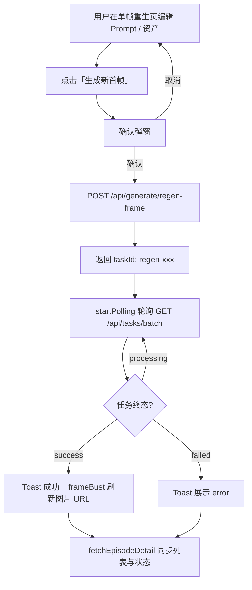

# 单帧重生（Regen Frame）

本文说明 FV Studio 中「单帧重生」功能的端到端行为：前端页面、任务轮询、后端写盘与配置要求。

## 功能概述

在镜头详情或分镜卡片进入 **单帧重生** 页后，可修改 **画面描述** 并勾选 **资产参考图**（可选，后端最多使用 2 张），调用云雾（Yunwu）Gemini 基于**当前首帧文件**重新生成图像，并**原地覆盖** `frames/Sxx.png` 对应的本地文件。

成功后会：

- 更新 `episode.json` 中该 Shot 的 `imagePrompt`
- 清空 `endFrame`、`videoCandidates`
- 将 `status` 置为 `pending`（需重新走尾帧 / 视频流程）

## 流程图

## 前端模块

| 位置 | 说明 |
|------|------|
| `web/frontend/src/pages/RegenPage.tsx` | 路由页：解析 `projectId` / `episodeId` / `shotId`，组装资产列表，渲染 `RegenFramePanel` |
| `web/frontend/src/components/business/regen/RegenFramePanel.tsx` | 核心 UI：表单、确认框、调用 `generateApi.regenFrame`、`useTaskStore.startPolling` |
| `web/frontend/src/api/generate.ts` | `regenFrame` → `POST /generate/regen-frame` |
| `web/frontend/src/stores/taskStore.ts` | 多批合并轮询（见下文）；终态时刷新剧集；连续查询失败上限触发各批 `onPollAborted` |

### 实现要点（本次修复）

- 确认弹窗的「确认」会真正调用 `POST /generate/regen-frame`，并用 `taskId` 走全局任务轮询。
- 轮询正常结束走 `onAllSettled`；连续失败中止走 `onPollAborted`，避免界面永久卡在「处理中」。
- `BatchTaskProgressBanner` 会统计未结束的 `regen-*` 任务，与分镜板其他批量任务一致展示。
- **资产 ID**：后端在 `generate.py` 中合并 `episode.assets` 与 `shot.assets` 解析 `assetIds`，与前端「剧集级资产库」勾选行为一致（同 id 以镜头级元数据为准）。
- **版本控制**：单帧 UI 模块路径为 `web/frontend/src/components/business/regen/`（含 `RegenFramePanel.tsx`、`index.ts`），应纳入 Git 提交，勿遗漏为未跟踪文件。

## 资产解析（前后端闭环）

前端 `RegenPage` 将 **episode 级全量资产库**（`episode.json` 根字段 `assets`）或全剧去重资产注入 `RegenFramePanel`。后端 `_resolve_regen_asset_paths` 会：

1. 将 `episode.assets` 与当前 `shot.assets` 合并为 `assetId → ShotAsset` 映射；
2. 同一 `assetId` **后者覆盖前者**（镜头级优先）；
3. 按请求体 `assetIds` **顺序**取路径，最多 **2** 个已存在文件。

这样即使某资产只出现在剧集库、未挂在该 shot 上，只要本地 `assets/` 文件存在，即可参与重生推理。

## 任务轮询（多批合并）

`startPolling` **不再**在每次调用时清空上一轮轮询：多批任务共享同一次 `GET /tasks/batch` 查询（任务 id 取并集）。每一批有独立的 `onAllSettled` / `onAnyTerminal` / `onPollAborted`。

效果：批量尾帧或批量视频仍在轮询时，若再发起单帧重生，**不会顶掉**批量任务的轮询与回调；各批在各自任务全部终态后分别收尾。

### 图片缓存

首帧文件路径不变，浏览器可能缓存旧图。成功后在 `getFileUrl` 上增加 **`v=` 时间戳**（`frameBust`），强制刷新左侧预览。

## 后端接口

| 项目 | 说明 |
|------|------|
| 路由 | `POST /api/generate/regen-frame` |
| 请求体 | `RegenFrameRequest`: `episodeId`, `shotId`, `imagePrompt`, `assetIds` |
| 响应 | `taskId`（前缀 `regen-`）、`shotId`、`newFramePath`（当前首帧相对路径） |
| 执行 | `BackgroundTasks` 中调用 `yunwu_service.regenerate_first_frame`，写回文件后 `data_service.update_shot` |
| 资产路径 | `_resolve_regen_asset_paths`：合并 `Episode.assets` + `Shot.assets` 后按 `assetIds` 解析 `assets/` 下文件 |

任务状态由 `web/server/services/task_store` 持久化，前缀 `regen-` 的任务类型为 **regen**。

## 环境配置

- 需在运行环境中配置 **`YUNWU_API_KEY`**（与 `scripts/regen/regen_frame.py` 一致逻辑）。
- 若未配置或密钥无效，任务会进入 `failed`，前端 Toast 展示服务端返回的 `error` 文本。

## 与全局任务条的关系

分镜板顶部的 `BatchTaskProgressBanner` 会统计未结束的 **endframe- / video- / regen-** 任务。用户在单帧重生页提交任务后若切换到分镜板，仍能看到「单帧重生 N 个」的进行中提示。

## 与批量首帧视频的区别

| 能力 | 单帧重生 | 批量首帧视频（mode=first_frame） |
|------|----------|----------------------------------|
| 目的 | 改首帧图（Gemini 重绘） | 用已有首帧做 Vidu i2v 出视频 |
| API | `/generate/regen-frame` | `/generate/video` |
| 框选 | 不涉及（单镜头页） | 受 `batchPickMode` / 勾选影响 |

## 相关脚本（本地 CLI）

仓库内 `scripts/regen/regen_frame.py` 提供命令行等价能力，便于无 UI 时批量或调试。

## 万相 2.7 批量组图（分镜板）

与上文「云雾单帧重生」**并行存在**的另一条首帧重生路径：在 **分镜板** 使用 **「万相组图重生」**，对当前筛选/框选下 **1～12** 个、且 **已有首帧文件** 的镜头，调用阿里云 DashScope **异步组图**（`enable_sequential`），按 `shotIds` 顺序将生成 PNG **覆盖**各镜 `firstFrame`，并清空尾帧与视频候选（不写回 `imagePrompt`，避免与编辑页文案漂移）。

| 项目 | 说明 |
|------|------|
| 路由 | `POST /api/generate/regen-batch-wan27` |
| 环境变量 | **`DASHSCOPE_API_KEY`**（必填）；可选 **`DASHSCOPE_BASE_URL`** 或 **`DASHSCOPE_REGION`**（北京/新加坡，与官方文档一致） |
| 任务 id | 前缀 **`wan27-`**，`task_store.kind` 为 **`regen_wan27_batch`** |
| 前端 | `generateApi.regenBatchWan27` + `startPolling` 单 taskId，与尾帧/视频/单帧重生轮询合并 |
| v1 | 请求体可不传 `assetIds`；后端仍按首镜与单帧相同规则解析资产参考（最多 2 张） |

---

*文档版本与实现代码同步维护；若接口字段变更，请同时更新本页与 `web/server/models/schemas.py` 中的 `RegenFrameRequest`。*
