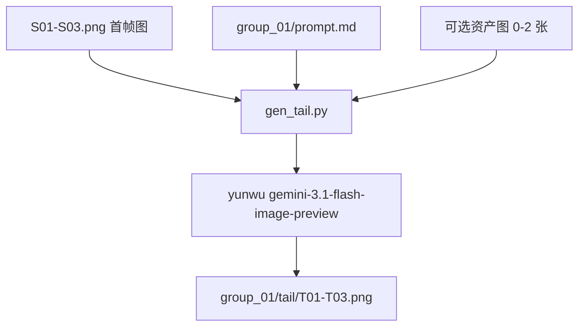

# 尾帧补全计划（MVP）

> 目标不是一次性做完整工程，而是先跑通一条最小链路：用首帧图 + 终态提示词 + 少量补充资产图，经 yunwu Gemini 生成可用于 i2v 的尾帧。

## 一、MVP 目标

- **问题**：仅用首帧做 i2v 约束时，镜头后段才出现的角色/资产容易丢失，导致视频自由发挥过大。
- **MVP 方案**：先只在 `group_01` 的 `S01-S03` 上验证尾帧生成。
- **输入**：首帧图 `Sxx.png` + `prompt.md` 中对应 shot 的 `image_prompt` 与 `video_prompt` + 可选的 0~2 张资产图。
- **输出**：`tail/Txx.png`
- **成功标准**：
  - 尾帧与首帧人物和场景连续
  - 首帧缺失但终态需要的关键资产被补足
  - 结果足够稳定，值得继续送入 i2v 做首尾双约束

## 二、MVP 范围

本阶段只做下面这些，不做额外工程化：

- 只测试目录：`output/frames/第2集_EP02_分镜包/group_01`
- 只测试镜头：`S01`、`S02`、`S03`
- 只做一个脚本：`scripts/endframe/gen_tail.py`
- 资产列表从 raw.txt 提取（`scripts/endframe/extract_assets.py` → `assets_by_shot.json`）
- 不新增 `config/endframe.yaml`
- 不抽 `src/yunwu/client.py`
- 资产图放 `public/assets/{资产名}.png`，由 `assets_by_shot.json` 提供 shot→资产映射

## 三、最小数据流



## 四、输入约定

### 4.1 prompt.md 结构

每个 shot 块：第 1 行时间戳，第 2 行 image_prompt，第 3 行 video_prompt。

（根 prompt.md 有 `# Shot N` 头；group_xx 内可能仅 `0-4s` + 两行 prompt，来源以实际文件为准）

含义：

- `image_prompt`：首帧构图、主体、景别、空间关系
- `video_prompt`：镜头过程和终态信息

MVP 中不做复杂语义解析，只做简单抽取。

### 4.2 资产图

MVP 约束：

- 每个 shot 最多附加 2 张资产图
- 没有资产图也允许生成
- 资产图只用于补首帧未出现、但尾帧必须出现的关键资产
- 资产列表由 `extract_assets.py` 从 raw.txt 提取（台词与时长之间的行）
- 输出 `assets_by_shot.json`，key 为 shot 序号
- 资产图路径：`public/assets/{资产名}.png`

## 五、尾帧提示词策略

不要直接把 `image_prompt` 和 `video_prompt` 生硬拼接。MVP 里统一改写成“终态静帧任务”。

核心要求：

- 基于首帧参考图生成同一镜头结束瞬间的静态尾帧
- 保持角色身份、服装、道具、场景、光线、景别连续
- 补足在镜头结束时应出现但首帧中不完整的关键资产
- 不要描述运动过程
- 不要生成字幕

建议模板：

```text
请基于提供的首帧参考图，生成同一镜头结束瞬间的静态尾帧。

要求：
- 保持与首帧一致的角色身份、服装、发型、道具、场景和时间氛围
- 输出必须是镜头结束瞬间的单张静态画面，不要表现运动轨迹
- 补足尾帧中应该清晰可见、但首帧中不完整或未出现的关键资产
- 保持构图、镜头语言和光线连续
- 不要生成字幕或额外文字

首帧画面描述：
{image_prompt}

镜头终态信息：
{video_prompt}

需要重点保持：
角色一致性、伤口位置、服装连续性、光线方向、景别稳定
```

如果传了多张图，文本中显式说明：

- 图一：首帧参考图
- 图二：补充资产图
- 图三：补充资产图

## 六、API 调用

- **模型**：`gemini-3.1-flash-image-preview`
- **端点**：`https://yunwu.ai/v1beta/models/gemini-3.1-flash-image-preview:generateContent`
- **鉴权**：从 `.env` 读取 `YUNWU_API_KEY`，放在请求头 `Authorization: Bearer <key>`
- **输入 parts**：
  - 1 个文本 prompt
  - 1 张首帧图
  - 0~2 张资产图

MVP 默认参数：

- `aspectRatio`: `9:16`
- `imageSize`: `2K`（1K/2K 价格相等）

## 七、脚本方案

新增一个脚本：

- `scripts/endframe/gen_tail.py`

脚本职责：

1. 读取 `.env`
2. 读取 `group_01/prompt.md`（或同目录 prompt，第 2、3 行分别为 image/video_prompt）
3. 按 shot 编号抽取 `image_prompt` 与 `video_prompt`
4. 读取 `S01-S03.png`
5. 根据 `assets_by_shot.json` 与 `public/assets/` 决定是否附加资产图（每 shot 最多 2 张）
6. 拼出尾帧 prompt
7. 调用 yunwu API
8. 保存到 `group_01/tail/T01-T03.png`

建议支持参数：

- `--group-dir`
- `--shots 1,2,3`
- `--assets-json`
- `--dry-run`

## 八、运行顺序

1. 先只跑 `S01 -> T01`
2. 结果可用后，再跑 `S02`、`S03`
3. 如果 `S01-S03` 效果稳定，再扩到更多 group

## 九、验收标准

单张尾帧通过，至少满足：

- 与首帧是同一镜头连续状态，不像换了一个场景
- 主体人物身份没有漂
- 终态应该出现的关键资产被补足
- 没有明显多余元素
- 可以作为首尾帧之一继续送入后续 i2v

## 十、已知风险

- 多图输入过多会稀释首帧约束，所以 MVP 限制为最多 2 张资产图
- `video_prompt` 常带动作描述，必须改写为“终态静帧”语义
- 某些镜头未必适合用“尾帧”表达最关键状态，但 MVP 先不处理这一类特殊镜头
- 若资产图缺失，允许仅用首帧 + 文本继续测试
