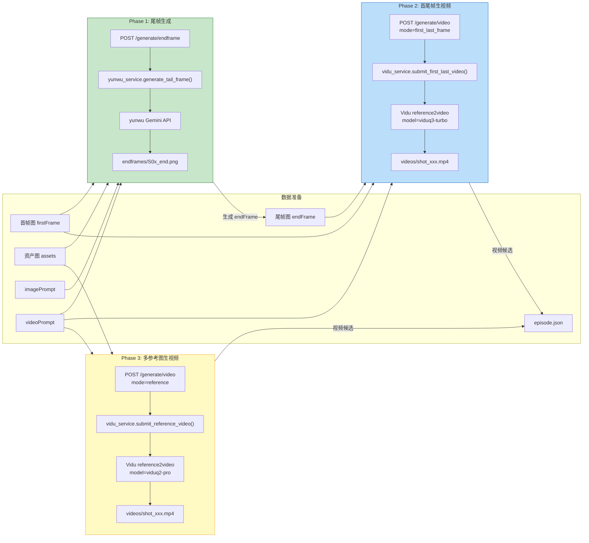

# 尾帧 & 视频批量生成 — TODO Plan

> 本文档基于现有代码库状态，梳理从「尾帧批量生成 Web UI 打通」到「Vidu Q3 首尾帧」「Vidu Q2 多参考图」的完整实施计划。
> 每个 Phase 按"后端 → 前端"顺序推进，Phase 之间有依赖关系。

---

## 当前能力盘点（Baseline）

### 已完成 ✅

| 层级 | 能力 | 对应代码 |
|------|------|----------|
| CLI | 尾帧批量生成（`--from-json` + `--shots`） | `scripts/endframe/gen_tail.py` |
| CLI | 视频批量 i2v（含 `--with-endframe` 首尾帧） | `scripts/i2v/batch.py` |
| CLI | 多参考图 reference2video（主体/非主体） | `scripts/i2v/ref2v_multi.py` |
| 后端 | yunwu 尾帧生成服务 | `web/server/services/yunwu_service.py` |
| 后端 | `POST /api/generate/endframe`（仅处理 `shotIds[0]`） | `web/server/routes/generate.py` |
| 后端 | `POST /api/generate/video`（仅单首帧 i2v，忽略 `mode`） | `web/server/routes/generate.py` |
| 后端 | 任务状态查询 `GET /api/tasks/:id`、`GET /api/tasks/batch` | `web/server/routes/tasks.py` |
| 前端 | `generateApi.endframe()` / `generateApi.video()` 已定义 | `web/frontend/src/api/generate.ts` |
| 前端 | `useTaskPolling` 轮询机制就绪 | `web/frontend/src/stores/taskStore.ts` |
| 前端 | `GenerateVideoRequest.mode` 类型已定义（`first_frame` / `first_last_frame` / `reference`） | `web/frontend/src/types/api.ts` |
| SDK | Vidu Client 支持 i2v / reference2video / 任务查询 | `src/vidu/client.py` |

### 未完成 ❌

| 层级 | 缺口 | 影响 |
|------|------|------|
| 后端 | `/generate/endframe` 只取 `shotIds[0]`，不支持真正批量 | 前端无法一次提交多 shot 尾帧生成 |
| 后端 | `/generate/video` 忽略 `mode` 参数，永远走单首帧 i2v | 无法使用首尾帧双图、多参考图模式 |
| 后端 | `vidu_service.submit_img2video()` 的 `end_frame_path` 未使用 | 双帧模式不可用 |
| 后端 | 无 reference2video Web 服务封装 | 多参考图模式不可用 |
| 后端 | 无批量并发控制（信号量/队列） | 大批量时可能打满 API 限速 |
| 前端 | StoryboardPage「批量生成尾帧」按钮无 `onClick` | 用户无法在 UI 触发批量尾帧 |
| 前端 | StoryboardPage「批量生成视频」按钮无 `onClick` | 用户无法在 UI 触发批量视频 |
| 前端 | ShotCard「尾帧」按钮无 `onClick` | 用户无法在 UI 触发单 shot 尾帧 |
| 前端 | 视频生成无模式选择（i2v / 首尾帧 / 多参） | 无法切换 Vidu 生成策略 |
| 前端 | 视频生成无模型选择（Q2 / Q3） | 无法选用更新的模型 |

---

## 整体流程图

```mermaid
flowchart TB
    subgraph P1["Phase 1: 尾帧批量生成 Web UI 打通<br/>预估 1-2 天"]
        direction TB
        P1A["1.1 后端: /generate/endframe 支持多 shotIds 循环"]
        P1B["1.2 后端: 添加并发信号量（限 3 并发）"]
        P1C["1.3 前端: ShotCard「尾帧」按钮 → 单 shot 生成"]
        P1D["1.4 前端: StoryboardPage「批量生成尾帧」→ 多 shot 生成"]
        P1E["1.5 前端: 尾帧生成任务轮询 + 状态刷新"]
        P1F["1.6 前端: 尾帧生成中/完成的 UI 反馈"]
        P1A --> P1B --> P1C --> P1D --> P1E --> P1F
    end

    subgraph P2["Phase 2: Vidu Q3 首尾帧批量生视频<br/>预估 2-3 天"]
        direction TB
        P2A["2.1 后端: vidu_service 新增 submit_first_last_video()"]
        P2B["2.2 后端: /generate/video 分发 mode 逻辑"]
        P2C["2.3 后端: 视频下载 + 写入 videoCandidates"]
        P2D["2.4 前端: ShotCard「出视频」→ 触发生成（支持模式选择）"]
        P2E["2.5 前端: StoryboardPage「批量生成视频」→ 多 shot 生成"]
        P2F["2.6 前端: 视频任务轮询 + 候选视频预览"]
        P2G["2.7 前端: 视频候选选定 + 状态更新"]
        P2A --> P2B --> P2C --> P2D --> P2E --> P2F --> P2G
    end

    subgraph P3["Phase 3: Vidu Q2 多参考图批量<br/>预估 2 天"]
        direction TB
        P3A["3.1 后端: vidu_service 新增 submit_reference_video()"]
        P3B["3.2 后端: /generate/video reference 模式分支"]
        P3C["3.3 前端: 参考图选择 UI（资产库 → 选图）"]
        P3D["3.4 前端: reference 模式下的批量提交"]
        P3E["3.5 全局: 批量任务并发控制 + 失败重试"]
        P3A --> P3B --> P3C --> P3D --> P3E
    end

    P1 --> P2 --> P3

    style P1 fill:#c8e6c9,stroke:#2e7d32,stroke-width:2px
    style P2 fill:#bbdefb,stroke:#1565c0,stroke-width:2px
    style P3 fill:#fff9c4,stroke:#f9a825,stroke-width:2px
```



---

## Phase 1: 尾帧批量生成 Web UI 打通

> **目标**：用户可在 Web 前端，通过首帧图 + imagePrompt + videoPrompt + 引用资产，单个或批量生成尾帧图。

### 1.1 后端：`/generate/endframe` 支持多 shotIds

**现状**：`routes/generate.py` 中 `generate_endframe()` 只取 `req.shotIds[0]`。

**改动**：

```
文件: web/server/routes/generate.py

- 循环 req.shotIds，为每个 shot 创建独立 task_id 并启动后台任务
- 返回 { tasks: [{ taskId, shotId }, ...] }
- 响应模型从 GenerateEndframeResponse(taskId, shotId) 改为 BatchEndframeResponse(tasks[])
```

**要点**：
- 每个 shot 的后台任务独立运行，互不阻塞
- episode.json 的 shot.status 在提交时立即更新为 `endframe_generating`
- 生成成功后更新 `endFrame` 路径和 `status: endframe_done`
- 生成失败时 `status: error`

### 1.2 后端：添加并发信号量

**改动**：

```
文件: web/server/routes/generate.py

- 模块级 asyncio.Semaphore(3)，限制同时运行的 yunwu 调用数
- _run_tail_frame() 内 async with semaphore 包裹实际生成逻辑
```

**要点**：
- yunwu Gemini 有 QPS 限制，默认并发上限 3
- 可通过环境变量 `ENDFRAME_CONCURRENCY=3` 配置

### 1.3 前端：ShotCard「尾帧」按钮绑定

**现状**：`ShotCard.tsx` 中「尾帧」按钮无 `onClick`。

**改动**：

```
文件: web/frontend/src/components/business/ShotCard.tsx

- 导入 generateApi
- onClick: 调用 generateApi.endframe({ episodeId, shotIds: [shot.shotId] })
- 调用后将 shot.status 乐观更新为 endframe_generating
- 返回的 taskId 加入 taskStore 轮询队列
- 按钮在 status=endframe_generating 时显示 loading 态并 disabled
```

### 1.4 前端：StoryboardPage「批量生成尾帧」按钮绑定

**现状**：按钮存在但无 `onClick`。

**改动**：

```
文件: web/frontend/src/pages/StoryboardPage.tsx

- onClick: 收集所有 status=pending 且有 firstFrame 的 shotIds
- 调用 generateApi.endframe({ episodeId, shotIds })
- 返回的 tasks[] 全部加入 taskStore 轮询
- 按钮文案改为「批量生成尾帧 (N)」显示待生成数量
- 生成中时按钮显示进度（如 3/10）
```

### 1.5 前端：尾帧任务轮询 + 状态刷新

**改动**：

```
文件: web/frontend/src/stores/taskStore.ts
文件: web/frontend/src/pages/StoryboardPage.tsx

- taskStore 中 endframe 类型的任务完成时，触发 episodeStore.refreshEpisode()
- 刷新后 ShotCard 自动展示 endFrame 缩略图
- 批量任务全部完成时弹出 toast 通知
```

### 1.6 前端：尾帧 UI 反馈

**改动**：

```
文件: web/frontend/src/components/business/ShotCard.tsx

- status=endframe_generating 时，ShotCard 尾帧区域显示 Skeleton/Spinner
- status=endframe_done 时，展示 endFrame 缩略图
- status=error 时，展示错误提示 + 重试按钮
```

### Phase 1 验收标准

- [ ] 单 shot：点击 ShotCard「尾帧」按钮 → 生成中状态 → 尾帧图出现
- [ ] 批量：点击「批量生成尾帧」→ 所有符合条件的 shot 开始生成 → 逐个完成
- [ ] 生成中 ShotCard 显示加载状态
- [ ] 生成完成自动展示尾帧缩略图
- [ ] 失败时显示错误 + 可重试

---

## Phase 2: Vidu Q3 首尾帧批量生视频

> **目标**：用户可选择首尾帧双图模式（Vidu Q3），批量将 firstFrame + endFrame 送入 Vidu 生成约束更强的视频。

### 模型能力对照

| 模型 | 类型 | 首帧 i2v | 首尾帧双图 | 多参考图 | 最高分辨率 |
|------|------|----------|-----------|---------|-----------|
| `viduq3-pro` | Q3 | ✅ | ✅ (reference2video) | ✅ | 1080p |
| `viduq3-turbo` | Q3 | ✅ | ✅ (reference2video) | ✅ | 1080p |
| `viduq2-pro-fast` | Q2 | ✅ | ❌ (i2v 仅单图) | ✅ (reference2video) | 1080p |
| `viduq2-pro` | Q2 | ✅ | ❌ | ✅ | 1080p |

> **注**：Vidu 的 i2v 接口 `images` 始终只接受 1 张图。首尾帧双图需要走 `reference2video_with_images(images=[首帧, 尾帧])` 接口。
> Q3 模型在 reference2video 中支持"首帧 + 尾帧"作为两张参考图，实现首尾帧约束。

### 2.1 后端：`vidu_service` 新增首尾帧方法

**改动**：

```
文件: web/server/services/vidu_service.py

新增:
def submit_first_last_video(
    first_frame_path: Path,
    end_frame_path: Path,
    prompt: str,
    *,
    model: str = "viduq3-turbo",      # Q3 默认模型
    duration: int = 5,
    resolution: str = "720p",
) -> dict:
    """
    首尾帧双图生视频。
    将 firstFrame 和 endFrame 作为 2 张参考图调用 reference2video_with_images。
    """
    b64_first = encode_base64(first_frame_path)
    b64_end = encode_base64(end_frame_path)
    return client.reference2video_with_images(
        images=[b64_first, b64_end],
        prompt=prompt,
        model=model,
        duration=duration,
        resolution=resolution,
    )
```

### 2.2 后端：`/generate/video` 分发 mode 逻辑

**现状**：`_run_video_gen()` 忽略 `mode`，始终调用 `submit_img2video()`。

**改动**：

```
文件: web/server/routes/generate.py

_run_video_gen() 中:
if mode == "first_frame":
    result = vidu_service.submit_img2video(first_frame, prompt, model=model)
elif mode == "first_last_frame":
    if not end_frame:
        raise → status=error, "需要先生成尾帧"
    result = vidu_service.submit_first_last_video(first_frame, end_frame, prompt, model=model)
elif mode == "reference":
    result = vidu_service.submit_reference_video(...)  # Phase 3
```

**要点**：
- `first_last_frame` 模式下 shot 必须有 `endFrame`，否则报错
- 默认 model 由 mode 决定：`first_frame` → `viduq2-pro-fast`，`first_last_frame` → `viduq3-turbo`
- 前端也可在请求中指定 model 覆盖默认值

### 2.3 后端：视频下载 + 写入 videoCandidates

**改动**：

```
文件: web/server/routes/generate.py (或新增 web/server/services/task_service.py)

- Vidu 返回 task_id 后，写入 shot.videoCandidates[] 为 taskStatus=pending
- GET /api/tasks/:taskId 查询时同步查询 Vidu API 更新状态
- task 成功后自动下载视频到 data/.../videos/{shotId}_{candidateId}.mp4
- 更新 videoCandidate.videoPath 和 taskStatus=success
```

### 2.4 前端：ShotCard「出视频」交互改造

**改动**：

```
文件: web/frontend/src/components/business/ShotCard.tsx

- 「出视频」按钮改为触发视频生成（而非跳转详情页）
- 根据 shot 状态自动选择 mode:
  - 有 endFrame → 默认 first_last_frame
  - 无 endFrame → 默认 first_frame
- 点击后调用 generateApi.video({ episodeId, shotIds: [shotId], mode, model })
- 任务加入轮询队列
```

### 2.5 前端：StoryboardPage「批量生成视频」按钮

**改动**：

```
文件: web/frontend/src/pages/StoryboardPage.tsx

- onClick: 收集 status=endframe_done 的 shotIds
- 弹出确认弹窗，可选择 mode 和 model:
  ┌─────────────────────────────────┐
  │ 批量生成视频                      │
  │                                   │
  │ 模式: ○ 首帧 i2v                  │
  │       ● 首尾帧双图 (推荐)          │
  │       ○ 多参考图                   │
  │                                   │
  │ 模型: viduq3-turbo ▼             │
  │                                   │
  │ 待生成: 15 个 Shot                │
  │ [取消]              [开始生成]     │
  └─────────────────────────────────┘
- 确认后调用 generateApi.video()
```

### 2.6 前端：视频任务轮询 + 候选预览

**改动**：

```
文件: web/frontend/src/stores/taskStore.ts
文件: web/frontend/src/pages/ShotDetailPage.tsx

- 视频任务完成后刷新 episode 数据
- ShotDetailPage 展示 videoCandidates[] 列表，支持播放预览
- ShotCard 视频区域展示最新候选缩略图
```

### 2.7 前端：视频候选选定

**改动**：

```
文件: web/frontend/src/pages/ShotDetailPage.tsx

- 每个 VideoCandidate 旁边有「选定」按钮
- 点击后调用 PUT /api/shots/:shotId/select-video (新增)
- 更新 candidate.selected = true, shot.status = selected
```

### Phase 2 验收标准

- [ ] 单 shot：点击「出视频」→ 自动选择合适 mode → 视频生成中 → 视频出现
- [ ] 首尾帧模式：有 endFrame 的 shot 默认走 `first_last_frame` + Q3 模型
- [ ] 批量：「批量生成视频」→ 弹窗选模式/模型 → 确认 → 批量提交
- [ ] 轮询正常，视频完成后自动刷新
- [ ] ShotDetailPage 可预览/选定候选视频

---

## Phase 3: Vidu Q2 多参考图批量

> **目标**：支持 reference2video 模式，用户可选择 1-7 张参考图（资产图/角色图）作为输入，生成更精准的视频。

### 3.1 后端：`vidu_service` 新增 reference 方法

**改动**：

```
文件: web/server/services/vidu_service.py

新增:
def submit_reference_video(
    reference_images: list[Path],      # 1-7 张参考图
    prompt: str,
    *,
    model: str = "viduq2-pro",         # Q2 默认模型
    duration: int = 5,
    resolution: str = "720p",
    with_subjects: bool = False,       # 是否使用主体模式
    voice_text: str | None = None,     # 可选台词
) -> dict:
    """
    多参考图生视频。
    with_subjects=False → reference2video_with_images（非主体，支持更多模型）
    with_subjects=True  → reference2video_with_subjects（主体模式，支持台词）
    """
```

### 3.2 后端：`/generate/video` reference 模式分支

**改动**：

```
文件: web/server/routes/generate.py

elif mode == "reference":
    # 从 shot.assets 收集参考图路径
    ref_paths = [resolve(a.localPath) for a in shot.assets if a.localPath]
    if not ref_paths:
        raise → "至少需要 1 张参考图"
    # 可选：也把 firstFrame 作为第一张参考图
    result = vidu_service.submit_reference_video(
        reference_images=ref_paths,
        prompt=shot.videoPrompt,
        model=req.model or "viduq2-pro",
    )
```

**新增请求字段**（可选）：

```
文件: web/server/models/schemas.py

class GenerateVideoRequest:
    ...
    referenceAssetIds: list[str] | None = None  # 指定参考资产，空则用 shot.assets
```

### 3.3 前端：参考图选择 UI

**改动**：

```
文件: 新增 web/frontend/src/components/business/ReferenceImagePicker.tsx

- 从 episode.assets 或 shot.assets 列表中选择参考图
- 支持拖拽排序（顺序影响权重）
- 限制 1-7 张
- 显示已选参考图缩略图
```

### 3.4 前端：reference 模式下的批量提交

**改动**：

```
文件: web/frontend/src/pages/StoryboardPage.tsx

- 批量生成视频弹窗中选择「多参考图」模式
- 每个 shot 自动使用其关联的 assets 作为参考图
- 也支持手动指定全局参考图（应用到所有 shot）
```

### 3.5 全局：批量任务并发控制 + 失败重试

**改动**：

```
文件: web/server/routes/generate.py (或新增 web/server/services/queue_service.py)

- 模块级 Semaphore:
  - ENDFRAME_SEM = Semaphore(int(os.getenv("ENDFRAME_CONCURRENCY", 3)))
  - VIDEO_SEM = Semaphore(int(os.getenv("VIDEO_CONCURRENCY", 5)))
- 每个后台任务 async with sem 包裹
- 失败任务记录到 shot.videoCandidates[].taskStatus = "failed"
- 前端展示失败原因 + 重试按钮
- 重试时创建新的 VideoCandidate，不覆盖旧记录
```

### Phase 3 验收标准

- [ ] reference 模式：选择参考图 → 生成视频 → 预览
- [ ] 批量 reference：多 shot 使用各自关联资产自动生成
- [ ] 并发控制：大批量提交不触发 API 限速
- [ ] 失败重试：失败的 shot 可单独重试
- [ ] 不同模式的 VideoCandidate 可在同一 shot 下共存对比

---

## 数据流全景图



---

## API 变更汇总

### 新增/修改的后端 API

| 方法 | 路径 | Phase | 变更说明 |
|------|------|-------|----------|
| `POST` | `/api/generate/endframe` | P1 | 支持多 shotIds，返回 tasks[] |
| `POST` | `/api/generate/video` | P2/P3 | 按 mode 分发到不同 vidu_service 方法 |
| `PUT` | `/api/shots/:shotId/select-video` | P2 | 新增，选定候选视频 |
| `GET` | `/api/tasks/batch` | P1 | 已有，无变更 |

### 请求/响应模型变更

```python
# Phase 1: 尾帧批量响应
class BatchEndframeResponse(BaseModel):
    tasks: list[EndframeTask]           # [{ taskId, shotId }]

# Phase 2: 视频生成请求增强
class GenerateVideoRequest(BaseModel):
    episodeId: str
    shotIds: list[str]
    mode: Literal["first_frame", "first_last_frame", "reference"]
    model: str | None = None            # 不传则按 mode 使用默认模型
    duration: int = 5
    resolution: str = "720p"
    referenceAssetIds: list[str] | None = None  # Phase 3: reference 模式下手动指定资产

# Phase 2: 视频批量响应
class BatchVideoResponse(BaseModel):
    tasks: list[VideoTask]              # [{ taskId, shotId, candidateId }]
```

---

## 前端组件变更汇总

| 组件 | Phase | 变更 |
|------|-------|------|
| `ShotCard.tsx` | P1 | 「尾帧」按钮绑定 onClick |
| `ShotCard.tsx` | P2 | 「出视频」按钮改为触发生成 |
| `ShotCard.tsx` | P1/P2 | 生成中 loading 态、完成态展示 |
| `StoryboardPage.tsx` | P1 | 「批量生成尾帧」按钮绑定 |
| `StoryboardPage.tsx` | P2 | 「批量生成视频」按钮 + 弹窗（模式/模型选择） |
| `ShotDetailPage.tsx` | P2 | 视频候选列表 + 播放预览 + 选定 |
| `ReferenceImagePicker.tsx` | P3 | 新增，参考图多选组件 |
| `taskStore.ts` | P1 | 尾帧任务完成回调 |
| `episodeStore.ts` | P1/P2 | 刷新 episode 数据 |

---

## 文件变更清单

### 后端

| 文件 | Phase | 变更类型 |
|------|-------|----------|
| `web/server/routes/generate.py` | P1/P2/P3 | 修改 |
| `web/server/services/vidu_service.py` | P2/P3 | 修改 |
| `web/server/models/schemas.py` | P1/P2/P3 | 修改 |
| `web/server/routes/shots.py` | P2 | 新增 select-video 端点 |
| `web/server/services/queue_service.py` | P3 | 新增（可选，并发控制） |

### 前端

| 文件 | Phase | 变更类型 |
|------|-------|----------|
| `web/frontend/src/components/business/ShotCard.tsx` | P1/P2 | 修改 |
| `web/frontend/src/pages/StoryboardPage.tsx` | P1/P2 | 修改 |
| `web/frontend/src/pages/ShotDetailPage.tsx` | P2 | 修改 |
| `web/frontend/src/stores/taskStore.ts` | P1 | 修改 |
| `web/frontend/src/stores/episodeStore.ts` | P1/P2 | 修改 |
| `web/frontend/src/types/api.ts` | P1/P2 | 修改 |
| `web/frontend/src/components/business/ReferenceImagePicker.tsx` | P3 | 新增 |
| `web/frontend/src/components/business/VideoModeSelector.tsx` | P2 | 新增（弹窗组件） |

---

## 时间估算

| Phase | 内容 | 后端 | 前端 | 合计 |
|-------|------|------|------|------|
| **Phase 1** | 尾帧批量 Web UI | 0.5 天 | 1 天 | **1-1.5 天** |
| **Phase 2** | Q3 首尾帧批量视频 | 1 天 | 1.5 天 | **2-2.5 天** |
| **Phase 3** | Q2 多参考图批量 | 0.5 天 | 1.5 天 | **1.5-2 天** |
| | | | **总计** | **5-6 天** |

---

## 风险 & 注意事项

| 风险 | 影响 | 应对 |
|------|------|------|
| yunwu Gemini QPS 限制 | 批量尾帧可能被限速 | 后端信号量限制并发 |
| Vidu API 额度 | 大批量视频生成消耗较快 | 前端提交前展示预估消耗，二次确认 |
| Q3 首尾帧效果未验证 | reference2video 可能不如 i2v 稳定 | Phase 2 先小批量测试，保留 first_frame 模式作为回退 |
| reference2video 两张图的顺序 | 顺序可能影响首尾帧约束效果 | 测试确认 [首帧, 尾帧] vs [尾帧, 首帧] 的效果差异 |
| 视频下载耗时 | 生成完成后还需下载到本地 | 异步下载，不阻塞任务状态更新 |
| 前端大批量任务轮询 | 40+ 个 task 同时轮询可能卡顿 | 使用 /tasks/batch 批量查询，轮询间隔动态调整 |
