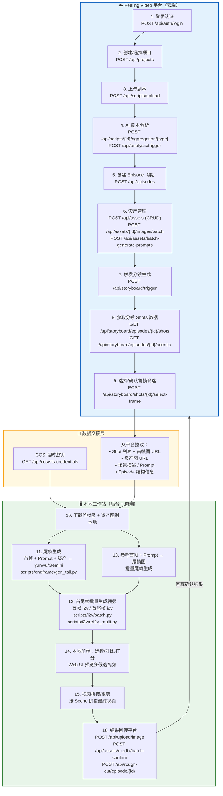
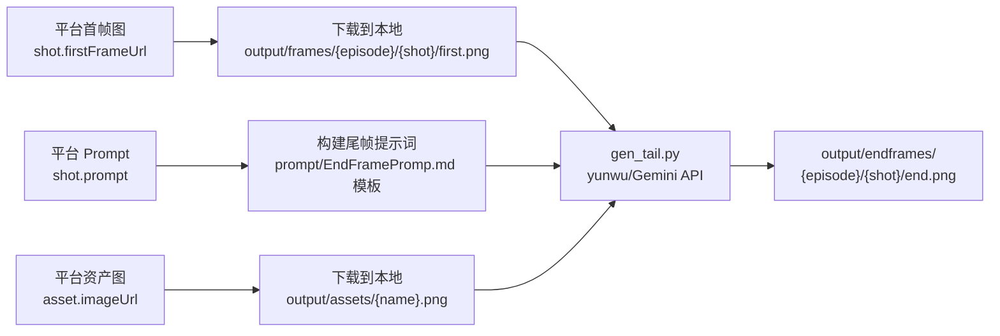
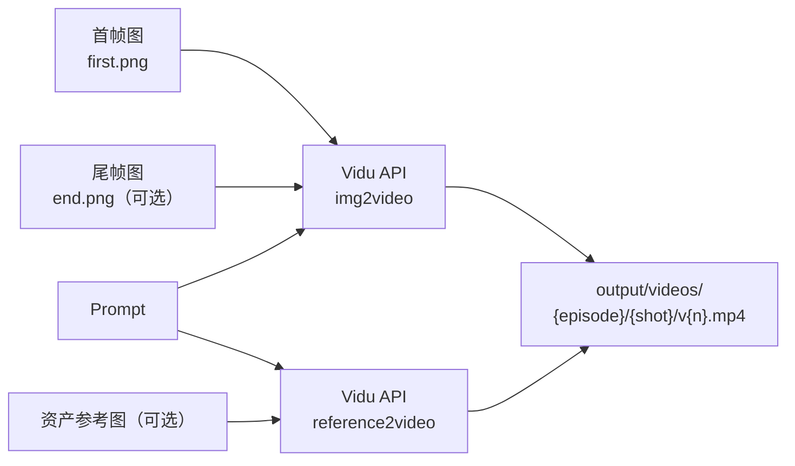
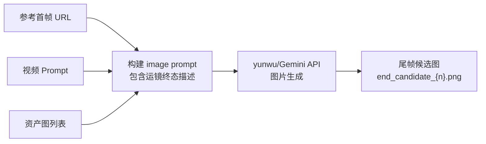

# Feeling Video 平台 + 本地工作站 集成计划

> **核心思路**：平台完成「剧本 → 分析 → 资产 → 分镜板（图片级）」的全部工作，  
> 本地工作站接管「尾帧生成 → 首尾帧批量出视频 → 选择 → 拼接」等重计算环节。  
> 本地可建轻量 后台 + 前端，实现可视化操作。

---

## 一、整体流程图



---

## 二、分工边界：平台做什么 vs 本地做什么

### 2.1 平台负责（步骤 1-9）

| 步骤 | 平台 API | 说明 |
|------|---------|------|
| **认证** | `POST /api/auth/login` | JWT Token 认证，支持密码/短信验证码 |
| **项目管理** | `POST/GET /api/projects` | 创建项目、设置美术风格 |
| **剧本上传** | `POST /api/scripts/upload` | 上传 .docx/.txt 剧本文件 |
| **剧本解析** | `GET /api/scripts/{id}/blocks` | 平台自动拆分剧本 Block |
| **AI 剧本分析** | `POST /api/scripts/{id}/aggregation/{type}` | AI 分析角色/场景/道具/叙事结构 |
| **集管理** | `POST/GET /api/episodes` | 创建集、管理集内容 |
| **资产创建** | `POST /api/assets` | 创建角色/场景/道具资产 |
| **资产图上传** | `POST /api/assets/{id}/images/batch` | 批量上传资产参考图 |
| **AI 生成资产描述** | `POST /api/assets/batch-generate-prompts` | 批量 AI 生成资产 Prompt |
| **触发分镜** | `POST /api/storyboard/trigger` | AI 生成分镜（场景拆解、镜头描述、画面描述） |
| **分镜板出图** | `POST /api/storyboard/episodes/{id}/generate-assets` | 根据分镜数据生成每个 Shot 的首帧图 |
| **选帧确认** | `POST /api/storyboard/shots/{id}/select-frame` | 从多候选中选定每个 Shot 的首帧图 |

**平台输出物**：每个 Shot 拥有——
- 确认的首帧图（URL）
- 场景描述文本（Prompt）
- 关联的资产列表
- 镜头运镜、时长等元数据

### 2.2 本地工作站负责（步骤 10-16）

| 步骤 | 本地脚本 / 工具 | 说明 |
|------|----------------|------|
| **数据拉取** | `src/feeling/` 客户端 | 从平台下载首帧图、资产图、Prompt、Shot 结构 |
| **尾帧生成** | `scripts/endframe/gen_tail.py` | 首帧 + Prompt + 资产图 → yunwu/Gemini → 尾帧图 |
| **首帧 i2v** | `scripts/i2v/batch.py` | 批量 首帧 → Vidu i2v → 5s 视频 |
| **首尾帧 i2v** | `scripts/i2v/batch.py` (扩展) | 首帧 + 尾帧 → Vidu i2v → 有明确终点的视频 |
| **参考生视频** | `scripts/i2v/ref2v_multi.py` | 多参考图 → reference2video |
| **视频选择** | 本地前端 Web UI | 每个 Shot 多候选视频预览、对比、打分 |
| **视频拼接** | FFmpeg / 本地脚本 | 按 Scene→Episode 顺序拼接 + 转场 |
| **结果回传** | `src/feeling/` 客户端 | 将最终视频上传回平台，关联到对应 Shot |

---

## 三、数据交接格式

### 3.1 从平台拉取的核心数据结构

```json
{
  "episode": {
    "id": "uuid",
    "title": "第2集",
    "episodeNumber": 2
  },
  "scenes": [
    {
      "id": "scene-uuid",
      "sceneNumber": 1,
      "title": "场景描述",
      "shots": [
        {
          "id": "shot-uuid",
          "shotNumber": 1,
          "description": "中景，达里尔站在废弃仓库门口...",
          "prompt": "Medium shot, Daryl stands at abandoned warehouse...",
          "duration": 5,
          "cameraMovement": "push_in",
          "firstFrameUrl": "https://cos.xxx/shot-001-frame.png",
          "assets": [
            {
              "id": "asset-uuid",
              "name": "达里尔",
              "type": "character",
              "imageUrl": "https://cos.xxx/daryl.png",
              "prompt": "A muscular man with short hair..."
            }
          ]
        }
      ]
    }
  ]
}
```

### 3.2 本地生成后回传的数据

```json
{
  "shotId": "shot-uuid",
  "results": [
    {
      "type": "end_frame",
      "imageUrl": "local://output/endframes/shot-001-end.png",
      "uploadedUrl": "https://cos.xxx/uploaded/shot-001-end.png"
    },
    {
      "type": "video_candidate",
      "videoUrl": "local://output/videos/shot-001-v1.mp4",
      "uploadedUrl": "https://cos.xxx/uploaded/shot-001-v1.mp4",
      "selected": true,
      "seed": 12345,
      "model": "viduq2-pro-fast"
    }
  ]
}
```

---

## 四、需要开发的模块

### 4.1 新增 `src/feeling/` 平台客户端

```
src/feeling/
├── __init__.py           # 模块初始化，导出 FeelingClient
├── client.py             # 基础 HTTP 客户端（认证、请求封装、错误处理）
├── auth.py               # 登录 / Token 管理 / 自动刷新
├── project.py            # 项目 CRUD
├── script.py             # 剧本上传 / 解析 / 分析触发
├── episode.py            # 集 CRUD / 内容管理
├── asset.py              # 资产 CRUD / 图片上传 / Prompt 生成
├── storyboard.py         # 分镜触发 / Shot 数据获取
├── generation.py         # 图片/视频生成任务（平台侧）
├── upload.py             # COS 临时密钥 + 文件上传
└── sync.py               # 数据同步：平台 → 本地 JSON
```

#### 核心类设计

```python
class FeelingClient:
    """
    Feeling Video 平台 API 客户端基类。
    
    - 认证：JWT Bearer Token，自动刷新
    - 请求：统一错误处理、重试、日志
    - 配置：从 .env 读取 FEELING_API_BASE / FEELING_PHONE / FEELING_PASSWORD
    """
    
    def __init__(self, base_url: str, phone: str, password: str):
        self.base_url = base_url
        self.access_token = None
        self.refresh_token = None
        self._login(phone, password)
    
    def _login(self, phone, password):
        """POST /api/auth/login → 获取 accessToken + refreshToken"""
        ...
    
    def _refresh_token(self):
        """POST /api/auth/refresh → 续期 accessToken"""
        ...
    
    def _request(self, method, path, **kwargs):
        """统一请求方法，自动携带 Authorization: Bearer {token}"""
        ...
```

### 4.2 新增 `scripts/feeling/` 平台对接脚本

```
scripts/feeling/
├── pull_storyboard.py    # 从平台拉取分镜数据（Shots+首帧图+Prompt+资产）
├── push_results.py       # 将本地生成结果回传平台
├── sync_assets.py        # 同步资产图到本地
└── full_pipeline.py      # 完整流水线：拉取 → 本地生成 → 回传
```

### 4.3 本地前端（可选，后续开发）

```
web/
├── backend/              # Python FastAPI 本地服务
│   ├── main.py           # API 入口
│   ├── routes/
│   │   ├── shots.py      # Shot 列表、候选视频
│   │   ├── generate.py   # 触发生成（尾帧/视频）
│   │   └── export.py     # 拼接导出
│   └── services/
│       ├── vidu.py       # 调用 ViduClient
│       └── feeling.py    # 调用 FeelingClient
├── frontend/             # React/Vue 前端
│   ├── ShotBoard.vue     # 分镜板视图
│   ├── VideoCompare.vue  # 多候选视频对比
│   └── Timeline.vue      # 粗剪时间线
└── docker-compose.yml    # 一键启动
```

---

## 五、关键平台 API 详细说明

### 5.1 认证

```
POST /api/auth/login
Body: { "phone": "xxx", "password": "xxx" }
Response: { "accessToken": "jwt...", "refreshToken": "jwt...", "user": {...} }

所有后续请求 Header: Authorization: Bearer {accessToken}
Token 过期时: POST /api/auth/refresh  Body: { "refreshToken": "xxx" }
```

### 5.2 剧本管理

```
# 上传剧本文件（multipart/form-data）
POST /api/scripts/upload

# 创建剧本（JSON）
POST /api/scripts
Body: CreateScriptDto { projectId, title, content?, ... }

# 获取剧本分块
GET /api/scripts/{id}/blocks
Response: 结构化的 Block 数组（对话、描述、场景标记等）

# 触发 AI 汇总分析（角色/场景/道具提取）
POST /api/scripts/{scriptId}/aggregation/{type}
type: characters | locations | props | narrative | art_style | global_synopsis

# 补充叙事分析
POST /api/scripts/{scriptId}/analysis/supplement
```

### 5.3 资产管理

```
# 创建资产
POST /api/assets
Body: CreateAssetDto { projectId, episodeId?, name, type, description?, ... }
type: character | location | prop | ...

# 批量上传资产图片
POST /api/assets/{id}/images/batch
Body: multipart/form-data (多个图片文件)

# AI 生成单个资产描述
POST /api/assets/{id}/generate-prompt

# 批量生成所有资产描述
POST /api/assets/batch-generate-prompts
Body: { projectId, assetIds? }

# 按集查资产
GET /api/assets/episode/{episodeId}

# 获取资产图片列表
GET /api/assets/{id}/images

# 获取资产关联媒体（图片+视频）
GET /api/assets/{id}/media
```

### 5.4 分镜/故事板

```
# 触发分镜生成（需要先完成剧本分析）
POST /api/storyboard/trigger
Body: TriggerStoryboardDto { episodeId, ... }

# 为 Episode 生成资产图（首帧图）
POST /api/storyboard/episodes/{episodeId}/generate-assets

# 部分重新生成（指定 Shot）
POST /api/storyboard/episodes/{episodeId}/regenerate-partial
Body: RegeneratePartialStoryboardDto { shotIds: [...] }

# 获取 Episode 下所有 Shot（含首帧、Prompt、资产信息）
GET /api/storyboard/episodes/{episodeId}/shots
→ 这是本地工作站的主要数据来源

# 获取场景列表
GET /api/storyboard/episodes/{episodeId}/scenes

# 选择首帧候选图
POST /api/storyboard/shots/{shotId}/select-frame
Body: { candidateIndex: 0 }

# 获取任务状态
GET /api/storyboard/tasks/{taskId}

# 获取 Episode 级别的任务列表
GET /api/storyboard/episodes/{episodeId}/tasks
```

### 5.5 文件上传（COS 对象存储）

```
# 获取临时上传凭证
GET /api/cos/sts-credentials
Response: { tmpSecretId, tmpSecretKey, sessionToken, bucket, region, ... }

# 上传图片（简单方式）
POST /api/upload/image
Body: multipart/form-data { file }

# 刷新文件 URL（COS 签名过期后重新获取）
GET /api/cos/refresh-url?filePath=xxx

# 下载文件
GET /api/cos/download?filePath=xxx
```

### 5.6 结果回传

```
# 回传视频到粗剪时间线
POST /api/rough-cut/episode/{episodeId}
Body: AddClipDto { shotId, mediaUrl, duration, ... }

# 资产媒体批量确认
POST /api/assets/media/batch-confirm
Body: { mediaIds: [...] }

# 视频导出
POST /api/video-export/episode/{episodeId}
POST /api/video-export/storyboard-pack/{episodeId}
POST /api/video-export/jianying/{episodeId}    # 导出剪映草稿
```

---

## 六、本地生成流水线设计

### 6.1 批量尾帧生成



**对标现有脚本**：`scripts/endframe/gen_tail.py`，仅需修改数据来源从本地文件 → 平台 API。

### 6.2 批量首帧/首尾帧生视频



**对标现有脚本**：
- 首帧 i2v → `scripts/i2v/batch.py`
- 参考生视频 → `scripts/i2v/ref2v_multi.py`
- 需要新增：首尾帧 i2v 支持（Vidu images 参数传 2 张图）

### 6.3 批量参考首帧 + Prompt → 尾帧图



**说明**：这一步与「尾帧生成」类似，但重点在于——  
- 使用首帧作为「参考图」（不是直接输入），让 AI 理解画面风格
- 结合运镜描述（如 push_in → 终态更近景）推断尾帧应有的画面
- 可以一次生成多个候选，供前端选择

---

## 七、.env 新增配置

```env
# ========== Feeling Video 平台 ==========
FEELING_API_BASE=https://dev-video-server.feeling.ltd/api
FEELING_PHONE=your_phone_number
FEELING_PASSWORD=your_password
# 当前操作的项目/集（可选，也可以在脚本中指定）
FEELING_PROJECT_ID=
FEELING_EPISODE_ID=

# ========== 已有配置（保持不变） ==========
VIDU_API_KEY=xxx
YUNWU_API_KEY=xxx
```

---

## 八、开发优先级

### Phase 1：打通数据链路（1-2 天）

| 优先级 | 任务 | 输出 |
|--------|------|------|
| P0 | `src/feeling/client.py` + `auth.py` | 认证 + 基础请求 |
| P0 | `src/feeling/storyboard.py` | 拉取 Shot 列表 + 首帧图 |
| P0 | `src/feeling/asset.py` | 拉取资产图 |
| P0 | `scripts/feeling/pull_storyboard.py` | 一键拉取分镜数据到本地 |

### Phase 2：接入本地生成（2-3 天）

| 优先级 | 任务 | 输出 |
|--------|------|------|
| P1 | 改造 `gen_tail.py` 支持平台数据源 | 尾帧批量生成 |
| P1 | 改造 `batch.py` 支持首尾帧模式 | 视频批量生成 |
| P1 | `scripts/feeling/full_pipeline.py` | 完整流水线脚本 |
| P1 | `scripts/feeling/push_results.py` | 结果回传平台 |

### Phase 3：本地前端（3-5 天，可选）

| 优先级 | 任务 | 输出 |
|--------|------|------|
| P2 | FastAPI 本地后台 | REST API 供前端调用 |
| P2 | 分镜板视图 | 首帧 + 尾帧 + 视频预览 |
| P2 | 多候选对比 | 同一 Shot 多个视频版本对比选择 |
| P2 | 粗剪时间线 | 拖拽排序 + FFmpeg 拼接 |
| P2 | 一键导出 | 按 Episode 输出最终视频 |

---

## 九、为什么这种分工最优

### 平台做前半段的优势

1. **剧本分析是 AI 重活**：平台内置了 prompt 模板系统（`/api/admin/prompt-templates`）和多轮 AI 分析能力，比本地 API 调用更完善
2. **资产管理需要协作**：多人共享资产库、版本控制、审核流程——这些是平台的强项
3. **分镜拆解有完整数据模型**：平台的 Script → Episode → Scene → Shot 四级结构，比本地文件目录更规范
4. **首帧出图集成了 Canvas（画布）**：平台有节点画布系统（`/api/canvas/*`），支持可视化编排

### 本地做后半段的优势

1. **Vidu API 直调更快**：绕过平台的计费和排队层，使用自有 API Key 直接调用
2. **尾帧生成用 yunwu**：平台不一定集成了 yunwu/Gemini，本地可以灵活切换模型
3. **批量并发更可控**：本地可以精确控制并发数、错峰策略、重试逻辑
4. **选择过程更高效**：本地前端实时预览，不需要来回上传下载
5. **拼接/剪辑需要本地 FFmpeg**：视频处理是 CPU/GPU 密集型，本地完成效率更高
6. **成本更低**：平台 `generation/video` 接口会计费（`/api/wallet`），本地直调 Vidu 使用自有 Key 更灵活

---

## 十、风险和注意事项

| 风险 | 应对方案 |
|------|----------|
| 平台 JWT Token 过期 | `FeelingClient` 内置自动刷新逻辑 |
| COS 文件 URL 过期 | 使用 `GET /api/cos/refresh-url` 重签 |
| 平台分镜数据格式变更 | 中间层做数据适配，与本地格式解耦 |
| 本地 Vidu Key 额度不足 | 监控余额，支持回退到平台 `generation/video` |
| 大批量（100+ Shot）并发 | Vidu API 有 QPS 限制，本地实现令牌桶限速 |
| 尾帧质量不稳定 | 生成多候选（3-5 个），前端支持人工筛选 |

---

## 十一、参考 API 文档

- **完整 Swagger 文档**：https://dev-video-server.feeling.ltd/api-docs
- **OpenAPI JSON**：https://dev-video-server.feeling.ltd/api-docs-json
- **Vidu API 文档**：见 `docs/vidu/` 目录
- **yunwu API**：用于尾帧生成（Gemini 图片生成能力）
