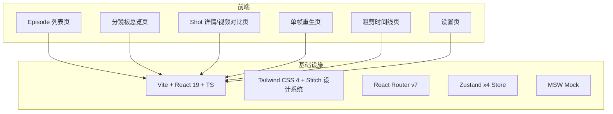
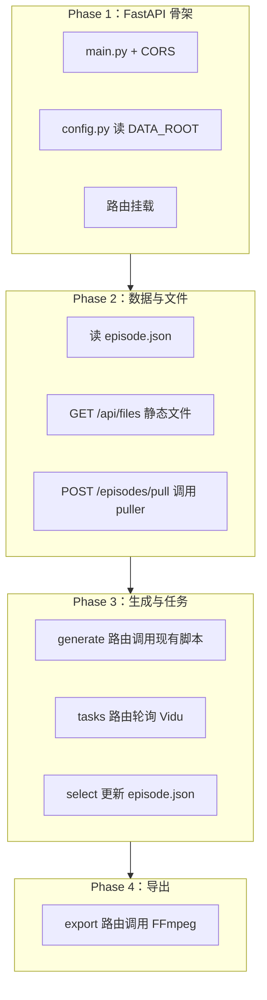

# 前端完成总结与后端改造指南

> **目的**：前端 FV Studio 已完成 Stitch 报纸风格迁移与全部功能实现，本文档总结当前状态并提供后端改造指引，便于下一步对接。

---

## 一、前端改造完成情况

### 1.1 已完成功能一览



| 模块 | 状态 | 说明 |
|------|------|------|
| Episode 列表 | ✅ | Bento 卡片、从平台拉取弹窗、进度统计 |
| 分镜板总览 | ✅ | Scene 分组、ShotCard/ShotRow、状态筛选、批量操作、网格/列表视图 |
| Shot 详情 | ✅ | 首尾帧、视频候选、选定、前后 Shot 导航 |
| 单帧重生 | ✅ | Prompt 编辑、资产多选、生成、级联确认 |
| 粗剪时间线 | ✅ | 视频预览、多轨拖拽（@dnd-kit）、导出 |
| 设置页 | ✅ | API 地址、默认参数、连接测试 |
| 任务轮询 | ✅ | useTaskPolling 每 3 秒轮询 |
| 键盘快捷键 | ✅ | 方向键、Enter、Space、1-9 |
| Stitch 报纸风格 | ✅ | 0px 圆角、硬阴影、点阵背景、灰度图、Manrope+Inter |

### 1.2 技术栈

- **框架**：Vite + React 19 + TypeScript
- **样式**：Tailwind CSS 4，Stitch 设计系统（`#F9F9F7` 纸张色、`#111111` 墨色、`#168866` 翡翠绿）
- **路由**：React Router v7
- **状态**：Zustand（episodeStore、shotStore、taskStore、uiStore）
- **Mock**：MSW 拦截 `/api/*`，后台未就绪时返回模拟数据

### 1.3 项目路径

```
web/frontend/
├── src/
│   ├── api/              # API 调用层
│   │   ├── client.ts     # Axios baseURL /api
│   │   ├── episodes.ts
│   │   ├── shots.ts
│   │   ├── generate.ts
│   │   ├── tasks.ts
│   │   └── export.ts
│   ├── types/            # episode.ts + api.ts
│   ├── stores/           # Zustand
│   ├── components/       # UI + 业务组件
│   ├── pages/            # 6 个页面
│   ├── mocks/            # MSW handlers
│   └── utils/file.ts     # getFileUrl → /api/files/{path}
```

---

## 二、前端期望的后端 API 契约

前端通过 Vite proxy 将 `/api` 代理到 `http://localhost:8000`，即所有请求实际发往 `http://localhost:8000/api/...`。

### 2.1 API 总览

| 方法 | 路径 | 用途 |
|------|------|------|
| GET | `/api/episodes` | 列出本地已拉取 Episode |
| GET | `/api/episodes/:id` | 获取单个 Episode 详情 |
| POST | `/api/episodes/pull` | 从平台拉取 Episode |
| GET | `/api/episodes/:id/shots` | 获取 Episode 下所有 Shot（扁平或按 Scene） |
| GET | `/api/episodes/:id/shots/:shotId` | 获取单个 Shot |
| PATCH | `/api/episodes/:id/shots/:shotId` | 更新 Shot |
| POST | `/api/episodes/:id/shots/:shotId/select` | 选定视频候选 |
| POST | `/api/generate/endframe` | 批量生成尾帧 |
| POST | `/api/generate/video` | 批量生成视频 |
| POST | `/api/generate/regen-frame` | 单帧重生 |
| GET | `/api/tasks/:taskId` | 查询单个任务状态 |
| GET | `/api/tasks/batch?ids=id1,id2,...` | 批量查询任务状态 |
| POST | `/api/export/rough-cut` | 导出粗剪 |
| GET | `/api/files/{path}` | 静态文件代理（首帧、尾帧、资产、视频） |

### 2.2 请求/响应结构

#### Episode

```json
{
  "projectId": "proj-uuid",
  "episodeId": "ep-uuid",
  "episodeTitle": "第2集",
  "episodeNumber": 2,
  "pulledAt": "2026-03-19T10:00:00Z",
  "scenes": [
    {
      "sceneId": "scene-uuid",
      "sceneNumber": 1,
      "title": "废弃仓库外",
      "shots": [...]
    }
  ]
}
```

#### Shot（含视频候选、资产）

```json
{
  "shotId": "shot-uuid",
  "shotNumber": 1,
  "imagePrompt": "...",
  "videoPrompt": "...",
  "duration": 5,
  "cameraMovement": "push_in",
  "aspectRatio": "9:16",
  "firstFrame": "frames/S01.png",
  "endFrame": "endframes/S01_end.png",
  "status": "endframe_done",
  "assets": [
    {
      "assetId": "asset-uuid",
      "name": "达里尔",
      "type": "character",
      "localPath": "assets/达里尔.png",
      "prompt": "..."
    }
  ],
  "videoCandidates": [
    {
      "id": "candidate-uuid",
      "videoPath": "videos/S01/v1.mp4",
      "thumbnailPath": "videos/S01/v1_thumb.png",
      "seed": 12345,
      "model": "viduq2-pro-fast",
      "mode": "first_last_frame",
      "selected": true,
      "createdAt": "2026-03-19T10:30:00Z",
      "taskId": "task-uuid",
      "taskStatus": "success"
    }
  ]
}
```

#### ShotStatus 枚举

```
pending | endframe_generating | endframe_done | video_generating | video_done | selected | error
```

#### POST /api/episodes/pull

**请求**：`{ "episodeId": "ep-uuid" }`  
**响应**：返回完整 `Episode` 对象

#### POST /api/generate/endframe

**请求**：
```json
{
  "episodeId": "ep-uuid",
  "shotIds": ["shot-uuid-1", "shot-uuid-2"]
}
```

**响应**：
```json
{
  "taskId": "task-uuid",
  "shotId": "shot-uuid-1"
}
```

> 批量生成时，前端会多次调用或后端支持一次返回多个 task，实际前端按 shotIds 逐-shot 或批量调用，需与后端约定。

#### POST /api/generate/video

**请求**：
```json
{
  "episodeId": "ep-uuid",
  "shotIds": ["shot-uuid-1"],
  "mode": "first_frame" | "first_last_frame" | "reference",
  "model": "viduq2-pro-fast",
  "duration": 5
}
```

**响应**：
```json
{
  "tasks": [
    { "taskId": "task-uuid", "shotId": "shot-uuid-1" }
  ]
}
```

#### POST /api/generate/regen-frame

**请求**：
```json
{
  "episodeId": "ep-uuid",
  "shotId": "shot-uuid",
  "imagePrompt": "修改后的 prompt 文本",
  "assetIds": ["asset-uuid-1", "asset-uuid-2"]
}
```

**响应**：
```json
{
  "taskId": "task-uuid",
  "shotId": "shot-uuid",
  "newFramePath": "frames/S01.png"
}
```

#### POST /api/episodes/:id/shots/:shotId/select

**请求**：`{ "candidateId": "candidate-uuid" }`  
**响应**：返回更新后的完整 `Shot`

#### GET /api/tasks/:taskId 与 GET /api/tasks/batch?ids=...

**响应**（单个）：
```json
{
  "taskId": "task-uuid",
  "status": "pending" | "processing" | "success" | "failed",
  "progress": 50,
  "result": { ... },
  "error": "错误信息（失败时）"
}
```

**响应**（batch）：返回 `TaskStatusResponse[]` 数组

#### POST /api/export/rough-cut

**请求**：
```json
{
  "episodeId": "ep-uuid",
  "shotIds": ["id1", "id2"]
}
```

**响应**：
```json
{
  "exportPath": "data/proj/ep02/export/episode_rough.mp4"
}
```

#### GET /api/files/{path}

- **path**：相对于 `data/{projectId}/{episodeId}/` 的路径，如 `frames/S01.png`、`assets/达里尔.png`
- 前端调用：`getFileUrl(relativePath, basePath)` → `/api/files/{projectId}/{episodeId}/{relativePath}`
- 后端需：根据 `DATA_ROOT` 拼接完整路径并流式返回文件内容

---

## 三、本地数据目录与 episode.json

### 3.1 目录结构（与平台辅助计划一致）

```
data/
└── {projectId}/
    └── {episodeId}/
        ├── episode.json
        ├── frames/           # 首帧 S01.png, S02.png
        ├── assets/           # 资产图
        ├── endframes/        # 尾帧 S01_end.png
        ├── videos/           # videos/S01/v1.mp4, selected.mp4
        └── export/           # episode_rough.mp4
```

### 3.2 episode.json 核心字段

后端读写 `episode.json` 时需保持与前端类型一致：

- `projectId`, `episodeId`, `episodeTitle`, `episodeNumber`, `pulledAt`
- `scenes[].sceneId`, `sceneNumber`, `title`, `shots`
- `shots[].shotId`, `shotNumber`, `imagePrompt`, `videoPrompt`, `duration`, `cameraMovement`, `aspectRatio`
- `shots[].firstFrame`, `endFrame`, `status`, `assets`, `videoCandidates`
- `videoCandidates[].id`, `videoPath`, `selected`, `taskId`, `taskStatus`

---

## 四、后端改造待办清单

### 4.1 流程图



### 4.2 建议后端目录结构

```
web/
├── frontend/                 # 已有
└── server/
    ├── main.py              # FastAPI 入口，uvicorn
    ├── config.py            # DATA_ROOT, FEELING_API_BASE 等
    ├── routes/
    │   ├── episodes.py      # GET list/detail, POST pull
    │   ├── shots.py         # GET, PATCH, POST select
    │   ├── generate.py      # endframe, video, regen-frame
    │   ├── tasks.py         # GET status, batch
    │   ├── export.py        # POST rough-cut
    │   └── files.py         # GET /api/files/*
    ├── services/
    │   ├── data_service.py  # 读写 episode.json、扫描 data/
    │   ├── vidu_service.py # 封装 ViduClient
    │   ├── yunwu_service.py
    │   └── ffmpeg_service.py
    └── models/
        └── schemas.py       # Pydantic 与前端类型对齐
```

### 4.3 与平台辅助计划的衔接

| 平台辅助计划 | 后端实现方式 |
|-------------|-------------|
| puller.py | `POST /episodes/pull` 内部调用 `puller.pull_episode()` |
| gen_tail.py | `POST /generate/endframe` 内部调用或 subprocess |
| batch.py | `POST /generate/video` 内部调用 |
| regen_frame.py | `POST /generate/regen-frame` 内部调用 |
| poll.py | `GET /tasks/*` 查询 Vidu 任务状态 |
| FFmpeg 拼接 | `POST /export/rough-cut` 调用 ffmpeg_service |

---

## 五、启动与联调

### 5.1 前端

```bash
cd web/frontend && npm run dev
```

- 默认代理 `/api` → `http://localhost:8000`
- 设置页可配置 API  base URL（当前为直连测试，proxy 不变）

### 5.2 后端（待实现）

```bash
cd web/server && uvicorn main:app --reload --port 8000
```

### 5.3 Mock 模式

- 前端已配置 MSW，默认拦截 `/api/*`
- 关闭 Mock：在 `main.tsx` 中注释 `worker.start()`
- 后端就绪后关闭 Mock 即可直连

---

## 六、相关文档索引

| 文档 | 说明 |
|------|------|
| `平台辅助计划.md` | 整体流程、平台拉取、本地制作、数据格式 |
| `前端改造计划.md` | Stitch 参考、改造计划、设计决策（部分已由 Stitch 完全替代） |
| `reference/frontend/stitch/fv_chronicle/DESIGN.md` | Stitch 设计系统规范 |
| `web/frontend/src/types/episode.ts` | 前端数据类型 |
| `web/frontend/src/types/api.ts` | API 请求/响应类型 |

---

## 七、总结

前端 FV Studio 已具备完整 UI 与交互，采用 Stitch 报纸风格，通过 MSW 模拟数据完成开发。下一步后端需实现上述 REST API，并保证：

1. **数据格式**：与 `episode.json` 及前端 `Episode`/`Shot` 类型一致  
2. **文件服务**：`/api/files/{path}` 正确映射到 `DATA_ROOT` 下文件  
3. **任务状态**：`/api/tasks/*` 与 Vidu 任务状态同步  
4. **拉取**：`POST /episodes/pull` 对接平台 API 并落地到本地 `data/`

完成上述对接后，即可实现「平台拉取 → 本地生成 → 前端操作」的完整闭环。
