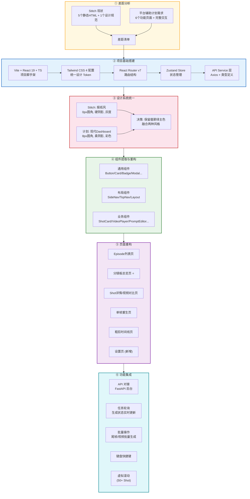
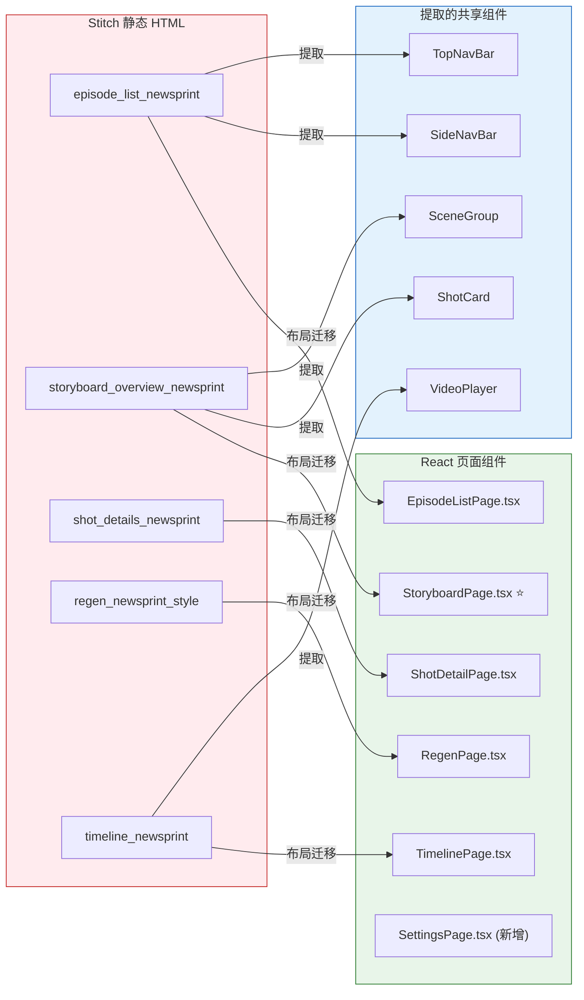
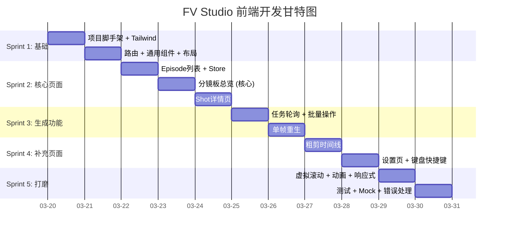

# Stitch 参考前端 → FV Studio 前端改造计划

> **一句话**：`reference/frontend/stitch` 提供了 5 个高保真静态 HTML 页面（报纸编辑风格），
> 需要将其**重构为 React 19 组件化项目**，并补齐 API 对接、状态管理、交互逻辑等全部缺失模块。

---

## 一、改造总流程图



---

## 二、Stitch 现状盘点

### 2.1 文件清单

| 文件 | 页面 | 内容 |
|------|------|------|
| `episode_list_newsprint/code.html` | Episode 列表 | Bento 风格卡片，进度统计 |
| `storyboard_overview_newsprint/code.html` | 分镜板总览 | Scene 分组展示 Shot 卡片 |
| `shot_details_newsprint/code.html` | Shot 详情 | 首尾帧展示 + 候选视频对比 |
| `regen_newsprint_style/code.html` | 单帧重生 | Modal：原图 + prompt编辑 + 资产选择 + 候选预览 |
| `timeline_newsprint/code.html` | 时间线 | 视频播放器 + 多轨时间线 |
| `fv_chronicle/DESIGN.md` | 设计规范 | 报纸编辑风格设计系统 |

### 2.2 技术栈

| 项目 | 当前 | 目标 |
|------|------|------|
| 框架 | 纯静态 HTML | React 19 + TypeScript |
| 构建 | 无（CDN引入） | Vite |
| 样式 | Tailwind CDN + 内联配置 | Tailwind CSS 4（本地安装） |
| 图标 | Material Symbols Outlined | Lucide React |
| 字体 | Manrope + Inter + JetBrains Mono | 系统字体栈 + PingFang SC |
| 路由 | 无（`<a href="#">`） | React Router v7（文件路由） |
| 状态管理 | 无 | Zustand |
| 动画 | 无 | Framer Motion |
| API调用 | 无（纯展示） | Axios / fetch → FastAPI |

### 2.3 可复用资产

Stitch 虽然是静态 HTML，但以下**布局结构和 CSS 类名**可直接参考迁移：

| 可复用 | 说明 |
|--------|------|
| ✅ 侧边栏布局 | 固定左侧导航栏结构（Logo、导航项、状态指示） |
| ✅ 顶部导航栏 | 面包屑 + 搜索 + 用户头像 |
| ✅ Shot 卡片布局 | 缩略图 + 元数据 + 操作按钮排列 |
| ✅ 候选视频对比布局 | 左右面板：帧图信息 + 候选列表 |
| ✅ 重生 Modal 布局 | 三栏：原图 / prompt编辑 + 资产 / 候选结果 |
| ✅ 时间线轨道结构 | V1/A1/A2 多轨 + playhead |
| ✅ Tailwind 工具类 | 大部分 class 可直接迁移到 React JSX |
| ✅ 配色方案 | 翡翠绿 `#168866` 主色系完全一致 |
| ⚠️ 设计风格 | 报纸风 vs 现代风——需要决策取舍 |

---

## 三、差距分析（完整清单）

### 3.1 设计风格差异 ⚠️ 需决策

| 维度 | Stitch（报纸编辑风） | 计划（现代Dashboard风） | 建议 |
|------|---------------------|----------------------|------|
| 圆角 | `0px`（严格方角） | `8px`（卡片 12px） | **采用计划的 8px/12px** — 更友好 |
| 阴影 | 硬偏移 `4px 4px 0px 0px #111` | `shadow-sm` / `shadow-md` | **采用计划的柔阴影** — 更现代 |
| 图片 | 默认灰度，hover 彩色 | 默认彩色 | **采用计划的彩色** — 视频制作需要看色彩 |
| 背景 | 点阵纹理 `#F9F9F7` | 纯色 `#f8fafb` | **采用计划的纯色** — 更干净 |
| 字体 | Manrope + Inter + JetBrains Mono | 系统字体 + PingFang SC | **采用计划的系统字体** — 中文优先 |
| 文字 | UI 标签全大写 | 正常中文 | **采用中文** — 中文界面 |
| 边框 | 1px 实线 `#111111` | `#e5e7eb` 浅边框 | **采用计划的浅边框** — 更柔和 |
| 主色 | `#168866` ✅ 一致 | `#168866` ✅ 一致 | **保持** |
| 强调色 | `#F59E0B` ✅ 一致 | `#f59e0b` ✅ 一致 | **保持** |

> **结论**：主色系完全一致可直接复用，但设计风格以**计划书的现代 Dashboard 风**为准。
> Stitch 的报纸风格作为布局参考，不直接搬运样式细节。

### 3.2 缺失的基础设施

| 缺失项 | 优先级 | 工作量 | 说明 |
|--------|--------|--------|------|
| Vite + React 19 + TS 项目脚手架 | 🔴 P0 | 0.5h | `npm create vite@latest` + 配置 |
| Tailwind CSS 4 本地化配置 | 🔴 P0 | 0.5h | 统一 design token，替代 CDN 内联配置 |
| React Router v7 路由定义 | 🔴 P0 | 1h | 6 个路由 + Layout |
| Zustand Store 设计 | 🔴 P0 | 2h | Episode、Shot、Task、UI 四个 Store |
| API Service 层 | 🔴 P0 | 2h | 类型定义 + 请求封装 + 错误处理 |
| Vite proxy 配置 | 🔴 P0 | 0.5h | `/api` → `http://localhost:8000` |

### 3.3 缺失的页面 / 功能

| 页面 | Stitch 有? | 计划需要? | 差距 |
|------|-----------|----------|------|
| Episode 列表 | ✅ 有布局 | ✅ | 需加：API 数据加载、拉取新 Episode 弹窗、进度实时更新 |
| 分镜板总览 | ✅ 有布局 | ✅ ⭐核心 | 需加：状态筛选、批量操作、网格/列表视图切换、Scene 折叠 |
| Shot 详情 | ✅ 有布局 | ✅ | 需加：视频播放器、候选选定、生成新视频弹窗、前后 Shot 导航 |
| 单帧重生 | ✅ 有布局 | ✅ | 需加：prompt 编辑器、资产多选、生成触发、级联确认 |
| 粗剪时间线 | ✅ 有布局 | ✅ | 需加：视频预览播放、拖拽排序、导出配置、FFmpeg 触发 |
| **设置** | ❌ 无 | ✅ | **全新开发**：API 地址、默认参数、数据目录 |

### 3.4 缺失的交互功能

| 功能 | 说明 | 工作量 |
|------|------|--------|
| API 数据加载 + 加载态 | 所有页面的 skeleton / loading spinner | 2h |
| 错误处理 + Toast 通知 | 异步操作成功/失败反馈 | 1h |
| 任务状态轮询 | 尾帧/视频生成中每 3 秒轮询，状态更新后自动刷新 | 3h |
| 批量操作 | 批量生成尾帧 / 批量生成视频 / 导出粗剪 | 2h |
| 视频播放器 | HTML5 `<video>` 封装：播放/暂停/进度条/全屏 | 2h |
| 图片预览 Lightbox | 首帧/尾帧/资产图点击放大 | 1h |
| 候选视频选定 | 点击选定 → API → 更新状态 | 1h |
| 键盘快捷键 | 分镜板 ←→ 切换，Enter 进详情，Space 播放，1-9 选候选 | 2h |
| 虚拟滚动 | 50+ Shot 时列表性能优化 | 2h |
| 空状态 | 各页面无数据时的插画 + 引导 | 1h |
| 响应式适配 | 最小 1024px，最大自适应 | 2h |

### 3.5 缺失的组件

#### 通用组件（Stitch 无，需全部新建）

| 组件 | 说明 |
|------|------|
| `Button` | 主要/次要/危险/Ghost 四种变体 |
| `Badge` | 状态标签，5种颜色对应 ShotStatus |
| `Card` | 白底卡片，统一圆角和阴影 |
| `Dialog` / `Modal` | 居中弹出，遮罩层 |
| `Toast` | 右上角通知 |
| `Tooltip` | 鼠标悬停提示 |
| `Progress` | 线性进度条 + 百分比 |
| `Skeleton` | 加载骨架屏 |
| `EmptyState` | 空状态插画 + 引导 |

#### 业务组件（Stitch 有布局参考，需 React 化）

| 组件 | Stitch 参考 | 需新增逻辑 |
|------|------------|-----------|
| `ShotCard` | ✅ 有 HTML 结构 | 状态色标、操作按钮事件、视频缩略图 |
| `ShotRow` | ❌ 无 | 列表视图需全新开发 |
| `VideoPlayer` | ✅ 有播放器 UI | 实际播放控制、进度拖动 |
| `ImagePreview` | ❌ 无 | Lightbox 放大功能 |
| `PromptEditor` | ❌ 无 | textarea + 字数统计 |
| `AssetTag` | ❌ 无 | 图标区分类型 + 名字 |
| `AssetSelector` | ❌ 无 | 缩略图 + 复选框多选 |
| `StatusIndicator` | ✅ 有状态圆点 | 脉冲动画 |
| `SceneGroup` | ✅ 有 Scene 分组 | 折叠展开交互 |
| `TimelineTrack` | ✅ 有轨道结构 | 拖拽排序 |
| `TimelineClip` | ✅ 有片段色块 | duration 比例宽度计算 |
| `SideNavBar` | ✅ 有完整布局 | 折叠切换（240px ↔ 64px）、任务数 badge |
| `TopNavBar` | ✅ 有面包屑结构 | 动态面包屑、搜索功能 |

---

## 四、技术方案

### 4.1 项目结构

```
web/frontend/
├── index.html
├── package.json
├── vite.config.ts               # proxy → localhost:8000
├── tailwind.config.ts           # 统一 design token
├── tsconfig.json
├── src/
│   ├── main.tsx                 # 入口
│   ├── App.tsx                  # 路由 + Layout
│   ├── types/                   # 类型定义
│   │   ├── episode.ts           # Episode / Scene / Shot / VideoCandidate
│   │   └── api.ts               # API 请求/响应类型
│   ├── api/                     # API 服务层
│   │   ├── client.ts            # Axios 实例 + 拦截器
│   │   ├── episodes.ts          # Episode CRUD
│   │   ├── shots.ts             # Shot 操作
│   │   ├── generate.ts          # 生成操作（尾帧/视频/重生）
│   │   ├── tasks.ts             # 任务状态查询
│   │   └── export.ts            # 粗剪导出
│   ├── stores/                  # Zustand 状态管理
│   │   ├── episodeStore.ts      # Episode 列表 + 当前 Episode
│   │   ├── shotStore.ts         # Shot 列表 + 筛选 + 选中
│   │   ├── taskStore.ts         # 进行中的任务 + 轮询逻辑
│   │   └── uiStore.ts           # 侧边栏折叠、视图模式、弹窗状态
│   ├── hooks/                   # 自定义 Hooks
│   │   ├── useTaskPolling.ts    # 任务状态轮询（3秒间隔）
│   │   ├── useKeyboard.ts       # 键盘快捷键
│   │   └── useVirtualScroll.ts  # 虚拟滚动
│   ├── components/              # 组件
│   │   ├── ui/                  # 通用 UI 组件
│   │   │   ├── Button.tsx
│   │   │   ├── Badge.tsx
│   │   │   ├── Card.tsx
│   │   │   ├── Dialog.tsx
│   │   │   ├── Toast.tsx
│   │   │   ├── Tooltip.tsx
│   │   │   ├── Progress.tsx
│   │   │   ├── Skeleton.tsx
│   │   │   └── EmptyState.tsx
│   │   ├── layout/              # 布局组件
│   │   │   ├── SideNavBar.tsx   # 参考 Stitch 侧边栏
│   │   │   ├── TopNavBar.tsx    # 参考 Stitch 顶栏
│   │   │   └── AppLayout.tsx    # 主布局容器
│   │   └── business/            # 业务组件
│   │       ├── ShotCard.tsx     # 参考 Stitch shot 卡片
│   │       ├── ShotRow.tsx      # 列表视图行
│   │       ├── VideoPlayer.tsx  # 参考 Stitch 播放器
│   │       ├── ImagePreview.tsx
│   │       ├── PromptEditor.tsx
│   │       ├── AssetTag.tsx
│   │       ├── AssetSelector.tsx
│   │       ├── StatusIndicator.tsx
│   │       ├── SceneGroup.tsx   # 参考 Stitch scene 分组
│   │       ├── TimelineTrack.tsx # 参考 Stitch 时间线
│   │       └── TimelineClip.tsx
│   ├── pages/                   # 页面
│   │   ├── EpisodeListPage.tsx  # 参考 Stitch episode_list
│   │   ├── StoryboardPage.tsx   # 参考 Stitch storyboard_overview
│   │   ├── ShotDetailPage.tsx   # 参考 Stitch shot_details
│   │   ├── RegenPage.tsx        # 参考 Stitch regen
│   │   ├── TimelinePage.tsx     # 参考 Stitch timeline
│   │   └── SettingsPage.tsx     # 全新开发
│   └── utils/                   # 工具函数
│       ├── format.ts            # 时间/状态格式化
│       └── file.ts              # 文件路径处理
└── public/
    └── logo.svg
```

### 4.2 路由结构

```typescript
// React Router v7 路由定义
const routes = [
  {
    path: '/',
    element: <AppLayout />,
    children: [
      { index: true, element: <EpisodeListPage /> },             // Episode 列表
      { path: 'episode/:episodeId', element: <StoryboardPage /> }, // 分镜板总览 ⭐
      { path: 'episode/:episodeId/shot/:shotId', element: <ShotDetailPage /> },
      { path: 'episode/:episodeId/shot/:shotId/regen', element: <RegenPage /> },
      { path: 'episode/:episodeId/timeline', element: <TimelinePage /> },
      { path: 'settings', element: <SettingsPage /> },
    ],
  },
];
```

### 4.3 Zustand Store 设计

```typescript
// episodeStore.ts — Episode 状态管理
interface EpisodeStore {
  episodes: Episode[];           // 所有已拉取的 Episode
  currentEpisode: Episode | null;
  loading: boolean;
  error: string | null;
  fetchEpisodes: () => Promise<void>;
  fetchEpisodeDetail: (id: string) => Promise<void>;
  pullNewEpisode: (episodeId: string) => Promise<void>;
}

// shotStore.ts — Shot 状态管理
interface ShotStore {
  shots: Shot[];
  filteredShots: Shot[];
  statusFilter: ShotStatus | 'all';
  viewMode: 'grid' | 'list';
  setFilter: (status: ShotStatus | 'all') => void;
  setViewMode: (mode: 'grid' | 'list') => void;
  selectCandidate: (shotId: string, candidateId: string) => Promise<void>;
}

// taskStore.ts — 任务轮询管理
interface TaskStore {
  activeTasks: Map<string, TaskStatus>;
  startPolling: (taskIds: string[]) => void;
  stopPolling: () => void;
}

// uiStore.ts — UI 状态
interface UIStore {
  sidebarCollapsed: boolean;
  activeModal: string | null;
  toggleSidebar: () => void;
  openModal: (id: string) => void;
  closeModal: () => void;
}
```

### 4.4 API 层对接

```typescript
// api/client.ts — Axios 实例
import axios from 'axios';

// Vite proxy 会将 /api 代理到 http://localhost:8000
const apiClient = axios.create({
  baseURL: '/api',
  timeout: 30000,
});

// api/episodes.ts
export const episodesApi = {
  list: () => apiClient.get<Episode[]>('/episodes'),
  detail: (id: string) => apiClient.get<Episode>(`/episodes/${id}`),
  pull: (episodeId: string) => apiClient.post<Episode>('/episodes/pull', { episodeId }),
};

// api/generate.ts
export const generateApi = {
  endframe: (episodeId: string, shotIds: string[]) =>
    apiClient.post('/generate/endframe', { episodeId, shotIds }),
  video: (params: VideoGenerateParams) =>
    apiClient.post('/generate/video', params),
  regenFrame: (params: RegenFrameParams) =>
    apiClient.post('/generate/regen-frame', params),
};

// api/tasks.ts
export const tasksApi = {
  status: (taskId: string) => apiClient.get<TaskStatus>(`/tasks/${taskId}`),
  batchStatus: (ids: string[]) => apiClient.get<TaskStatus[]>(`/tasks/batch?ids=${ids.join(',')}`),
};
```

---

## 五、Stitch → React 页面迁移映射

### 5.1 迁移策略



### 5.2 逐页迁移要点

#### Episode 列表 (`episode_list_newsprint` → `EpisodeListPage.tsx`)

| Stitch 可用 | 需新增 |
|-------------|--------|
| ✅ Bento 卡片网格布局 | ➕ API: `GET /api/episodes` 数据加载 |
| ✅ 进度条 + 统计数字 | ➕ 拉取新 Episode 的 Dialog (输入 episodeId) |
| ✅ 侧边栏 + 顶栏 | ➕ Loading Skeleton |
| | ➕ 空状态引导 |
| | ➕ 卡片点击路由跳转 |

#### 分镜板总览 (`storyboard_overview_newsprint` → `StoryboardPage.tsx`) ⭐

| Stitch 可用 | 需新增 |
|-------------|--------|
| ✅ Scene 分组展示 | ➕ API: `GET /api/episodes/:id` 完整数据加载 |
| ✅ Shot 缩略图卡片 | ➕ 状态筛选栏（全部/待处理/尾帧完成/视频完成/已选定） |
| ✅ 状态 badge | ➕ 批量操作按钮组（生成尾帧/生成视频/导出） |
| | ➕ 网格/列表视图切换 |
| | ➕ Scene 折叠/展开 |
| | ➕ ShotCard 状态色标 + 脉冲动画 |
| | ➕ 键盘快捷键 (←→ 切换, Enter 进详情) |
| | ➕ 任务状态实时轮询更新 |

#### Shot 详情 (`shot_details_newsprint` → `ShotDetailPage.tsx`)

| Stitch 可用 | 需新增 |
|-------------|--------|
| ✅ 左右面板布局 | ➕ API: `GET /api/episodes/:id/shots/:shotId` |
| ✅ 首尾帧展示 | ➕ 视频播放器实际播放控制 |
| ✅ 候选视频并排 | ➕ 候选选定: `POST /api/shots/:shotId/select` |
| ✅ 元数据展示 | ➕ 生成新视频弹窗（模式/模型/时长） |
| | ➕ 前后 Shot 导航箭头 |
| | ➕ 数字键 1-9 快速选定候选 |

#### 单帧重生 (`regen_newsprint_style` → `RegenPage.tsx`)

| Stitch 可用 | 需新增 |
|-------------|--------|
| ✅ Modal 三栏布局 | ➕ PromptEditor（textarea + 字数统计） |
| ✅ 原始资产展示 | ➕ AssetSelector（复选框 + 缩略图） |
| ✅ 候选预览区 | ➕ 生成触发: `POST /api/generate/regen-frame` |
| | ➕ 级联确认弹窗（清除尾帧/视频） |
| | ➕ 生成状态轮询 |

#### 粗剪时间线 (`timeline_newsprint` → `TimelinePage.tsx`)

| Stitch 可用 | 需新增 |
|-------------|--------|
| ✅ 播放器 UI | ➕ 实际视频拼接预览 |
| ✅ 多轨时间线结构 | ➕ 拖拽排序（dnd-kit 或自实现） |
| ✅ Playhead | ➕ 导出配置弹窗（分辨率/转场） |
| ✅ 片段色块 | ➕ 导出触发: `POST /api/export/rough-cut` |
| | ➕ 导出进度显示 |

#### 设置 (全新 → `SettingsPage.tsx`)

| 需开发 |
|--------|
| ➕ API 地址配置（默认 http://localhost:8000） |
| ➕ 默认视频生成参数（模型、时长、分辨率） |
| ➕ 尾帧生成参数（yunwu 模型、图片尺寸） |
| ➕ 数据目录路径显示 |
| ➕ 后台连接状态测试 |

---

## 六、Design Token 统一配置

```typescript
// tailwind.config.ts
export default {
  content: ['./src/**/*.{ts,tsx}'],
  theme: {
    extend: {
      colors: {
        // 主色系（Stitch 与计划一致 ✅）
        primary: {
          DEFAULT: '#168866',
          light: '#1da87e',
          dark: '#0f6b50',
          50: '#e6f5ef',
        },
        // 功能色
        accent: '#f59e0b',     // 琥珀色（一致 ✅）
        error: '#ef4444',
        success: '#168866',    // 复用主色
        // 中性色（采用计划的现代方案）
        surface: '#f8fafb',    // 页面底色
        card: '#ffffff',       // 卡片底色
        ink: '#1a1a2e',        // 文字主色
        muted: '#6b7280',      // 文字次要色
        border: '#e5e7eb',     // 边框色
        divider: '#f0f0f0',    // 分割线
      },
      borderRadius: {
        // 采用计划的圆角（而非 Stitch 的 0px）
        DEFAULT: '8px',
        lg: '12px',
        xl: '16px',
      },
      fontFamily: {
        sans: ['"PingFang SC"', '"Microsoft YaHei"', 'system-ui', 'sans-serif'],
        mono: ['"JetBrains Mono"', '"Fira Code"', 'monospace'],
      },
      boxShadow: {
        // 采用计划的柔阴影（而非 Stitch 的硬偏移）
        sm: '0 1px 2px 0 rgb(0 0 0 / 0.05)',
        DEFAULT: '0 1px 3px 0 rgb(0 0 0 / 0.1)',
        md: '0 4px 6px -1px rgb(0 0 0 / 0.1)',
      },
    },
  },
};
```

---

## 七、开发计划（Phase 3 前端细分）

> 总工期预估：**5 ~ 7 个工作日**

### Sprint 1：基础搭建（Day 1）

| 任务 | 工时 | 说明 |
|------|------|------|
| Vite + React 19 + TS 脚手架 | 0.5h | 项目初始化、依赖安装 |
| Tailwind CSS 4 配置 | 0.5h | design token、全局样式 |
| React Router v7 路由 | 1h | 6 个路由 + AppLayout |
| 通用 UI 组件 | 3h | Button/Card/Badge/Dialog/Toast/Progress/Skeleton/EmptyState |
| 布局组件 | 2h | SideNavBar + TopNavBar（从 Stitch 迁移布局） |
| API client 基础 | 1h | Axios 实例 + 类型定义 |

**产出**：可运行的空壳项目，有侧边栏和路由导航。

### Sprint 2：核心页面（Day 2-3）

| 任务 | 工时 | 说明 |
|------|------|------|
| Episode 列表页 | 3h | 卡片网格 + 拉取弹窗 + API 对接 |
| **分镜板总览页** | 6h | Shot 卡片/行 + Scene 分组 + 筛选 + 视图切换（核心页面） |
| Shot 详情页 | 4h | 左右面板 + 候选列表 + 视频播放器 |
| Zustand Store | 3h | Episode + Shot + Task + UI Store |

**产出**：能看到真实数据的三个主页面。

### Sprint 3：生成功能（Day 4）

| 任务 | 工时 | 说明 |
|------|------|------|
| 任务轮询机制 | 3h | useTaskPolling hook + 状态自动刷新 |
| 批量操作 | 2h | 批量生成尾帧 / 视频的 API 调用 + Loading 状态 |
| 单帧重生页 | 3h | PromptEditor + AssetSelector + 生成 + 级联确认 |

**产出**：完整的生成 → 轮询 → 更新闭环。

### Sprint 4：时间线 + 设置（Day 5）

| 任务 | 工时 | 说明 |
|------|------|------|
| 粗剪时间线页 | 4h | 播放器 + 时间线 + 拖拽排序 + 导出 |
| 设置页 | 2h | 配置表单 |
| 键盘快捷键 | 2h | useKeyboard hook |

**产出**：全部 6 个页面可用。

### Sprint 5：打磨 + 优化（Day 6-7）

| 任务 | 工时 | 说明 |
|------|------|------|
| 虚拟滚动 | 2h | 50+ Shot 性能优化 |
| 动画 | 2h | Framer Motion 过渡动画 |
| 响应式适配 | 2h | 1024px 最小宽度适配 |
| 错误处理完善 | 2h | 网络错误、超时、重试 |
| Mock 数据 | 2h | 脱离后台可独立开发 |
| 整体测试 | 2h | 全流程走通 |

**产出**：生产可用的完整前端。

---

## 八、开发顺序优先级



---

## 九、Mock 数据策略

在后台 FastAPI 未就绪时，前端可独立开发：

```typescript
// src/mocks/episode.mock.ts
// 基于 episode.json schema 生成模拟数据
export const mockEpisode: Episode = {
  projectId: 'proj-demo',
  episodeId: 'ep-001',
  episodeTitle: '第2集',
  episodeNumber: 2,
  pulledAt: '2026-03-19T10:00:00Z',
  scenes: [
    {
      sceneId: 'scene-001',
      sceneNumber: 1,
      title: '废弃仓库外',
      shots: [
        {
          shotId: 'shot-001',
          shotNumber: 1,
          imagePrompt: '中景，达里尔站在废弃仓库门口...',
          videoPrompt: '镜头缓慢推进...',
          duration: 5,
          cameraMovement: 'push_in',
          aspectRatio: '9:16',
          firstFrame: 'frames/S01.png',
          assets: [],
          status: 'pending',
          endFrame: null,
          videoCandidates: [],
        },
        // ... 更多 mock shots
      ],
    },
  ],
};
```

配合 MSW (Mock Service Worker) 或 Vite 插件拦截 API 请求。

---

## 十、风险与对策

| 风险 | 影响 | 对策 |
|------|------|------|
| Stitch 布局在 React 化时丢失细节 | 中 | 逐个 HTML 对照迁移，用浏览器截图比对 |
| 设计风格融合冲突 | 低 | 以**计划书现代风**为准，Stitch 仅参考布局 |
| 后台 API 未就绪 | 中 | Mock 数据 + MSW 先行，API 协议已在计划书中定义 |
| 时间线拖拽实现复杂 | 高 | 可引入 `@dnd-kit/core` 库辅助 |
| 50+ Shot 渲染性能 | 中 | 引入 `react-virtual` 或 `@tanstack/react-virtual` |
| Tailwind CSS 4 兼容性 | 低 | 如遇问题可回退到 Tailwind 3，类名基本兼容 |

---

## 十一、依赖清单

```json
{
  "dependencies": {
    "react": "^19.0.0",
    "react-dom": "^19.0.0",
    "react-router": "^7.0.0",
    "zustand": "^5.0.0",
    "axios": "^1.7.0",
    "lucide-react": "^0.400.0",
    "framer-motion": "^12.0.0",
    "@dnd-kit/core": "^6.0.0",
    "@dnd-kit/sortable": "^8.0.0",
    "@tanstack/react-virtual": "^3.0.0"
  },
  "devDependencies": {
    "typescript": "^5.6.0",
    "vite": "^6.0.0",
    "@vitejs/plugin-react": "^4.0.0",
    "tailwindcss": "^4.0.0",
    "@tailwindcss/vite": "^4.0.0",
    "msw": "^2.0.0"
  }
}
```

---

## 十二、总结

| 维度 | 结论 |
|------|------|
| **Stitch 能提供什么** | 5 个页面的布局参考 + Tailwind 类名 + 配色方案 |
| **完全不能用的** | 无框架、无路由、无状态管理、无 API、无交互 |
| **最大差距** | 从纯展示 HTML 到可交互的 React 应用——需要全部重写逻辑层 |
| **设计决策** | 保留翡翠绿主色，样式风格以计划书的现代 Dashboard 为准 |
| **预估工期** | 5-7 天（前端部分），可与后台并行开发 |
| **关键依赖** | 后台 API 协议（已在计划书中定义）、Mock 数据（可先行） |
