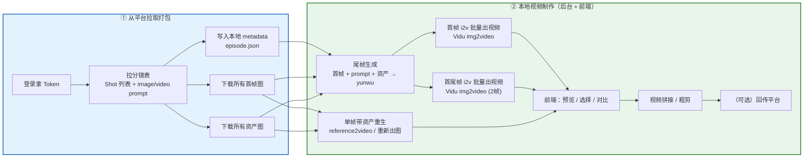
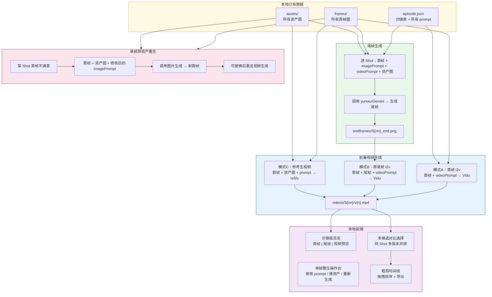
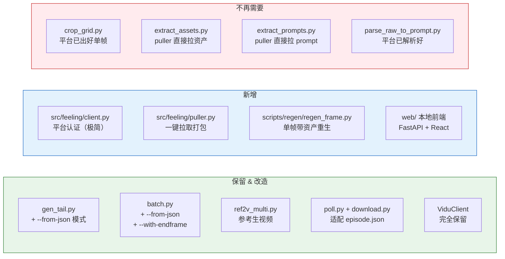

# 平台数据拉取 + 本地视频制作工作站

> **一句话**：平台上的活（剧本、分析、资产、分镜出图）别人已经做完了，  
> 我们只管把成品**打包拉下来**，然后在本地完成所有**视频制作**环节。

---

## 一、总体流程图



---

## 二、① 从平台拉取什么

平台上别人已经完成了：剧本上传 → AI 分析 → 资产建立 → 分镜生成 → 首帧出图 → 选帧确认。  
**我们只需要调 3-4 个 GET 接口，把最终成品全部拉下来。**

### 2.1 需要拉取的数据清单

| 数据 | 来源 API | 本地保存位置 |
|------|---------|------------|
| **分镜表**（Shot 列表 + scene 结构） | `GET /api/storyboard/episodes/{episodeId}/shots` | `data/{project}/{episode}/episode.json` |
| **场景列表** | `GET /api/storyboard/episodes/{episodeId}/scenes` | 合并写入 `episode.json` |
| **每个 Shot 的首帧图** | 从 Shot 数据中的图片 URL 下载 | `data/{project}/{episode}/frames/S{nn}.png` |
| **所有资产图** | `GET /api/assets/episode/{episodeId}` → 各资产图片 URL | `data/{project}/{episode}/assets/{name}.png` |
| **每个 Shot 的 image prompt** | Shot 数据中的字段 | 写入 `episode.json` 的每个 shot 内 |
| **每个 Shot 的 video prompt** | Shot 数据中的字段 | 写入 `episode.json` 的每个 shot 内 |
| **镜头运镜 / 时长等 metadata** | Shot 数据中的字段 | 写入 `episode.json` 的每个 shot 内 |
| **Shot → Asset 关联关系** | Shot 数据中的资产引用 | 写入 `episode.json` 的每个 shot 内 |

### 2.2 仅需的平台 API（只读）

```
# 1. 登录（仅此一个写接口）
POST /api/auth/login
Body: { "phone": "xxx", "password": "xxx" }
→ { "accessToken": "Bearer xxx" }

# 2. 拉分镜 Shot 列表（核心）
GET /api/storyboard/episodes/{episodeId}/shots
→ 包含每个 Shot 的 id、shotNumber、description、prompt(s)、首帧URL、关联资产

# 3. 拉场景列表
GET /api/storyboard/episodes/{episodeId}/scenes
→ Scene 分组信息，Shot 归属哪个 Scene

# 4. 拉资产列表 + 图片
GET /api/assets/episode/{episodeId}
→ 资产 id、name、type、prompt、imageUrl

# 5. （备用）刷新过期的 COS 文件 URL
GET /api/cos/refresh-url?filePath=xxx

# 6. （备用）直接下载文件
GET /api/cos/download?filePath=xxx
```

**总共就 4 个 GET + 1 个 POST（登录），极其轻量。**

### 2.3 本地 metadata 格式：`episode.json`

```json
{
  "projectId": "proj-uuid",
  "episodeId": "ep-uuid",
  "episodeTitle": "第2集",
  "episodeNumber": 2,
  "pulledAt": "2026-03-19T10:00:00Z",
  "scenes": [
    {
      "sceneId": "scene-uuid",
      "sceneNumber": 1,
      "title": "废弃仓库外",
      "shots": [
        {
          "shotId": "shot-uuid",
          "shotNumber": 1,
          "imagePrompt": "中景，达里尔站在废弃仓库门口，夕阳逆光，破碎的铁门半开...",
          "videoPrompt": "镜头缓慢推进，达里尔转身走入仓库，铁门在风中摇晃...",
          "duration": 5,
          "cameraMovement": "push_in",
          "aspectRatio": "9:16",
          "firstFrame": "frames/S01.png",
          "assets": [
            {
              "assetId": "asset-uuid",
              "name": "达里尔",
              "type": "character",
              "localPath": "assets/达里尔.png",
              "prompt": "A muscular man with short dark hair, leather vest..."
            },
            {
              "assetId": "asset-uuid-2",
              "name": "废弃仓库",
              "type": "location",
              "localPath": "assets/废弃仓库.png",
              "prompt": "An abandoned industrial warehouse..."
            }
          ],
          "status": "pending",
          "endFrame": null,
          "videoCandidates": []
        }
      ]
    }
  ]
}
```

### 2.4 本地目录结构

```
data/
└── {projectId}/
    └── {episodeId}/
        ├── episode.json          # 上面的 metadata（一切的索引）
        ├── frames/               # 首帧图
        │   ├── S01.png
        │   ├── S02.png
        │   └── ...
        ├── assets/               # 资产图
        │   ├── 达里尔.png
        │   ├── 格雷·金斯顿.png
        │   └── ...
        ├── endframes/            # 生成的尾帧（本地产出）
        │   ├── S01_end.png
        │   └── ...
        ├── videos/               # 生成的视频候选（本地产出）
        │   ├── S01/
        │   │   ├── v1.mp4
        │   │   ├── v2.mp4        # 多候选
        │   │   └── selected.mp4  # 选定的
        │   └── ...
        └── export/               # 最终拼接输出
            └── episode_rough.mp4
```

---

## 三、② 本地要做的事

### 3.1 工作流程图



### 3.2 各环节详解

#### A. 尾帧生成

- **输入**：首帧图 + imagePrompt + videoPrompt + 资产图（0-2张）
- **引擎**：yunwu Gemini（`gen_tail.py` 现有逻辑）
- **输出**：尾帧图 `endframes/S{nn}_end.png`
- **改造点**：数据源从 `prompt.md + assets_by_shot.json` 改为读 `episode.json`

#### B. 首帧 i2v 批量出视频

- **输入**：首帧图 + videoPrompt
- **引擎**：Vidu `img2video`（`batch.py` 现有逻辑）
- **输出**：`videos/S{nn}/v{n}.mp4`
- **改造点**：数据源从 `prompt.txt + group 目录` 改为读 `episode.json`

#### C. 首尾帧 i2v 批量出视频

- **输入**：首帧图 + 尾帧图 + videoPrompt
- **引擎**：Vidu `img2video`（images 传 2 张）
- **输出**：`videos/S{nn}/v{n}.mp4`
- **新增**：需要扩展 `batch.py` 或新建脚本支持双帧输入

#### D. 单帧带资产重生

- **场景**：某个 Shot 的首帧不满意，需要带着资产图重新生成
- **输入**：原首帧（参考） + 资产图 + 修改后的 imagePrompt
- **引擎**：yunwu/Gemini 图片生成 或 Vidu reference2video 的截帧
- **输出**：替换 `frames/S{nn}.png`，然后重走尾帧 + 视频流程
- **前端操作**：在前端修改 prompt → 点击「重生」→ 预览 → 确认替换

#### E. 选择 / 对比

- **每个 Shot 可能有多个视频候选**（不同 seed、不同模式）
- **前端提供**：并排预览、打分、标记 selected
- **结果写入**：`episode.json` 的 `videoCandidates[].selected = true`

#### F. 拼接 / 粗剪

- **按 Scene 顺序**串联所有 selected 视频
- **FFmpeg 拼接**：转场效果（可选）
- **输出**：`export/episode_rough.mp4`

---

## 四、需要开发的代码

### 4.1 平台数据拉取模块（极简）

```
src/feeling/
├── __init__.py
├── client.py         # HTTP 基础 + JWT 认证（仅 login + bearer header）
└── puller.py         # 核心：拉取 shots/scenes/assets → 下载图片 → 写 episode.json
```

就这 2 个文件。不需要 project/script/episode 的 CRUD——那些是平台团队的事。

**`puller.py` 的核心逻辑**：

```python
def pull_episode(episode_id: str, output_dir: Path):
    """
    一键拉取：
    1. GET /storyboard/episodes/{id}/shots → shot 列表
    2. GET /storyboard/episodes/{id}/scenes → scene 结构
    3. GET /assets/episode/{id} → 资产列表 + 图片 URL
    4. 下载所有首帧图 → frames/
    5. 下载所有资产图 → assets/
    6. 组装 episode.json 写入
    """
```

**一行命令**：

```bash
python -m src.feeling.puller --episode-id <uuid> --output data/proj/ep02
```

### 4.2 本地生成脚本（改造现有）

| 脚本 | 改动 | 说明 |
|------|------|------|
| `scripts/endframe/gen_tail.py` | 新增 `--from-json episode.json` 模式 | 从 episode.json 读取 prompt + 资产，替代 prompt.md + assets_by_shot.json |
| `scripts/i2v/batch.py` | 新增 `--from-json episode.json` 模式 | 从 episode.json 读取 shot 列表 + prompt，替代 prompt.txt + group 目录 |
| `scripts/i2v/batch.py` | 新增 `--with-endframe` 选项 | 支持首帧+尾帧双图输入 |
| **新增** `scripts/regen/regen_frame.py` | 全新 | 单帧带资产重新生成首帧图（yunwu/Gemini） |
| `scripts/task/poll.py` | 小改 | 支持从 episode.json 读取 task_id 列表 |
| `scripts/task/download.py` | 小改 | 下载到 `videos/S{nn}/` 结构 |

### 4.3 本地前端（另起项目）

```
web/
├── server/                   # Python FastAPI 后台
│   ├── main.py               # 入口，uvicorn 启动
│   ├── config.py             # 读 .env，数据目录配置
│   ├── routes/
│   │   ├── episodes.py       # GET /episodes → 列出本地已拉取的 episode
│   │   ├── shots.py          # GET /shots → 分镜表视图数据
│   │   ├── generate.py       # POST /generate/endframe, /generate/video 触发生成
│   │   ├── regen.py          # POST /regen/frame 单帧重生
│   │   ├── select.py         # POST /select 标记选中候选
│   │   └── export.py         # POST /export 拼接导出
│   ├── services/
│   │   ├── vidu_service.py   # 封装 ViduClient，读 episode.json
│   │   ├── yunwu_service.py  # 封装 yunwu 尾帧/重生
│   │   ├── ffmpeg_service.py # FFmpeg 拼接
│   │   └── data_service.py   # 读写 episode.json + 本地文件管理
│   └── models/
│       └── schemas.py        # Pydantic 数据模型
│
├── frontend/                 # 前端（React / Vue / Next.js）
│   ├── pages/
│   │   ├── EpisodeList.tsx   # Episode 选择页
│   │   ├── ShotBoard.tsx     # 分镜板总览（首帧 → 尾帧 → 视频 全流程）
│   │   ├── VideoCompare.tsx  # 多候选视频并排对比
│   │   ├── RegenPanel.tsx    # 单帧重生操作台
│   │   └── Timeline.tsx      # 粗剪时间线
│   └── components/
│       ├── ShotCard.tsx      # 单个 Shot 卡片（首帧/尾帧/视频/状态）
│       ├── VideoPlayer.tsx   # 视频播放器
│       └── PromptEditor.tsx  # Prompt 编辑器（重生时修改 prompt）
│
└── docker-compose.yml        # 一键启动 backend + frontend
```

#### 前端核心页面

**分镜板总览（ShotBoard）**：

```
┌─────────────────────────────────────────────────────┐
│ 第2集 - 场景1: 废弃仓库外                    [全部生成尾帧] │
├──────────┬──────────┬──────────┬────────────────────┤
│ Shot 1   │ Shot 2   │ Shot 3   │ Shot 4             │
│ [首帧图] │ [首帧图] │ [首帧图] │ [首帧图]           │
│ [尾帧图] │ [待生成] │ [尾帧图] │ [待生成]           │
│ [▶ 视频] │ [待生成] │ [▶ v1]  │ [待生成]           │
│          │          │ [▶ v2]  │                    │
│ ✅ 已选   │ ⏳ 等待  │ 🔄 选择  │ ⏳ 等待             │
│ [重生]   │ [重生]   │ [重生]   │ [重生]             │
└──────────┴──────────┴──────────┴────────────────────┘
```

**单帧重生操作台（RegenPanel）**：

```
┌──────────────────────────────────────────────┐
│ Shot 3 - 重新生成首帧                         │
├─────────────────┬────────────────────────────┤
│ 当前首帧        │ Image Prompt (可编辑)       │
│ [S03.png]       │ ┌──────────────────────┐   │
│                 │ │中景，达里尔站在...     │   │
│ 关联资产        │ │                      │   │
│ [✓] 达里尔      │ └──────────────────────┘   │
│ [✓] 废弃仓库    │                            │
│ [ ] 格雷        │ [生成新首帧]               │
│                 │                            │
│ 新生成候选      │ 选中后自动：               │
│ [候选1] [候选2] │ → 重新生成尾帧             │
│                 │ → 重新生成视频             │
└─────────────────┴────────────────────────────┘
```

---

## 五、.env 新增配置

```env
# ========== Feeling Video 平台（仅用于拉取数据） ==========
FEELING_API_BASE=https://dev-video-server.feeling.ltd/api
FEELING_PHONE=your_phone_number
FEELING_PASSWORD=your_password

# ========== 已有配置（保持不变） ==========
VIDU_API_KEY=xxx
YUNWU_API_KEY=xxx

# ========== 本地工作站 ==========
# 数据根目录（拉取的分镜数据 + 本地生成物）
DATA_ROOT=./data
# 本地前端端口
WEB_PORT=8080
```

---

## 六、开发计划

### Phase 1：拉取打包（0.5 天）

| 任务 | 文件 | 说明 |
|------|------|------|
| 平台认证客户端 | `src/feeling/client.py` | login → JWT → 自动刷新 |
| 一键拉取脚本 | `src/feeling/puller.py` | 拉 shots + scenes + assets → 下载图片 → 写 episode.json |

**完成标准**：`python -m src.feeling.puller --episode-id xxx` 后，本地 `data/` 目录下有完整的首帧图、资产图、episode.json。

### Phase 2：改造现有生成脚本（1 天）

| 任务 | 文件 | 说明 |
|------|------|------|
| gen_tail.py 适配 | `scripts/endframe/gen_tail.py` | 新增 `--from-json` 模式 |
| batch.py 适配 | `scripts/i2v/batch.py` | 新增 `--from-json` + `--with-endframe` |
| 单帧重生脚本 | `scripts/regen/regen_frame.py` | 新增：带资产重新生成首帧 |
| poll/download 适配 | `scripts/task/` | 支持 episode.json 中的 task_id |

**完成标准**：纯命令行即可完成「拉取 → 尾帧 → 出视频 → 下载」全流程。

### Phase 3：本地前端（3-5 天）

| 任务 | 说明 |
|------|------|
| FastAPI 后台 | 读 episode.json，提供 REST API |
| 分镜板总览页 | 每个 Shot 的首帧/尾帧/视频/状态一目了然 |
| 批量操作 | 一键生成所有尾帧、一键批量出视频 |
| 多候选对比 | 同 Shot 多版本视频并排播放 |
| 单帧重生 | 修改 prompt + 选资产 → 生成新首帧 → 级联重生尾帧/视频 |
| 粗剪导出 | 拖拽排序 → FFmpeg 拼接输出 |

---

## 七、与现有脚本的关系



**关键变化**：
- `crop_grid.py`、`extract_assets.py`、`extract_prompts.py`、`parse_raw_to_prompt.py` → **不需要了**，平台已经做好了这些事
- `gen_tail.py`、`batch.py` → **小改**，增加从 `episode.json` 读数据的模式
- `puller.py` → **新增**，一键从平台拉取所有数据
- `regen_frame.py` → **新增**，单帧带资产重生
- `web/` → **新增**，本地前端

---

## 八、风险 & 注意

| 问题 | 方案 |
|------|------|
| 平台 Shot 数据结构不确定 | 先跑一次真实接口，看返回的 JSON 结构，再定 episode.json 格式 |
| COS 图片 URL 有效期 | 拉取时直接下载到本地，不依赖在线 URL |
| 首帧图分辨率/尺寸不一 | puller 下载时记录原始尺寸到 metadata，生成时按需缩放 |
| 大批量 Shot（50+）并发 Vidu | 本地令牌桶限速，Vidu QPS 可控 |
| 单帧重生后需要级联更新 | 前端触发重生后，自动清除该 Shot 的尾帧 + 视频，标记为待重生 |

---

## 九、参考 API

| 用途 | 接口 |
|------|------|
| 登录 | `POST /api/auth/login` |
| 拉 Shot 列表 | `GET /api/storyboard/episodes/{episodeId}/shots` |
| 拉场景列表 | `GET /api/storyboard/episodes/{episodeId}/scenes` |
| 拉资产列表 | `GET /api/assets/episode/{episodeId}` |
| 刷新 URL | `GET /api/cos/refresh-url?filePath=xxx` |
| Swagger | https://dev-video-server.feeling.ltd/api-docs |
