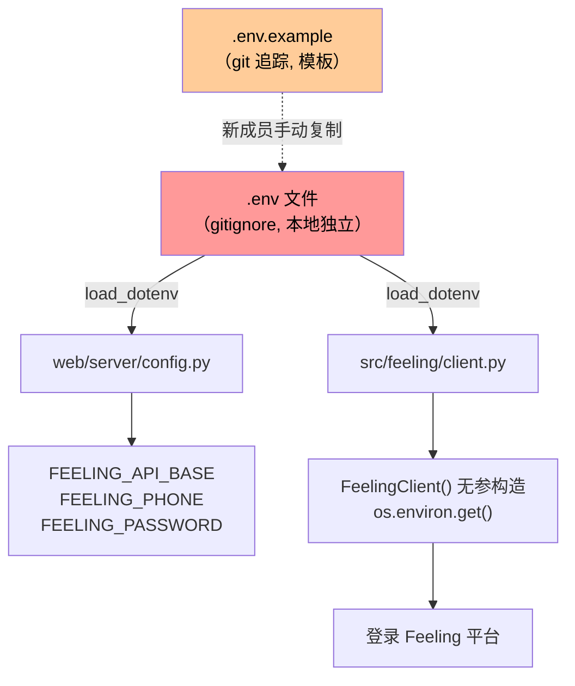
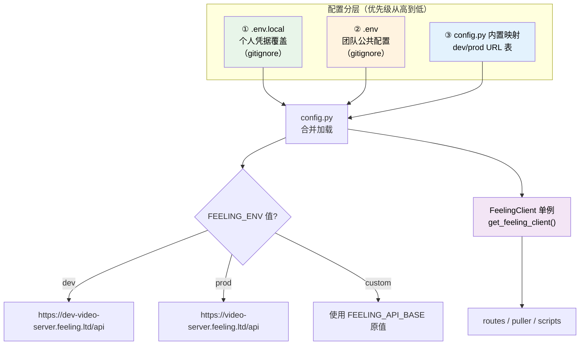
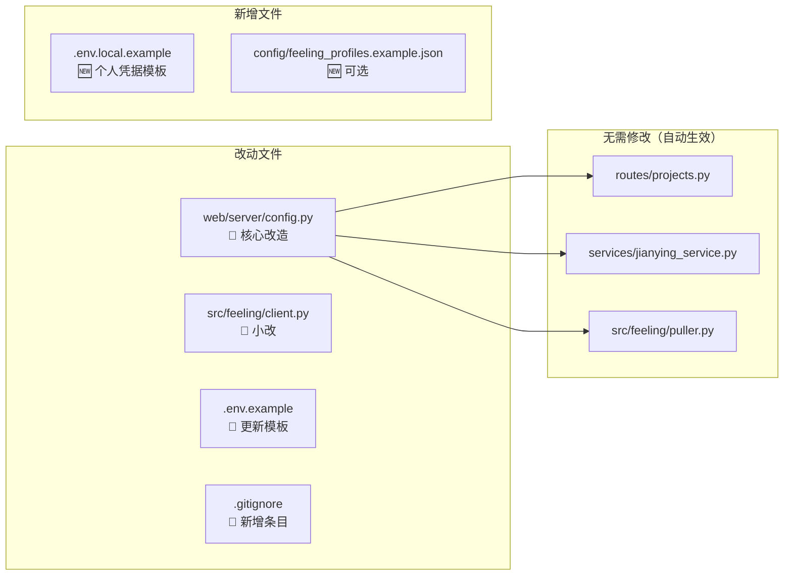
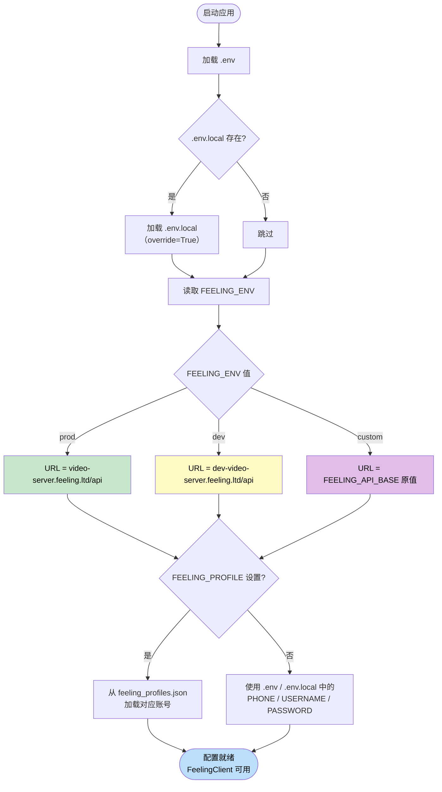

# 环境切换 & 多用户凭据管理方案

> 解决「不同机器/不同成员环境不一致」「无法在 dev/prod 之间快速切换」「换账号需要手改多行 .env」的问题。

**收尾与手工验收**：见 [联调验收清单.md](./联调验收清单.md)（凭据 Keychain 现状、必测三条、CI 覆盖边界）。

---

## 1. 现状问题分析

### 1.1 当前架构



### 1.2 痛点

| 编号 | 问题 | 根因 |
|------|------|------|
| P1 | 别人机器已切生产，你的还是测试 | `.env` 在 `.gitignore`，无法通过 `git pull` 同步 |
| P2 | `.env.example` 写死 dev URL | 新成员 clone 后直接复制就连错环境 |
| P3 | 切环境需要手动改 URL | 容易拼写错误，且不知道生产 URL 是什么 |
| P4 | 换账号需要改 3 个字段 | `FEELING_PHONE` / `FEELING_USERNAME` / `FEELING_PASSWORD` 全部要改 |
| P5 | `FeelingClient()` 在 6+ 处无参调用 | 没有统一的「当前环境/当前用户」入口 |

### 1.3 受影响的代码调用链

以下位置均使用 `FeelingClient()` 无参构造（直接读 `.env` 环境变量）：

| 文件 | 调用位置 |
|------|----------|
| `web/server/routes/projects.py` | `list_projects()` / `get_project_detail()` / `list_project_episodes()` |
| `web/server/services/jianying_service.py` | 获取项目标题 |
| `src/feeling/puller.py` | `pull_episode()` / `pull_project()` |
| `scripts/feeling/full_pipeline.py` | CLI 全量流水线 |

---

## 2. 方案设计

### 2.1 整体架构



### 2.2 核心设计：`FEELING_ENV` 环境变量

新增一个 `FEELING_ENV` 变量，在 `config.py` 中自动映射到对应 URL：

```python
# ---- config.py 中新增 ----

# Feeling 平台环境预设 URL 映射表
_FEELING_ENV_MAP = {
    "dev":  "https://dev-video-server.feeling.ltd/api",
    "prod": "https://video-server.feeling.ltd/api",
}

# 读取 FEELING_ENV，默认 prod（生产优先）
_feeling_env = os.environ.get("FEELING_ENV", "prod").lower().strip()

if _feeling_env in _FEELING_ENV_MAP:
    # 预设环境：忽略 FEELING_API_BASE，直接使用映射
    FEELING_API_BASE = _FEELING_ENV_MAP[_feeling_env]
elif _feeling_env == "custom":
    # 自定义：使用 FEELING_API_BASE 原值
    FEELING_API_BASE = os.environ.get("FEELING_API_BASE", "")
else:
    # 兜底：当作 prod
    FEELING_API_BASE = _FEELING_ENV_MAP.get(_feeling_env, _FEELING_ENV_MAP["prod"])

# 记录当前环境名称，供日志 / 前端显示
FEELING_ENV = _feeling_env if _feeling_env in _FEELING_ENV_MAP else "custom"
```

**用法**：`.env` 中只需一行即可切换：

```env
# 切到生产
FEELING_ENV=prod

# 切到测试
FEELING_ENV=dev

# 自定义 URL（例如 staging）
FEELING_ENV=custom
FEELING_API_BASE=https://staging-video-server.feeling.ltd/api
```

### 2.3 多用户凭据：`.env.local` 覆盖层

利用 `python-dotenv` 的 `override=True` 特性，引入第二层配置文件：

```
项目根目录/
├── .env              ← 团队公共配置（环境、COS 等），gitignore
├── .env.local        ← 个人凭据覆盖（账号密码），gitignore
├── .env.example      ← 模板，git 追踪
└── .env.local.example ← 个人凭据模板，git 追踪
```

**加载顺序**（`config.py` 改造后）：

```python
# 先加载 .env（团队公共）
load_dotenv(_PROJECT_ROOT / ".env")
# 再加载 .env.local（个人覆盖），override=True 使其优先
load_dotenv(_PROJECT_ROOT / ".env.local", override=True)
```

**效果**：

| 场景 | .env | .env.local | 最终值 |
|------|------|------------|--------|
| 团队统一用 prod | `FEELING_ENV=prod` | （不存在） | prod |
| 小明要切 dev 调试 | `FEELING_ENV=prod` | `FEELING_ENV=dev` | dev |
| 小红用自己的账号 | `FEELING_PHONE=18818272870` | `FEELING_PHONE=13900001111`<br/>`FEELING_PASSWORD=mypass123` | 小红的账号 |

### 2.4 快速切换账号的 Profile 机制（可选增强）

如果团队需要在**多个预设账号之间频繁切换**，可以用 `FEELING_PROFILE` 变量 + JSON 配置：

```
项目根目录/
└── config/
    └── feeling_profiles.json   ← gitignore，每人维护自己的
    └── feeling_profiles.example.json  ← 模板，git 追踪
```

```json
{
  "default": {
    "phone": "18818272870",
    "username": "aitoshuu",
    "password": "Feeling@123"
  },
  "zhangsan": {
    "phone": "13900001111",
    "username": "zhangsan",
    "password": "Zs@456"
  },
  "test_readonly": {
    "phone": "",
    "username": "test_viewer",
    "password": "ViewOnly@789"
  }
}
```

`.env` 中切换：

```env
FEELING_PROFILE=default     # 或 zhangsan / test_readonly
```

`config.py` 中读取：

```python
import json

_profile_name = os.environ.get("FEELING_PROFILE", "")
if _profile_name:
    _profiles_file = _PROJECT_ROOT / "config" / "feeling_profiles.json"
    if _profiles_file.exists():
        _profiles = json.loads(_profiles_file.read_text("utf-8"))
        _p = _profiles.get(_profile_name, {})
        FEELING_PHONE = _p.get("phone", FEELING_PHONE)
        FEELING_USERNAME = _p.get("username", "") or FEELING_USERNAME
        FEELING_PASSWORD = _p.get("password", FEELING_PASSWORD)
```

---

## 3. 具体改动清单

### 3.1 需要修改的文件



### 3.2 改动详情

#### ① `web/server/config.py` — 核心改造

```python
# -*- coding: utf-8 -*-
"""
应用配置：从 .env / .env.local 和环境变量读取

加载优先级（从低到高）：
1. config.py 内置默认值
2. .env 文件（团队公共配置）
3. .env.local 文件（个人覆盖，override=True）
4. 系统环境变量（最高优先级）

环境切换：
- FEELING_ENV=prod|dev|custom 控制 Feeling 平台 URL
- FEELING_PROFILE=xxx 可切换预设账号（需配合 config/feeling_profiles.json）
"""

import json
import os
import sys
from pathlib import Path

# ---------------------------------------------------------------------------
# 项目根目录
# ---------------------------------------------------------------------------
if getattr(sys, "frozen", False):
    _PROJECT_ROOT = Path(
        os.environ.get("FV_STUDIO_EXE_DIR", str(Path(sys.executable).parent))
    )
else:
    _PROJECT_ROOT = Path(__file__).resolve().parent.parent.parent

# ---------------------------------------------------------------------------
# 分层加载 .env → .env.local
# ---------------------------------------------------------------------------
try:
    from dotenv import load_dotenv

    # 第一层：团队公共配置
    load_dotenv(_PROJECT_ROOT / ".env")
    # 第二层：个人覆盖（override=True 使其优先于 .env）
    _env_local = _PROJECT_ROOT / ".env.local"
    if _env_local.exists():
        load_dotenv(_env_local, override=True)
except ImportError:
    pass

# ---------------------------------------------------------------------------
# Feeling 平台环境切换
# ---------------------------------------------------------------------------
_FEELING_ENV_MAP = {
    "dev":  "https://dev-video-server.feeling.ltd/api",
    "prod": "https://video-server.feeling.ltd/api",
}

_feeling_env = os.environ.get("FEELING_ENV", "prod").lower().strip()

if _feeling_env in _FEELING_ENV_MAP:
    FEELING_API_BASE = _FEELING_ENV_MAP[_feeling_env]
elif _feeling_env == "custom":
    FEELING_API_BASE = os.environ.get("FEELING_API_BASE", "")
else:
    FEELING_API_BASE = _FEELING_ENV_MAP.get(_feeling_env, _FEELING_ENV_MAP["prod"])

FEELING_ENV = _feeling_env if _feeling_env in ("dev", "prod", "custom") else "prod"

# ---------------------------------------------------------------------------
# Feeling 凭据（基础读取）
# ---------------------------------------------------------------------------
FEELING_PHONE = os.environ.get("FEELING_PHONE", "")
FEELING_USERNAME = os.environ.get("FEELING_USERNAME", "")
FEELING_PASSWORD = os.environ.get("FEELING_PASSWORD", "")

# ---------------------------------------------------------------------------
# 可选：Profile 账号切换
# ---------------------------------------------------------------------------
_profile_name = os.environ.get("FEELING_PROFILE", "")
if _profile_name:
    _profiles_file = _PROJECT_ROOT / "config" / "feeling_profiles.json"
    if _profiles_file.exists():
        try:
            _profiles = json.loads(_profiles_file.read_text("utf-8"))
            _p = _profiles.get(_profile_name, {})
            if _p:
                FEELING_PHONE = _p.get("phone", "") or FEELING_PHONE
                FEELING_USERNAME = _p.get("username", "") or FEELING_USERNAME
                FEELING_PASSWORD = _p.get("password", "") or FEELING_PASSWORD
        except (json.JSONDecodeError, OSError):
            pass

# ---------------------------------------------------------------------------
# 其他配置（保持不变）
# ---------------------------------------------------------------------------
_DATA_ENV = os.environ.get("DATA_ROOT", "data")
DATA_ROOT = Path(_DATA_ENV) if Path(_DATA_ENV).is_absolute() else _PROJECT_ROOT / _DATA_ENV
WEB_PORT = int(os.environ.get("WEB_PORT", "8000"))
VIDU_API_KEY = os.environ.get("VIDU_API_KEY") or os.environ.get("API_KEY", "")
YUNWU_API_KEY = os.environ.get("YUNWU_API_KEY", "")
ELEVENLABS_API_KEY = os.environ.get("ELEVENLABS_API_KEY") or os.environ.get("ELEVENLABS_KEY", "")
ELEVENLABS_BASE = os.environ.get("ELEVENLABS_BASE", "https://api.elevenlabs.io")
```

#### ② `.env.example` — 更新模板

```env
# ========== 环境切换（核心） ==========
# prod = 生产环境（默认）
# dev  = 测试环境
# custom = 使用下方 FEELING_API_BASE 自定义 URL
FEELING_ENV=prod

# 仅 FEELING_ENV=custom 时生效；dev/prod 自动映射无需填写
# FEELING_API_BASE=https://custom-video-server.example.com/api

# ========== Feeling 平台凭据 ==========
# 直接填写（如不使用 Profile 机制）
FEELING_PHONE=your_phone_number
FEELING_USERNAME=your_username
FEELING_PASSWORD=your_password

# 或使用 Profile 切换账号（需配合 config/feeling_profiles.json）
# FEELING_PROFILE=default

# ========== Vidu API ==========
VIDU_API_KEY=your_api_key_here
YUNWU_API_KEY=your_yunwu_api_key_here

# ========== 腾讯云 COS ==========
COS_SECRET_ID=your_cos_secret_id
COS_SECRET_KEY=your_cos_secret_key
COS_BUCKET=your_bucket_name
COS_REGION=ap-nanjing

# ========== 本地工作站 ==========
DATA_ROOT=./data
WEB_PORT=8000
```

#### ③ `.env.local.example` — 新增个人凭据模板

```env
# ========== 个人覆盖配置 ==========
# 此文件仅存在于你的本地，不会被 git 追踪。
# 此处的值会覆盖 .env 中的同名变量。

# 如果你需要用自己的 Feeling 账号：
# FEELING_PHONE=13900001111
# FEELING_USERNAME=my_username
# FEELING_PASSWORD=my_password

# 如果你需要切到 dev 环境（其他人用 prod）：
# FEELING_ENV=dev
```

#### ④ `.gitignore` — 新增条目

```gitignore
# （已有的 .env 规则下方追加）
.env.local
config/feeling_profiles.json
```

#### ⑤ `config/feeling_profiles.example.json` — 新增模板

```json
{
  "default": {
    "phone": "your_phone",
    "username": "your_username",
    "password": "your_password"
  },
  "another_account": {
    "phone": "",
    "username": "another_user",
    "password": "another_pass"
  }
}
```

#### ⑥ `src/feeling/client.py` — 小改（统一从 config 读取）

将 `FeelingClient.__init__` 中的 `.env` 回退改为从 `config` 模块读取：

```python
def __init__(
    self,
    base_url: str | None = None,
    phone: str | None = None,
    username: str | None = None,
    password: str | None = None,
) -> None:
    # 优先使用参数传入值 → 否则从 config 模块读取（已合并 .env + .env.local + profile）
    try:
        from web.server.config import (
            FEELING_API_BASE as _cfg_base,
            FEELING_PHONE as _cfg_phone,
            FEELING_USERNAME as _cfg_username,
            FEELING_PASSWORD as _cfg_password,
        )
    except ImportError:
        # 兜底：直接读环境变量（CLI 单独运行时）
        _cfg_base = os.environ.get("FEELING_API_BASE", "")
        _cfg_phone = os.environ.get("FEELING_PHONE", "")
        _cfg_username = os.environ.get("FEELING_USERNAME", "")
        _cfg_password = os.environ.get("FEELING_PASSWORD", "")

    self.base_url = (base_url or _cfg_base).rstrip("/")
    self._phone = phone or _cfg_phone
    self._username = username or _cfg_username
    self._password = password or _cfg_password
    # ... 其余不变
```

> **注意**：由于 `src/feeling/client.py` 也可能被 CLI 脚本直接调用（不经过 web server），
> 所以用 `try/except ImportError` 兜底。CLI 场景下 `config.py` 的 `load_dotenv` 逻辑
> 不会被触发，但 `client.py` 自身的 `load_dotenv()` 仍然会加载 `.env`。
> 要让 CLI 也支持 `FEELING_ENV` 映射，需要在 `client.py` 的模块级加入同样的映射逻辑，
> 或者将映射逻辑抽到一个独立的 `src/feeling/env.py` 工具模块中。

---

## 4. 使用指南

### 4.1 日常切换环境

```bash
# 编辑 .env，改一行即可
FEELING_ENV=prod   # 切到生产
FEELING_ENV=dev    # 切到测试
```

然后重启后端（`Ctrl+C` → `python -m web.server.main`）。

### 4.2 个人覆盖（不影响他人）

创建 `.env.local`：

```bash
cp .env.local.example .env.local
# 编辑 .env.local，填入自己的账号
```

### 4.3 切换账号（Profile 模式）

```bash
# 1. 创建 profiles 文件
cp config/feeling_profiles.example.json config/feeling_profiles.json
# 2. 编辑填入多个账号
# 3. 在 .env 或 .env.local 中切换
FEELING_PROFILE=zhangsan
```

### 4.4 验证当前环境

```bash
python -c "
from web.server.config import FEELING_API_BASE, FEELING_ENV, FEELING_PHONE
print(f'环境: {FEELING_ENV}')
print(f'URL:  {FEELING_API_BASE}')
print(f'账号: {FEELING_PHONE}')
"
```

---

## 5. 常见场景速查

| 场景 | 操作 |
|------|------|
| 全组统一切到生产 | 群里通知：`.env` 改 `FEELING_ENV=prod` |
| 我要单独用测试环境 | `.env.local` 写 `FEELING_ENV=dev` |
| 换一个 Feeling 账号 | `.env.local` 改 `FEELING_PHONE` / `FEELING_PASSWORD` |
| 频繁切账号 | 用 `feeling_profiles.json` + `FEELING_PROFILE=xxx` |
| 连接一个全新的 staging 服务器 | `FEELING_ENV=custom` + `FEELING_API_BASE=https://...` |

---

## 6. 流程图总览



---

## 7. 实施优先级

| 阶段 | 内容 | 工作量 | 效果 |
|------|------|--------|------|
| **P0（立即）** | `config.py` 加 `FEELING_ENV` 映射 + 更新 `.env.example` | 30 分钟 | 解决 dev/prod 切换问题 |
| **P1（当天）** | 支持 `.env.local` 覆盖层 + 新增 `.env.local.example` | 15 分钟 | 解决多用户凭据问题 |
| **P2（可选）** | `feeling_profiles.json` 账号 Profile 机制 | 30 分钟 | 频繁切账号场景 |
| **P3（可选）** | 后端暴露 `/api/config/feeling-env` 接口 + 前端设置页切换 | 2 小时 | 不重启切环境（运行时） |

建议先做 P0 + P1，覆盖 90% 的使用场景。
