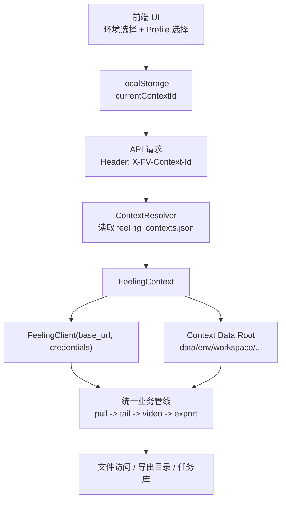

# 环境与用户上下文隔离方案

> 本文档是新的落地方案，**不替换**现有 `README.md`。  
> 目标不是“再做两条不同管线”，而是在**同一套业务管线**上，引入“环境 + 用户配置”的请求级上下文，让两套环境与多用户能够相对独立。

---

## 1. 目标定义

### 1.1 最终目标

在同一套 FV Studio 代码与流程下，支持：

- 用户先选择目标环境：`dev` / `prod` / `custom`
- 再选择该环境下的用户配置（账号 Profile）
- 后端根据当前选择，使用对应的 `baseUrl + credentials`
- 同一环境下不同用户的本地缓存、任务、导出结果尽量隔离
- 两套环境之间的数据、任务、导出结果不串

### 1.2 明确不做的事

本方案**不**默认引入完整的“平台登录账号体系”：

- 不做 App 自己的注册/登录/权限中心
- 不做 OAuth / SSO
- 不做真正的组织、租户、RBAC

本阶段只做“**上下文管理**”：

- 环境选择
- Profile 选择
- 数据命名空间隔离

如果后续需要真正的用户系统，再在本方案之上扩展。

### 1.3 成功标准

满足以下条件即视为落地成功：

- `dev` 与 `prod` 可在 UI 中切换，不需要改 `.env`
- 不同 Profile 可在 UI 中切换，不需要改 `.env`
- 相同 `episodeId` 在不同环境或不同 Profile 下不会共用同一份本地数据
- 任务队列、导出目录、文件访问路径都带上下文，不互相污染
- 同一套 `pull -> tail -> video -> export` 逻辑可复用，不拆业务管线

---

## 2. 现状问题

### 2.1 当前系统是“进程级配置”

当前实现的核心特点：

- `web/server/config.py` 在进程启动时读取 `.env`
- `src/feeling/client.py` 默认直接从环境变量拿 `FEELING_API_BASE / FEELING_USERNAME / FEELING_PASSWORD`
- 业务代码里大量 `FeelingClient()` 无参构造

这意味着：

- 配置是“全局唯一”的
- 适合单机单人
- 不适合同一个后端实例被多个人同时使用

### 2.2 当前数据是“无上下文命名空间”

当前本地数据核心路径是：

```text
data/{projectId}/{episodeId}/
```

现有问题：

- 没有 `env` 维度
- 没有 `profile` 维度
- 查找逻辑很多地方只按 `episodeId` 反查
- 归一化逻辑会主动合并同 `episodeId` 的多份副本

直接后果：

- dev / prod 可能串数据
- 不同用户配置可能串数据
- 任务状态、导出目录、文件访问可能互相覆盖

### 2.3 “切 .env”不是多用户方案

`.env` / `.env.local` 适合：

- 本地开发者自己切环境
- 本地开发者自己切账号

但它不适合：

- 共享后端实例
- 前端多个用户并发操作
- 运行时按用户选择上下文

所以这次方案不能建立在“动态改全局环境变量”之上。

---

## 3. 设计原则

### 3.1 一套管线，多套上下文

保留统一业务流程：

```text
pull -> tail -> video -> export
```

不再为 `dev` / `prod` 各写一套逻辑。  
区别只在于每次请求进入管线时，携带不同的上下文。

### 3.2 上下文必须是“请求级”，不能是“全局级”

错误做法：

- 用户 A 在前端切到 `dev`
- 后端把全局 `FEELING_ENV` 改成 `dev`
- 用户 B 同时请求 `prod`

这种做法必然互相踩。

正确做法：

- 每次请求都带 `context_id` 或 `env + profile`
- 后端在本次请求内解析上下文
- 本次请求创建自己的 `FeelingClient`
- 任务执行、数据落盘、文件读取都基于同一个上下文

### 3.3 数据隔离优先于 UI 切换

真正的独立，不是“前端看起来选了不同环境”，而是：

- 数据目录不同
- 任务记录不同
- 文件路径不同
- 导出目录不同

如果只有 UI 切换，没有数据命名空间，最终还是会串。

---

## 4. 核心方案

### 4.1 引入 Context 概念

定义一个新的业务对象：`FeelingContext`

一个 Context 表示一次完整运行所需的最小配置集合：

- `contextId`
- `envKey`
- `profileKey`
- `baseUrl`
- `identifierType`
- `identifier`
- `credentialSource`
- `workspaceKey`
- `enabled`

其中：

- `envKey` 表示目标环境，例如 `dev` / `prod`
- `profileKey` 表示该环境下的账号配置
- `workspaceKey` 表示本地隔离命名空间

### 4.2 推荐的数据结构

建议新增配置文件：

```text
config/feeling_contexts.json
```

默认推荐：`feeling_contexts.json` **不保存明文密码**，只保存映射关系与凭据引用。

结构示例：

```json
{
  "environments": {
    "dev": {
      "label": "测试环境",
      "baseUrl": "https://dev-video-server.feeling.ltd/api"
    },
    "prod": {
      "label": "生产环境",
      "baseUrl": "https://video-server.feeling.ltd/api"
    }
  },
  "profiles": {
    "dev_qa_zhangsan": {
      "label": "测试-张三",
      "envKey": "dev",
      "identifierType": "username",
      "credentialSource": {
        "type": "env",
        "identifierEnv": "FEELING_DEV_QA_ZHANGSAN_USERNAME",
        "passwordEnv": "FEELING_DEV_QA_ZHANGSAN_PASSWORD"
      },
      "workspaceKey": "dev_qa_zhangsan",
      "enabled": true
    },
    "prod_ops": {
      "label": "生产-运营",
      "envKey": "prod",
      "identifierType": "username",
      "credentialSource": {
        "type": "env",
        "identifierEnv": "FEELING_PROD_OPS_USERNAME",
        "passwordEnv": "FEELING_PROD_OPS_PASSWORD"
      },
      "workspaceKey": "prod_ops",
      "enabled": true
    }
  }
}
```

推荐配套的本地私有配置：

```env
FEELING_DEV_QA_ZHANGSAN_USERNAME=zhangsan
FEELING_DEV_QA_ZHANGSAN_PASSWORD=xxxx

FEELING_PROD_OPS_USERNAME=ops_user
FEELING_PROD_OPS_PASSWORD=xxxx
```

建议这些值放在：

- `.env.local`
- 或系统 Keychain / Secret Store

不建议放在：

- `config/feeling_contexts.json`
- 任意会被 git 跟踪的配置文件

### 4.2.1 凭据安全策略

首版默认采用两层结构：

1. `feeling_contexts.json` 存“环境、Profile、变量名映射”
2. `.env.local` 或 Keychain 存“真实账号与密码”

后端解析顺序建议为：

1. 读取 Profile 元信息
2. 根据 `credentialSource` 查真实凭据
3. 组装运行时 `FeelingContext`
4. 再创建 `FeelingClient`

推荐支持两种凭据来源：

- `env`
- `keychain`

其中：

- `env` 适合开发和测试环境，落地最快
- `keychain` 更适合生产账号，泄露风险更低

如果后续接 Keychain，可扩展为：

```json
{
  "label": "生产-运营",
  "envKey": "prod",
  "identifierType": "username",
  "credentialSource": {
    "type": "keychain",
    "service": "fv_autovidu",
    "account": "prod_ops"
  },
  "workspaceKey": "prod_ops",
  "enabled": true
}
```

原则只有一条：

> 可提交的配置文件里只放“引用”，不放“秘密本体”。

### 4.3 前端选择模型

前端不再暴露底层 `.env` 概念，而是提供：

- 环境下拉框
- 当前环境可用的 Profile 下拉框
- 当前上下文状态展示

推荐交互：

1. 用户先选环境
2. 根据环境过滤可用 Profile
3. 选择 Profile 后写入浏览器本地存储
4. 后续 API 请求自动带上 `X-FV-Context-Id`

### 4.4 后端解析模型

推荐新增模块：

```text
src/feeling/context.py
```

职责：

- 加载 `config/feeling_contexts.json`
- 根据 `context_id` 解析完整上下文
- 解析 `credentialSource`，从 `.env.local` 或 Keychain 获取真实凭据
- 提供 `resolve_context()`
- 提供 `build_feeling_client(context)`
- 提供 `get_context_data_root(context)`

这样现有业务代码不需要各自拼装映射。

### 4.5 FeelingClient 改造原则

`FeelingClient` 保留，但改成两种用法：

1. 显式传参模式，作为主路径
2. 读取 `.env` 模式，作为兼容兜底

推荐主路径：

```python
ctx = resolve_context(context_id)
client = FeelingClient(
    base_url=ctx.base_url,
    username=ctx.username,
    phone=ctx.phone,
    password=ctx.password,
)
```

不再推荐：

```python
client = FeelingClient()
```

### 4.6 数据目录命名空间

当前：

```text
data/{projectId}/{episodeId}
```

建议改为：

```text
data/{envKey}/{workspaceKey}/{projectId}/{episodeId}
```

例如：

```text
data/dev/dev_qa_zhangsan/123/ep-001/
data/prod/prod_ops/123/ep-001/
```

这样即使：

- `projectId` 相同
- `episodeId` 相同

也不会互相覆盖。

### 4.7 任务与文件路径同步带命名空间

所有依赖本地路径的模块都要跟进上下文化：

- tasks.db
- tasks_state.json（若仍保留）
- 导出目录
- 文件路由
- Episode 查找逻辑

建议统一使用：

```text
namespace = {envKey}/{workspaceKey}
```

文件路由建议升级为：

```text
/api/files/{envKey}/{workspaceKey}/{projectId}/{episodeId}/{path}
```

或：

```text
/api/files/{contextId}/{projectId}/{episodeId}/{path}
```

推荐后者，前端更简单，后端可统一解析。

### 4.8 Token 缓存策略

如需缓存平台 token，必须按上下文分桶：

```text
cache_key = context_id
```

绝不能使用全局单例 token。

否则会出现：

- dev token 用到 prod
- A 用户 token 用到 B 用户

---

## 5. 架构图



---

## 6. 模块改造清单

### 6.1 新增模块

建议新增：

- `src/feeling/context.py`
- `web/server/services/context_service.py`
- `config/feeling_contexts.example.json`

可选新增：

- `web/server/routes/context_route.py`

### 6.2 需要修改的现有文件

#### A. 配置层

- `web/server/config.py`

目标：

- 保留 `.env` 的基础配置能力
- 不再承担运行时用户上下文选择职责
- `DATA_ROOT` 仅作为全局根目录，不再直接对应某个唯一环境

#### B. Feeling SDK 层

- `src/feeling/client.py`

目标：

- 优先支持显式传参
- 保留 `.env` 兼容兜底
- 为未来 token cache 分 context 预留接口

#### C. 业务入口层

- `web/server/routes/projects.py`
- `web/server/routes/episodes.py`
- `web/server/routes/generate.py`
- `web/server/routes/export_route.py`
- `web/server/routes/dub_route.py`

目标：

- 所有需要访问平台或本地剧集数据的 API，都能拿到 `context_id`
- 统一走 `resolve_context()`

#### D. 数据服务层

- `web/server/services/data_service.py`
- `src/feeling/puller.py`
- `src/feeling/episode_fs_lock.py`

目标：

- Episode 查找、落盘、锁粒度都要带 `context`
- 不再只按 `episodeId` 全局扫描
- 归一化逻辑只在**同一 context 内**执行

#### E. 任务系统

- `web/server/services/task_store/*`
- `web/server/routes/tasks.py`

目标：

- 任务记录携带 `context_id`
- 查询任务时按 context 过滤

#### F. 文件服务

- `web/server/routes/files.py`
- 前端文件 URL 生成器

目标：

- 文件路径包含 context
- 不同 context 下的资源可并存

#### G. 前端

- 设置页
- 全局请求封装
- 项目列表、分镜、生成、导出相关 API 调用

目标：

- 统一读取当前 `context_id`
- 自动附带到所有请求
- 提供上下文切换 UI

---

## 7. API 设计建议

### 7.1 Context 管理接口

建议新增：

```text
GET  /api/contexts
GET  /api/contexts/current
POST /api/contexts/validate
```

说明：

- `GET /api/contexts` 返回所有可选环境与 Profile
- `GET /api/contexts/current` 可选，仅用于调试或显示
- `POST /api/contexts/validate` 用于测试配置是否可登录

### 7.2 业务接口如何传上下文

推荐统一使用 Header：

```text
X-FV-Context-Id: prod_ops
```

优点：

- 不污染现有请求体
- 对 GET / POST 都一致
- 前端请求封装统一处理

### 7.3 兼容策略

首版可以这样兼容：

- Header 有 `X-FV-Context-Id`：走新逻辑
- Header 没有：退回旧 `.env` 逻辑

这样可以逐步迁移，不需要一次性重写全部调用链。

---

## 8. 数据迁移方案

### 8.1 迁移目标

把历史目录：

```text
data/{projectId}/{episodeId}
```

迁到新的命名空间结构：

```text
data/{envKey}/{workspaceKey}/{projectId}/{episodeId}
```

### 8.2 默认迁移策略

若无法准确识别旧数据属于哪个环境/哪个用户，建议全部迁入一个默认上下文：

```text
data/prod/legacy_default/{projectId}/{episodeId}
```

理由：

- 避免误判导致 dev/prod 互串
- 先保全历史数据
- 后续再人工整理

### 8.3 迁移步骤

1. 新增 `context` 目录结构支持
2. 写迁移脚本扫描旧 `data/`
3. 将旧数据整体搬到 `legacy_default`
4. 更新文件路由与 Episode 查找逻辑
5. 验证旧功能可读
6. 再开放 UI 上下文切换

### 8.4 迁移期间的兼容窗口

迁移窗口期建议允许：

- 先查新路径
- 未命中时再查旧路径

待迁移稳定后，再删除旧路径兼容逻辑。

---

## 9. 实施阶段

## Project: 环境与用户上下文隔离

**Goal**: 在统一业务管线下支持运行时环境选择、Profile 选择，以及按上下文隔离数据与任务。  
**Timeline**: 5-8 个工作日  
**Team**: 1 名后端/全栈开发可完成，前端配合 0.5-1 天更顺畅  
**Constraints**: 需保留旧 `.env` 兼容；不能一次性破坏现有数据目录与脚本调用

---

## Milestones

| # | Milestone | 预计时长 | Owner | Success Criteria |
|---|-----------|----------|-------|------------------|
| 1 | 上下文模型落地 | 0.5-1 天 | 开发 | 后端可按 `context_id` 构造 `FeelingClient` |
| 2 | 数据命名空间落地 | 1.5-2 天 | 开发 | 相同 `episodeId` 在不同 context 下不冲突 |
| 3 | 前端切换器落地 | 0.5-1 天 | 开发 | 用户可选环境与 Profile，API 自动带 context |
| 4 | 任务/文件/导出兼容 | 1-2 天 | 开发 | 生成、导出、文件访问都带 context |
| 5 | 迁移与验收 | 1-2 天 | 开发 | 旧数据可迁移，新旧流程可验证 |

---

## Phase 1: 上下文基础设施

| Task | Effort | Owner | Depends On | Done Criteria |
|------|--------|-------|------------|---------------|
| 定义 `FeelingContext` 数据结构 | 2h | 开发 | - | 类型定义清晰，字段固定 |
| 新增 `feeling_contexts.example.json` | 2h | 开发 | - | 提供 dev/prod 示例 |
| 编写 `ContextResolver` | 4h | 开发 | 数据结构 | 可按 `context_id` 解析完整配置 |
| 封装 `build_feeling_client(context)` | 2h | 开发 | Resolver | 可基于 context 构造 client |
| 添加接口 `/api/contexts` | 3h | 开发 | Resolver | 前端可读取可选上下文 |

**Total**: 13h

## Phase 2: 数据隔离改造

| Task | Effort | Owner | Depends On | Done Criteria |
|------|--------|-------|------------|---------------|
| 设计新的数据路径规范 | 2h | 开发 | Phase 1 | 明确 `data/{env}/{workspace}/...` |
| 改造 `data_service` 查找与落盘 | 6h | 开发 | 路径规范 | 所有 CRUD 支持 context |
| 改造 `puller` 归一化逻辑 | 6h | 开发 | `data_service` | 仅在同 context 内归一化 |
| 改造文件路由 | 3h | 开发 | 路径规范 | 文件 URL 支持 context |
| 增加路径兼容/回退策略 | 3h | 开发 | 文件路由 | 迁移窗口期可读旧数据 |

**Total**: 20h

## Phase 3: 业务链路接入

| Task | Effort | Owner | Depends On | Done Criteria |
|------|--------|-------|------------|---------------|
| 改造 projects / episodes 路由 | 4h | 开发 | Phase 1-2 | 拉取和查询按 context 生效 |
| 改造 generate / export / dub 路由 | 6h | 开发 | Phase 1-2 | 任务与导出按 context 生效 |
| 改造 task store 带 `context_id` | 6h | 开发 | Phase 2 | 任务记录按 context 隔离 |
| 处理历史任务兼容 | 2h | 开发 | task store | 历史数据可读取或可降级忽略 |

**Total**: 18h

## Phase 4: 前端切换与验证

| Task | Effort | Owner | Depends On | Done Criteria |
|------|--------|-------|------------|---------------|
| 新增环境/Profile 选择器 | 4h | 开发 | `/api/contexts` | 可选上下文并保存本地 |
| 改造 API 请求封装 | 2h | 开发 | 选择器 | 自动附带 Header |
| 页面显示当前上下文 | 2h | 开发 | 选择器 | 用户知道自己在 dev/prod 哪个 profile |
| 联调与回归 | 6h | 开发 | 全部前置 | 拉取、生成、导出全流程通过 |

**Total**: 14h

---

## 10. 依赖关系

```text
Context 模型
   -> Data 命名空间
      -> 路由接入
         -> 前端切换
            -> 联调验收
```

关键路径：

```text
ContextResolver -> data_service/puller -> 路由 -> 前端 -> 验收
```

---

## 11. 风险与规避

| Risk | Impact | Probability | Mitigation |
|------|--------|-------------|------------|
| 漏改某条旧路由，仍走全局 `.env` | High | Medium | 统一 grep `FeelingClient()` 无参调用并逐个替换 |
| 数据迁移误判导致旧数据不可见 | High | Medium | 先迁入 `legacy_default`，保守不猜环境 |
| 文件路径结构变更导致前端资源 404 | High | Medium | 先做兼容读，再切前端 |
| 任务队列未带 context 导致状态串台 | High | Medium | tasks 表增加 `context_id`，查询默认按 context |
| 凭据误入 git 或配置泄露 | High | Medium | `feeling_contexts.json` 仅存引用；真实密码放 `.env.local` 或 Keychain |
| 用户误选生产环境进行测试 | Medium | Medium | UI 强提示当前环境，生产环境使用醒目标识 |

---

## 12. 验收清单

### 12.1 功能验收

- 选择 `dev + profile A` 可正常拉取项目
- 切换到 `prod + profile B` 后看到的是另一套平台数据
- `dev` 拉取的本地 episode 不会在 `prod` 视图里冒出来
- 同一 `episodeId` 在两个 context 下可并存
- 生成、导出、文件访问都能命中对应 context 目录

### 12.2 技术验收

- 不再依赖运行时修改 `.env`
- 业务主链路不需要复制两份代码
- 关键服务均支持 `context_id`
- 旧 `.env` 模式仍可兼容单机脚本

### 12.3 回归验收

- 单 context 模式下原有流程不退化
- 无 context header 时仍可走旧逻辑
- 旧数据在迁移窗口内可访问

---

## 13. 推荐决策

### 13.1 现在就应该做的

- 采用“统一管线 + 请求级上下文”
- 新建 `feeling_contexts.json`
- 以 `context_id` 作为前后端贯通主键
- 数据目录增加 `env/workspace` 维度

### 13.2 现在不要做的

- 不要动态修改进程级 `.env`
- 不要新增两套业务管线
- 不要在共享后端里用全局单例 `FeelingClient`
- 不要继续只按 `episodeId` 全局找目录

### 13.3 首版建议范围

建议首版只做到：

- `dev` / `prod`
- Profile 切换
- `context_id` 贯通
- 数据目录隔离

先不做：

- App 用户登录
- 权限控制
- 配置加密管理后台

首版凭据方案直接采用：

- `feeling_contexts.json` 存映射
- `.env.local` 存真实账号密码

生产账号若后续要进一步收紧，再升级到 Keychain。

---

## 14. 一句话结论

这件事完全可以做成“用户先选环境，再选该环境下的用户配置”的形式，  
而且**不需要**拆成两条完全不同的业务管线。  

真正需要新增的，不是第二套流程，而是一个统一的“**上下文层**”：

- 它把环境映射与用户配置映射收口
- 它把本地数据、任务、导出结果按命名空间隔离
- 它让现有管线在不同 context 下复用

这才是既能落地、又不会后面越改越乱的方案。
