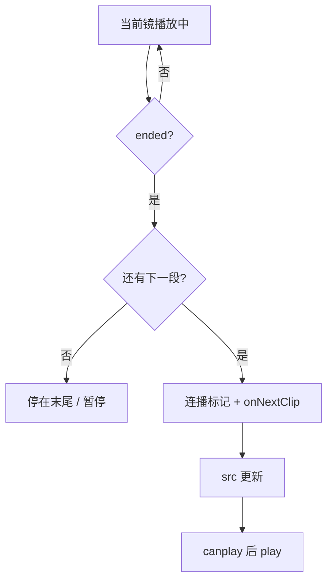

# 粗剪台预览播放更新说明

本文档记录粗剪时间线页（`TimelinePage`）中预览播放器 **`RoughCutVideoPlayer`** 的一次功能更新：自动连续播放与键盘快捷键。

## 更新日期

2025-03-25（以仓库内实现为准）

## 功能概览

| 能力 | 说明 |
|------|------|
| **片尾自动接播** | 当前镜头播放到结尾时，若存在下一可播镜头，自动切换并继续播放。 |
| **切镜续播** | 在**正在播放**状态下，通过「上一段 / 下一段」按钮或 **↑ / ↓** 切换镜头时，新片段加载完成后自动继续播放。 |
| **左右快进** | **← / →** 在当前片段内快退 / 快进，默认步长 **5 秒**（可通过组件 props 调整）。 |

## 键盘快捷键

在页面内全局监听（`window` `keydown`），以下情况**不拦截**，避免影响表单输入：

- 焦点在 `input`、`textarea`、`select` 内
- 可编辑元素（`contenteditable`）

| 按键 | 行为 |
|------|------|
| **←** | 当前片段快退（默认 5s，不早于 0s） |
| **→** | 当前片段快进（默认 5s，不超过片长） |
| **↑** | 上一段（与「上一段」按钮一致；播放中切镜会续播） |
| **↓** | 下一段（与「下一段」按钮一致；播放中切镜会续播） |

## 实现位置

- **组件**：`web/frontend/src/components/roughcut/RoughCutVideoPlayer.tsx`
- **使用页**：`web/frontend/src/pages/TimelinePage.tsx`（传入 `onPrevClip` / `onNextClip` 等，与本次更新前一致）

## 实现要点（供维护者）

1. **连播标记**  
   使用 `autoplayAfterSrcChangeRef`：在「需要在新 `src` 就绪后自动 `play`」的路径上置为 `true`（片尾接下一镜、或播放中切镜），在 `src` 变化的 `useEffect` 中读取并清零，再在 `canplay` 或已缓存就绪时调用 `video.play()`。

2. **片尾**  
   `<video>` 的 `onEnded`：若有 `onNextClip` 且未 `disableNext`，则置连播标记并调用 `onNextClip()`；否则仅将 UI 置为暂停。

3. **暂停时切镜**  
   若当前为暂停状态，切镜**不会**自动播放（与「连播标记仅在播放中切镜时设置」一致）。

4. **可选 props**  
   - `seekStepSec`：左右键单次步长（秒），默认 `5`；非法或 ≤0 时回退为内部默认常量。

5. **界面提示**  
   控制条底部增加一行文案，说明快捷键与片尾自动接播，避免与浏览器默认行为混淆。

## 流程示意（片尾接播）

## 相关代码引用

- 播放器组件：`web/frontend/src/components/roughcut/RoughCutVideoPlayer.tsx`
- 粗剪模块导出：`web/frontend/src/components/roughcut/index.ts`

---

若后续需要「暂停时按 ↑↓ 也自动播放」或「可关闭连播」等，建议在 `RoughCutVideoPlayer` 增加布尔 props，并在本页补充说明。
