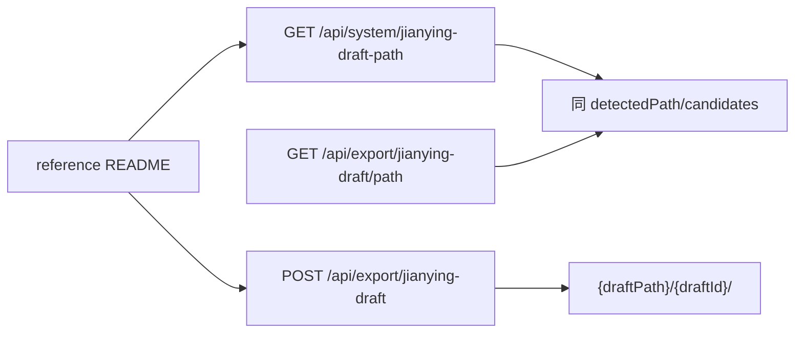
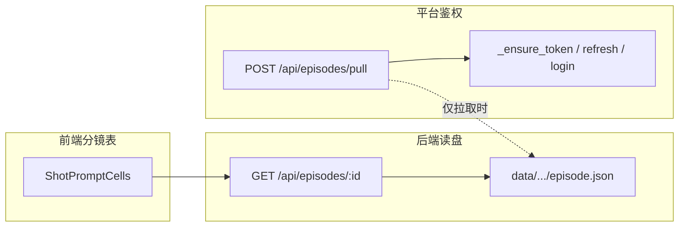

# FV Studio 联调说明

## 快速启动

### 1. 环境准备

```bash
# 项目根目录
cp .env.example .env    # 配置 FEELING_*、VIDU_API_KEY、YUNWU_API_KEY 等
cd web/frontend && cp .env.example .env  # 可选，默认 VITE_USE_MOCK=false 即不走 Mock
```

### 2. 启动后端

```bash
# 从项目根目录运行（需已安装依赖：pip install -r requirements.txt）
uvicorn web.server.main:app --reload --port 8000
```

或：

```bash
cd web/server && uvicorn main:app --reload --port 8000
```

**`pnpm run dev`（根目录）同时起 API + 前端时**：若终端里 **`[api] Address already in use`**，说明 **8000 已被旧进程占用**，此时 **只有 Vite 在跑**，请求仍打到**旧后端**，会出现 **episode.json 已有 `visualDescription`，页面却没有** 的现象。

处理：

```bash
# 查看谁占用了 8000
lsof -i :8000
# 结束对应 PID 后，再重新 pnpm run dev
kill <PID>
```

### 3. 启动前端

```bash
cd web/frontend && npm run dev
```

前端默认访问 http://localhost:5173，Vite 将 `/api` 代理到 `http://localhost:8000`。

### 4. 端到端流程

1. **拉取**：在 Episode 列表页点击「从平台拉取」，需配置 `.env` 中的 `FEELING_API_BASE`、`FEELING_PHONE`、`FEELING_PASSWORD`
2. **查看分镜**：进入 Episode 详情 → 分镜列表
3. **生成尾帧**：选择分镜 → 批量生成尾帧
4. **生成视频**：选择分镜 → 生成视频（需 `VIDU_API_KEY`）
5. **选定**：在候选视频中选定一个
6. **导出**：导出粗剪视频（需 FFmpeg）；剪映草稿见下文「剪映导出与 reference 包」

### 5. 关闭 MSW Mock

联调时确保不使用 Mock：

- 不设置 `VITE_USE_MOCK`，或设为 `false`
- 前端会请求真实后端 `http://localhost:8000`

若要前后端分离开发（后端未就绪），在 `web/frontend/.env` 中设置 `VITE_USE_MOCK=true`。

## API 健康检查

```bash
curl http://localhost:8000/api/health
# {"status":"ok"}
```

## 剪映导出与 reference 包

`reference/packages/ugc-export-integrations/README.md` 已约定 **`draftPath`**、**`GET /api/system/jianying-draft-path`** 等；本仓库实现与之对齐：

| 参考 README | fv_autovidu |
|-------------|-------------|
| `GET /api/system/jianying-draft-path` | **已实现**（与 `GET /api/export/jianying-draft/path` 同响应） |
| `POST` Body `draftPath`（必填） | `POST /api/export/jianying-draft`（**不生成 ZIP**，仅复制到剪映草稿目录） |
| 写入 `{draftPath}/{draftId}/` | 含 **`draft_content.json`**（pyJianYingDraft 生成时间轴）+ `draft_meta_info.json` + `materials/`；需 `pip install -r requirements.txt` |



**联调自检**（本机探测草稿根）：

```bash
curl -s http://127.0.0.1:8000/api/system/jianying-draft-path | python3 -m json.tool
```

### 画面描述不显示？与 Feeling Token



| 环节 | 是否用 Feeling Token |
|------|----------------------|
| 浏览分镜、读 `visualDescription` | **否**，只走本地 JSON |
| 从平台拉取、资产接口 | **是**，`FeelingClient` 会在过期前 `refresh()`，失败再 `login()` |

**若 `episode.json` 里已有 `visualDescription`，但页面仍是「-」：**

1. 确认未开 Mock：`web/frontend/.env` 里 **`VITE_USE_MOCK` 不要为 `true`**。
2. 直接打接口自检（应能看到非空字符串或至少存在该字段）：

   ```bash
   curl -s "http://127.0.0.1:8000/api/episodes/<你的episodeId>" | python3 -c "import sys,json; d=json.load(sys.stdin); s=d['scenes'][0]['shots'][0]; print('visualDescription' in s, repr((s.get('visualDescription') or '')[:80]))"
   ```

3. **若磁盘 JSON 有该字段，但上面 curl 没有**：当前 `uvicorn` 进程仍是**旧版** `Shot` 模型（会把 JSON 里多出来的字段丢掉），请**停掉后端并重新启动**（`--reload` 在部分环境下未重载到模型变更时需手动重启一次）。

---

## 从 dev 环境拉取分镜数据

dev 项目指 `https://dev-video-server.feeling.ltd` 上的分镜数据，拉取后可在本地进行尾帧生成、视频生成等操作。

### 1. 配置 .env

在项目根目录 `.env` 中填写 dev 平台账号。平台 API 使用 `identifier`（手机号或用户名）+ `password`，优先用 `FEELING_USERNAME`，否则用 `FEELING_PHONE`：

```env
FEELING_API_BASE=https://dev-video-server.feeling.ltd/api
# identifier 二选一
FEELING_USERNAME=你的用户名
FEELING_PHONE=你的手机号
FEELING_PASSWORD=你的密码
DATA_ROOT=./data
```

**验证登录**：执行 `python -c "from src.feeling.client import FeelingClient; c=FeelingClient(); c.login(); print('OK')"` 若报错会显示平台返回的具体原因（如「密码错误」）。

### 2. 获取 Episode ID

需要知道要拉取的 Episode 的 UUID，可通过以下方式获取：

- **方式一：平台 Web 页面**  
  登录 dev 平台分镜页面，浏览器地址栏 URL 格式为：  
  `project/{projectId}/storyboard?episode={episodeId}`  
  例如：`project/b95c3d75-d99a-40c3-9f69-9bb76f23c990/storyboard?episode=c25126d1-73c7-418a-8ebe-e877df4f2e84`

- **方式二：API 文档**  
  打开 `https://dev-video-server.feeling.ltd/api-docs`，查看是否有项目/剧集列表接口，从返回数据中获取 episode ID

- **方式三：向平台同事索要**  
  直接询问项目/剧集对应的 episode UUID

### 3. 拉取数据

**命令行拉取：**

```bash
# 项目根目录执行
python -m src.feeling.puller --episode-id <你的episode-uuid> --output data

# 指定项目 ID 和剧集标题（资产与目录会落在 data/{projectId}/{episodeId}/）
python -m src.feeling.puller --episode-id <uuid> -o data --project-id <平台项目UUID> --title "第2集" --number 2

# 只同步分镜文案（画面描述、提示词），不下载首帧/资产图（更快）
python -m src.feeling.puller --episode-id <uuid> -o data --project-id <项目UUID> --skip-images
```

**注意**：同时传 `--episode-id` 与 `--project-id` 时只会拉**单集**；`--project-id` 仅作资产接口与本地目录名，不会触发「拉整项目」。

**前端**：「从平台拉取」弹窗可勾选 **「仅拉取分镜文案（不下载图片）」**，效果与 `--skip-images` 一致；`episode.json` 中仍会包含 `visualDescription` 等字段。

拉取成功后，数据会写入 `data/{projectId}/{episodeId}/`，包含：

- `episode.json`：分镜元数据（含 `visualDescription` 画面描述，需用新版 puller 拉取）

**同一 episodeId 多套目录**：若同时存在 `data/proj-default/{episodeId}/` 与真实 `projectId` 目录，后端会**自动择优**返回含 `visualDescription` 更完整的一份，避免列表里点到旧数据看不到画面描述。
- `frames/S01.png`、`S02.png`…：首帧图
- `assets/`：角色等资产图

**通过前端拉取：**

1. 执行 `pnpm run dev` 启动前后端
2. 打开 http://localhost:5173
3. 在 Episode 列表页点击「从平台拉取」
4. 输入 episode ID 提交（前端会调用 `POST /api/episodes/pull`）

### 4. 导出接口原始数据（调试用）

**资产接口：**

```bash
python -c "
import json
from src.feeling.client import FeelingClient
c = FeelingClient()
c.login()
assets = c.get_assets('<project-id>', episode_id='<episode-id>')
with open('docs/asset_api_dump.json', 'w', encoding='utf-8') as f:
    json.dump([dict(a) for a in assets], f, ensure_ascii=False, indent=2)
print('已写入 docs/asset_api_dump.json')
"
```

**分镜 Shots 接口（含图片/视频提示词）：**

```bash
python -c "
import json
from src.feeling.client import FeelingClient
c = FeelingClient()
c.login()
shots = c.get_shots('<episode-id>')
with open('docs/shots_api_dump.json', 'w', encoding='utf-8') as f:
    json.dump(shots, f, ensure_ascii=False, indent=2)
print('已写入 docs/shots_api_dump.json，可检查 imgPrompt、videoPrompt、visualDescription 等字段')
"
```

当前最新的资产 API 数据已导出至 `docs/asset_api_dump.json`。分镜表的图片提示词（imgPrompt/visualDescription）和视频提示词（videoPrompt）由 puller 拉取并写入 episode.json。
