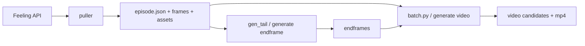

# 自动化流水线计划

> **文档目的**：把「平台拉取 Project → 本地生成尾帧 → 按不同模式生成视频」收敛成一份可以直接排期、直接实现、直接验收的计划。  
> **适用范围**：`data/` 本地数据目录、`scripts/` CLI、`web/` 前后端、Vidu / Yunwu 调用链。  
> **非目标**：平台回传、粗剪导出、NotebookLM 等外围能力。

---

## 一、落地结论

这套计划 **可以落地**，但原文档里有三处会影响执行：

1. **把“目标态”写得过满**  
   当前代码已经具备 Web 端三种视频模式，但 CLI 还没有 `reference + episode.json`，任务恢复也只有内存态。原文把这些能力写在同一层级，容易让人误判“差一点就全通了”。

2. **把两个正式入口写成并列方案**  
   `full_pipeline.py` 和 `Makefile/justfile` 不应该同时作为正式入口。落地时必须只保留一个主入口，否则参数、日志、错误处理会分叉。

3. **把“重启后恢复”承诺得过重**  
   现在 `web/server/routes/tasks.py` 的 `_local_tasks` 是纯内存。没有持久化之前，只能做到“重新识别候选任务并补查/补提交”，不能写成“服务重启后无缝继续追踪全部任务”。

因此，这份计划调整为两条主线：

- **主线 A：CLI 闭环**  
  先做一条可重复执行的正式流水线入口，解决“怎么从空目录跑到视频产物”。
- **主线 B：Web 可运维**  
  再补任务持久化、轮询提示、失败重试，解决“怎么稳定跑、怎么恢复、怎么让用户知道失败在哪”。

`reference` 的 CLI 对齐保留，但不再作为第一阶段阻塞项。

---

## 二、目标与边界

### 2.1 目标

| 目标 | 说明 | 是否第一阶段必须 |
|------|------|------------------|
| **端到端可重复** | 新机器只配 `.env` 后，可从 Project 拉取到本地视频产物 | 是 |
| **模式定义一致** | Web 与 CLI 对 `mode`、模型、分辨率、参考图的含义一致 | 是 |
| **失败可定位** | 失败能定位到 shot，并知道是提交失败、轮询失败还是下载失败 | 是 |
| **状态可恢复** | 至少能在重启后识别未完成任务并继续处理 | 否，第二阶段 |
| **CLI/Web 能力对齐** | Web 支持的模式最终能在 CLI 上批量跑通 | 否，第三阶段 |

### 2.2 非目标

- 不在本计划内定义 Feeling 平台服务端接口契约。
- 不在本计划内实现平台回传和粗剪导出。
- 不要求第一阶段解决所有批量 UI 体验问题。

### 2.3 成功定义

- 对任意一个已有 `project_id`，从空 `data/` 开始可执行一次标准命令，得到本地 `videos/` 产物。
- 对失败任务，能够明确是哪个 `shot_id`、哪个阶段、哪类错误。
- 文档中每个阶段都有明确交付物和 Done 定义，不依赖口头补充。

---

## 三、已确认现状

### 3.1 代码现状

| 能力 | 当前实现 | 结论 |
|------|----------|------|
| 拉取 Project | `src/feeling/puller.py` | 已有 |
| 尾帧生成 | `scripts/endframe/gen_tail.py`、`POST /generate/endframe` | 已有 |
| Web 首帧视频 | `POST /generate/video` `mode=first_frame` | 已有 |
| Web 首尾帧视频 | `POST /generate/video` `mode=first_last_frame` | 已有 |
| Web 多参考图视频 | `POST /generate/video` `mode=reference` | 已有 |
| CLI 首帧视频 | `scripts/i2v/batch.py --from-json` | 已有 |
| CLI 首尾帧视频 | `scripts/i2v/batch.py --from-json --with-endframe` | 已有 |
| CLI 多参考图视频 | `scripts/i2v/batch.py --from-json --video-mode reference` | 已有（与 Web reference 一致） |
| Web 任务追踪 | `web/server/routes/tasks.py` `_local_tasks` | 仅内存 |
| 前端轮询 | `web/frontend/src/stores/taskStore.ts` 每 3 秒轮询 | 无退避、无失败提示 |

### 3.2 关键技术事实

- `first_last_frame` 在当前实现里本质上走的是 **Vidu `reference2video` 双图模式**，不是独立的 i2v 双帧接口。
- Web 的 `reference` 模式当前只使用 `shot.assets` 中的资产图，不自动混入 `firstFrame`。
- `StoryboardPage.tsx` 当前批量视频只针对 `status === "endframe_done"` 的镜头。
- `_local_tasks` 进程重启后会丢失，因此当前“恢复”能力只成立于单次进程生命周期内。

### 3.3 当前数据流

---

## 四、落地决策

### 4.1 正式入口只保留一个

**决策**：正式流水线入口定为 `scripts/feeling/full_pipeline.py`。  
`Makefile` 或 `justfile` 如果需要，只做薄包装，不承载业务逻辑。

原因：

- Python 脚本更适合做参数校验、阶段跳过、错误汇总、日志落盘。
- 如果把逻辑分散到 `Makefile`，后续会出现 Web 参数、CLI 参数、文档示例三套口径。

### 4.2 先做“可跑通”，再做“全对齐”

第一阶段只要求正式入口跑通以下组合：

- `pull`
- `tail`
- `video:first_frame`
- `video:first_last_frame`

`video:reference` 的 CLI 批量支持放到第三阶段，不阻塞主闭环。

### 4.3 任务恢复按两个层级写清楚

| 层级 | 能力定义 | 是否本次必须 |
|------|----------|--------------|
| **弱恢复** | 服务重启后，根据 `episode.json` / `videoCandidates` 识别进行中过的候选，允许补查或补提交 | 是 |
| **强恢复** | 服务重启后，保留本地 task 映射并自动继续轮询、下载、收敛状态 | 否 |

第二阶段只承诺做到 **弱恢复 + 基本持久化**，不承诺“完全无感恢复”。

### 4.4 参数契约先冻结

在写 `full_pipeline.py` 前，先统一以下参数命名：

- `mode`: `first_frame | first_last_frame | reference`
- `model`
- `resolution`
- `duration`
- `reference_asset_ids`

CLI 和 Web 使用同一套术语，避免后续再做映射层。

---

## 五、缺口与优先级

### 5.1 P0：主闭环必须项

| ID | 缺口 | 交付物 | Done 定义 |
|----|------|--------|-----------|
| P0-1 | 缺少正式流水线入口 | `scripts/feeling/full_pipeline.py` | 可从空 `data/` 跑完 `pull -> tail -> video` |
| P0-2 | 参数口径分散 | 参数约定表 + CLI 帮助文案 | Web/CLI 对 `mode` 等术语无歧义 |
| P0-3 | 失败信息不足 | 阶段化日志与错误汇总 | 失败能定位到 `shot_id` 和失败阶段 |

### 5.2 P1：Web 可运维必须项

| ID | 缺口 | 交付物 | Done 定义 |
|----|------|--------|-----------|
| P1-1 | `_local_tasks` 仅内存 | 轻量持久化文件，如 `tasks_state.json` 或等价方案 | 重启后可重新识别未完成视频候选 |
| P1-2 | 轮询失败静默 | 前端错误提示 + 退避策略 | 连续失败时用户可见，且不会无限 3 秒打点 |
| P1-3 | 批量完成无汇总 | 批量结果汇总 UI | 能看到成功数、失败数、失败镜头 |

### 5.3 P2：一致性与体验增强

| ID | 缺口 | 交付物 | Done 定义 |
|----|------|--------|-----------|
| P2-1 | CLI 不支持 `reference + episode.json` | `scripts/i2v/batch.py` 新模式或共享实现 | CLI/Web 可对同一 `episode.json` 提交 reference 批量任务 |
| P2-2 | 分镜页批量视频仅支持 `endframe_done` | 批量目标选择器 | 支持“仅首帧可生成”的批量视频 |
| P2-3 | `reference` 是否包含首帧未定 | 产品决策记录 + 实现 | 文档和代码对参考图组合规则一致 |
| P2-4 | Yunwu/Vidu 无统一重试 | 统一重试封装 | 网络抖动和 429 有受控退避 |

---

## 六、实施方案

### 6.1 阶段 0：冻结契约

目标：在动代码前消除概念歧义。

任务：

- 明确 `first_last_frame` 在文档中统一表述为“首尾帧约束视频，技术实现走 `reference2video` 双图”。
- 明确 `reference` 默认只使用资产图；是否混入 `firstFrame` 单列为待确认项。
- 明确 `full_pipeline.py` 是唯一正式入口，`Makefile/justfile` 不承载业务逻辑。

Done：

- 本文档和 README 用词一致。
- 不再出现“i2v 双图”和“正式入口二选一”这类模糊说法。

### 6.2 阶段 1：CLI 主闭环

目标：先保证机器可跑，不依赖 Web。

建议入口参数：

- `--project-id`
- `--episode-id` 或 `--episode-dir`
- `--steps pull,tail,video`
- `--video-mode first_frame|first_last_frame`
- `--model`
- `--resolution`
- `--duration`
- `--dry-run`

实现要求：

- 复用现有 `pull_project`、`gen_tail.py`、`batch.py` 能力，不重复写 Vidu/Yunwu 调用。
- 每个阶段输出结构化日志，至少包含 `episode_id`、`shot_id`、阶段、错误。
- 支持跳步执行，例如已拉取完成后只跑 `tail,video`。

Done：

- 从空 `data/` 跑通一个真实 `project_id`。
- 失败后能拿到镜头级错误汇总。
- README 有唯一命令示例。

### 6.3 阶段 2：Web 可运维

目标：把“可用”提升到“能持续跑”。

实现要求：

- 给 `_local_tasks` 增加轻量持久化，不要求一开始就上 SQLite。
- `taskStore` 增加轮询失败提示和指数退避。
- 批量任务结束后展示 `成功 M / 失败 N`，并带失败镜头列表。

建议轻量方案：

- 本地维护 `tasks_state.json`，记录：
  - 本地 `task_id`
  - `episode_id`
  - `shot_id`
  - `candidate_id`
  - `vidu_task_id`
  - `kind`
  - `status`

Done：

- 服务重启后，至少能识别未完成候选并继续补查或标记失败。
- 前端轮询出错时不再静默。
- 批量任务结果对用户可见。

### 6.4 阶段 3：能力对齐

目标：补完 CLI/Web 差异。

任务：

- `batch.py` 增加 `reference` 模式，读取 `episode.json` 中 `shot.assets`。
- 分镜页新增批量目标选择，支持“仅首帧批量视频”。
- 根据产品结论决定 `reference` 是否将 `firstFrame` 作为第一张参考图。

Done：

- CLI 和 Web 对同一份 `episode.json` 的模式定义一致。
- 用户无需先生成尾帧也能批量跑 `first_frame`。

---

## 七、风险与约束

| 风险 | 影响 | 处理方式 |
|------|------|----------|
| Vidu/Q3 模型在双图约束下效果不稳定 | 首尾帧模式效果波动 | 阶段 1 先保留 `first_frame` 作为回退路径 |
| `reference` 图顺序影响结果 | 产出不稳定、难复现 | 在阶段 3 单独做顺序实验并固化规则 |
| 轮询与下载都放在 `GET /tasks` | 请求时延放大，失败面增多 | 阶段 2 先补状态持久化，后续再考虑 worker 化 |
| 同时维护多入口 | 参数漂移、示例失真 | 强制只有 `full_pipeline.py` 为正式入口 |

---

## 八、验收标准

| 编号 | 验收项 | 所属阶段 |
|------|--------|----------|
| AC1 | 新环境可通过唯一正式命令完成 `pull -> tail -> video`，至少支持 `first_frame` 或 `first_last_frame` 之一 | 阶段 1 |
| AC2 | 失败结果能定位到 `shot_id` 和失败阶段，并有可读汇总 | 阶段 1 |
| AC3 | 服务重启后可识别未完成视频候选并继续补查或标记失败 | 阶段 2 |
| AC4 | 前端批量任务结束后可见成功数、失败数、失败镜头 | 阶段 2 |
| AC5 | CLI 支持 `reference + episode.json` 批量模式，且模式定义与 Web 一致 | 阶段 3 |

---

## 九、执行顺序建议

1. 先改文档和参数契约，不直接上手补所有缺口。
2. 先交付 `full_pipeline.py`，验证真正的主闭环。
3. 再补 Web 任务持久化和轮询可观测性。
4. 最后补 CLI reference 对齐和批量 UI 增强。

这个顺序的原因很简单：

- 没有正式入口，就没有“流水线”，只有零散脚本。
- 没有任务持久化和结果汇总，就谈不上“可运维”。
- CLI reference 和更细的批量 UI 是增强项，不是主闭环阻塞项。

---

## 十、变更记录

| 日期 | 说明 |
|------|------|
| 2026-03-22 | 收敛为可执行版本：拆分 CLI 闭环与 Web 可运维两条主线，冻结正式入口与恢复边界，补充阶段交付物和 Done 定义 |

---

*文档维护规则：任何影响优先级、正式入口、任务恢复边界的改动，都必须同步更新「四、落地决策」「五、缺口与优先级」「八、验收标准」。*
