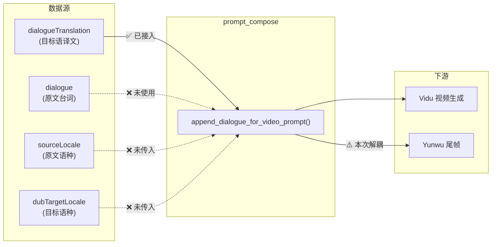
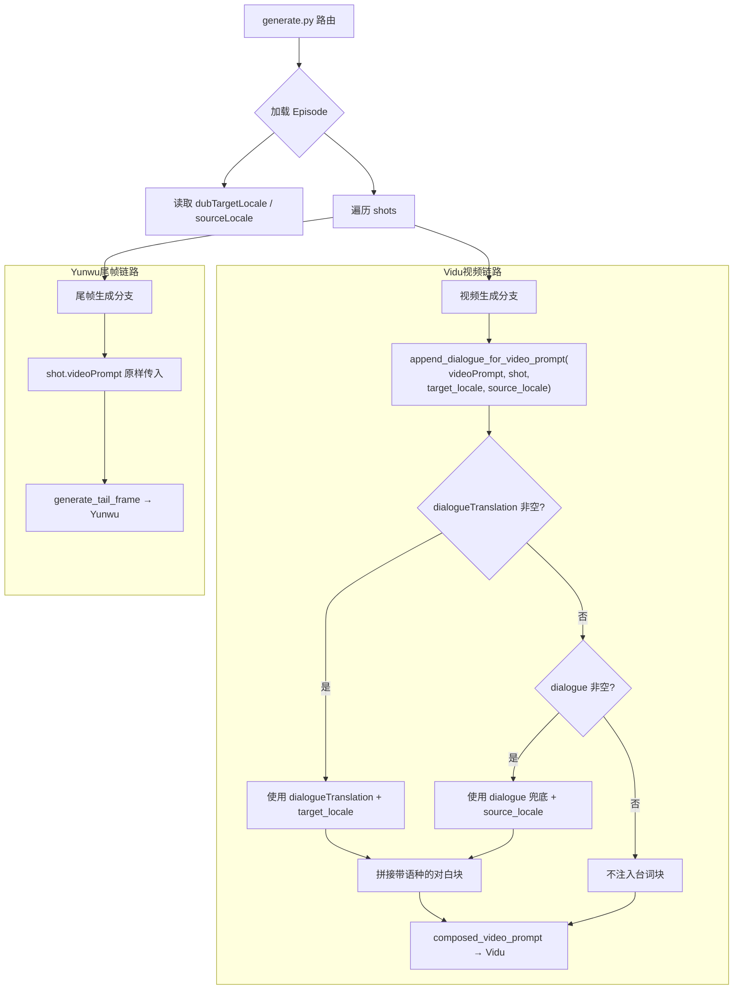

# 视频提示词语种台词注入 — 设计说明

**日期**：2026-03-27  
**状态**：方案已落地（代码）；上线后口型对比待验证  
**版本**：v2（整合评审反馈）

---

## 0. 评审结论（实现前必读）

| 边界 | 结论 |
|------|------|
| **尾帧是否注入台词** | **第一阶段不改尾帧链路。** Yunwu system prompt 明确是「静态尾帧，不要字幕或额外文字」，对白块的「口型/表演参考」语义与尾帧的「镜头终态」不在同一空间。`generate.py` 尾帧调用点（约 305 行）维持 `shot.videoPrompt` 原样传入，**不再**经过 `append_dialogue_for_video_prompt`。后续如需尾帧侧 AB 实验，单独评估。 |
| **幂等检测** | **不用宽松子串判断。** 使用正则严格匹配标题行：`^\[Dialogue(?: \([^)]+\))? for performance/lip-sync\]$`（多行模式），避免误判。 |
| **语种标签格式** | **第一阶段用 `(ja-JP)` raw locale code**，向后兼容且足够。后续如需提升模型理解效果，可迭代为 `Japanese (ja-JP)` 格式，不影响现在先上。 |
| **Episode 级单一语种假设** | **当前成立。** locale 在 Episode 级，不在 Shot 级。如后续出现同集混合语种台词需求，需在 Shot 级补 locale 字段。本次不预埋。 |

---

## 1. 问题描述

当前视频提示词（发往 Vidu）**未携带语种标签**，且**台词注入不完整**：

| 缺口 | 现状 | 期望 |
|------|------|------|
| 语种信息未注入 | `dubTargetLocale` / `sourceLocale` 只存于 Episode 级，`prompt_compose` 不感知 | 视频提示词中标注台词语种，供 Vidu 口型/表演参考 |
| 原文台词无兜底 | 用户未填 `dialogueTranslation` 时，`dialogue`（原文）不会被注入 | `dialogueTranslation` 为空时自动回退到 `dialogue` |
| 模型缺乏语言上下文 | 对白块仅为裸文本，Vidu 不知道台词是什么语言 | 在对白块标题行中明确语种 |

---

## 2. 当前数据流



### 相关文件

| 文件 | 职责 |
|------|------|
| `web/server/services/prompt_compose.py` | 台词块拼接到视频提示词（唯一注入点） |
| `web/server/routes/generate.py` | 视频/尾帧任务：调用 `append_dialogue_for_video_prompt` 后发往 Vidu；尾帧发往 Yunwu |
| `web/server/models/schemas.py` | `Shot`（dialogue / dialogueTranslation）、`Episode`（dubTargetLocale / sourceLocale） |
| `web/server/services/vidu_service.py` | Vidu 提交封装（当前无语种参数） |
| `web/server/services/yunwu_service.py` | 尾帧 system/user 模板（line 29：「不要字幕或额外文字」） |
| `tests/test_prompt_compose.py` | 台词块行为单测 |

---

## 3. 方案 A（收口版）— Vidu 侧最小修复 + 原文兜底 + 严格幂等

### 3.1 改动范围

| 文件 | 改动 |
|------|------|
| `web/server/services/prompt_compose.py` | 增加 `target_locale` / `source_locale` 参数；`dialogue` 兜底；语种标签；正则幂等 |
| `web/server/routes/generate.py` | **仅视频生成**调用时传入 locale；**尾帧调用改回 `shot.videoPrompt` 原样**，不再走 `append_dialogue_for_video_prompt` |
| `tests/test_prompt_compose.py` | 补充语种标签、兜底、正则幂等等用例 |

### 3.2 函数签名变更

```python
# 变更前
def append_dialogue_for_video_prompt(video_prompt: str, shot) -> str:

# 变更后
def append_dialogue_for_video_prompt(
    video_prompt: str,
    shot,
    target_locale: str = "",   # Episode.dubTargetLocale
    source_locale: str = "",   # Episode.sourceLocale
) -> str:
```

### 3.3 内部逻辑

```python
import re

_DIALOGUE_BLOCK_RE = re.compile(
    r"^\[Dialogue(?: \([^)]+\))? for performance/lip-sync\]$",
    re.MULTILINE,
)

def append_dialogue_for_video_prompt(
    video_prompt: str,
    shot,
    target_locale: str = "",
    source_locale: str = "",
) -> str:
    # 优先使用译文，无译文时兜底原文
    chunk = (getattr(shot, "dialogueTranslation", None) or "").strip()
    used_translation = bool(chunk)

    if not chunk:
        chunk = (getattr(shot, "dialogue", None) or "").strip()

    if not chunk:
        return video_prompt

    # 严格正则幂等检测：已含对白块标题行则不重复追加
    if _DIALOGUE_BLOCK_RE.search(video_prompt):
        return video_prompt

    # 根据实际使用的文本选择对应语种标签
    locale = target_locale if used_translation else source_locale
    lang_hint = f" ({locale})" if locale else ""

    block = f"\n\n[Dialogue{lang_hint} for performance/lip-sync]\n{chunk}\n"
    return video_prompt.rstrip() + block
```

### 3.4 调用侧改动（generate.py）

#### 视频生成（约 478 行）— 注入台词 + 语种

```python
composed_video_prompt = append_dialogue_for_video_prompt(
    shot.videoPrompt,
    shot,
    target_locale=episode.dubTargetLocale,
    source_locale=episode.sourceLocale,
)
```

#### 尾帧生成（约 305 行）— 解耦，不再注入对白块

```python
# 变更前（当前代码）：
img_data = generate_tail_frame(
    first_path,
    shot.imagePrompt,
    append_dialogue_for_video_prompt(shot.videoPrompt, shot),  # ← 移除
    asset_paths,
)

# 变更后：尾帧直接用原始 videoPrompt，不拼接对白块
img_data = generate_tail_frame(
    first_path,
    shot.imagePrompt,
    shot.videoPrompt,    # ← 原样传入
    asset_paths,
)
```

> **理由**：Yunwu 的 system prompt（`yunwu_service.py` line 29）明确要求「不要字幕或额外文字」。
> 对白块的「口型/表演参考」语义是给 Vidu 视频生成用的，塞进「镜头终态信息」不是同一语义空间。
> 如需后续验证尾帧侧是否受益于台词上下文，单独 AB 实验评估。

### 3.5 输出示例

**场景 1：有译文，dubTargetLocale=ja-JP**
```
Camera pushes in slowly on the protagonist.

[Dialogue (ja-JP) for performance/lip-sync]
「もう一度、あの場所に行こう」
```

**场景 2：无译文，兜底原文，sourceLocale=zh-CN**
```
Camera pushes in slowly on the protagonist.

[Dialogue (zh-CN) for performance/lip-sync]
再去一次那个地方吧
```

**场景 3：无译文无原文**
```
Camera pushes in slowly on the protagonist.
```
（不追加任何对白块）

**场景 4：有译文但无语种设置**
```
Camera pushes in slowly on the protagonist.

[Dialogue for performance/lip-sync]
Let's go back to that place one more time.
```
（退化为当前行为，向后兼容）

---

## 4. 改动后数据流



---

## 5. 幂等检测：正则方案

### 变更前

```python
_DIALOGUE_BLOCK_HEADER = "[Dialogue for performance/lip-sync]"

# 检测方式：
if _DIALOGUE_BLOCK_HEADER in video_prompt:
    return video_prompt
```

### 变更后

```python
_DIALOGUE_BLOCK_RE = re.compile(
    r"^\[Dialogue(?: \([^)]+\))? for performance/lip-sync\]$",
    re.MULTILINE,
)

# 检测方式：
if _DIALOGUE_BLOCK_RE.search(video_prompt):
    return video_prompt
```

正则解读：
- `^` / `$` + `re.MULTILINE`：只匹配独立标题行
- `(?: \([^)]+\))?`：可选的 ` (locale)` 部分，括号内不含 `)`
- 能匹配 `[Dialogue for performance/lip-sync]`（无语种，旧格式兼容）
- 能匹配 `[Dialogue (ja-JP) for performance/lip-sync]`（新格式）
- **不会**误匹配 prompt 正文中恰好含 `Dialogue` 或 `lip-sync` 的普通句子

---

## 6. 已知限制与后续迭代

| 限制 | 说明 | 后续方向 |
|------|------|----------|
| Episode 级单一语种 | locale 不在 Shot 级，同集混合语种台词会用错标签 | 需求出现时在 Shot 上补 locale 字段 |
| locale 格式为 raw BCP-47 | `(ja-JP)` 可能不如 `Japanese (ja-JP)` 对模型友好 | 迭代时改为人类可读语言名 + code 组合 |
| 尾帧未注入台词 | 有意设计：与 Yunwu「静态尾帧」语义不匹配 | 需要时单独 AB 实验评估 |
| Vidu 对语种标签的利用程度 | 未验证 Vidu 模型是否真正读取标题行中的语种信息 | 上线后对比有/无语种标签的口型质量 |

---

## 7. 备选方案（供后续参考）

### 方案 B：结构化注入（语种 + 角色 + 台词分层）

```text
[Dialogue for performance/lip-sync]
Language: Japanese (ja-JP)
Speaker: 美咲
Line: 「もう一度、あの場所に行こう」
```

- 改动面大，需处理 `associatedDialogue` 各种边界
- Vidu 对结构化格式理解力未验证
- 适合后续迭代

### 方案 C：双语注入（原文 + 译文同时带入）

```text
[Dialogue for performance/lip-sync]
Original (zh-CN): 再去一次那个地方吧
Target (ja-JP): 「もう一度、あの場所に行こう」
```

- prompt 膨胀，可能让模型混淆
- 适合特殊场景按需开启

---

## 8. 待办清单

- [x] 修改 `prompt_compose.py`：增加 locale 参数 + dialogue 兜底 + 语种标签 + 正则幂等
- [x] 修改 `generate.py`：**仅视频生成**调用时传入 episode 级 locale
- [x] 修改 `generate.py`：**尾帧调用解耦**，改回 `shot.videoPrompt` 原样传入
- [x] 更新 `tests/test_prompt_compose.py`：覆盖语种标签、兜底、正则幂等、旧格式兼容等场景
- [x] **pytest 可重复运行**：仓库根增加 `pyproject.toml`（`testpaths` / `pythonpath` / `asyncio_default_fixture_loop_scope`），避免在子目录跑或 import 路径不一致时出现「0 项收集」或退出码非 0
- [x] **路由层衔接单测**：`tests/test_generate_routes_dialogue_wiring.py`（mock Vidu/Yunwu，断言视频分支拼好的 prompt 与尾帧分支原始 `videoPrompt`）
- [ ] 上线后验证：对比有/无语种标签的 Vidu 口型质量（**验证闭环**；可选再跑一次真实 Vidu + Yunwu smoke）

---

## 9. 验证闭环说明（自动化 vs 真实下游）

| 层级 | 内容 | 状态 |
|------|------|------|
| 实现闭环 | `prompt_compose` + `generate` 路由 + 单测 | 已完成 |
| 自动化验证 | 仓库根执行 `pytest` 或 `python -m pytest`，应 **全绿**（含路由 wiring） | 以 CI/本地为准 |
| 真实下游 smoke | 需有效密钥与环境：提交一单 **视频**（Vidu）与一单 **尾帧**（Yunwu），人工确认请求体符合预期 | 非阻塞发版，按需执行 |
