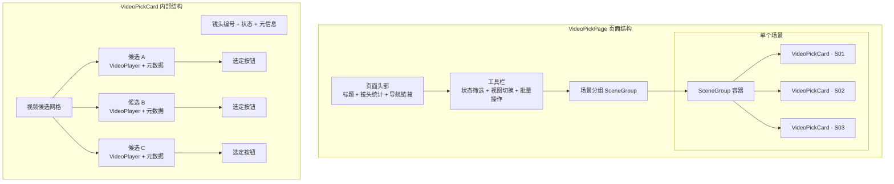
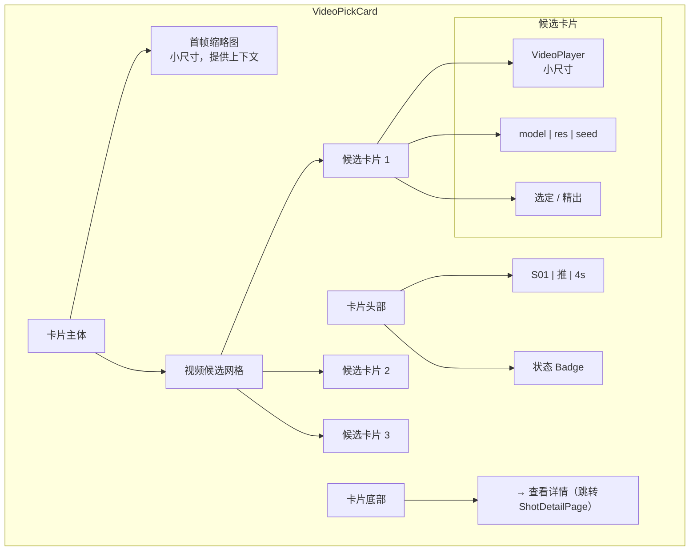
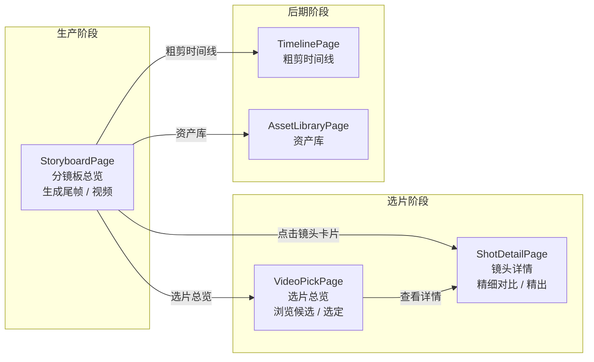
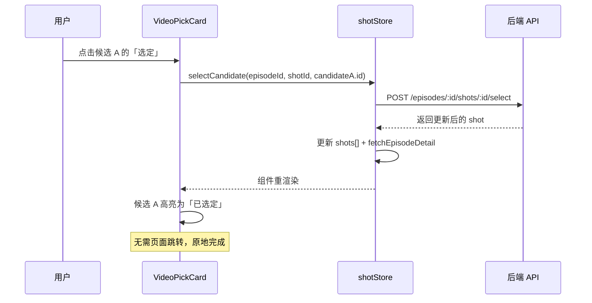
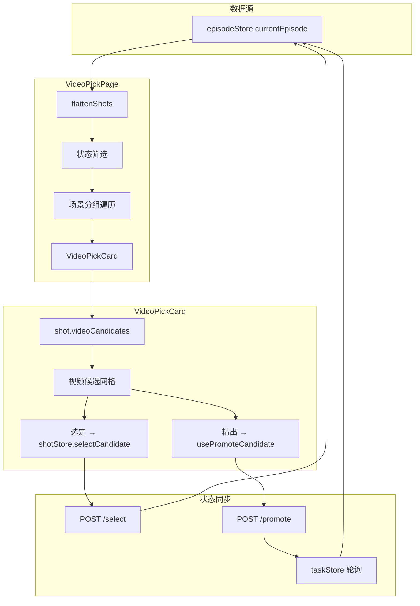

# 选片总览页（VideoPickPage）设计方案

> **方案代号**：方案 A — 新增独立页面  
> **创建日期**：2026-03-25  
> **状态**：已落地（前端已实现；方案细节仍以本文为准，迭代时同步更新本节）

---

## 实施状态与验证（收口说明）

### 代码落地对照

| 项 | 位置 |
|----|------|
| 路由 `.../pick` 与页面注册 | `web/frontend/src/App.tsx` |
| 路径生成 `routes.videopick` | `web/frontend/src/utils/routes.ts` |
| 选片总览页 | `web/frontend/src/pages/VideoPickPage.tsx` |
| 选片卡片 | `web/frontend/src/components/business/VideoPickCard.tsx` |
| 精出共享逻辑 | `web/frontend/src/hooks/usePromoteCandidate.ts`（`ShotDetailPage` 已改用） |
| 分镜板 / 侧栏入口 | `StoryboardPage.tsx`、`SideNavBar.tsx` |

### 已执行验证

- **前端构建**：在仓库内执行 `pnpm --prefix web/frontend run build` 或 `npm run build`（于 `web/frontend` 目录）应通过（含 `tsc -b` 与 `vite build`）。

### 建议端到端自测（手动）

以下尚未在自动化用例中固化，发版或联调前建议走一遍：

1. 从分镜板或侧栏进入「选片总览」，确认列表与筛选（全部 / 待选片 / 已选定 / 无视频）与场景分组正常。
2. 在卡片上对候选执行「选定」，确认无需跳转即可刷新高亮，且镜头详情页状态一致。
3. 对符合条件的预览候选执行「精出 1080p」，确认任务轮询结束后列表与详情数据一致。
4. 「查看详情」进入 `ShotDetailPage`，与选片页数据一致。
5. （可选）选定后进入粗剪时间线 / 导出链路，确认业务侧仍按原流程工作。

---

## 1. 背景与痛点

### 当前选片流程


**问题**：
- 用户必须 **逐镜头跳转** `ShotDetailPage` 才能看到视频候选并选片
- 如果有 40 个镜头，需要 **点进去 → 选定 → 返回 → 再点下一个** 循环 40 次
- 无法在一个页面内 **横向对比不同镜头的视频质量**
- `StoryboardPage` 每个卡片仅展示 **一个** 视频缩略图（已选定 or 首个候选），无法看到全部备选

### 目标

提供一个 **选片总览页**，在一个页面内：
1. 浏览所有镜头的 **全部视频候选**
2. 直接在卡片内 **选定** 某个候选，无需跳转
3. 支持 **场景分组**、**状态筛选**，与分镜板一致的浏览体验

---

## 2. 方案概览

### 新增页面 `VideoPickPage`，复用分镜板骨架



### 核心决策

| 决策项 | 选择 | 理由 |
|--------|------|------|
| 新增页面 vs 改造现有页面 | **新增** `VideoPickPage` | `StoryboardPage` 已承载尾帧/视频生成、框选、配音等重逻辑，继续叠加会臃肿 |
| 卡片组件 | **新建** `VideoPickCard` | 与 `ShotCard` 职责不同：`ShotCard` 聚焦生产（生成尾帧/视频），`VideoPickCard` 聚焦选片 |
| 场景分组 / 筛选 | **复用** `SceneGroup`、状态筛选逻辑 | 保持与分镜板一致的浏览体验 |
| 视频播放器 | **复用** `VideoPlayer` | 已有完善的播放控件 |
| 选定逻辑 | **复用** `shotStore.selectCandidate` | 选片 API + 状态同步已有 |
| 精出操作 | **复用** `ShotDetailPage` 中的 `handlePromote` 逻辑 | 抽为共享 hook `usePromoteCandidate` |

---

## 3. 路由设计

### 新增路由

```
/project/:projectId/episode/:episodeId/pick
```

### routes.ts 新增

```typescript
/** 选片总览 */
videopick: (projectId: string, episodeId: string) =>
  `/project/${encodeURIComponent(projectId)}/episode/${encodeURIComponent(episodeId)}/pick`,
```

### 导航入口

在 `StoryboardPage` 的头部导航区域（粗剪时间线 / 资产库 旁边）新增：

```
📋 选片总览
```

---

## 4. 组件设计

### 4.1 页面组件 `VideoPickPage.tsx`

**文件路径**：`web/frontend/src/pages/VideoPickPage.tsx`

**职责**：
- 加载剧集数据（`useEpisodeStore`）
- 场景分组遍历 + 状态筛选
- 渲染 `VideoPickCard` 替代 `ShotCard`

**复用自 StoryboardPage 的部分**：

| 模块 | 复用方式 |
|------|---------|
| 剧集数据加载 + loading/error 处理 | 直接复用 `useEpisodeStore` 相同模式 |
| `cacheBust` | 复用 `useEpisodeMediaCacheBust` |
| `STATUS_FILTERS` 筛选按钮 | 可提取为共享常量或直接复制 |
| `SceneGroup` 场景分组组件 | 直接复用 |
| 视图切换（grid/list） | 暂只做 grid 模式（选片场景下 list 不太适合展示多视频） |

**不复用的部分**（分镜板独有）：
- 批量尾帧/视频生成按钮（选片页不负责生成）
- `BatchPickScopeControl` 框选模式
- `DubPanel` 配音面板
- `ExportPanel` 导出面板
- `VideoModeSelector` 视频生成参数对话框
- `BatchResultSummary` 批量结果汇总

### 4.2 卡片组件 `VideoPickCard.tsx`

**文件路径**：`web/frontend/src/components/business/VideoPickCard.tsx`

**Props**：

```typescript
interface VideoPickCardProps {
  shot: Shot
  projectId: string
  episodeId: string
  basePath: string
  cacheBust?: string
}
```

**内部结构**：



**关键设计**：

1. **首帧缩略图**：保留一个小尺寸的首帧图，帮助用户识别"这是哪个镜头"
2. **视频候选网格**：
   - 候选 ≤ 2 个：单行并排
   - 候选 3 个：`grid-cols-3`
   - 候选 > 3 个：`grid-cols-2` 或 `grid-cols-3` 自适应
3. **已选定候选高亮**：与 `ShotDetailPage` 一致，选中候选边框变 `--color-primary`
4. **选定按钮**：调用 `shotStore.selectCandidate`，原地更新无需跳转
5. **精出按钮**：预览候选（`isPreview && taskStatus === "success" && seed > 0`）显示「精出 1080p」
6. **详情链接**：底部提供跳转 `ShotDetailPage` 的入口，用于查看 prompt、资产等详细信息

### 4.3 共享 Hook `usePromoteCandidate.ts`

**文件路径**：`web/frontend/src/hooks/usePromoteCandidate.ts`

**目的**：从 `ShotDetailPage` 中提取精出逻辑，供 `VideoPickCard` 和 `ShotDetailPage` 共同使用。

```typescript
interface UsePromoteCandidateOptions {
  episodeId: string
  shotId: string
}

interface UsePromoteCandidateReturn {
  /** 正在精出中的候选 id 列表 */
  promotingIds: string[]
  /** 发起精出 */
  promote: (candidateId: string) => Promise<void>
  /** 指定候选是否正在精出中 */
  isPromoting: (candidateId: string) => boolean
}
```

---

## 5. 与现有页面的关系



### 职责划分

| 页面 | 核心职责 | 操作动作 |
|------|---------|---------|
| **StoryboardPage** | 生产管控：尾帧/视频批量生成、状态监控 | 批量生成、框选、配音 |
| **VideoPickPage** ⭐ | 快速选片：浏览全部候选、一键选定 | 选定、精出 |
| **ShotDetailPage** | 精细对比：prompt/资产/元信息 + 逐候选对比 | 选定、精出、单帧重生入口 |

---

## 6. 状态筛选

选片页面的状态筛选与分镜板略有不同，更聚焦于"有视频候选"的镜头：

| 筛选项 | 含义 | 显示内容 |
|--------|------|---------|
| 全部 | 所有镜头 | 无候选的显示"暂无视频" |
| 待选片 | `status === "video_done"` | 有候选但未选定 |
| 已选定 | `status === "selected"` | 已选定，可更改 |
| 无视频 | `videoCandidates.length === 0` | 提示用户去分镜板生成 |

---

## 7. 交互细节

### 7.1 视频缩略模式

为避免卡片过大，视频候选默认以 **缩略模式** 展示：
- 显示视频的 **poster 帧**（首帧截图）
- **hover** 时自动 muted 播放（复用 `ShotRowVideoPreview` 的 portal 预览思路）
- **点击播放按钮** 才展开完整的 `VideoPlayer` 控件

### 7.2 选定交互



### 7.3 精出 1080p 交互

与 `ShotDetailPage` 完全一致，通过 `usePromoteCandidate` hook 复用。

### 7.4 批量选定（未来扩展）

预留扩展接口，支持：
- **一键选定所有镜头的第 N 个候选**（如"全部选第 1 个"）
- **AI 推荐选片**：根据视频质量评分自动推荐最佳候选

---

## 8. 文件清单

| 操作 | 文件路径 | 说明 |
|------|---------|------|
| **新建** | `pages/VideoPickPage.tsx` | 选片总览页面 |
| **新建** | `components/business/VideoPickCard.tsx` | 选片卡片组件 |
| **新建** | `hooks/usePromoteCandidate.ts` | 精出逻辑共享 hook |
| **修改** | `utils/routes.ts` | 新增 `videopick` 路由路径 |
| **修改** | `App.tsx` | 注册新路由 |
| **修改** | `pages/StoryboardPage.tsx` | 头部导航增加「选片总览」入口 |
| **修改** | `components/layout/SideNavBar.tsx` | 侧导航增加选片入口（可选） |
| **修改** | `components/business/index.ts` | 导出 `VideoPickCard` |
| **修改** | `hooks/index.ts` | 导出 `usePromoteCandidate` |
| **重构** | `pages/ShotDetailPage.tsx` | 精出逻辑提取到 `usePromoteCandidate`，本页改为调用 hook |

---

## 9. 实施步骤

```mermaid
gantt
    title 选片总览页实施计划
    dateFormat X
    axisFormat %s

    section 基础设施
    路由 + 空页面壳                   :a1, 0, 1
    提取 usePromoteCandidate hook     :a2, 1, 2

    section 核心组件
    VideoPickCard 组件                :b1, 2, 4
    VideoPickPage 页面集成            :b2, 4, 6

    section 串联
    StoryboardPage 增加导航入口       :c1, 6, 7
    ShotDetailPage 重构使用 hook      :c2, 6, 7

    section 打磨
    交互细节 + 样式调优               :d1, 7, 8
    自测 + 修复                       :d2, 8, 9
```



### 分步说明

1. **路由 + 空页面壳**：`routes.ts` 加路径 → `App.tsx` 注册 → `VideoPickPage` 空壳
2. **提取 hook**：从 `ShotDetailPage` 提取精出逻辑为 `usePromoteCandidate`
3. **VideoPickCard**：核心卡片组件，展示视频候选网格 + 选定/精出按钮
4. **VideoPickPage**：集成 SceneGroup + 筛选 + VideoPickCard
5. **导航入口**：分镜板头部新增「选片总览」链接
6. **ShotDetailPage 重构**：改用 `usePromoteCandidate` hook
7. **样式调优**：hover 预览、卡片尺寸、响应式布局
8. **自测**：端到端验证选片 → 时间线 → 导出 流程

---

## 10. 参考

### 现有相关代码

| 文件 | 可复用内容 |
|------|-----------|
| `pages/StoryboardPage.tsx` | 场景分组遍历、状态筛选逻辑、页面骨架 |
| `pages/ShotDetailPage.tsx` | 视频候选展示、选定交互、精出流程 |
| `components/business/ShotCard.tsx` | 卡片结构、newsprint 风格 |
| `components/business/ShotFrameCompare.tsx` | variant 模式设计思路 |
| `components/business/ShotRowVideoPreview.tsx` | hover 预览 portal 方案 |
| `components/business/VideoPlayer.tsx` | 视频播放控件 |
| `stores/shotStore.ts` | `selectCandidate` 选片逻辑 |
| `types/episode.ts` | `VideoCandidate` 类型定义 |

### 数据流


