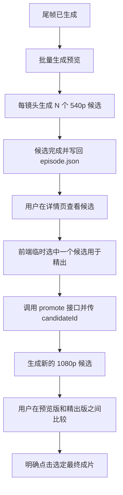

# 首尾帧种子复用方案（最小可落地版）

> 目标：在**不大改现有前后端结构**的前提下，为 `first_last_frame` 模式补齐「低成本预览 -> 人工挑选 -> 锁种精出」闭环。

## 1. 结论

这件事可以落地，但实现方式需要收敛为一个**V1 最小方案**：

- 继续复用现有 `POST /api/generate/video` 作为“预览生成”入口，不新增 `/preview`
- 新增 `POST /api/generate/video/promote` 作为“锁种精出”入口
- `selected` 继续表示**最终选定成片**
- 预览阶段挑中的候选**不落库为 selected**，由前端在精出请求里显式传 `candidateId`
- 只有 `seed > 0` 且 `taskStatus = success` 的预览候选才能精出

这版方案的设计原则只有一条：**先做成，再做漂亮**。

---

## 2. 为什么要做

当前首尾帧视频生成存在三个实际问题：

- 直接高质量出片，试错成本高
- 同一镜头往往要反复重跑，人工时间和积分都浪费
- 系统已经保存 `seed`，但 Web 端没有把它用起来

因此需要一个两阶段工作流：

```text
阶段一：turbo + 540p + 多候选低成本试错
阶段二：固定已选候选的 seed -> pro + 1080p 精出
```

注意：这里的“精出”是**锁定方向并提高质量**，不是像素级复现。

---

## 3. 现状基线

当前仓库已经具备以下前提：

- `VideoCandidate.seed` 已存在
- 后端 `generate_video` 已支持多模式视频生成
- `first_last_frame` 已经可以走现有服务链路提交任务
- 任务收尾、视频下载、候选写回 `episode.json` 的链路已经存在
- 仓库里有固定 `seed` 生成 1080p 的 CLI 原型，但它是**单帧 i2v 原型**，不能直接视为首尾帧方案已验证

当前仓库还**不具备**：

- Web 端透传 `seed`
- 同一镜头一次生成多个候选
- 锁种精出接口
- 预览候选与最终候选的明确区分

---

## 4. V1 范围与非目标

### 4.1 本期必须完成

- 首尾帧模式支持一次生成 `N` 个预览候选
- 候选展示 `seed / model / resolution / taskStatus`
- 用户可基于某个预览候选发起 1080p 精出
- 精出后生成新的候选，不覆盖旧候选
- 最终仍通过现有 `selected` 机制选定成片

### 4.2 本期明确不做

- 不做新的 `/generate/video/preview` 端点
- 不做“预览选中状态”持久化字段
- 不做自动替换旧候选
- 不做跨项目种子收藏
- 不做自动评分 / 自动选优

---

## 5. 核心决策

### 5.1 只保留一个预览入口

预览生成直接复用现有接口：

```http
POST /api/generate/video
```

新增字段后即可表达预览任务，无需再开 `/preview`。

### 5.2 `selected` 只表示最终成片

当前系统里 `selected` 已经被下游语义使用，不能再拿来表示“预览阶段暂时看中”。

所以：

- 预览候选的选择由前端本地状态管理
- 发起精出时，前端把目标 `candidateId` 显式传给后端
- 精出成功后，新候选默认 `selected = false`
- 只有用户明确点“选定”时，才写入最终 `selected`

### 5.3 精出生成新候选，不替换旧候选

精出是一次新的生成任务，不是文件替换。

原因：

- 需要保留预览版本用于回看和对比
- 需要保留来源关系，便于排查“为什么精出和预览不一致”
- 替换旧候选会让任务历史和用户认知混乱

### 5.4 `seed == 0` 不能精出

如果候选的 `seed` 为空或为 `0`，说明这条候选无法被稳定复用。

因此 promote 端点必须在后端校验：

- `seed <= 0` -> 直接拒绝
- `taskStatus != success` -> 直接拒绝
- `videoPath` 为空但任务未完成 -> 直接拒绝

---

## 6. 用户流程

### 6.1 完整流程



### 6.2 预览生成

```json
POST /api/generate/video
{
  "episodeId": "ep-xxx",
  "shotIds": ["shot-1", "shot-2", "shot-3"],
  "mode": "first_last_frame",
  "model": "viduq3-turbo",
  "resolution": "540p",
  "duration": 5,
  "candidateCount": 2,
  "seed": 0,
  "isPreview": true
}
```

语义：

- `candidateCount = 2` 表示每个镜头提交两次
- `seed = 0` 表示每次都让服务端随机
- `isPreview = true` 表示这些候选只是预览，不应被当作最终成片

### 6.3 精出

```json
POST /api/generate/video/promote
{
  "episodeId": "ep-xxx",
  "items": [
    {
      "shotId": "shot-1",
      "candidateId": "cand-aaa"
    },
    {
      "shotId": "shot-2",
      "candidateId": "cand-bbb"
    }
  ],
  "model": "viduq3-pro",
  "resolution": "1080p"
}
```

后端对每个 item：

1. 找到对应候选
2. 校验 `seed > 0`
3. 继承原候选对应镜头的 prompt、首帧、尾帧
4. 用相同 `seed` + 新 `model/resolution` 重新提交
5. 创建一个新的候选，并记录 `promotedFrom`

### 6.4 最终选定

最终仍使用现有接口：

```http
POST /api/episodes/{episode_id}/shots/{shot_id}/select
```

只有用户确认某个候选就是终版时，才调用它。

---

## 7. 数据模型改动

### 7.1 VideoCandidate

```python
class VideoCandidate(BaseModel):
    id: str
    videoPath: str
    thumbnailPath: str = ""
    seed: int = 0
    model: str = ""
    mode: VideoMode = "first_frame"
    resolution: str = ""
    selected: bool = False
    createdAt: str = ""
    taskId: str = ""
    taskStatus: TaskStatus = "pending"
    isPreview: bool = False
    promotedFrom: Optional[str] = None
```

字段解释：

- `resolution`：方便前端直接展示 540p / 1080p
- `isPreview`：用于区分预览候选与最终候选
- `promotedFrom`：记录精出版来源

### 7.2 GenerateVideoRequest

```python
class GenerateVideoRequest(BaseModel):
    episodeId: str
    shotIds: list[str]
    mode: VideoMode = "first_frame"
    model: Optional[str] = None
    duration: Optional[int] = None
    resolution: Optional[str] = None
    referenceAssetIds: Optional[list[str]] = None
    seed: Optional[int] = None
    candidateCount: int = 1
    isPreview: bool = False
```

约束：

- `candidateCount` 允许 `1-3`
- `seed` 为空或 `0` 表示随机
- 预览任务建议 `isPreview = true`

### 7.3 PromoteVideoRequest

```python
class PromoteVideoItem(BaseModel):
    shotId: str
    candidateId: str


class PromoteVideoRequest(BaseModel):
    episodeId: str
    items: list[PromoteVideoItem]
    model: str = "viduq3-pro"
    resolution: str = "1080p"
```

选择 `items[]` 而不是 `candidateIds: dict[shotId, candidateId]` 的原因：

- 请求体更直观
- 更容易做逐项错误提示
- 前端构造更简单

---

## 8. API 设计

### 8.1 改造 `POST /api/generate/video`

目标：支持“每镜头多候选预览”。

后端改动要点：

1. `GenerateVideoRequest` 增加 `seed`、`candidateCount`、`isPreview`
2. `_run_video_gen` 增加 `seed`、`isPreview`
3. `candidateCount > 1` 时，对同一镜头创建多条 job
4. 每条 job 各自生成独立 `VideoCandidate`
5. 候选写回时补齐 `resolution`、`isPreview`
6. 当 `isPreview = false` 时，后端强制将 `candidateCount` 视为 `1`

这样可以避免非预览任务误开多候选，导致积分被重复消耗。

### 8.2 新增 `POST /api/generate/video/promote`

职责：将一个或多个预览候选升级为 1080p 成片候选。

返回值仍复用：

```python
class GenerateVideoResponse(BaseModel):
    tasks: list[dict[str, str]]
```

这样前端 task polling 不需要新起一套机制。

### 8.3 promote 校验规则

每个 item 提交前都要校验：

- 候选存在
- 候选属于该 `shotId`
- 候选 `taskStatus == success`
- 候选 `seed > 0`
- 候选 `isPreview == true`
- 对应镜头 `endFrame` 存在

任一失败时：

- 整体返回 `400`，附带明确错误信息
- 不做部分静默跳过

V1 不做“部分成功部分失败”的批量 promote。

---

## 9. 前端方案

### 9.1 StoryboardPage

批量生成视频对话框增加预览配置：

- 模式：`first_last_frame`
- 模型：默认 `viduq3-turbo`
- 分辨率：默认 `540p`
- 候选数：`1 / 2 / 3`

点击“生成预览”后调用：

```json
{
  "candidateCount": 1|2|3,
  "isPreview": true
}
```

### 9.2 ShotDetailPage

候选卡片至少展示：

- 视频预览
- `model`
- `resolution`
- `seed`
- `taskStatus`
- `isPreview`

对预览候选增加“精出 1080p”按钮。

这个按钮的行为不是“选定终版”，而是：

- 把当前候选 `candidateId` 传给 promote 接口
- 成功后等待新的 1080p 候选出现

### 9.3 最终选定按钮保持现状

“选定”按钮语义不改：

- 只能表达“这个候选就是最终成片”
- 与 promote 按钮分开

---

## 10. 后端实施清单

### P0

- `web/server/models/schemas.py`
  - `VideoCandidate` 增加 `resolution / isPreview / promotedFrom`
  - `GenerateVideoRequest` 增加 `seed / candidateCount / isPreview`
  - 新增 `PromoteVideoRequest`

- `web/server/services/vidu_service.py`
  - `submit_img2video` 增加 `seed`
  - `submit_first_last_video` 增加 `seed`
  - `submit_reference_video` 增加 `seed`

- `web/server/routes/generate.py`
  - `_run_video_gen` 增加 `seed / isPreview / promotedFrom`
  - `generate_video` 支持 `candidateCount`
  - 新增 `promote_video`

### P1

- `web/frontend/src/types/api.ts`
  - 对齐新请求体

- `web/frontend/src/types/episode.ts`
  - 增加 `resolution / isPreview / promotedFrom`

- `web/frontend/src/api/generate.ts`
  - 增加 `promote()`

- `web/frontend/src/pages/ShotDetailPage.tsx`
  - 候选卡片展示完整元信息
  - 增加 promote 按钮和处理中状态

### P2

- StoryboardPage 批量预览入口
- 批量 promote 入口
- 候选筛选和分组展示

---

## 11. 验收标准

满足以下条件即视为 V1 完成：

1. 单个镜头可一次生成 2-3 个 540p 预览候选
2. 每个候选都能看到真实 `seed`
3. 用户可基于某个成功候选发起 promote
4. promote 后会新增一个 1080p 候选，且 `promotedFrom` 正确
5. 原预览候选仍保留
6. 用户可以像现在一样手动选定最终候选
7. `seed == 0` 的候选无法 promote

建议先用 5 个镜头做验收，不要一上来跑整集。

---

## 12. 风险与回退

### 12.1 跨模型不保证完全一致

同一个 `seed` 在 `turbo + 540p` 与 `pro + 1080p` 下，通常只能保证：

- 运动方向接近
- 风格趋势接近
- 主体关系大体稳定

不能保证：

- 像素级一致
- 每一帧构图完全相同

因此产品描述必须使用：

- “锁定方向精出”
- “高相似度复用”

不能使用：

- “精确复现”

### 12.2 如果跨模型漂移过大

回退顺序建议如下：

1. `turbo 540p -> turbo 1080p`
2. `q2-pro 540p -> q2-pro 1080p`
3. 放弃锁种精出，保留多候选预览能力

### 12.3 如果后续要切到更官方的首尾帧端点

V1 为了尽快落地，允许先继续复用当前仓库的首尾帧提交链路。

后续若确认官方 `start-end2video` 更稳定，可以只替换：

- `src/vidu/client.py`
- `web/server/services/vidu_service.py`

前端和 promote 交互层不需要重做。

但需要注意：

- 即使官方首尾帧端点也支持 `seed`，其内部采样行为也可能与当前链路不同
- 因此切换端点后，必须重新验证“预览 seed -> 精出 seed”的复用一致性
- 在验证完成前，不能默认认为新端点与当前方案具备相同的 seed 复用效果

---

## 13. 推荐实施顺序

建议按下面顺序开发：

1. 先改后端 schema 和 seed 透传
2. 再做 `candidateCount`
3. 再做 promote 端点
4. 最后补前端 UI

不要一开始就做批量 promote 或复杂比选交互；先跑通单镜头闭环。

---

## 14. 附录

### 14.1 直接相关文件

- `web/server/models/schemas.py`
- `web/server/routes/generate.py`
- `web/server/services/vidu_service.py`
- `web/server/services/data_service.py`
- `web/frontend/src/types/api.ts`
- `web/frontend/src/types/episode.ts`
- `web/frontend/src/api/generate.ts`
- `web/frontend/src/pages/ShotDetailPage.tsx`

### 14.2 现有原型和参考

- `scripts/i2v/selected_1080p.py`
- `docs/vidu/i2v.md`
- `docs/vidu/reference.md`
