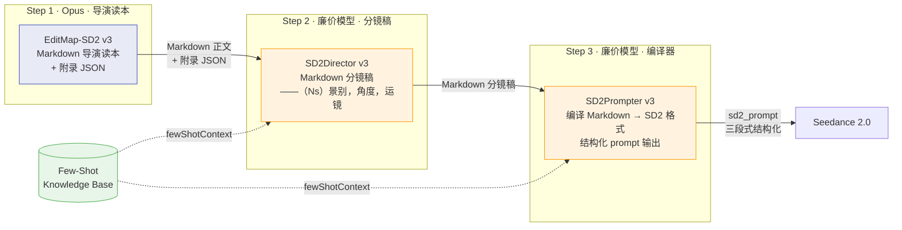

# SD2Workflow v3 架构升级计划

**核心变更：从 JSON-heavy 填表模式 → Markdown 导演读本 + 轻量 JSON 附录**
**日期：2026-04-16**
**基于 v2 对比分析 + leji-v1/v2 实战验证**

---

## 一、v3 升级动因

### 1.1 v2 暴露的根本问题

v2 在概念维度上做了大量正确的扩充（情绪驱动、声画分离、动态禁用词、资产时间线、节奏型细化、对白压缩等），但编码方式选择了 **JSON 字段膨胀**。实际测试暴露以下问题：

| 问题 | 表现 | 根因 |
|------|------|------|
| LLM "填表"心态 | 生成的 Block 像在"完成表单"，缺乏导演因果推理 | JSON 字段原子化隔离了本应串联的信息 |
| `@图N` 映射错位 | 文本中 `@图1（秦若岚）` 与 `asset_tag_mapping` 实际映射不一致 | 全局映射表 + 多处引用 = 一致性维护成本高 |
| 风格先验过硬 | 反复写 "冷调偏青、高反差、低饱和" 导致整集被统一风格绑死 | JSON 字段鼓励"复制粘贴"而非"场次内推理" |
| 叙事控制力不足 | 镜头细节很满但戏剧重心不稳 | 缺少 "为什么这样拍" 的上游因果传递 |
| Schema 膨胀 | EditMap 40+ 字段，每增新维度就加新字段 | JSON 的结构性限制 |

### 1.2 Fengxing v2 输出的启示

对比 `leji-v2`（纯 Fengxing 管线）的输出后，发现其核心优势不在"文风更华丽"，而在于**信息架构**：

1. **先把"这集怎么讲"讲清楚，再往下传** — `01_标注剧本` 锁定组骨架、声画分离策略、禁用词、道具时间线
2. **导演意图嵌在叙事流中** — "权力关系→空间锚点→调度弧线→光影基准"自然串联
3. **`——（Ns）景别，角度，运镜——描述`** — 一行即时间片，无需 6-7 个 JSON 字段
4. **每组重复完整角色描述** — 不依赖全局映射表，杜绝 `@图N` 错位

### 1.3 v3 的核心命题

> **概念保留 v2 的全部扩充，编码方式从 JSON 表单转向 Markdown 导演读本。**

具体而言：
- **EditMap**（第 1 步）：输出 Markdown 导演读本 + 附录轻量 JSON
- **Director**（第 2 步）：输出 Markdown 分镜稿（`——（Ns）景别，角度，运镜` 格式）
- **Prompter**（第 3 步）：输出结构化 SD2 格式 prompt（**保持不变**，引擎需要）

---

## 二、三层架构设计

### 2.1 架构总览



### 2.2 各阶段输入输出格式对比

| 阶段 | v2 输入 | v2 输出 | v3 输入 | v3 输出 |
|------|--------|--------|--------|--------|
| EditMap | JSON 输入 | **重 JSON**（40+ 字段） | JSON 输入（不变） | **Markdown 导演读本** + 附录轻量 JSON |
| Director | JSON Block | **JSON 时间片** | Markdown 段落 + 附录 JSON | **Markdown 分镜稿**（`——（Ns）` 格式） |
| Prompter | JSON 时间片 | SD2 三段式 | Markdown 分镜稿 + 资产映射 | SD2 三段式（**不变**） |

### 2.3 "附录 JSON" 的定位

EditMap 的 Markdown 正文承载所有叙事、导演意图、情绪分析。**附录 JSON 只包含程序必需的硬数据**：

```json
{
  "meta": {
    "title": "乐极生悲·第一集",
    "genre": "revenge",
    "target_duration_sec": 120,
    "total_duration_sec": 120,
    "parsed_brief": { "..." },
    "asset_tag_mapping": [
      {"tag": "@图1", "asset_type": "character", "asset_id": "秦若岚", "asset_description": "..."}
    ]
  },
  "block_index": [
    {"id": "B01", "start_sec": 0, "end_sec": 10, "duration": 10, "scene_bucket": "transition", "scene_archetype": "opening_reveal"},
    {"id": "B02", "start_sec": 10, "end_sec": 22, "duration": 12, "scene_bucket": "dialogue", "scene_archetype": "voice_image_split"}
  ],
  "diagnosis": {
    "opening_hook_check_3s": true,
    "core_reversal_check": true,
    "first_reversal_timing_check": true,
    "skeleton_integrity_check": true,
    "warning_msg": null
  }
}
```

**附录 JSON 的职责边界**：
- ✅ 资产映射表（`asset_tag_mapping`）— 程序需要绑定媒体文件
- ✅ Block 索引（`block_index`）— 程序需要时间轴数据
- ✅ 诊断项（`diagnosis`）— 程序需要自动校验
- ✅ 解析后的 brief（`parsed_brief`）— 下游需要继承参数
- ✅ few-shot 检索键（`scene_bucket` / `scene_archetype`）— 编排层需要路由
- ❌ 情绪分析、声画分离策略、导演意图、对白压缩 — 全部在 Markdown 正文中

---

## 三、EditMap-SD2 v3 输出格式规范

### 3.1 Markdown 正文结构

```markdown
# 《{标题}》第{N}集 · 导演读本

**本集主角：{角色名}**（{一句话角色简介}——所有事件围绕 TA 的视角展开）

---

## 【本集组数判断】

**本集总组数：** {N} 组
**判断依据：** {为什么是这个数，哪些段落合并/压缩了，对白密度分析}

**⚠️ 时长风险提示：** {若对白量超出单集容量，说明压缩策略}

## 【组骨架】（下游 Director / Prompter 禁止增删拆合）

### 第1组 → [场{X}-{Y}] {核心事件}（{叙事职责}·{节奏标注}）
### 第2组 → [场{X}-{Y}] {核心事件}（{叙事职责}·{节奏标注}）
...

---

## 道具时间线

| 道具 | 出现组 | 状态 | 备注 |
|------|-------|------|------|
| ... | ... | ... | ... |

---

## 禁用词清单

| 禁用词 | 理由 | 适用范围 |
|-------|------|---------|
| 泛白 | SD2 引擎禁止皮肤色值描写 | 全集 |
| 卡通化 | 与真人电影渲染风格冲突 | 全集 |
| ... | ... | ... |

---

## 场次 {X}-{Y} ｜ {场景名} ｜ {时间/光线}

**本场核心冲突：** {一句话}
**调度衔接：** {承接上一场的什么}
**在场人物确认：** {列出所有角色及出现范围}
**节奏走势设计：** {情绪弧线描述}
**情绪主体：** {角色名}（{为什么是 TA}）

**光影基准：**
- {场景主光源描述}
- {角色光影设计}
- {与其他场次的光影对比关系}

---

### 段落 {N}（第{M}组）

**节奏标注：{节奏档位 + 一句话策略}**
**情绪主体：** {角色名}（{为什么——必须说明因果}）

{原始剧本片段，保持原格式}

**视觉增强：**
- {镜头级视觉设计建议}
- {声画分离设计（如有）}
- {特定动作/道具的拍摄策略}

**声画分离设计：** {如果本段有对白密集段，说明如何分层——谁的声音 + 谁的画面}

**主角反应节点：** {观众必须看到的核心反应瞬间}

**⚠️ 时长压缩建议：** {如果对白超长，给出具体压缩策略}

---

## 【尾部校验块】

### 组数校验
- brain 判断组数：{N}
- 本文件骨架行实际计数：{N}
- 是否一致：✓/✗

### 禁用词逐条扫描报告
{逐词扫描结果表格}

### 扫描结论
- 禁用词命中数：{N}
- 落盘许可：✓/✗
```

### 3.2 v2 概念在 v3 中的对应关系

以下是 v2 的 JSON 字段如何"融入"v3 的 Markdown 自然语言：

| v2 JSON 字段 | v3 融入位置 | 融入方式 |
|-------------|-----------|---------|
| `focus_subject` | 每段 **情绪主体：** | 自然语言 + 括号内因果解释 |
| `focus_subject_rationale` | 同上，括号内 | 与 focus_subject 合并 |
| `emotion_arc` | 每段 **情绪主体：** 或 **视觉增强：** | 嵌入"从 X 过渡到 Y"的自然描述 |
| `protagonist_reaction_node` | 每段 **主角反应节点：** | 独立固定格式行 |
| `director_note` | 每段 **节奏标注：** | 融入节奏策略描述 |
| `rhythm_tier` | 组骨架标注 + 每段 **节奏标注：** | 如"1档慢蓄力"、"3档快切转折" |
| `audio_visual_split` | 每段 **声画分离设计：** | 独立固定格式行（含对白时填写） |
| `dialogue_compression` | 每段 **⚠️ 时长压缩建议：** | 独立固定格式行（超时触发） |
| `asset_timeline` | **道具时间线** 表格 | 全局 section |
| `episode_forbidden_words` | **禁用词清单** 表格 | 全局 section |
| `block_skeleton` | **组骨架** section | 固定格式骨架行 |
| `narrative.phase` | 组骨架标注括号内 | 如"（转折·暗线启动）" |
| `beats[]` | 每段正文中自然出现 | 不再单独列为字段 |
| `sd2_scene_type` + `rhythm_tier` | **节奏标注** 行 | 如"对峙型·3档" |
| `visuals.*` | **光影基准** section + 每段 **视觉增强** | 自然语言 |
| `continuity_hints` | 每场 **调度衔接** + 每段 **视觉增强** | 自然串联 |
| `staging_constraints` | 每场 **调度前置分析** 中的空间布局 | 自然语言 |
| `block_forbidden_patterns` | **视觉增强** 中的禁止项 + **禁用词清单** | 自然融入 |
| `prompt_risk_flags` | **⚠️** 标记自然嵌入 | 出现在相关段落旁 |

### 3.3 Block 时长规则（v3）

**每组时长范围：5-16s，按叙事需求分配。**

| 时长范围 | 典型用途 |
|---------|---------|
| 5-7s | 冲击帧/定格/闪回/纯反应/尾卡 Cliff |
| 8-12s | 标准叙事段（1-2 句对白 + 反应 + 建立） |
| 13-16s | 对白密集段/声画分离复杂段落 |

**硬约束**：
- `sum(所有组时长) == episodeDuration`（总时长守恒）
- 每组时长在附录 JSON 的 `block_index` 中有精确值
- 若 `workflowControls.blockDurationRange` 存在，优先遵守

**与 v2 的区别**：不再有"默认 15s"的概念。时长由叙事密度决定，在组骨架阶段就确定。

### 3.4 节奏档位约定（v3 新增）

借鉴 Fengxing 的节奏信号系统，v3 在组骨架和每段标注中使用 **5 档节奏信号**：

| 档位 | 含义 | 典型特征 | 推荐镜头密度 |
|------|------|---------|------------|
| 1档 | 慢蓄力：内心消化、沉默、情绪沉淀 | 长镜头/慢推 | 低 |
| 2档 | 铺垫过渡：信息交代、环境建立 | 中景为主 | 低-中 |
| 3档 | 转折对峙：冲突升级、态度转变 | 正反打交替 | 中 |
| 4档 | 爆发释放：爽点兑现、动作冲击 | 快切碎镜 | 高 |
| 5档 | 骤停定格：Cliff 悬停、反讽定格 | 定格/分屏 | 极低（1-2 镜） |

**使用方式**：在组骨架和段落标注中自然引用，如：
- `【节奏信号】1档慢蓄力 · 声画分离 · 母亲VO叠加双线画面`
- `【节奏信号】3档转折 · 快切暧昧暗示+电话打断`

---

## 四、SD2Director v3 输出格式规范

### 4.1 整体结构

```markdown
# 《{标题}》第{N}集 · 导演分镜稿

**本集主角：{角色名}**
**组数锁定：EditMap {N} 组 → Director {N} 组（1:1 锁定）**
**画幅：{竖屏 9:16 / 横屏 16:9}**
**目标时长：{N}s | 目标镜头数：{N}**

---

## 道具时间线
{从 EditMap 继承，可补充状态细化}

---

## 场次 {X}-{Y} | {场景名} | {时间/光线} 【{画幅}】

**本场核心冲突：** {继承自 EditMap}
**调度衔接：** {继承自 EditMap}
**在场人物确认：** {继承自 EditMap}

---

【调度前置分析】
权力关系：{角色间力量对比}
空间布局：{物理空间描述}
调度弧线：{角色运动路径}
空间锚点：{关键视觉锚点}
光影基准：{主光源 + 辅助光}

---

### 第{M}组 → {继承自 EditMap 骨架} | 时长：{N}s

场景环境：{详细环境描述}
道具：{本组涉及道具}
音效前置：{如有}

【节奏信号】{档位} · {策略}

（{N}s）{景别}，{角度}，{运镜}——{画面内容描述。光线描述。}
——（{N}s）切镜，{景别}，{角度}，{运镜}——{画面内容描述。光线描述。}
——（{N}s）切镜，{景别}，{角度}，{运镜}——{画面内容描述。光线描述。}

**{角色}：** {对白}

| 光影：{光影总结} | 音效：[底层]{环境}——[中层]{动作}——[顶层]{人声/音乐} |

---
```

### 4.2 时间片格式约定

**核心格式**：`——（{时长}s）切镜，{景别}，{角度}，{运镜}——{画面描述}`

| 组件 | 枚举/规则 |
|------|---------|
| 时长 | 整数秒，所有时间片之和 == 组时长 |
| 景别 | `全景` / `中景` / `近景` / `特写` / `大特写`；可用 `→` 表示景别变化如 `中景→近景` |
| 角度 | `平视` / `微仰` / `微俯` / `俯拍` / `仰拍` |
| 运镜 | `固定` / `缓慢推镜` / `缓慢拉镜` / `缓慢横移` / `缓慢上移` / `缓慢下移` / `跟随` / `手持` |
| 切镜 | 首个时间片无前缀；后续以 `——` 连接并标注 `切镜` |

**与 v2 JSON 时间片的对应**：

| v2 JSON 字段 | v3 自然语言对应 |
|-------------|--------------|
| `slice_function` | 通过画面描述自然体现 |
| `camera_intent` | `{运镜}` 部分 |
| `staging_plan` | 画面描述中的角色位置 |
| `continuity_guardrails` | 每组末尾光影表 + 音效表 |

### 4.3 Director 从 EditMap 继承的规则

1. **组数 1:1 锁定**：Director 的组数 == EditMap 的骨架行数，禁止增删拆合
2. **组骨架标题继承**：EditMap 的 `### 第N组 → [场X-Y] {事件}` 必须作为 Director 每组的标题前缀
3. **情绪主体继承**：EditMap 标注的情绪主体和反应节点，Director 必须在镜头分配中体现
4. **声画分离策略继承**：EditMap 标注的声画分离设计，Director 必须执行（如 `reaction_focus` → 对白时画面切听者）
5. **禁用词继承**：EditMap 的禁用词清单，Director 在分镜稿中不得出现
6. **时长继承**：每组时长从 EditMap 附录 JSON 的 `block_index` 读取

---

## 五、SD2Prompter v3 变更

### 5.1 核心变化：从 "JSON 消费者" 变为 "Markdown 编译器"

Prompter v3 的输入从 Director 的 JSON 变为 Director 的 **Markdown 分镜稿**。它的职责是：

1. **读取 Director 分镜稿**中的时间片（`——（Ns）景别，角度，运镜——描述`）
2. **读取 EditMap 附录 JSON** 中的 `asset_tag_mapping`
3. **编译为 SD2 三段式 prompt**：
   - 第一段：全局设定（角色 `@图N` 声明 + 场景 + 风格约束）
   - 第二段：时间片故事板（从 Director 的自然语言时间片编译）
   - 第三段：质量/风格约束

### 5.2 输出格式（不变）

Prompter 的输出仍然是 SD2 引擎需要的结构化格式，这部分**不做架构变更**。

### 5.3 `@图N` 一致性强校验（v3 新增）

**编译时硬校验**：Prompter 在生成 prompt 文本后，必须执行以下校验：
- 文本中所有 `@图N` 必须在 `asset_tag_mapping` 中存在
- 文本中所有 `@图N（角色名）` 的角色名必须与 `asset_tag_mapping` 中 `asset_id` 一致
- 不一致 → 产物作废，不得输出

---

## 六、FSKB（Few-Shot Knowledge Base）在 v3 中的变化

### 6.1 检索机制不变

`scene_bucket` + `scene_archetype` → 路由到对应 bucket → 注入 `fewShotContext` 的机制**完全保留**。这是我们相对 Fengxing 的架构优势。

### 6.2 检索键来源变化

v2 中检索键是 EditMap JSON 的 `few_shot_retrieval` 字段。v3 中检索键来自 **EditMap 附录 JSON 的 `block_index`**：

```json
"block_index": [
  {"id": "B01", "start_sec": 0, "end_sec": 10, "duration": 10,
   "scene_bucket": "transition", "scene_archetype": "opening_reveal",
   "structural_tags": ["single_subject", "entrance", "reverse_light"],
   "injection_goals": ["scan_path_template", "atmosphere_interaction"]}
]
```

### 6.3 fewShotContext 注入点

- **Director 阶段**：按 `scene_bucket` + `scene_archetype` 注入对应的运镜模板和创作指导
- **Prompter 阶段**：按 `scene_bucket` 注入对应的 prompt 写法示例和 `structural_notes`

---

## 七、与 v2 的差异总结

### 7.1 保留的

| 项目 | 说明 |
|------|------|
| 3 阶段管线 | EditMap → Director → Prompter，模型分层策略不变 |
| FSKB 系统 | scene_bucket + scene_archetype 路由检索不变 |
| 资产白名单 | assetManifest 机制不变 |
| directorBrief 解析 | 意图解析 + 优先级链不变 |
| 诊断项 | 骨架校验、钩子检查、反转时序等不变（在附录 JSON 中） |
| 引擎级硬规则 | 8 条引擎硬规则（禁比喻、禁皮肤变色等）不变 |
| Block 时长 5-16s | 弹性时长范围保留，总时长守恒 |
| 所有 v2 新增概念 | 情绪驱动、声画分离、对白压缩、禁用词、资产时间线、节奏档位 |

### 7.2 变更的

| 项目 | v2 | v3 |
|------|----|----|
| EditMap 输出格式 | 重 JSON（40+ 字段） | Markdown 导演读本 + 附录轻量 JSON |
| Director 输出格式 | JSON 时间片 | Markdown 分镜稿（`——（Ns）` 格式） |
| 概念编码方式 | JSON 字段（`emotion_arc`, `audio_visual_split` 等） | Markdown 固定格式行（**情绪主体：**、**声画分离设计：** 等） |
| 角色引用方式 | 依赖 `@图N` 全局映射 | 每组重复完整角色描述 + `@图N` 仅在 Prompter 编译时使用 |
| Block 数量决策 | `round(episodeDuration / 15)` + 弹性 | 纯叙事驱动，无固定公式 |
| 时长分配 | 先均分时间槽再映射叙事 | 先标注叙事 beat 再分配时长 |
| 节奏信号 | `rhythm_tier` 枚举字段 | 5 档自然语言标注 |
| 导演意图传递 | `director_note` 字段 | **节奏标注** 行自然融入 |

### 7.3 废弃的

| 项目 | 废弃理由 |
|------|---------|
| v2 EditMap 的纯 JSON 输出模式 | 被 Markdown + 附录 JSON 取代 |
| v2 Director 的纯 JSON 输出模式 | 被 Markdown 分镜稿取代 |
| `focus_subject_rationale` 独立字段 | 融入 **情绪主体：** 的括号说明 |
| `emotion_arc` 独立字段 | 融入 **情绪主体：** 或 **视觉增强：** |
| `protagonist_reaction_node` 独立字段 | 变为 **主角反应节点：** 固定格式行 |
| `audio_visual_split` JSON 结构 | 变为 **声画分离设计：** 固定格式行 |
| `dialogue_compression` JSON 结构 | 变为 **⚠️ 时长压缩建议：** 固定格式行 |

---

## 八、v3 文件命名与目录结构

```
1_SD2Workflow/
├── 1_EditMap-SD2/
│   ├── 1_EditMap-SD2-v1.md          # 保留（原始版本）
│   ├── 1_EditMap-SD2-v2.md          # 保留（JSON 字段扩充版）
│   └── 1_EditMap-SD2-v3.md          # 🆕 Markdown 导演读本版
├── 2_SD2Director/
│   ├── 2_SD2Director-v1.md          # 保留（v2 JSON 版）
│   └── 2_SD2Director-v3.md          # 🆕 Markdown 分镜稿版
├── 2_SD2Prompter/                    # 目录编号保持兼容
│   ├── 2_SD2Prompter-v1.md          # 保留
│   ├── 2_SD2Prompter-v2.md          # 保留
│   └── 2_SD2Prompter-v3.md          # 🆕 Markdown 编译器版
├── 3_FewShotKnowledgeBase/
│   ├── 0_Retrieval-Contract-v1.md
│   ├── 0_Retrieval-Contract-v2.md
│   ├── 1_Dialogue-v1.md
│   ├── 2_Emotion-v1.md
│   ├── 3_Reveal-v1.md
│   ├── 4_Action-v1.md
│   ├── 5_Transition-v1.md
│   └── 6_Memory-v1.md
│   （FSKB 内容暂不升级 v3，等 prompt 稳定后按需迭代）
└── docs/
    ├── SD2Workflow-v2-升级计划.md     # 保留
    └── SD2Workflow-v3-架构升级计划.md  # 🆕 本文档
```

---

## 九、接口与迁移规范（v3 工程落地补件）

> 本章解决"架构蓝图到工程落地"的 gap：落盘格式、payload 组装、`@图N` 统一、验收方案。

### 9.1 落盘格式：JSON 包 Markdown（单对象方案）

**问题**：现有代码全链路使用 `jsonObject: true`（OpenAI response_format），LLM 返回单个 JSON 对象。v3 若改为纯 Markdown 输出，所有解析代码都要重写。

**决策**：LLM 仍然返回 **单个 JSON 对象**，但内部包含 `markdown_body` 字符串字段 + 结构化附录字段。代码侧只需改字段读取路径，不需要改 response_format。

#### EditMap v3 的实际 LLM 返回格式

```json
{
  "markdown_body": "# 《乐极生悲》第一集 · 导演读本\n\n**本集主角：秦若岚**...\n\n## 【本集组数判断】\n\n...",

  "appendix": {
    "meta": {
      "title": "乐极生悲·第一集",
      "genre": "revenge",
      "target_duration_sec": 120,
      "total_duration_sec": 120,
      "parsed_brief": {
        "source": "directorBrief",
        "episodeDuration": 120,
        "episodeShotCount": 60,
        "genre": "revenge",
        "renderingStyle": "真人电影",
        "artStyle": "冷调偏青",
        "aspectRatio": "9:16",
        "motionBias": "steady",
        "extraConstraints": []
      },
      "asset_tag_mapping": [
        {"tag": "@图1", "asset_type": "character", "asset_id": "秦若岚", "asset_description": "三十岁左右华人女性，知性短发齐耳，无框眼镜"},
        {"tag": "@图2", "asset_type": "character", "asset_id": "赵凯", "asset_description": "三十五岁左右华人男性，五官端正面容精明"}
      ],
      "episode_forbidden_words": [
        {"word": "泛白", "reason": "SD2 引擎禁止皮肤色值描写"},
        {"word": "卡通化", "reason": "与真人电影渲染风格冲突"}
      ]
    },
    "block_index": [
      {
        "id": "B01", "start_sec": 0, "end_sec": 10, "duration": 10,
        "scene_bucket": "transition", "scene_archetype": "opening_reveal",
        "structural_tags": ["single_subject", "entrance", "reverse_light"],
        "injection_goals": ["scan_path_template", "atmosphere_interaction"]
      },
      {
        "id": "B02", "start_sec": 10, "end_sec": 22, "duration": 12,
        "scene_bucket": "dialogue", "scene_archetype": "voice_image_split",
        "structural_tags": ["voice_image_split", "listener_reaction"],
        "injection_goals": ["voice_image_split_template", "silence_density"]
      }
    ],
    "diagnosis": {
      "opening_hook_check_3s": true,
      "core_reversal_check": true,
      "first_reversal_timing_check": true,
      "ending_cliff_check": true,
      "skeleton_integrity_check": true,
      "fragmentation_check": true,
      "beat_density_check": true,
      "warning_msg": null,
      "missing_manifest_assets": []
    }
  }
}
```

#### Director v3 的实际 LLM 返回格式

```json
{
  "markdown_body": "# 《乐极生悲》第一集 · 导演分镜稿\n\n**本集主角：秦若岚**\n**组数锁定：...**\n\n...",

  "appendix": {
    "shot_count_per_block": [
      {"id": "B01", "shot_count": 4, "duration": 10},
      {"id": "B02", "shot_count": 4, "duration": 12}
    ],
    "total_shot_count": 41,
    "total_duration_sec": 120,
    "forbidden_words_scan": {
      "scanned_count": 12,
      "hits": 0,
      "pass": true
    }
  }
}
```

#### Prompter v3 的输入/输出

Prompter 的 **输入** 是编排层组装的 payload，包含：
- Director 的 `markdown_body`（当前 Block 对应段落，由编排层截取）
- EditMap 附录的 `asset_tag_mapping`
- FSKB 注入的 `fewShotContext`
- 全局 `episode_forbidden_words`

Prompter 的 **输出** 格式不变（SD2 三段式结构化 prompt），仍然是 `jsonObject: true`。

### 9.2 Payload 组装迁移合同

#### 9.2.1 v2 → v3 字段映射（EditMap → Director payload）

| v2 读取路径 | v3 读取路径 | 说明 |
|------------|-----------|------|
| `editMap.blocks[i]` | `editMap.appendix.block_index[i]` + `editMap.markdown_body` 中对应段落 | block_index 提供结构数据，markdown_body 提供叙事内容 |
| `editMap.blocks[i].few_shot_retrieval.scene_bucket` | `editMap.appendix.block_index[i].scene_bucket` | 检索键移到 block_index |
| `editMap.blocks[i].few_shot_retrieval.scene_archetype` | `editMap.appendix.block_index[i].scene_archetype` | 同上 |
| `editMap.blocks[i].few_shot_retrieval.structural_tags` | `editMap.appendix.block_index[i].structural_tags` | 同上 |
| `editMap.blocks[i].few_shot_retrieval.injection_goals` | `editMap.appendix.block_index[i].injection_goals` | 同上 |
| `editMap.meta.asset_tag_mapping` | `editMap.appendix.meta.asset_tag_mapping` | 路径变深一层 |
| `editMap.meta.parsed_brief` | `editMap.appendix.meta.parsed_brief` | 同上 |
| `editMap.meta.genre` | `editMap.appendix.meta.genre` | 同上 |
| `editMap.blocks[i].time.start_sec` | `editMap.appendix.block_index[i].start_sec` | 扁平化 |
| `editMap.blocks[i].time.duration` | `editMap.appendix.block_index[i].duration` | 扁平化 |
| `editMap.diagnosis.*` | `editMap.appendix.diagnosis.*` | 路径变深一层 |

#### 9.2.2 EditMap markdown_body 段落截取规则

编排层需要为每个 Block 从 `markdown_body` 中截取对应段落作为 Director 的输入。截取锚点：

```
起始：`### 段落 {N}（第{M}组）` 或 `### 第{M}组`
终止：下一个 `### 段落` / `### 第` / `## 场次` / `## 【尾部校验块】` 之前
```

**容错**：若 markdown_body 中段落数与 block_index 长度不一致，标记为解析错误，回退到 v2 管线。

#### 9.2.3 Director → Prompter payload 组装

编排层从 Director 的 `markdown_body` 中截取当前 Block 对应段落（截取锚点同上，用 `### 第{M}组`），加上：

| 字段 | 来源 |
|------|------|
| `director_shot_list` | Director markdown_body 中当前 Block 段落（含时间片） |
| `asset_tag_mapping` | EditMap `appendix.meta.asset_tag_mapping`（透传） |
| `fewShotContext` | 编排层按 block_index 的检索键从 FSKB 检索 |
| `episode_forbidden_words` | EditMap `appendix.meta.episode_forbidden_words`（透传） |
| `renderingStyle` | EditMap `appendix.meta.parsed_brief.renderingStyle`（透传） |
| `artStyle` | EditMap `appendix.meta.parsed_brief.artStyle`（透传） |
| `block_time` | EditMap `appendix.block_index[i]`（`start_sec`, `end_sec`, `duration`） |

### 9.3 `@图N` 统一规范

**v3 定论：全局唯一编号，全流程一致。废弃 block 内重编号。**

| 阶段 | `@图N` 规则 |
|------|-----------|
| EditMap | 在 `appendix.meta.asset_tag_mapping` 中定义全局映射。Markdown 正文中每组用**完整角色描述**（不用 `@图N`） |
| Director | Markdown 正文中每组用**完整角色描述**（不用 `@图N`）。附录中不涉及 `@图N` |
| Prompter | 编译时从 `asset_tag_mapping` 读取映射，在 SD2 prompt 第一段做 `@图N` 声明。**全局编号，不重编号** |
| 编排层 | `@图N` 的实际媒体绑定由编排层处理，按 `asset_tag_mapping` 的顺序排列 reference pack |

**废弃规则**：v2 Prompter 中的"每个 Block 内从 @图1 重新编号"规则在 v3 中**明确废弃**。

**理由**：
- block 内重编号是 v2 为了"每组独立消费"而设计的，但实际导致了全局映射错位
- v3 的 Prompter 输入已包含完整 `asset_tag_mapping`，全局编号不增加复杂度
- SD2 引擎本身支持全局 `@图N` 引用，无需 block 内重编号

### 9.4 版本切换方案

在 `fv_autovidu` 的 `run_sd2_pipeline.mjs` 中增加 `--sd2-version` 参数：

```bash
# 使用 v2 管线（默认，保持现有行为）
node scripts/sd2_pipeline/run_sd2_pipeline.mjs --episode=ep01 --sd2-version=v2

# 使用 v3 管线
node scripts/sd2_pipeline/run_sd2_pipeline.mjs --episode=ep01 --sd2-version=v3
```

**实现方式**：
- `--sd2-version=v2`：使用现有 prompt 文件（v2）、现有 payload builder、现有解析逻辑
- `--sd2-version=v3`：使用 v3 prompt 文件、v3 payload builder（读 `appendix.*`）、v3 Markdown 截取逻辑
- 两套管线**共享** FSKB、assetManifest、yunwu_chat 调用层
- v2 是默认值，v3 需要显式指定，直到 v3 验收通过后切换默认值

**回退**：任何阶段出问题，切回 `--sd2-version=v2` 即可。不需要代码回滚。

### 9.5 验收方案

#### 9.5.1 Fixture 集

从现有测试素材中选取 3 个覆盖不同题材的 episode 作为 fixture：

| Fixture | 题材 | 时长 | 对白密度 | 验收重点 |
|---------|------|------|---------|---------|
| `leji-ep01` | revenge（复仇/医疗） | 120s | 极高（550字+） | 声画分离、对白压缩、情绪驱动 |
| 待定（甜宠类） | sweet_romance | 120s | 中 | 钩子质量、Cliff 悬停、节奏档位 |
| 待定（玄幻/动作类） | fantasy | 60s | 低 | 特效段、动作节奏、资产状态时间线 |

#### 9.5.2 对比指标

每个 fixture 分别跑 v2 和 v3 管线，人工对比以下维度：

| 维度 | 评分方式 | 合格标准 |
|------|---------|---------|
| **叙事控制力** | 钩子质量、反转时序、节奏分布 | v3 ≥ v2 |
| **情绪焦点准确性** | 每组的情绪主体是否正确、反应节点是否被镜头覆盖 | v3 明显优于 v2 |
| **声画分离设计** | 对白密集段是否有声画分离策略、是否被 Director 执行 | v3 有设计，v2 无 |
| **`@图N` 一致性** | prompt 文本中的 `@图N（角色名）` 是否与映射表一致 | v3 零错位 |
| **禁用词命中** | prompt 文本中是否包含禁用词 | v3 零命中 |
| **时长守恒** | 所有组时长之和是否等于 episodeDuration | v3 精确守恒 |
| **SD2 引擎合规** | 最终 prompt 是否符合 SD2 三段式、`@图N` 引用、禁比喻等规则 | v3 ≥ v2 |

#### 9.5.3 合格门槛

- 3 个 fixture 中至少 2 个在所有维度上 v3 ≥ v2
- `@图N` 一致性和禁用词命中必须为零错误（硬性）
- 叙事控制力至少 1 个 fixture 明显优于 v2

---

## 十、实施计划（更新版）

### 10.1 阶段划分

| 阶段 | 内容 | 优先级 | 前置依赖 | 预估工作量 |
|------|------|--------|---------|----------|
| **Phase 0** | 本文档 + 接口规范（已完成） | P0 | — | ✅ |
| **Phase 1** | 编写 `1_EditMap-SD2-v3.md` prompt | P0 | Phase 0 | 大 |
| **Phase 2** | 编写 `2_SD2Director-v3.md` prompt | P0 | Phase 1 | 大 |
| **Phase 3** | 编写 `2_SD2Prompter-v3.md` prompt（含 `@图N` 全局编号） | P0 | Phase 2 | 中 |
| **Phase 4** | `fv_autovidu` 管线适配：v3 payload builder + Markdown 截取 + `--sd2-version` 开关 | P0 | Phase 1-3 | 中 |
| **Phase 5** | Fixture 验收：3 个 episode 双跑对比 | P0 | Phase 4 | 中 |
| **Phase 6** | v3 成为默认版本 + FSKB 按需适配 | P1 | Phase 5 通过 | 小 |

### 10.2 建议执行顺序

1. **Phase 1：EditMap v3 prompt** — 最关键一步。写完后立即跑 leji-ep01 看 Markdown 输出 + 附录 JSON 质量
2. **Phase 2-3：Director + Prompter v3 prompt** — 可基本并行（Director 先行 1 天即可）
3. **Phase 4：管线适配** — 重点是 `--sd2-version` 开关 + v3 payload builder + Markdown 段落截取
4. **Phase 5：Fixture 验收** — 3 个 episode 双跑，按 9.5.2 指标表打分
5. **Phase 6：切换默认版本** — 验收通过后 `--sd2-version` 默认值从 v2 改为 v3

### 10.3 风险控制

| 风险 | 应对 |
|------|------|
| Markdown 输出格式不稳定 | prompt 中强制固定格式行（`**情绪主体：**`、`### 第N组 →`）；附录 JSON 做硬校验兜底 |
| 附录 JSON 与 Markdown 正文不一致 | prompt 中要求"先写正文，最后从正文中提取附录 JSON"；编排层校验 block_index 数量 == 正文段落数 |
| Director 消费 Markdown 丢失信息 | Director prompt 明确列出从 EditMap 继承的固定格式行清单 |
| Prompter 编译错误 | `@图N` 全局唯一 + 硬校验（不一致则产物作废） |
| v3 质量不如 v2 | `--sd2-version=v2` 一键回退，不影响线上流程 |
| Markdown 段落截取失败 | 截取失败时标记错误，回退到 v2 管线 |

---

## 十一、附录：v3 架构决策记录

### 决策 1：EditMap 输出 Markdown + 附录 JSON（混合模式）

**备选方案**：
- A) 纯 Markdown（如 Fengxing）
- B) 纯 JSON（如 v2）
- C) Markdown 正文 + 附录 JSON（选定）

**选择 C 的理由**：
- 纯 Markdown 无法满足程序化校验需求（骨架校验、时长守恒）
- 纯 JSON 导致 LLM 进入"填表模式"，丢失导演因果
- 混合模式：正文给 LLM 自由表达空间，附录给程序提供硬数据

### 决策 2：Block 时长保留硬约束

**理由**：最终输出是有时长限制的视频，不能完全自由。但约束方式从 "默认 15s ± 弹性" 变为 "5-16s 范围 + 总时长守恒"，给叙事更多空间。

### 决策 3：v2 新增概念融入自然语言而非保留为字段

**理由**：
- `emotion_arc: "震惊 → 压抑的愤怒"` 作为 JSON 字段是孤立信息
- `**情绪主体：** 苏晓（正在从震惊过渡到压抑的愤怒，观众需要看见她的微表情变化）` 作为自然语言携带了因果
- LLM 在自然语言中更容易做串联推理

### 决策 4：每组重复完整角色描述

**理由**：
- 消除 `@图N` 全局映射表的一致性风险
- `@图N` 仅在 Prompter 编译阶段使用（程序机械替换，不依赖 LLM 维护一致性）
- 代价是 token 冗余，但可靠性提升远大于成本增加

### 决策 5：`@图N` 全局唯一编号，废弃 block 内重编号

**背景**：v2 Prompter 要求"每个 Block 内从 @图1 重新编号"，导致全局映射错位 bug。

**决策**：v3 统一为全局唯一编号。EditMap 定义一次，全流程复用，Prompter 不再重编号。

**理由**：
- block 内重编号是 v2 为"每组独立消费"设计的，但实际导致了跨 block 映射错位
- 全局编号 + 编排层机械绑定是更可靠的方案
- SD2 引擎本身支持全局 `@图N` 引用

### 决策 6：JSON 包 Markdown（单对象方案）而非 raw .md + sidecar .json

**备选方案**：
- A) LLM 返回 raw Markdown 文件 + 单独的 sidecar JSON 文件
- B) LLM 返回单个 JSON，内含 `markdown_body` + `appendix`（选定）

**选择 B 的理由**：
- 现有代码全链路使用 `jsonObject: true`，方案 B 只需改字段读取路径，不需要改 response_format
- 方案 A 需要改 LLM 调用方式 + 新增文件 IO，工程成本大
- 方案 B 的 `markdown_body` 是字符串字段，LLM 在生成时仍然是自然语言思维，不影响创作质量
