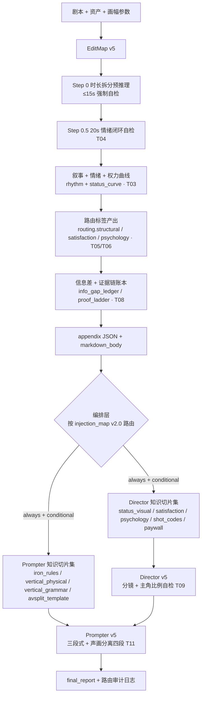

# SD2Workflow v5 升级计划 · 总览

**状态：规划中（Draft）**
**日期：2026-04-16**
**适用版本：SD2Workflow v5（在 v4 稳定版基础上做内容方法论升级）**
**文档导航：**

| 序号 | 文档 | 作用 |
|------|------|------|
| 00 | 本文件 | 总览、设计原则、任务索引、时间线 |
| 01 | `01_v5-知识库清洗与脱敏规范.md` | 外部参考脱敏规则、参考源代号表、原有文档改名清单、**CI 扫描单一真相源** |
| 02 | `02_v5-路由与切片扩展.md` | `injection_map.yaml v2.0` 设计、**Director/Prompter 微切片清单（17 份）**、路由维度扩展 |
| 03 | `03_tasks_P0_工程修复与基础爆点.md` | T01–T04 实施方案 |
| 04 | `04_tasks_P1_心理学与镜头字典.md` | T05–T08 实施方案 |
| 05 | `05_tasks_P2_竖屏与付费闭环.md` | T09–T12 实施方案（T07/T09 **v5.0 软门 / v5.1 升硬门**） |
| 06 | `06_v5-验收清单与回归基线.md` | 每个任务的验收 SQL / 正则 / 样例 + 回归集 |
| 07 | `07_v5-schema-冻结.md` | **🟩 字段契约唯一真相源**（EditMap / Director / Prompter appendix） |
| **08** | **`08_v5-编剧方法论切片.md`** | **🟩 EditMap 方法论静态挂载单一真相源**（editmap/ 6 份切片、拼接顺序、token 硬限、与 Stage 0 正交关系） |

---

## 一、一句话目标

> **v4 解决了「稳定产出」，v5 解决「爽点跑通 + 心理节奏对齐 + 镜头语言字典化」**。
> 实现手段：**主提示词只加钩子**，真正的方法论全部走 **KnowledgeSlices + 智能路由注入**，避免把规则硬编码进 Prompt 主体，保留 v4 的稳定性。

---

## 二、设计原则（与 v4 一脉相承）

1. **最小提示词原则**：EditMap / Director / Prompter 的主提示词在 v5 只加「字段扩展」「新路由标签枚举」「尾部自检增项」三类最小钩子；所有方法论内容全部落到 `4_KnowledgeSlices/` 下按需注入。
2. **路由可审计**：EditMap 在 `block_index[i].routing` 下产出结构化路由标签（**canonical 见 `07_` 文档**），编排层按 `injection_map.yaml v2.0` 机械匹配，注入行为可被日志完整复现。
3. **脱敏自洽**：任何外部参考源只能以**代号**出现（参考源 A / B / C），原文不得整段抄写，必须用我们自己的术语体系改写。详见 `01_` 文档。
4. **硬挡板 5 + 软门 5**：v5.0 保留 v4 的 `4–15s / 总时长容差 / 首部 Hook / 末部 CTA` 四个 EditMap 侧硬约束（H1–H3 + **新增 H4 `routing_schema_valid`**），并在 Prompter 侧新增 **H5**（`avsplit_format_check` + `bgm_no_name_check` 合并为一条硬门）；T04/T08/T09/T12 及 T07 均为**软门**（warning 不阻塞 CI）。完整清单见 `07_` §二。
5. **向后兼容 v4**：v5 产出的 `block_index[].duration`、`present_asset_ids[]`、`asset_tag_mapping`、三段式 SD2 prompt 结构保持不变；v5 只**追加字段**（见 `07_` 文档「字段契约」 + `01_` §4.2 速查索引）。v4 `structural_tags` 由 normalize 兼容层转成 `routing.structural`（3 个月过渡）。
6. **每份新增文件 ≤ 400 行 + 详尽注释 + box-sizing: border-box（代码中涉及 CSS 时）**（用户规则）。

---

## 三、v4 → v5 变更轴（What changes）

| 维度 | v4 现状 | v5 目标 |
|------|---------|---------|
| 时长控制 | 4–15s 硬约束 + Step 0 预推理 | 对齐：消除 prompt/切片/合同里残留的 5–16s 字样（T01） |
| 路由元数据 | `structure_fewshot` 标签口径不一致 | 合同层与切片层术语对齐，新增 `routing.validated` 自检字段（T02） |
| 权力/情绪曲线 | 只有 `rhythm_curve` 情绪强度 | 新增 `status_curve[]`（谁在上/下/持平），映射到视觉高低位（T03） |
| 情绪闭环 | 只有块级节奏，没有 15–25s 微闭环 | Step 0.5：闭环自检（Hook→压迫→锁死→兑现→悬念）（T04） |
| 爽点结构 | 无显式爽点标签 | 爽点三层模型（母题/触发器/兑现）标签库（T05） |
| 心理学 | 无模块库 | 心理学武器库切片（六大功能组）按路由注入（T06） |
| 镜头语言 | 自由描述 | 镜头编码手册切片（A/B/C/D 四大类），Director 引用（T07） |
| 信息差 | 仅叙事层隐含 | `info_gap_ledger[]` + `proof_ladder[]` 结构化账本（T08） |
| 主角主体性 | 无量化 | `protagonist_shot_ratio` 目标值 + Director 分镜比例自检（T09） |
| 竖屏语法 | 仅 `vertical_physical_rules` 物理铁律 | 新增 `vertical_grammar` 竖屏镜头字典切片（T10） |
| 声画分离 | Prompter 模板中零散 | 统一 `avsplit_template` 四段切模板切片（T11） |
| 付费/悬念结构 | Cliff 尾段一个 shot | 升级为 `paywall_scaffolding` 三级悬念脚手架切片（T12） |
| **编剧方法论层** | **v4 无；v5 早期也无** | **新增 6 份 editmap/ 方法论切片**（戏剧动作 / Want-Need / 视听化 + 爽点信号 / 开场钩子 / 双轨节奏 / 信息差与证据链），**全量静态挂载**到 EditMap system prompt（不走 injection_map 路由） |

---

## 四、12 项任务索引（挨个修复）

> 详细实施方案见 `03/04/05` 文档。每项任务含：**修改范围 / 接口增量 / 新增切片 / 回归样例 / 验收**。

| 编号 | 名称 | 优先级 | 主要改动面 | 新增切片（v5 最终微切片化） | v5.0 挡板 |
|------|------|--------|-----------|----------------------------|----------|
| T01 | 时长约束术语对齐（4–15s 唯一口径） | P0 | EditMap prompt / normalize / 合同 | 否 | 硬 |
| T02 | **Schema 冻结** + 路由标签对齐 | P0 | `07_` schema / injection_map v2.0 / structure_* 清洗 | 否 | 硬（`routing_schema_valid`） |
| T03 | 地位跷跷板 `status_curve` | P0 | EditMap appendix / 视觉高低位切片 | ✅ `director/status_visual_mapping.md` | 软（warning） |
| T04 | 20s 情绪闭环（Step 0.5 自检） | P0 | EditMap prompt / normalize diagnosis | 否（Prompt 钩子） | **软** |
| T05 | 爽点三层模型（母题/触发器/兑现） | P1 | EditMap routing / Director 注入 | ✅ 4 份 `director/satisfaction/*.md`（微切片） | 软（warning） |
| T06 | 心理学武器库（六功能组） | P1 | EditMap routing / Director 注入 | ✅ 6 份 `director/psychology/*.md`（微切片） | 软（warning） |
| T07 | 镜头编码手册（A/B/C/D 四类） | P1 | Director 切片注入 + `continuity_out.shot_codes_used[]` 自报 | ✅ 4 份 `director/shot_codes/*.md`（微切片） | **软（v5.0）/ v5.1 升硬** |
| T08 | 信息差账本 + 证据链阶梯（已按悬疑修宽） | P1 | EditMap appendix（`hidden_from_audience` + `retracted`） | 否（纯字段） | **软** |
| T09 | 主角主体性量化 `protagonist_shot_ratio` | P2 | EditMap target + Director `continuity_out` 自估 | 否（Prompt 钩子） | **软（v5.0）/ v5.1 升硬** |
| T10 | 竖屏镜头语言字典 | P2 | Prompter 切片注入 | ✅ `prompter/vertical_grammar.md` | 软（warning） |
| T11 | 声画分离四段切模板 | P2 | Prompter 切片注入 + `validation_report.avsplit_format_check` | ✅ `prompter/avsplit_template.md` | **硬**（四段齐） |
| T12 | 付费关卡脚手架（Cliff 升级） | P2 | EditMap `paywall_scaffolding` / Director 微切片 | ✅ 3 份 `director/paywall/*.md`（微切片） | **软** |

> 本表与 `07_` §二硬门/软门清单、`06_` §挡板矩阵保持一致；如冲突以 07 为准。

---

## 五、系统流程图（v5 全景）

---

## 六、v5 核心"不变量"（红线）

以下 v4 行为在 v5 **严禁回退**（回归测试挡板，详见 06 文档）：

| 不变量 | 触发条件 | v5 要求 |
|--------|---------|--------|
| Block 4–15s | 任意 block | 必须，违反直接丢弃重跑 |
| 总时长 ±10% | 全片 | 必须 |
| `asset_tag_mapping` 局部化 | Prompter 输入 | 必须，仅 `@图1..N` |
| 首 block 3–5s Hook | 首块首镜头 | 必须 |
| 末 block 末镜头 CTA/悬念 | 末块末镜头 | 必须（v5 升级为三级脚手架，T12） |
| 禁精确数值微操 | 全链路 prompt | 必须（光比/色温/镜头焦距除外） |
| 禁外部源名 | 全链路 prompt + 文档 | 必须（详见 01 文档） |
| **editmap/ 切片不进 injection_map** | `4_KnowledgeSlices/editmap/*.md` | **必须（EditMap 是路由器，路由器不能被自己路由；详见 08 文档 §一）** |
| **editmap/ 整体 token ≤ 12,000** | 6 份切片合计 | **必须（超限阻塞 PR；v5.0 GA 实测 ~10,981 tokens；详见 08 文档 §3.2）** |
| **Stage 0 与 editmap/ 切片正交** | Stage 0 Phase 1 / Phase 2 | **必须（Stage 0 不替代、不路由 editmap/ 切片；详见 Stage 0 §5.4）** |

---

## 七、交付时间线（修正版）

| 阶段 | 范围 | 工作量 | 产出 | 前置 |
|------|------|--------|------|------|
| **Week 0** | 文档定稿 + schema 冻结 + 脱敏清洗 + **存量切片清洗** + **3 份 golden sample** | **1.5 天** | v5 docs 全套（00-07）+ `docs/archive/`（`fengxing-video` 改名归档）+ `structure_constraints.md`/`structure_fewshot.md` 清洗 + golden × 3 | — |
| **Week 0.5**（追加） | **editmap/ 编剧方法论切片升级** | **1 天** | **6 份 editmap/ 切片（已完成） + `08_v5-编剧方法论切片.md`（已完成） + `.gitignore` 屏蔽外部原文（已完成） + injection_map 顶部声明（已完成）** | Week 0 |
| **Week 1** | P0：T01 / T02 / T03 / T04 | 2 天 | EditMap v5 prompt + `normalize_edit_map_sd2_v5.mjs`（含兼容层）+ `status_visual_mapping.md` + Step 0.5 自检 | Week 0.5 |
| **Week 2** | P1：T05 / T06 / T08 | 2 天 | **14 份微切片**（satisfaction × 4 + psychology × 6 + shot_codes × 4）+ `info_gap_ledger` / `proof_ladder` 审计代码 | Week 1 |
| **Week 3** | P2（v5.0 软门版）：T07 / T09 / T10 / T11 / T12 | 1.5 天 | Prompter v5 prompt + `vertical_grammar` + `avsplit_template` + 3 份 `paywall/*.md` + T07/T09 LLM 自报字段 | Week 2 |
| **Week 3.5**（追加） | **`call_editmap_sd2_v5.mjs` 实现 editmap/ 静态拼接** | **0.5 天** | 胶水代码（在 `fv_autovidu/scripts/sd2_pipeline/` 下） + leji-v5d 基准快照 | Week 3 |
| **Week 4** | 回归与灰度 | 1 天 | 3 题材 × 2 画幅回归跑通，固化基线 + D1–D8 达标（见 `06_` §十一） | Week 3.5 |
| **v5.1** | T00.5 `shots_contract[]` 结构化 + T07/T09 **升硬门** + **Stage 0 Phase 1 上线** | +3 天（独立 PR） | Director 产出结构化 shot 合同 / Prompter 精确计数 / Stage 0 normalizedScriptPackage 作为 EditMap 附加输入 | v5.0 稳定 |

**里程碑 v5.0 GA** = Week 0 全部交付 + 5 硬挡板（H1–H4 EditMap: duration / max_duration / skeleton / routing_schema_valid + H5 Prompter: avsplit_format_check ∧ bgm_no_name_check）全绿 + 回归集绿。
**软门**（T04/T07/T08/T09/T12）只记 warning，不阻塞。

> 相比初版，**Week 0 从 0.5 天扩到 1.5 天**（新增存量切片清洗 + 3 份 golden sample 是硬前置），Week 1 从 1.5 天扩到 2 天（新增 normalize 兼容层实现）。

---

## 八、与 v4 的兼容矩阵

| 场景 | 行为 |
|------|------|
| v4 appendix 字段读取 | 全部保留，不改名 |
| v4 切片 `structure_constraints / structure_fewshot / iron_rules_full / vertical_physical_rules` | 保留，术语对齐（T02） |
| v4 Prompter 局部 `@图N` | 保留 |
| v5 新增字段缺失 | 下游解析必须兜底为空 `[]` / `"none"`，不得崩溃 |
| 下游只读 v4 的消费者 | 可忽略 v5 新字段，行为不变 |

---

## 九、术语表（本 v5 文档包通用）

| 术语 | 定义 |
|------|------|
| **KnowledgeSlice** | 存放在 `4_KnowledgeSlices/{director,prompter}/` 下的 Markdown 片段，由 `injection_map.yaml v2.0` 按路由机械注入 |
| **路由标签** | `block_index[i].routing.{structural,satisfaction,psychology,shot_hint,paywall_level}`（canonical 见 07），每 block 一份，决定注入哪些切片 |
| **参考源 A / B / C** | 外部方法论参考的脱敏代号，见 01 文档 |
| **爽点母题** | 地位反转 / 掌控感 / 专属偏爱 / 即时正义 四选其一（或 none） |
| **心理学武器** | Hook / Retention / Payoff / Bonding / Relationship / Conversion 六功能组的具体心理效应单元 |
| **跷跷板曲线** | `status_curve[]`，每 block 标记主角相对对手的位置：上 / 中 / 下 |
| **证据链阶梯** | `proof_ladder[]`，证据从「传闻」→「物证」→「直接证词」→「自证」分层登记 |
| **情绪闭环 20s** | Hook(0–3s)→压迫(3–10s)→锁死(10–15s)→兑现(15–20s)→悬念(20s+)，Step 0.5 自检结构 |

---

## 十、给实施者的一页纸

> 如果你只有 10 分钟看完本计划，读下面五条即可：

1. **v5 不重写主提示词**。只在 EditMap prompt 里加 Step 0.5 自检 + 新字段产出，其他全部靠 KnowledgeSlices 注入。
2. **开工先看 07**。schema 已冻结，所有字段名/枚举/审计逻辑都以 `07_v5-schema-冻结.md` 为准；本总览表只是速查索引。
3. **先完成 Week 0**。存量切片清洗 + golden sample × 3 是硬前置；跳过它直接写 T01 代码的 PR 将被拒。
4. **Director token 上限 3000**：v5.0 从 v4 的 2000 提升到 3000（微切片化后典型命中仍落在 2550，最坏 3450 按 priority 截断）。
5. **v5.0 共 5 个硬门**：EditMap 侧 H1–H4（duration / max_duration / skeleton / `routing_schema_valid`）+ Prompter 侧 H5（`avsplit_format_check` ∧ `bgm_no_name_check`）；T04/T07/T08/T09/T12 均为软门。**真正要升硬门的 T07/T09 排在 v5.1**（依赖 T00.5 `shots_contract[]`）。
6. **不要引入新硬阈值**。所有新规则只进入 `diagnosis.*` 自检字段，失败只记录 warning（除 v5 红线外），保持 v4 稳定性。

---

## 下一步

阅读顺序建议：**00 →07（schema 契约，工程侧必读）→ 01（脱敏 + CI 扫描真相源）→ 02（路由设计 + 微切片）→ 03/04/05（任务详情）→ 06（验收）**。
