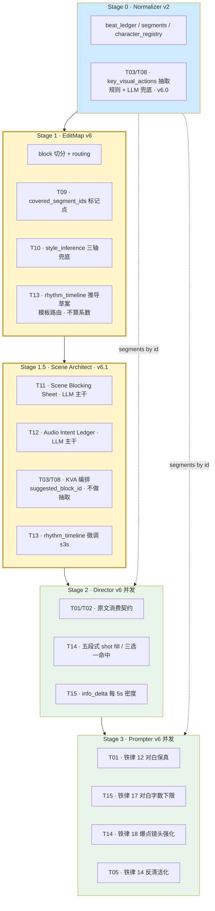

# SD2Workflow v6 升级计划 · 总览

**状态：规划中（Draft · 2 次迭代）**
**日期：2026-04-20**
**适用版本：SD2Workflow v6（在 v5.0 稳定产出的基础上做「叙事忠诚度 + 追剧密度 + 视听调度」三层升级）**
**触发原因：甲方《边缘·第一集》分镜脚本 vs 我方 `leji-v5p` 产出对标审计 + 并发链路剧本断流诊断**

---

## 文档导航

| 序号 | 文档 | 作用 |
|------|------|------|
| 00 | 本文件 | 总览 · 背景 · 任务索引 · 时间线 · 与 v5 的正交关系 |
| 01 | `01_v6-甲方脚本对齐审计报告.md` | **证据层**：甲方/我方逐镜对照、缺失清单、风格偏差量化 |
| 02 | `02_v6-对白保真与beat硬锚.md` | **P0 铁律**：`beat.segments.dialogue/monologue` 原文落地、raw_excerpt 覆盖审计 |
| 03 | `03_v6-风格锁定与反模板化.md` | **P1/P2**：短剧调性信号扩展、微表情去重、情节幻觉抑制 |
| **04** | **`04_v6-并发链路剧本透传.md`** | **P0 架构**：EditMap 标 `covered_segment_ids` + payload builder 按 ID 现查原文 + 风格三轴兜底 |
| **05** | **`05_v6-场级调度与音频意图.md`** | **P1 新分层**：引入 Stage 1.5 Scene Architect（混合型，LLM 主干 + 规则）产场级 blocking / audio / KVA |
| **06** | **`06_v6-节奏推导与爆点密度.md`** | **P0 节奏层**：推导驱动的 `rhythm_timeline`、五段式硬门、三选一强反转、每 5s 信息密度 |

---

## 〇、优先级仲裁铁律（v6 总则 · 先于任何硬门）

> 本目录所有硬门、软门、推导公式都必须服从以下优先级。当两条合同冲突时，上位合同覆写下位合同，**不得反向妥协**。

```
① 甲方 reference / Normalizer segments（真相源）
     ↓  覆写
② 保真硬门（对白原文 · raw_excerpt 覆盖率 · KVA 消费）
     ↓  覆写
③ 节奏与风格目标（rhythm_timeline · style_inference · info_density_contract）
     ↓  覆写
④ 场级美学（Scene Blocking · Audio Intent · 构图倾向）
```

### 典型仲裁场景

| 场景 | 冲突 | 仲裁结果 |
|------|------|----------|
| 对白字数推导下限 vs 原文对白字数 | 推导 floor=560，但原文只有 320 字 | `effective_floor = min(source × 0.95, derived)`，优先原文，不补台词 |
| `major_climax.strategy` 三选一 vs 剧本无明显信号 | 硬门要求命中一种策略 | `strategy = null` 合法，硬门跳过；禁止系统自行补造证据戏 |
| `segment_coverage_ratio ≥ 0.90` vs `dialogue/monologue/vo` 全消费 | 整集 0.90 与子类 1.00 都要求 | 子类 1.00 优先（上位），即使整集超过 0.90 也会因子类失败拦截 |
| Scene Architect 改写对白或 KVA | 场级美学与真相源冲突 | Scene Architect 只能编排/调位，**不得改写**；违者直接回滚 |
| 节奏密度要求 vs 原剧本是慢节奏文艺片 | `mini_count_hint` 与 `genre_bias=artistic_psychological` | 以 `genre_bias` 路由后的模板为准，不用高密度模板兜底 |

### 实现含义

- **任何 P0 硬门在设计时都要先自问**：是否与上位合同冲突？冲突时必须写"上位条件命中时跳过本硬门"；
- **兜底/回退策略**不得侵入上位合同的语义边界（例：不得"为了凑节拍而补造剧情"、不得"为了凑 KVA 而改写原文"）；
- `diagnosis.warning_msg` 用于记录"因上位合同而跳过的下位硬门"，便于回归追溯。

---

## 一、一句话目标

> **v5 解决了"产线可跑通 + 铁律合规"，v6 解决"对甲方剧本的叙事忠诚度 + 高密度追剧节拍 + 场级视听调度"**。
> 实现手段：
> - **层 1（数据流）**：修复并发链路上的剧本断流，让 Director / Prompter 真正看到原文；
> - **层 2（节奏）**：把"爽点密度 + 信息密度 + 对白密度"从描述字段升级为可度量硬门；
> - **层 3（调度）**：在 EditMap 与 Director 之间插入 Scene Architect，承担空间 / 音响 / KVA 三项视听调度。

---

## 二、背景：为什么要做 v6

### 2.1 v5.0 实测表现（基于 `leji-v5p` 全流程产出）

| 维度 | 评分 | 证据 |
|------|------|------|
| 产线工程质量（字段、合规、资产映射、连贯性） | ⭐⭐⭐⭐⭐ 9/10 | 10/10 Block 通过 iron_rule_checklist；`block_asset_mapping` 零残留 |
| 时长/镜头数拟合 | ⭐⭐⭐⭐ 8/10 | 62 镜 / 120s vs 甲方 67 镜 / ~115s，平均镜长 1.93s vs 1.72s |
| **叙事还原度**（对白、钩子、调情戏、分屏） | ⭐ **3/10** | **约 20 段对白丢失 · 核心调情戏被"清洁化" · 分屏收官缺失** |
| **风格一致性**（短剧反差爽感） | ⭐⭐ **4/10** | **被写成文艺心理片（大量"睫毛颤动/瞳孔收缩"微表情）** |
| 模板化疲劳 | ⭐⭐ **4/10** | **5 个固定微表情词在 62 镜里重复 40+ 次** |
| **追剧节拍密度** | ⭐ **2/10** | **`satisfaction_points` 仅 1–2 条；每 5s 信息空窗多；对白字数几乎归零** |
| **场级空间连贯** | ⭐⭐ **4/10** | **连续三个 block 同角色画面位置飘移；无场级锚点** |

> 详细审计证据见 `01_v6-甲方脚本对齐审计报告.md`。

### 2.2 三层根因

#### 根因 A · 数据流断流（04 号文档解决）

- Normalizer 保留了 `raw_excerpt` 原文，但 **Director 提示词没有强制"逐 segment 落地"机制**，且运行时 payload 中**根本不含原文**；
- EditMap 输入 `directorBrief` 偏空时模型默认走"真人电影 = 沉静文艺"的惯性解读，缺少**显式三轴信号**。

#### 根因 B · 节奏层薄弱（06 号文档解决）

- v5 `emotion_loops` 的语义与高密度节拍相似，但 `completeness == partial` 也能通过软门 → 模型系统性偷懒到"半兑现"；
- `satisfaction_points` 软门下限"至少 2 条"，远低于商业短剧基线（120s 剧本 4–7 条爆点）；
- 无"每 5s 信息点密度"与"对白字数下限"两项硬指标。

#### 根因 C · 视听调度缺位（05 号文档解决）

- `status_curve` 只管抽象权力位置，不管画面站位；
- `[SFX]` / `[BGM]` 由 Prompter 自由发挥，与情绪爆点不耦合；
- 分屏 / 推门 / 跨坐 等 KVA 没有结构化抽取机制。

---

## 三、v5 → v6 变更轴（What changes）

| 维度 | v5 现状 | v6 目标 | 任务号 |
|------|---------|---------|--------|
| **对白落地** | Director 可自由选择是否写入台词 | `segment_type ∈ {dialogue, monologue, vo}` 的文本**必须原样**出现在 `[DIALOG]` 段；禁止 silent 化；禁止重写 | T01 |
| **raw_excerpt 覆盖** | 无审计机制 | 新增 `segment_coverage_report`：每块列 `seg_id[]`，整集覆盖率 ≥ 0.90 | T02 |
| **关键视觉动作保留** | 靠模型自觉 | **Normalizer 抽取** `key_visual_actions[]`（规则+LLM 兜底）· Director 必须 1:1 消费 · Scene Architect（v6.1）只做 `suggested_block_id` 编排，**不做抽取** | T03 |
| **调性锁定** | `renderingStyle=真人电影` + `motionBias=balanced` | 扩展三轴 `style_inference`（rendering_style / tone_bias / genre_bias），各轴独立可缺省可推理 | T04 |
| **脱敏倾向抑制** | 无 | Director/Prompter 铁律新增"反清洁化"，切片里给正面示例 | T05 |
| **微表情去重** | 无 | Prompter 输出层扫描 `micro_expr_token_freq`，单 Block ≤ 2 次同义词，整集 ≤ 12 次 | T06 |
| **情节幻觉抑制** | 无 | Director 自检"本块剧情点是否都可追溯到某个 seg_id"；不可追溯记入 `extra_plot_injection` | T07 |
| **特殊构图（分屏/闪回/切镜）** | 散落在 `shot_hints` | Normalizer 产 `key_visual_actions[]` 抽取；Scene Architect（v6.1）做块级编排与视觉 hint 追加；Director 对应 Block 必须消费 | T08 |
| **并发链路剧本透传** | 运行时 payload 零剧本字段 | EditMap 标 `covered_segment_ids`，payload builder 按 ID 现查 Normalizer 原文 | **T09** |
| **风格三轴兜底** | 只有 `renderingStyle/artStyle` 混用 | EditMap 在 brief 缺失时从剧本推理三轴 + `evidence[]` + `confidence` | **T10** |
| **场级空间调度** | 无 | Scene Architect 产 `scene_blocking_sheets[]` | **T11** |
| **音频意图统一** | 无 | Scene Architect 产 `audio_intent_ledger[]` | **T12** |
| **节奏推导** | 无 | EditMap 推导 `rhythm_timeline`（片级三锚 + mini_climaxes 数量与时间点由公式推） | **T13** |
| **五段式 + 三选一** | 无 | mini_climax 五段式 shot fill 硬门 + major_climax 三选一硬门 | **T14** |
| **信息密度 & 对白下限** | 无 | 每 5s 滑窗至少 1 个非 none 的 `info_delta`；本 block 对白字数 ≥ 推导下限 | **T15** |

> **P0**（T01–T03 + T09–T10 + T13–T15）属于**阻断性改动**，不做会持续产出"哑剧 + 无节拍";
> **P1**（T04–T05 + T11–T12）决定**风格准确度与视听调度**;
> **P2**（T06–T08）提升**可交付感与鲁棒性**。

---

## 四、15 项任务总览

| ID | 任务名 | 优先级 | 落地层 | 软/硬门 |
|----|--------|--------|--------|---------|
| T01 | 对白原文强制落地 | P0 | Prompter 提示词 + 铁律 12 | **硬门** |
| T02 | raw_excerpt 覆盖审计 | P0 | Director appendix + Prompter 铁律 13 | **硬门** |
| T03 | key_visual_actions 硬锚 | P0 | **Normalizer 抽取** + Director 消费（v6.0）；Scene Architect 编排（v6.1） | **硬门** |
| T04 | style_inference 三轴 | P1 | EditMap Step 0.7 | 软门（warning） |
| T05 | 脱敏/清洁化抑制 | P1 | Director/Prompter 铁律 14 | 软门 |
| T06 | 微表情去重 | P2 | Prompter 输出扫描 | 软门 |
| T07 | 幻觉情节抑制 | P2 | Director 自检字段 | 软门 |
| T08 | 结构性构图硬锚 | P2 | Normalizer KVA 抽取规则（v6.0）+ Scene Architect 编排（v6.1） | 软门 |
| **T09** | **并发链路剧本透传** | **P0** | EditMap 字段 + payload builder | **硬门** |
| **T10** | **风格三轴兜底推理** | **P0** | EditMap Step 0.7 | 软门 |
| **T11** | **Scene Blocking Sheet** | **P1** | Stage 1.5 Scene Architect | 软门 |
| **T12** | **Audio Intent Ledger** | **P1** | Stage 1.5 Scene Architect | 软门 |
| **T13** | **rhythm_timeline 推导** | **P0** | **v6.0 EditMap 推导**（硬门落地）+ **v6.1 Scene Architect ±3s 微调**（可降级跳过） | **硬门** |
| **T14** | **五段式 + 三选一硬门** | **P0** | Director + Pipeline | **硬门** |
| **T15** | **信息密度 & 对白下限** | **P0** | Director shot 级 + Prompter 铁律 17 | **硬门/软门** |

> T01–T03 + T09–T10 + T13–T15 计划在 v6.0 落地；T04–T08 + T11–T12 在 v6.1 落地。
> **T13 边界说明**：v6.0 阶段由 **EditMap** 推导完整的 `rhythm_timeline`（满足硬门），v6.1 阶段 Scene Architect 在此草案上做 **±3s 微调**（纯优化，不新增 timeline 条目）；`--skip-scene-architect` 降级时 Director/Prompter 直接消费 EditMap 原稿，不影响硬门放行。

### 4.1 `segment_coverage` 三层阈值对照（v6 硬合同）

`segment_coverage` 有三个不同层的指标，阈值/门级彼此独立，**不相互覆写**。

| 层级 | 指标名 | 来源 | 阈值 | 门级 | 语义 |
|------|--------|------|------|------|------|
| L1 · EditMap | `segment_coverage_check` | `diagnosis` | **≥ 0.95** | **软门**（warning） | EditMap 把 Normalizer 的所有 `seg_id` **分配给某个 block** 的完整度 |
| L2 · Prompter 整集 | `segment_coverage_ratio` | `sd2_final_report` | **≥ 0.90** | **硬门** | Director/Prompter 实际**消费**到的 seg_id 占比（允许 ≤10% `descriptive` 未消费） |
| L3 · Prompter 子类 | `dialogue/monologue/vo coverage` | `episode_coverage` | **= 1.00** | **硬门**（上位） | 对白类 segment 必须 **100%** 消费；与 L2 正交，上位覆写 |

**解读**：
- L1 卡的是 EditMap 是否漏分块；L2 卡的是下游是否漏消费；L3 上位卡的是对白原文不能丢。
- 三层都过才算 v6.0 合格。L1 失败只警告不拦截（允许后续修正），L2/L3 任一失败 pipeline 立即硬拦。

---

## 五、三层架构示意



---

## 六、与 v5 的正交关系（不破坏稳定性）

- **铁律序号延续**：v5 有 Prompter 铁律 1–11 + VP-1..6，v6 在其后追加：
  - 铁律 12 对白保真（T01）
  - 铁律 13 覆盖率 ≥ 0.9（T02）
  - 铁律 14 反清洁化（T05）
  - 铁律 15 微表情去重（T06）
  - 铁律 16 音频意图落地（T12）
  - 铁律 17 对白字数下限（T15）
  - 铁律 18 爆点镜头强化（T14）
  - 铁律 19 缓冲区预算（T15）
- **schema 仅追加**：`appendix.segment_coverage_report` / `block_index[].covered_segment_ids` / `block_index[].script_chunk_hint` / `meta.style_inference` / `meta.rhythm_timeline` / `scene_architect_output.*` 均为新增字段；旧字段全部保留。
- **降级开关**：所有 P0 硬门提供 `--allow-v6-soft` CLI 开关；Stage 1.5 提供 `--skip-scene-architect`；节奏层提供 `--skip-rhythm-timeline` / `--rhythm-soft-only`。

---

## 七、度量与验收

### 7.1 核心指标（回归基线，基于 `leji-v5p` 同一剧本重跑）

| 指标 | v5.0 实测 | v6.0 目标 | 测量方式 |
|------|-----------|-----------|----------|
| `segment_coverage_ratio` | 估 0.35 | **≥ 0.90** | Director appendix 扫描 |
| 对白出现次数（整集） | ≈ 2 段 | **≥ 18 段**（甲方 20+） | Prompter 输出正则 |
| 整集对白字数 | < 40 | **≥ 560**（280 字/分钟 × 2） | Prompter 输出正则 |
| `key_visual_actions_hit_ratio` | 估 0.2 | **≥ 0.85** | Scene Architect 产出 vs Director 消费对账 |
| 微表情词（5 个同义词）整集合计 | 40+ 次 | **≤ 15 次** | Prompter 输出词频 |
| `mini_climaxes` 数量（120s） | — | **≥ 4** | EditMap 产出 |
| 每 5s 信息点空窗 | 多数 | **0 个** | Director shot 级 info_delta 扫描 |
| `major_climax` 三选一命中 | 0 | **100%** | Pipeline 校验 |
| `closing_hook` 含 freeze/split_screen | 0 | **100%** | Prompter 末 block 扫描 |

### 7.2 验收用例（分布在各子文档）

- UC1–UC3 见 02 号文档
- UC4–UC6 见 04 号文档
- UC7–UC10 见 05 号文档
- 节奏层 UC 见 06 号文档 §九 回归指标

---

## 八、时间线

| 里程碑 | 内容 | 预计时间 |
|--------|------|----------|
| M0（now） | v6 计划文档冻结（本目录 7 份） | 2026-04-20 |
| M1 | EditMap v6 · 加 `covered_segment_ids` + `style_inference` + `rhythm_timeline` | 2026-04-22 |
| M2 | payload builder v6 · 注入 `normalizedScriptPackage`，`buildDirectorPayloadV6` / `buildPrompterPayloadV6` | 2026-04-24 |
| M3 | Director/Prompter 切片加 T01/T02/T03/T14/T15 硬门铁律 | 2026-04-26 |
| M4 | 用 `leji-v5p` 同剧本重跑 v6.0（未含 Scene Architect），拿到基线 | 2026-04-28 |
| M5 | 与甲方脚本再次对标，确认核心指标达标 | 2026-04-30 |
| M6 | Stage 1.5 Scene Architect 落地（T11/T12 + KVA 规则） | 2026-05-04 |
| M7 | T04–T08 软门 + 验收 | 2026-05-08 |

---

## 九、风险与缓解

| 风险 | 影响 | 缓解 |
|------|------|------|
| 对白强制落地导致 SD2 模型生成"字幕" | 画面出现字幕水印 | Prompter 尾部"禁止水印/字幕"铁律保留；`[DIALOG]` 作为文本字段元数据不进入画面渲染指令 |
| `segment_coverage_ratio ≥ 0.9` 过严导致 Block 冗长 | 超出 4–15s 硬约束 | 覆盖率允许"跨块覆盖"；单块仍受时长硬约束；提供 `--segment-coverage-threshold` 可调 |
| `genre_bias=短剧反差钩子` 与 `rendering_style=真人电影` 语义冲突 | Director 选择困难 | 三轴正交；切片里给正交示例 |
| 清洁化抑制可能违反平台内容安全 | 生产被拦截 | 保留脱敏词表；仅要求"保留肢体戏与情感张力"，不要求露骨视觉 |
| 节奏硬门过严导致 Director retry 暴增 | Token 成本上升 | 上线初期启用 `--rhythm-soft-only`；确认稳定后再升硬门 |
| Scene Architect 新增一层 agent 延迟 | 端到端时长 +10–20% | 与 Director 并发启动；支持 `--skip-scene-architect` 降级 |
| 推导公式与题材不匹配 | `mini_count_hint` 过高/过低 | v6 不用系数，`genre_bias.primary` 路由到预置节奏模板（模板在 06 号文档冻结）；无 brief 时默认 `satisfaction_density_first` 高密度模板；允许通过 `directorBrief.genre_override` 显式 override |

---

## 十、三期落地分层

| 阶段 | 任务 | 目标 |
|------|------|------|
| **v6.0** | T01/T02/T03/T09/T10/T13/T14/T15 | 修复断流、对白保真、节奏密度（不含 Scene Architect） |
| **v6.1** | T04/T05/T11/T12 | 视听调度 + 风格微调 |
| **v6.2** | T06/T07/T08 | 细节打磨（微表情去重、幻觉抑制、构图精修） |

---

## 十一、每份文档 ≤ 400 行承诺

本目录每份文档（00–06）均控制在 400 行以内，并保留详尽中文注释，与用户规则一致。
