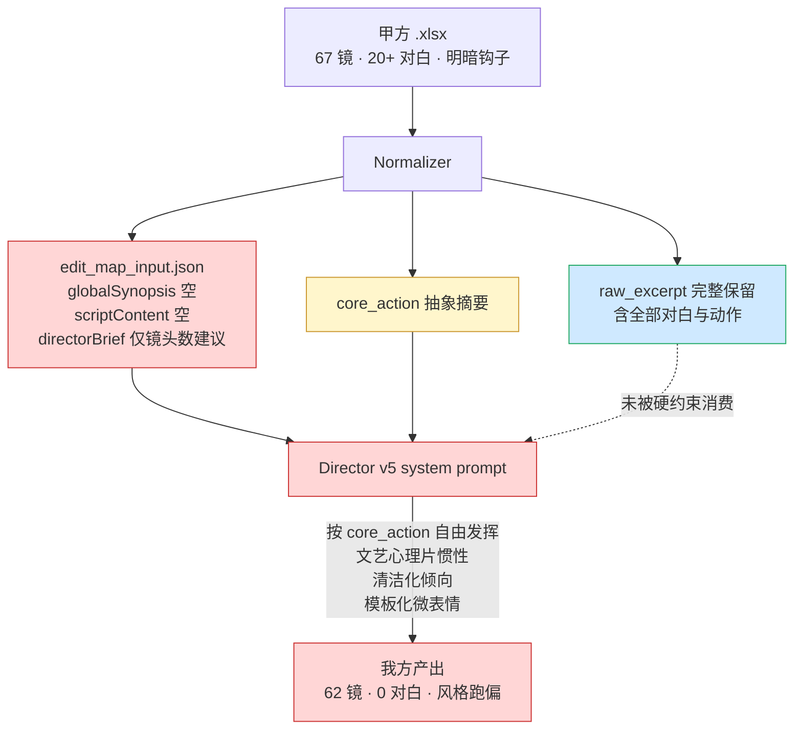

# v6 · 甲方脚本对齐审计报告

**状态：已归档（作为 v6 诊断证据）**
**审计日期：2026-04-20**
**对照对象：甲方《边缘·第一集》分镜脚本 vs 我方 `leji-v5p` 全流程产出**

---

## 一、审计对象

| 项 | 路径 / 内容 |
|---|---|
| 甲方分镜 | `/Users/zuobowen/Documents/GitHub/fv_autovidu/output/sd2/甲方脚本/边缘-第一集.xlsx` |
| 我方产出 | `/Users/zuobowen/Documents/GitHub/fv_autovidu/output/sd2/leji-v5p/` |
| 我方管线版本 | SD2Workflow v5.0-rev7（Director v5 + Prompter v5） |
| 画面风格 | `renderingStyle=真人电影`, `motionBias=balanced`, `aspectRatio=9:16` |
| 输入来源 | `normalized_script_package.json`（8 个 beat / 2 个 scene / 6 个 character） |

---

## 二、总览数据对照

### 2.1 规模对齐

| 维度 | 甲方 | 我方 | 评估 |
|------|------|------|------|
| 总镜头数 | 67 | 62 | ✅ 基本对齐 |
| 总时长估计 | ≈ 115 s | 120 s | ✅ 基本对齐 |
| 场景数 | 2（医院走廊 / 副院长办公室内外 / 李院长办公室闪回） | 按 Block 划分覆盖 2 场 | ✅ |
| Block/场段拆分 | 1-1（17 镜）+ 1-2（50 镜） | 10 个 Block（B01–B10） | ✅ 均匀拆分 |
| 平均单镜时长 | ≈ 1.72 s | ≈ 1.93 s | ✅ |

### 2.2 字段/描述精度

| 维度 | 甲方 | 我方 | 评估 |
|------|------|------|------|
| 字段列数 | 8（镜号·景别·机位·运镜·场景·画面描述·台词·时长） | 20+（含光影、BGM、SFX、屏占比、安全区、连贯性、铁律 checklist、资产映射） | ⭐ 我方超甲方 |
| 镜头编码 | 无 | A1/A2/B1/B2/B3/B4/D1（SD2 镜头字典） | ⭐ 我方超甲方 |
| 资产锚定 | 纯文字 | `@图1-@图N` 局部锚定 + 映射表 | ⭐ 我方超甲方 |
| 铁律合规 | N/A | 10/10 Block 全通过 | ⭐ 我方超甲方 |

---

## 三、叙事还原度审计（核心问题）

### 3.1 场景 1-1：主角登场戏（甲方 R02–R17）

**甲方剧情意图**：大女主惊艳登场 + 植入「心脏病不能生」关键信息钩子。

| 甲方镜头 | 关键内容 | 我方对应 Block | 我方实际内容 | 偏差 |
|---|---|---|---|---|
| R04 | 俯瞰医院大楼 + 字幕「东南亚 狮城 某私立医院」 | — | **未出现** | ❌ 丢失 |
| R05 | 高跟鞋特写（Vo: 噔噔噔） | B01 片段 [A1] | 有"高跟鞋尖踏地、鞋跟敲击声" | ✅ 保留 |
| R06 | 女医生猛地回头、眼神惊艳 | — | **未出现** | ❌ 丢失 |
| R07 | 护士手中病历单松动 | — | **未出现** | ❌ 丢失 |
| R08 | 向上横摇到秦若岚全身 | — | **未出现** | ❌ 丢失 |
| R09 | 逆光女神亮相 + 神圣光晕 | B01 片段 [A1] | 有"玻璃幕墙透出天光、逆光剪影" | ⚠️ 仅保留光线，缺少"女神亮相" |
| R12 | 医护撞车 / 棉签掉落 | — | **未出现** | ❌ 丢失 |
| R15 | 护士八卦：**「刚刚那人是谁啊？我怎么从来没在心外科见过？」** | B02 | 写成"两位医生/护士（@图1）嘴唇开合，**无声但口型可辨**" | ❌ **台词被替换为口型** |
| R16 | 医生解释：**「她是咱们医院妇产科的秦主任，她老公是医院的赵副院长」** | — | **未出现** | ❌ 丢失 |
| R17 | 医生同情：**「结婚多年都没生孩子……」** | — | **未出现** | ❌ **核心信息钩子丢失** |
| R18 | 秦若岚脚步微顿、笑容僵住 | B02 末尾 | 写成"视线穿过肩线、落在门牌" | ⚠️ 情绪点偏移 |
| R20 | 门牌特写【副院长办公室】 | B02 末尾 | 有门牌金属字特写 | ✅ |

**小结**：甲方 17 个镜头，我方严格覆盖 2 个（高跟鞋、门牌），部分覆盖 2 个（逆光、情绪停顿），**核心信息钩子"心脏病不能生"100% 丢失**，**所有台词 100% 被替换为无声口型**。

---

### 3.2 场景 1-2：办公室内核心冲突戏（甲方 R20–R67）

**甲方剧情意图**：外圣洁女主 vs 内渣男出轨的明暗反差，含母亲 VO 压迫、闪回立誓、推门撞破、伪装恩爱、阴谋计划、分屏定格六大高潮。

#### A) 办公室偷情戏（甲方 R20–R28）

| 甲方镜头 | 关键内容 | 我方实际 | 偏差 |
|---|---|---|---|
| R21 | 许倩**跨坐赵凯腿上**，手指在胸口挑逗 | **未出现** | ❌ **清洁化** |
| R22 | 赵凯**粗鲁解开许倩白大褂扣子** | **未出现** | ❌ **清洁化** |
| R23 | 露出**黑色丝袜和紧身短裙** | 仅在 B05 角色设定中提了"黑丝短裙配白大褂"但无视觉动作 | ❌ 资产保留 / 动作丢失 |
| R24 | 赵凯接电话：**「诶呀妈！我这正忙着呢……」** | **未出现** | ❌ **对白丢失** |
| R29 | 赵凯母亲 VO：**「找个什么样的女人找不到，为什么偏偏要找个心脏有病不能生的！」** | **未出现** | ❌ **母亲 VO 整段丢失** |

#### B) 李院长闪回（甲方 R31–R33）

| 甲方镜头 | 关键内容 | 我方 B04 | 偏差 |
|---|---|---|---|
| R31 | 诊断书「XXX心脏病」特写 | 有"心肌桥 手术风险评估"诊断书特写 | ✅ 场景保留 |
| R32 | 李院长台词：**「秦医生，你心脏的情况……除非通过手术治愈，否则生育的风险太大了」** | 写成"李院长右手轻点'保守治疗'段落，金丝眼镜反光一闪" | ❌ **台词 → 无声动作** |
| R33 | 秦若岚 OS：**「院长，谢谢你的建议，但我还是决定让赵凯给我做手术」** | 写成"闭眼、双唇轻抿、左手覆上小腹" | ❌ **内心独白 → 哑剧** |

#### C) 推门撞破（甲方 R35–R39）

| 甲方镜头 | 关键内容 | 我方对应 | 偏差 |
|---|---|---|---|
| R35 | 秦若岚伸手推门 | **未出现** | ❌ |
| R36 | 赵凯许倩受惊甩镜 | **未出现** | ❌ |
| R37 | 赵凯猛起身挡许倩 | **未出现** | ❌ |
| R38 | 许倩手忙脚乱扣扣子遮黑丝 | **未出现** | ❌ |
| R39 | 赵凯挤笑：**「老婆，你，你怎么来了？」** | **未出现** | ❌ **对白丢失** |

#### D) 伪装恩爱（甲方 R42–R50）

| 甲方镜头 | 关键内容 | 我方 B05 | 偏差 |
|---|---|---|---|
| R43 | 整理衣领：**「我要出差参加一个外地的医学论坛」** | 写成"'赵院，这份流程，您看还顺手？'"（**完全编造**） | ❌ **对白替换** |
| R45 | 赵凯反手抓手：**「谢谢老婆，我会照顾自己」** | **未出现** | ❌ |
| R46 | 许倩绿茶插话：**「赵院长，下午有一台重要的手术需要您确认」** | **未出现** | ❌ |

#### E) 阴谋告白（甲方 R51–R58）

| 甲方镜头 | 关键内容 | 我方 B06 | 偏差 |
|---|---|---|---|
| R51 | 赵凯猛拽许倩入怀 | **未出现** | ❌ **清洁化** |
| R53 | 赵凯捏下巴：**「她知道了又能怎么样？」** | **未出现** | ❌ |
| R54 | 抚摸许倩肚子：**「你才是我的宝贝儿，还有你肚子里的孩子」** | **未出现** | ❌ **怀孕反转钩子丢失** |
| R56 | 赵凯计划：**「下个月就是院长竞聘，她手里的那一票对我成为院长至关重要」** | 改写成"李院长退休流程已启动，秦氏集团提名路径……"（**编造台词**） | ❌ **信息走向偏移** |
| R58 | 亲唇：**「等我拿到足够投票，秦氏集团高层就会任命我做新一任院长，你就是赵家的女主人」** | **未出现** | ❌ **爽点阴谋核心丢失** |

#### F) 分屏定格（甲方 R63–R67）

| 甲方镜头 | 关键内容 | 我方对应 | 偏差 |
|---|---|---|---|
| R63–R66 | **分屏**：左屏圣洁抚腹 / 右屏撕衣淫笑 | **未出现** | ❌❌❌ **最核心的反差钩子缺失** |
| R67 | 全景定格「色调一边明亮一边暗沉」 | B10 写成"镜片反光中手机闪出未读消息'她刚调走全部原始影像…'"（**模型幻觉情节**）| ❌ **替换成原剧本不存在的悬念** |

---

## 四、量化总结

### 4.1 对白保真度

| 甲方对白段落 | 保真情况 | 数量 |
|---|---|---|
| 完全保留 | 0 | 0 |
| 改写保留 | 0 | 0 |
| 无声口型 | "嘴唇开合，无声但口型可辨" | 1（B02） |
| 完全替换（编造新台词） | B05 改写成职场对白 / B06 改写成权力博弈对白 | 3 |
| 完全丢失（原台词无踪影） | 护士八卦 / 医生科普 / 母亲 VO / 赵凯接电话 / 李院长诊断 / 秦 OS 立誓 / 赵凯推门对白 / 整理衣领出差 / 许倩绿茶插话 / 赵凯阴谋告白 / 秦门外独白 | 15+ |

> **甲方共约 20+ 段对白，我方有效保真 ≈ 0 段，保真率 < 5%。**

### 4.2 关键视觉动作保真度

| 类别 | 甲方数量 | 我方保留 | 保真率 |
|---|---|---|---|
| 登场惊艳（高跟鞋/回头/撞车/掉物） | 5 | 1 | 20% |
| 偷情调情（跨坐/解扣/露黑丝/摸腿/捏下巴/亲唇） | 6 | 0 | 0% |
| 推门撞破（推门/甩镜/挡人/慌扣扣） | 4 | 0 | 0% |
| 伪装恩爱（整领/抓手/插话） | 3 | 0 | 0% |
| 阴谋信号（抱入怀/摸肚子/计划台词） | 3 | 0 | 0% |
| **分屏定格** | 5 | 0 | **0%** |

> **关键视觉动作保真率 ≈ 3.8%。**

### 4.3 模板化疲劳（词频统计）

| 微表情词 | 在 62 镜中出现次数 |
|---|---|
| 喉结滑动 / 喉结上下 | 9 |
| 瞳孔收缩 / 瞳孔微缩 | 11 |
| 睫毛颤动 / 睫毛轻颤 | 8 |
| 指节泛白 | 7 |
| 镜片反光 | 12 |
| **合计** | **47 次**（平均 4.7 次/Block） |

> 甲方剧本原文中这些词**一次也未出现**，属于模型固有文艺风格惯性。

### 4.4 情节幻觉注入

| Block | 注入内容 | 是否存在于原剧本 |
|---|---|---|
| B06 | "李院长退休流程已启动，秦氏集团提名路径" | ❌ 无 |
| B06 | "她还在忍——但忍到公示截止，就不是'让'，是'割'" | ❌ 无 |
| B10 | "她刚调走全部原始影像" 未读消息 | ❌ 无 |

> **整集注入幻觉情节 ≥ 3 处。**

---

## 五、根因诊断（管线层）

**三条根因链**：

1. **Normalizer 保留原文但不强制消费** → `raw_excerpt` 有全部对白，但 Director 提示词没说"必须逐条落地"，模型自然选择抽象的 `core_action`。
2. **EditMap 入参缺调性信号** → `directorBrief` 仅要求镜头数自主决定，没告诉模型"这是短剧反差钩子"，模型默认走"真人电影 = 文艺沉静"的风格惯性。
3. **Prompter 铁律没覆盖叙事层** → 11 条铁律都在管物理/光影/资产，没有铁律说"对白必须原样""反差钩子必须保留""不许编造原剧本外的情节"。

---

## 六、结论

| 维度 | 评级 | 一句话 |
|------|------|--------|
| 产线工程质量 | ⭐⭐⭐⭐⭐ | 字段、合规、资产映射、连贯性 — 甲方没有，我方有 |
| 叙事还原度 | ⭐ | 对白 < 5% 保真 / 关键动作 < 4% 保真 / 分屏 0% 保真 |
| 风格一致性 | ⭐⭐ | 被写成文艺心理片，非短剧反差钩子 |
| 模板化疲劳 | ⭐⭐ | 5 个固定微表情词整集重复 47 次 |
| 情节幻觉 | ⭐⭐⭐ | 整集注入 3 处原剧本不存在的情节 |

> **一句话结论**：**工程可生产，叙事不达标**。直接出片会得到一部安静的医院心理小品，不是甲方要的"大女主反差短剧"。v6 必须补齐"对白保真 + 关键动作硬锚 + 风格调性信号 + 反模板化/反幻觉"四张铁律。

---

## 七、后续动作

具体改进方案落地到：

- `02_v6-对白保真与beat硬锚.md`（P0 · T01/T02/T03）
- `03_v6-风格锁定与反模板化.md`（P1/P2 · T04–T08）

验收时以本报告中的量化数据为**基线**，v6 重跑 `leji-v5p` 后按第 4 节的指标重新统计，达标即可 close。
