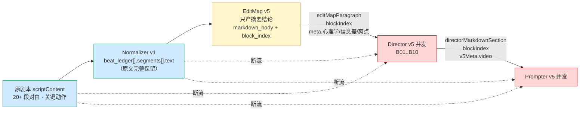

# v6 · 并发链路剧本透传与风格三轴

**状态：规划中（Draft）**
**优先级：P0**
**日期：2026-04-20**
**适用阶段：v6.0 · 断流修复**

---

## 文档目的

v5 审计中识别的核心根因并不是 Prompter 铁律缺失，而是 **管线上下文断流**：

- Normalizer 完整保留 `beat_ledger[].segments[].text`（含原台词、原动作描述）；
- EditMap 在 `markdown_body` 写入"叙事结论摘要"，但**不透传原文**；
- Director / Prompter 的 payload 构造函数（`buildDirectorPayloadV5` / `buildPrompterPayloadV5`）**入参零剧本字段**；
- 并发运行时 B01..B10 各 Block 的 LLM **看不到原剧本、看不到 Normalizer 的分段原文**，只看到 EditMap 的结论段与路由标签。

结果是：即使 v6 在 Prompter 侧加再多"对白保真"铁律，Director 也没有原文可引——铁律无法落地。本文档定义"剧本切片透传"与"风格三轴兜底"两项断流修复。

---

## 一、断流现状（证据层）



代码层佐证（相对路径以 `fv_autovidu` 为根）：

| 文件 | 证据 |
|------|------|
| `scripts/sd2_pipeline/lib/sd2_v5_payloads.mjs:175-316` | `buildDirectorPayloadV5()` 入参无 `scriptContent` / `beatLedger` / `segments` |
| `scripts/sd2_pipeline/lib/sd2_v5_payloads.mjs:408-481` | `buildPrompterPayloadV5()` 入参仅 `directorMarkdownSection`，零剧本字段 |
| `scripts/sd2_pipeline/call_sd2_block_chain_v5.mjs` | 对 `raw_excerpt` / `beat_ledger` / `segments` 全局零引用 |

**结论**：并发两步在运行时**彻底看不到剧本**，所有输出都是模型在 EditMap 摘要上做的"二次创作"。

---

## 二、设计原则

### 2.1 单一真相源：原文归 Normalizer

- EditMap / Scene Architect / Director / Prompter **都不产原文**，只引用；
- 原文字段以 `normalized_script_package.beat_ledger[].segments[]` 为唯一真相源；
- payload builder 在**运行时**按 `seg_id` 现查现塞，不做缓存、不写入 EditMap 输出。

### 2.2 EditMap 只产"标记点"

EditMap 只标记"哪些 `seg_id` 属于哪个 Block"（即 `covered_segment_ids[]`），**不把原文写进自己的输出**。这样：

- EditMap 输出体积不膨胀（一集 5–10 KB 量级）；
- 原文变更时不会出现"EditMap 与 Normalizer 原文版本不一致"；
- 下游对"污染"有纠错窗口（payload builder 可以在拉取原文时做最后一次归一化）。

### 2.3 风格三轴正交，缺省可推

将"视觉渲染 / 色调氛围 / 剧情张力"三轴拆开并正交：

- 三轴**独立可缺省**；
- EditMap 在 `directorBrief` 缺失时从 `scriptContent` 推理；
- 推理必须产 `evidence[]` + `confidence ∈ {high, mid, low}`；
- `confidence == low` 时打警告，不阻塞。

---

## 三、EditMap v6 新增字段

### 3.1 `block_index[i].covered_segment_ids[]` 与 `script_chunk_hint`

```jsonc
"block_index": [
  {
    "block_id": "B01",
    "start_sec": 0, "end_sec": 10, "duration": 10,
    "scene_run_id": "S1",
    "present_asset_ids": ["asset-A"],
    "rhythm_tier": 3,
    "routing": { /* v5 原样保留 */ },

    /* v6 · 新增字段 */
    "covered_beat_ids": ["BT_001"],
    "covered_segment_ids": ["SEG_001","SEG_002","SEG_003","SEG_004","SEG_005"],

    "script_chunk_hint": {
      "lead_seg_id": "SEG_001",
      "tail_seg_id": "SEG_005",
      "must_cover_segment_ids": ["SEG_004"],
      "overflow_policy": "push_to_next_block"
    }
  }
]
```

| 字段 | 类型 | 语义 |
|------|------|------|
| `covered_beat_ids` | `string[]` | 本 Block 覆盖的 Normalizer `beat_id` 列表 |
| `covered_segment_ids` | `string[]` | 本 Block 覆盖的 Normalizer `seg_id` 列表，**顺序即叙事顺序** |
| `script_chunk_hint.lead_seg_id` | `string` | 本 Block 首个需消费的 segment |
| `script_chunk_hint.tail_seg_id` | `string` | 本 Block 收尾需消费的 segment |
| `script_chunk_hint.must_cover_segment_ids` | `string[]` | 不可降级的关键段（含 KVA 的 segment） |
| `script_chunk_hint.overflow_policy` | `enum` | 塞不下的降级策略：`push_to_next_block` / `split_into_sub_shots` / `drop_with_warning` |

### 3.2 `meta.style_inference` 三轴

```jsonc
"meta": {
  "video": {
    "aspect_ratio": "9:16",
    "scene_bucket_default": "dialogue",
    "genre_hint": "revenge",
    "target_duration_sec": 120
  },

  /* v6 · 新增：style_inference 三轴 */
  "style_inference": {
    "rendering_style": {
      "value": "真人电影",
      "confidence": "high",
      "evidence": ["directorBrief 明示 真人电影"],
      "source": "brief"
    },
    "tone_bias": {
      "value": "cold_high_contrast",
      "confidence": "mid",
      "evidence": [
        "scriptContent 含 '冷光灯' / '水磨石' / '玻璃反光' 等视觉线索",
        "genreBias.primary == short_drama_contrast_hook 推断"
      ],
      "source": "inferred_from_script"
    },
    "genre_bias": {
      "primary": "short_drama_contrast_hook",
      "secondary": ["satisfaction_density_first"],
      "confidence": "high",
      "evidence": [
        "globalSynopsis 含 '撞破奸情' '复仇' 关键词",
        "parsed_brief.genre == revenge"
      ],
      "source": "derived_from_parsed_brief_and_script"
    }
  }
}
```

### 三轴受控词表

| 轴 | 字段 | 受控词示例 |
|---|------|----------|
| 视觉渲染 | `rendering_style.value` | `真人电影` / `3D写实动画` / `水墨动画` / `2D手绘` |
| 色调氛围 | `tone_bias.value` | `cold_high_contrast` / `warm_low_key` / `neutral_daylight` / `neon_saturated` / `desaturated_gritty` / `sunlit_pastel` / `other`（与 `docs/v6/07_v6-schema-冻结.md` §3.1.1 对齐） |
| 剧情张力 | `genre_bias.primary` | `short_drama_contrast_hook` / `satisfaction_density_first` / `artistic_psychological` / `slow_burn_longform` / `mystery_investigative` |

### 3.3 EditMap 自解析规则补丁

在 v5 `§0.A parsed_brief` 之后新增：

```
Step 0.7  三轴兜底推理
  a) 若 directorBrief 显式给出 → confidence=high，source=brief
  b) 若 directorBrief 未给但 globalSynopsis 有线索 → confidence=mid
  c) 若仅从 scriptContent 推理 → confidence=low，必须列 3 条以上证据
  d) 任意一轴 confidence=low → diagnosis.warning_msg 追加 "style_inference_low_confidence_on_<axis>"
Step 0.8  每块 covered_segment_ids 覆盖审计
  a) 对每个 block 列出消费的 seg_id[]（顺序即叙事顺序）
  b) ⋃ block_index[i].covered_segment_ids[] ⊇ ⋃ beat_ledger[*].segments[].seg_id 的 95%
  c) 不满足时 diagnosis.segment_coverage_check = false（软门）
```

---

## 四、Payload Builder v6 改造

### 4.1 新增运行时参数

`buildDirectorPayloadV6` / `buildPrompterPayloadV6` 入参新增：

```ts
interface PayloadV6Opts {
  editMap: EditMap;
  blockId: string;
  kbDir: string;

  // v6 新增 · 剧本真相源
  normalizedScriptPackage: NormalizedScriptPackage;

  // v6 新增 · 派生参数
  renderingStyle?: string;  // 若不传则从 meta.style_inference.rendering_style.value 取
  aspectRatio?: string;
  // …其他 v5 原有参数保持兼容
}
```

### 4.2 内部运行流程

```mermaid
flowchart TB
    A[buildDirectorPayloadV6 入口] --> B[读 editMap.block_index 找 blockId]
    B --> C[提取 covered_segment_ids[]]
    C --> D[从 normalizedScriptPackage.beat_ledger[]<br/>按 seg_id 现查 segments 原文]
    D --> E{script_chunk_hint<br/>.must_cover 都拿到?}
    E -->|否| F[抛 MissingMustCoverSegmentError]
    E -->|是| G[组装 scriptChunk 对象]
    G --> H[返回 payload · 含 scriptChunk]

    style A fill:#e8f5e9
    style D fill:#fff6cc
    style F fill:#ffd6d6
    style G fill:#e8f5e9
```

### 4.3 payload 新字段

```jsonc
{
  "editMapParagraph": "…（v5 原样）",
  "blockIndex": { /* v5 原样 */ },
  "assetTagMapping": [ /* v5 原样 */ ],
  "parsedBrief": { /* v5 原样 */ },
  "episodeForbiddenWords": [ /* v5 原样 */ ],

  /* v6 · 新增 · 剧本切片 */
  "scriptChunk": {
    "block_id": "B01",
    "lead_seg_id": "SEG_001",
    "tail_seg_id": "SEG_005",
    "must_cover_segment_ids": ["SEG_004"],
    "segments": [
      {
        "seg_id": "SEG_001",
        "beat_id": "BT_001",
        "segment_type": "descriptive",
        "speaker": null,
        "text": "秦若岚高跟鞋尖踏在水磨石地面上…"
      },
      {
        "seg_id": "SEG_002",
        "beat_id": "BT_001",
        "segment_type": "dialogue",
        "speaker": "护士A",
        "text": "刚刚那人是谁啊？我怎么从来没在心外科见过？"
      }
    ]
  },

  /* v6 · 新增 · 风格三轴（下游 prompt 切片注入点） */
  "styleInference": { /* 原样透传 meta.style_inference */ },

  /* v5 保留 */
  "v5Meta": { /* 原样 */ }
}
```

---

## 五、对 EditMap / Director / Prompter Prompt 的最小变更

### 5.1 EditMap v6 Prompt 变更点

| 位置 | v5 | v6 |
|------|----|----|
| `§0.A parsed_brief` | `renderingStyle` / `artStyle` 合并解析 | 拆成 `style_inference.rendering_style` + `tone_bias` + `genre_bias` 三轴 |
| `§1.1 组骨架锚定` | 仅填 `block_index[i]` | 新增 `covered_segment_ids[]` 与 `script_chunk_hint` |
| `§5 diagnosis` | v5 硬门软门 | 新增 `segment_coverage_check`（**EditMap 层软门 · 阈值 0.95**，只校验"seg_id 是否被某个 block 标到"，**不**校验实际消费；实际消费由 02 号文档的 Prompter 硬门负责，详见下表） |
| `§IV 实际返回格式` | 原样 | 追加 `style_inference` + 每 block 的 `covered_*` |

#### 5.1.1 `segment_coverage` 三层阈值（与 00 号文档 §4.1、02 号文档 §3.2.4 一致）

| 层级 | 指标 | 产出阶段 | 阈值 | 门级 | 语义 |
|------|------|----------|------|------|------|
| L1 | `segment_coverage_check` | EditMap | ≥ 0.95 | **软门** | 本文档 §3.3 Step 0.8：EditMap 是否把 `seg_id` 分配给 block |
| L2 | `segment_coverage_ratio` | Prompter 整集 | ≥ 0.90 | **硬门** | 02 号文档 §3.2.4：实际消费占比 |
| L3 | `dialogue_subtype_coverage` | Prompter 子类 | = 1.00 | **硬门**（上位） | 02 号文档 §3.2.4：对白类原文必须 100% 消费 |

三层独立、不互相覆写。L1 失败仅 warning，允许后续 Director 纠正；L2/L3 失败 pipeline 立即拦截。

### 5.2 Director v6 Prompt 新增章节

```text
## §I.2.1 剧本原文消费契约（v6 · 硬门）

- payload.scriptChunk.segments 是本 Block 的**唯一文本真相源**。
- 凡 segments[i].segment_type ∈ {dialogue, monologue, vo}，对应台词必须**原样**
  出现在对应镜头的 [DIALOG] 段；禁止 <silent>、同义重写、合并概述。
- 凡 segments[i].segment_type == descriptive，其动作描述必须映射到至少 1 个 shot 的
  画面描述；若空间/道具无法完全承载，允许拆分到相邻 shot，但不得跳过。
- payload.scriptChunk.must_cover_segment_ids 列出的 seg_id 若未被任何 shot 消费
  → 必须在 appendix.segment_coverage_report.missing_must_cover[] 中声明（会被 pipeline 硬门拦截）。
```

### 5.3 Prompter v6 Prompt 新增章节

Prompter 同步消费 `scriptChunk.segments`，在输出 SD2 prompt 时：

- `[DIALOG]` 段原样抄录 `dialogue/monologue` 类 segment 的 `text`；
- `[FRAME]` 段参考 `descriptive` 类 segment 的动作描述；
- 输出末尾 `appendix.dialogue_fidelity_check` 声明本 block 消费的 `seg_id[]` 与对白字数。

---

## 六、Pipeline 层新增硬门

```python
# 伪代码：segment 覆盖硬门
def check_segment_coverage(run_outputs, normalized_pkg, threshold=0.90):
    all_seg_ids = collect_all_seg_ids(normalized_pkg)
    consumed_ids = set()
    for block_out in run_outputs:
        report = block_out["appendix"]["segment_coverage_report"]
        consumed_ids.update(report["consumed_seg_ids"])
        # must_cover 若缺失 → 硬失败
        if report.get("missing_must_cover"):
            raise HardGateViolation(
                f"Block {block_out['block_id']} missing must_cover: "
                f"{report['missing_must_cover']}"
            )
    # 整集覆盖率
    ratio = len(consumed_ids) / max(len(all_seg_ids), 1)
    if ratio < threshold:
        raise HardGateViolation(
            f"segment_coverage_ratio={ratio:.2f} < {threshold}"
        )
```

---

## 七、降级开关

| 开关 | 作用 | 用途 |
|------|------|------|
| `--allow-missing-must-cover` | 允许 `must_cover_segment_ids` 缺失降级为 warning | 排查特殊镜头剪裁问题 |
| `--segment-coverage-threshold=<float>` | 下调覆盖率阈值（默认 0.90） | 短时长剧本（如 30s）允许放宽 |
| `--skip-style-inference` | 不做三轴推理，沿用 v5 `parsed_brief` | 回归对比 v5 行为 |

---

## 八、与其他 v6 文档的分工

| 本文档 | 与之协作 | 协作方式 |
|--------|----------|----------|
| 04（本文档）· 并发链路透传 | 02 · 对白保真 | 02 给铁律 12 的提示词文本；本文档给数据流路径 |
| 04（本文档） | 05 · 场级调度 | `scriptChunk.segments[]` 同时喂给 Scene Architect（stage 1.5）做 **KVA 编排**（抽取归 Normalizer v2，本文档链路仅负责透传） |
| 04（本文档） | 06 · 节奏推导 | `covered_segment_ids[]` 作为节奏锚点在时间轴上的落地依据 |

---

## 九、验收用例

| UC | 输入 | 期望输出 |
|----|------|----------|
| UC4 | `SEG_007` 台词"刚刚那人是谁啊？"标在 B01 `covered_segment_ids` 中 | Director/Prompter payload.scriptChunk.segments 含该条；Prompter 输出 `[DIALOG] 护士A：刚刚那人是谁啊？` |
| UC5 | 三轴全未显式给，`scriptContent` 含"冷光灯/水磨石/玻璃反光" | EditMap 输出 `tone_bias.value == cold_high_contrast`，`confidence == mid/low`，`evidence[].length ≥ 2` |
| UC6 | `must_cover_segment_ids` 含 `SEG_025`（KVA 分屏） | 若 Director appendix 未消费 `SEG_025` → pipeline 抛 `HardGateViolation` |

---

## 十、小结

- v6.0 的最底层修复不是铁律、不是提示词，而是**把 Normalizer 的原文顺着 payload 传下去**；
- EditMap 只做"标记点"与"风格三轴兜底"，不产原文、不污染真相源；
- 改动集中在 EditMap prompt（+2 Step，+3 字段）与 payload builder（+`normalizedScriptPackage` 入参，+`scriptChunk` 输出字段）；
- 完成本文档任务后，02（对白保真）与 06（节奏推导）才具备可落地前提。
