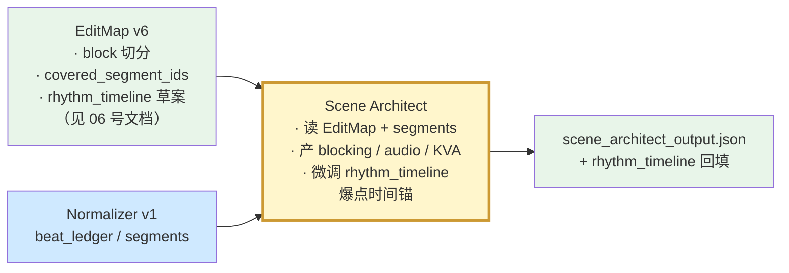
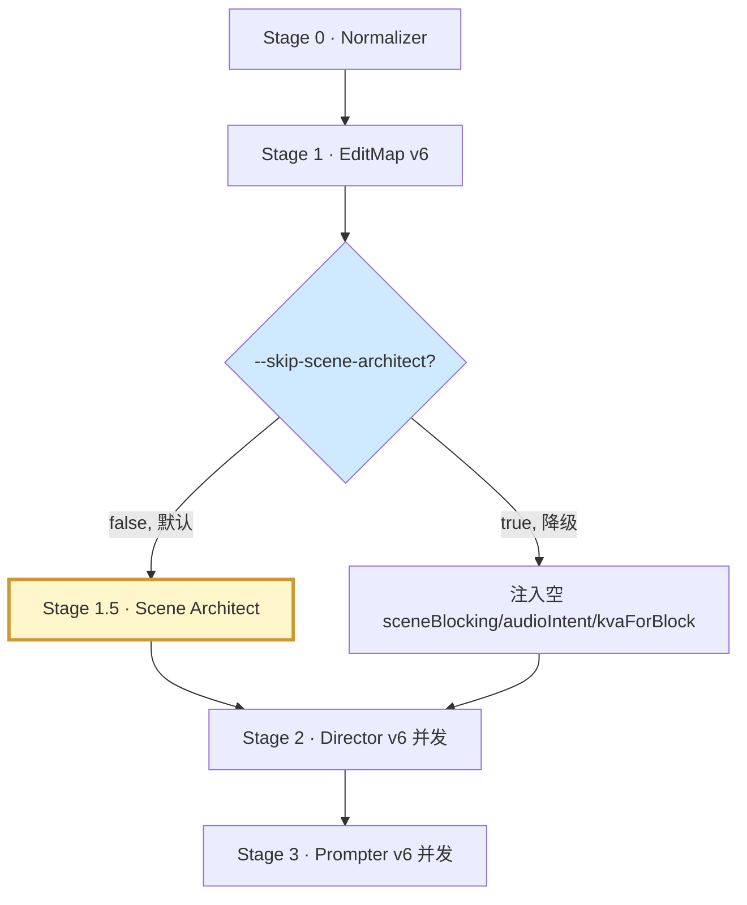

# v6 · 场级调度与音频意图（Stage 1.5 · Scene Architect）

**状态：规划中（Draft）**
**优先级：P1**
**日期：2026-04-20**
**适用阶段：v6.1 · 视听调度层补齐**

---

## 文档目的

v5 管线在"叙事层"（EditMap）与"镜头层"（Director/Prompter）之间缺失一个**视听调度层**，导致两类问题：

1. **空间跳接**：同一角色在连续 Block 之间画面位置飘移（左→右→中），没有场级锚点；
2. **音频套话**：`[SFX]` / `[BGM]` 由 Prompter 自由发挥，同一剧本反复出现"水滴声 + 低频嗡鸣"，与剧情爆点不耦合。

本文档定义在 EditMap 之后、Director 并发之前插入 **Stage 1.5 · Scene Architect** 独立 agent，承担"场级空间调度 + 音频意图表 + 关键视觉动作编排"三项职责。

> **职责澄清（与 02 号文档一致）**：Scene Architect **不做 KVA 抽取**（抽取归 Normalizer v2，见 02 号文档 §4.2）；本层仅在 Normalizer 产出的 `key_visual_actions[]` 基础上**追加块级落位 / 镜头定位建议等调度元数据**，并通过 `kva_missing_feedback[]` 反馈通道回写 Normalizer。

---

## 一、为什么单独分层，而不是合进 EditMap

| 方案 | 改动面 | 风险 |
|------|--------|------|
| A · 堆到 EditMap | EditMap 已管 10 项结构化产出，再加 3 项会显著抬 token 长度与自检失败率 | 高 |
| B · 新增 Stage 1.5 Scene Architect | 单一职责 · 可独立回归 · 支持降级跳过 | **低（推荐）** |
| C · 下沉到 Normalizer | Normalizer 语义是"抽取"而非"推理"，混合两种职责 | 中 |

**核心区分**：
- EditMap = 叙事层（情绪 / 权力 / 信息差 / 爽点结构）
- Scene Architect = **视听调度层**（空间 / 音响 / 结构化动作）
- Director = 镜头层（景别 / 运镜 / 画面描述）
- Prompter = 成品层（SD2 prompt 产出）

层次不同，各司其职。

---

## 二、Scene Architect 职责边界

### 2.1 只做三件事

1. **Scene Blocking Sheet**（场级舞台调度）— 解决空间跳接
2. **Audio Intent Ledger**（块级音频意图）— 解决音频套话
3. **Key Visual Actions 编排**（为 Normalizer 抽取的 KVA 追加 `suggested_block_id / suggested_shot_role` 等调度元数据）— 解决分屏/推门/特殊构图的**块级落位**

### 2.2 坚决不碰

- 不分 block（EditMap 的事）
- 不写 routing 标签（EditMap 的事）
- 不出分镜描述 / 景别 / 运镜（Director 的事）
- 不出 SD2 prompt（Prompter 的事）
- 不改写对白 / 动作原文（Normalizer 的真相源不可覆写）
- **不做 KVA 抽取**（归 Normalizer v2，见 02 号文档 §4.2。Scene Architect 只在 Normalizer 产出的 `key_visual_actions[]` 基础上做编排追加；若 Normalizer 未抽到而 Scene Architect 认为该抽，须回写 Normalizer 输入端反馈通道，不在本层直接新增 KVA 条目）

---

## 三、实现策略：混合型（LLM 主干 + 读取 Normalizer 产出）

用户定调：**混合**。KVA **抽取**下沉到 Normalizer v2（规则 + LLM 兜底，见 02 号文档 §4.2）；Scene Architect 只做 LLM 主干的**调度编排**。

| 子任务 | 实现方式 | 理由 |
|--------|----------|------|
| Scene Blocking Sheet | **LLM 主干** | 人物站位、视线轴线、景别走向需剧情语义理解，规则难以覆盖 |
| Audio Intent Ledger | **LLM 主干** | BGM 走向、SFX 命中与情绪曲线深度耦合，LLM 更擅长 |
| KVA 编排（`suggested_block_id / suggested_shot_role`） | **LLM 读取 Normalizer 产出** | Normalizer 产 `key_visual_actions[]` 真相源；Scene Architect 按场景语义分配块级落位与镜头定位建议，**不新增条目**。若 LLM 认为 Normalizer 漏抽，写入 `meta.kva_missing_feedback[]`（回写反馈通道，下一次 Normalizer 迭代消化），本层不硬补。 |

---

## 四、Schema 定义

### 4.1 Scene Blocking Sheet（场级）

```jsonc
{
  "scene_blocking_sheets": [{
    "scene_id": "SC_002",
    "scene_label": "副院长办公室",
    "covered_block_ids": ["B04","B05","B06","B07","B08"],
    "stage_axis": "door-to-desk",
    "sightline_baseline": "desk_center ↔ door",
    "actor_positions": [
      { "character_cn": "赵凯", "default_position": "desk_center",
        "position_timeline": [
          { "at_block": "B04", "position": "desk_center", "posture": "站立" },
          { "at_block": "B05", "position": "desk_center", "posture": "坐下" }
        ]},
      { "character_cn": "许倩", "default_position": "desk_side_right",
        "position_timeline": [
          { "at_block": "B05", "position": "desk_lap", "posture": "跨坐" },
          { "at_block": "B06", "position": "desk_side_left", "posture": "起身" }
        ]},
      { "character_cn": "秦若岚", "default_position": "door_out",
        "position_timeline": [
          { "at_block": "B04", "position": "door_out", "posture": "停住" },
          { "at_block": "B05", "position": "door_ajar", "posture": "窥见" },
          { "at_block": "B06", "position": "door_in", "posture": "推入" },
          { "at_block": "B08", "position": "desk_front", "posture": "质问" }
        ]}
    ],
    "sightline_pairs": [
      { "from": "秦若岚", "to": "赵凯", "at_blocks": ["B06","B07","B08"] },
      { "from": "秦若岚", "to": "许倩", "at_blocks": ["B06"], "type": "triangular" }
    ],
    "composition_bias": {
      "shot_size_trend": ["wide","medium","close","medium","wide"],
      "angle_tendency": "eye_level_with_low_angle_on_payoff",
      "depth_mode": "shallow_dof_on_intimacy"
    }
  }]
}
```

字段语义说明：

| 字段 | 语义 |
|------|------|
| `stage_axis` | 视线与运动主轴，用于 180° 轴线铁律 |
| `actor_positions[].position` | 受控词表：`door_in/door_out/door_ajar/desk_center/desk_side_left/desk_side_right/desk_lap/desk_front/window_left/couch_right/off_screen` 等 |
| `sightline_pairs[].type` | `dyadic` / `triangular` / `broken`（视线错位） |
| `composition_bias.shot_size_trend` | 本场戏的**景别走向**，每个 block 一个，Director 做每 block 的 shot 分配时必须贴合 |

### 4.2 Audio Intent Ledger（块级）

```jsonc
{
  "audio_intent_ledger": [
    { "block_id": "B01",
      "bgm": { "trend": "ambient_build", "intensity_0_5": 1, "motif_tag": "curiosity_low_brass" },
      "environment_bed": { "primary": "hospital_corridor_ambient",
                           "layers": ["footsteps_tile","distant_paging","hvac_low_hum"] },
      "sfx_hits": [
        { "at_shot_idx": 1, "label": "high_heel_click_solo", "emphasis": "normal" },
        { "at_shot_idx": 3, "label": "nurse_whisper_gossip", "emphasis": "soft" }
      ],
      "dialogue_balance": { "mode": "clear", "vo_layer": null }
    },
    { "block_id": "B09",
      "bgm": { "trend": "peak_drop", "intensity_0_5": 5, "motif_tag": "cold_revenge_strings" },
      "environment_bed": { "primary": "office_interior_sparse", "layers": ["distant_rain_window"] },
      "sfx_hits": [
        { "at_shot_idx": 2, "label": "evidence_slap_on_desk", "emphasis": "hard" },
        { "at_shot_idx": 4, "label": "breath_intake_cold",    "emphasis": "hard" }
      ],
      "dialogue_balance": { "mode": "protagonist_foreground", "vo_layer": "inner_monologue" }
    }
  ]
}
```

字段语义说明：

| 字段 | 语义 |
|------|------|
| `bgm.trend` | `silence / ambient_build / tension_rise / peak_drop / aftermath_fade / cliff_sting` |
| `bgm.intensity_0_5` | 0 = 无 BGM · 5 = 峰值；与节奏层 `rhythm_timeline` 爆点时间轴对齐 |
| `sfx_hits[].emphasis` | `soft / normal / hard`，`hard` 对应重音撞击 |
| `dialogue_balance.mode` | `clear / crowd_overlap / protagonist_foreground / whisper_subjective` |

### 4.3 Key Visual Actions 编排输出（片级）

**真相源**来自 Normalizer `beat_ledger[].key_visual_actions[]`（含 `kva_id / seg_id / beat_id / action_type / priority` 等抽取字段）；Scene Architect 在**只读**的基础上追加以下调度字段：

```jsonc
{
  "key_visual_actions_schedule": [
    { "kva_id": "high_heel_entry",    "seg_id": "SEG_003", "beat_id": "BT_001",
      "suggested_block_id": "B01", "suggested_shot_role": "entry_signature_close_up",
      "must_cover": true, "schedule_source": "scene_architect" },
    { "kva_id": "door_barge_in",      "seg_id": "SEG_028",
      "suggested_block_id": "B06", "suggested_shot_role": "climax_entry",
      "must_cover": true, "schedule_source": "scene_architect" },
    { "kva_id": "split_screen_finale","seg_id": "SEG_067",
      "suggested_block_id": "B10", "suggested_shot_role": "closing_irony_freeze",
      "must_cover": true, "schedule_source": "scene_architect" }
  ],
  "kva_missing_feedback": [
    /* 若 Scene Architect 认为剧本含某个 KVA 但 Normalizer 未抽到，写这里回写给 Normalizer 下一轮迭代，本层不硬补条目 */
  ]
}
```

字段含义：`suggested_block_id` 为建议落到的 block；`suggested_shot_role` 是对 Director 的镜头定位建议；`must_cover` 直接承袭 Normalizer 的 `priority==P0`；`schedule_source` 永远是 `scene_architect`，抽取源字段（`source`）保持 Normalizer 原值不动。

---

## 五、与 EditMap 的契约（C 选项 1）

用户选定 **EditMap 出草案 → Scene Architect 微调**。



Scene Architect **不能**改 EditMap 的 block 切分、routing、meta.status_curve 等叙事层结论，**只能微调**：

| 可微调项 | 微调范围 |
|----------|----------|
| `rhythm_timeline.mini_climaxes[i].at_sec` | 在 block 边界内偏移 ±3s，对齐 KVA 真实发生秒 |
| `rhythm_timeline.major_climax.at_sec` | 同上 |
| `rhythm_timeline.mini_climaxes[i].five_stage.*.shot_idx` | 细化到 shot 序 |

微调必须在 `scene_architect_output.meta.rhythm_adjustments[]` 记录原值与新值。

---

## 六、输入输出契约

### 6.1 输入

```jsonc
{
  "edit_map": { /* EditMap v6 完整产出 */ },
  "normalized_script_package": { /* Normalizer v1 完整产出 */ },
  "style_inference": { /* EditMap.meta.style_inference */ },
  "rhythm_timeline_draft": { /* EditMap.meta.rhythm_timeline 草案 */ }
}
```

### 6.2 输出

```jsonc
{
  "meta": {
    "kind": "scene_architect_output_v6",
    "generated_at": "2026-04-22T10:00:00Z",
    "rhythm_adjustments": [
      { "path": "mini_climaxes[2].at_sec", "from": 60, "to": 58, "reason": "对齐 KVA door_barge_in 实际秒" }
    ]
  },
  "scene_blocking_sheets": [ /* §4.1 */ ],
  "audio_intent_ledger":   [ /* §4.2 */ ],
  "key_visual_actions":    [ /* §4.3 */ ],
  "rhythm_timeline":       { /* §4 微调后回填 */ }
}
```

---

## 七、Director / Prompter 的消费点

### 7.1 Director payload v6 追加字段

```jsonc
{
  /* 04 号文档新增 */
  "scriptChunk": { /* … */ },
  "styleInference": { /* … */ },

  /* 05 号文档（本文档）新增 */
  "sceneBlocking": {
    "scene_id": "SC_002",
    "stage_axis": "door-to-desk",
    "my_block_positions": [
      { "character_cn": "秦若岚", "position": "door_ajar", "posture": "窥见" }
    ],
    "sightline_pairs_active": [ /* 本 block 生效的视线对 */ ],
    "composition_bias_at_block": { "shot_size_trend_hint": "medium→close", "angle_tendency": "eye_level" }
  },
  "audioIntent":  { /* ledger[this_block] */ },
  "kvaForBlock":  [ /* key_visual_actions where suggested_block_id == this_block */ ]
}
```

### 7.2 Director Prompt 新增章节

```text
## §I.3 视听调度契约（v6）

- payload.sceneBlocking.my_block_positions 是本 block 所有角色的**物理站位锚点**，
  所有 shot 的画面描述必须与之一致；禁止自行把角色写到别的位置。
- payload.kvaForBlock 列出的 KVA **必须**每个至少一个 shot 消费，`suggested_shot_role`
  给出了该 shot 的定位建议；若覆盖不全 → appendix.kva_consumption_report 必须声明。
- payload.audioIntent 提供 BGM/SFX/Environment/Dialogue 四层参数；Prompter 会直接消费，
  Director 本层仅做"shot 级音效打点位置"（在每个 shot 标注 `audio_cue_at_shot_end`）。
```

### 7.3 Prompter Prompt 新增铁律

```text
【铁律 16（v6 · 音频意图落地）】
- payload.audioIntent.bgm 必须映射为 [BGM] 段的 trend/intensity 描述；
- payload.audioIntent.sfx_hits 每一条必须在 [SFX] 段精确打点；
- payload.audioIntent.dialogue_balance.mode 决定 [DIALOG] 段的声像处理
  （如 whisper_subjective → 近距耳语音色）。
```

---

## 八、Pipeline 编排变更



降级路径：`--skip-scene-architect` 时 Scene Architect 被跳过，下游 payload 的视听字段置为 null，Director/Prompter 回落 v5 行为。这保证上线初期可先跑 v6.0（04 + 06 号文档）再增量启用 v6.1（本文档）。

---

## 九、验收用例

| UC | 输入 | 期望 |
|----|------|------|
| UC7 | SC_002 办公室 5 个 block | `scene_blocking_sheets[SC_002].actor_positions[秦若岚].position_timeline` 覆盖 B04–B08 每一块 |
| UC8 | `SEG_067` 含 "分屏 \| 交叉 \| 画面在讽刺中定格" | `key_visual_actions` 必须含 `kva_id=split_screen_finale` 与 `kva_id=freeze_frame_final`，`suggested_block_id` 均为末 block |
| UC9 | 末 block B10 | `audio_intent_ledger[B10].bgm.trend ∈ {peak_drop, cliff_sting}`；`sfx_hits` 至少 1 条 `emphasis=hard` |
| UC10 | `--skip-scene-architect` 降级 | 下游 payload 的 `sceneBlocking / audioIntent / kvaForBlock` 全为 null；Director/Prompter 不报错；输出与 v5 一致 |

---

## 十、小结

- v6.1 引入 Stage 1.5 Scene Architect，**独立可降级**，不增加 EditMap 负担；
- 混合实现：Blocking / Audio / KVA 编排 用 LLM 主干读取上游产出；**KVA 抽取归 Normalizer v2**，Scene Architect 只编排不抽取；
- 与 EditMap 关系：C 选项 1（EditMap 出草案 + Scene Architect 微调），不越权修改叙事层结论；
- 与 04/06 号文档解耦：本文档可单独延后落地，不阻塞 v6.0。
