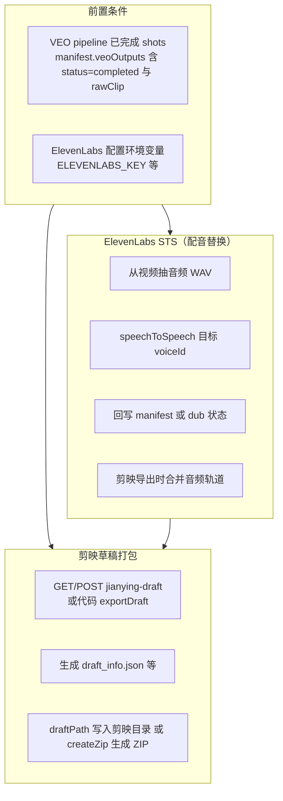

# 剪映草稿打包与 ElevenLabs STS 接入说明

本目录为 **UGCFlow 仓库内的统一接入层**：通过单一入口脚本聚合 `server/services` 中的剪映草稿导出与 ElevenLabs（含 **Speech-to-Speech / STS**）能力，并配套 HTTP 路由说明与类型声明。

---

## 流程图（Mermaid）



说明：线上完整流程中，**STS 先处理 dub**，剪映导出服务会读取 `buildAudioProtocolEntry` 将已生成的 dub 音频铺到时间轴（见 `jianyingDraftExportService.js`）。

---

## 一、程序化接入（Node 单文件入口）

从仓库根目录：

```js
const {
  INTEGRATION,
  jianying,
  elevenLabs,
} = require("./packages/ugc-export-integrations");

const { exportDraft, collectExportableShots } = jianying;
const { speechToSpeech, isConfigured } = elevenLabs;

console.log(INTEGRATION.version, isConfigured());
```

### 1.1 剪映 `exportDraft`

| 参数 | 类型 | 说明 |
|------|------|------|
| `manifest` | object | 含 `veoOutputs` 的 VEO runtime manifest |
| `baseDir` | string | 该变体 runtime 根目录（与 `veoShotPipelineService.getRuntimeDir` 一致） |
| `draftPath` | string \| null | 可选；剪映草稿根目录，将写入 `{draftPath}/{draftId}/` |
| `createZip` | boolean | 是否在 `baseDir/draft-export/` 下生成 `{draftId}.zip` |

**约束**：`draftPath` 与 `createZip` 至少一个有效；HTTP 层与脚本 `scripts/test/e2e-strong-template-replica.js` 中用法一致。

### 1.2 ElevenLabs STS `speechToSpeech`

| 参数 | 类型 | 说明 |
|------|------|------|
| `voiceId` | string | ElevenLabs 目标音色 ID |
| `audioBuffer` | Buffer | 源音频（通常为 WAV/PCM，服务端以 `source.wav` 上传） |
| `options` | object | 可选：`remove_background_noise`（默认 true）、`modelId`（默认 `eleven_multilingual_sts_v2`） |

返回：`{ audioBuffer, durationSec, contentType }`。

> 底层实现：`server/services/elevenLabsService.js`，依赖 `server/config` 中的 `ELEVENLABS_KEY`、`ELEVENLABS_BASE`、超时与重试配置。

---

## 二、HTTP API（接入外部系统）

**Base URL**：假定服务挂载为 `http://<host>:<port>/api`（以实际部署为准）。

### 2.1 剪映草稿

| 方法 | 路径 | 说明 |
|------|------|------|
| GET | `/api/projects/:projectId/variants/:variantId/veo-shot-pipeline/jianying-draft` | 读取上次导出状态（`manifest.draftExport`） |
| POST | 同上 | 执行导出；Body：`{ "draftPath"?: string, "createZip"?: boolean }`，需至少 `draftPath` 或 `createZip: true` |
| GET | `/api/system/jianying-draft-path` | 检测本机剪映草稿目录（辅助填 `draftPath`） |

**成功响应**（POST）：`buildApiData` 包裹的 `draftExport` 含 `draftId`、`draftDir`、`zipPath`、`exportedAt` 等（见 `variantRoutes.js` `postJianyingDraftExport`）。

### 2.2 ElevenLabs Voice Design + STS 配音流程（变体维度）

| 方法 | 路径 | 说明 |
|------|------|------|
| GET | `/api/projects/:id/variants/:variantId/voice-design` | 状态 + `elevenLabsConfigured` |
| POST | `/api/projects/:id/variants/:variantId/voice-design/auto` | 自动音色预热（可选） |
| POST | `/api/projects/:id/variants/:variantId/voice-design` | Body：`voiceDescription`, `languageCode?` |
| PATCH | 同上 | 更新 voice 配置 |
| POST | `/api/projects/:id/variants/:variantId/voice-design/create-voice` | Body：`generatedVoiceId`, `voiceName?` |
| GET | `/api/projects/:id/variants/:variantId/dub/status` | 各 shot dub 状态 |
| POST | `/api/projects/:id/variants/:variantId/dub/process` | Body：`voiceId`, `mode?`（`sts`|`tts`）, `concurrency?`；批量后台处理 |
| POST | `/api/projects/:id/variants/:variantId/dub/process-shot` | Body：`shotId`, `voiceId`, `mode?`；单 shot |

STS 对应 `mode: "sts"`，内部调用 `elevenLabsService.speechToSpeech`（见 `voiceChangerPipelineService.processShotDub`）。

---

## 三、环境变量（ElevenLabs）

| 变量 | 说明 |
|------|------|
| `ELEVENLABS_KEY` 或 `ELEVENLABS_API_KEY` | 必填，API 密钥 |
| `ELEVENLABS_BASE` | 可选，默认 `https://api.elevenlabs.io` |
| `ELEVENLABS_STS_TIMEOUT` | STS 超时（默认 120000 ms） |
| `ELEVENLABS_MAX_RETRIES` / `ELEVENLABS_RETRY_DELAY_MS` | 重试策略 |

完整列表见 `server/config.js` 中 ElevenLabs 段注释。

---

## 四、TypeScript

本包提供 `types.d.ts`，可在 TS 项目中：

```ts
import type { ExportDraftOptions, SpeechToSpeechResult } from "@ugcflow/export-integrations/types";
```

（若未配置路径别名，可使用相对路径指向 `packages/ugc-export-integrations/types.d.ts`。）

---

## 五、官方参考

- ElevenLabs API：<https://elevenlabs.io/docs/api-reference>
- Speech-to-Speech：`POST /v1/speech-to-speech/:voice_id`

---

## 六、自测

在仓库根目录执行：

```bash
node -e "const m=require('./packages/ugc-export-integrations'); console.log(m.INTEGRATION, Object.keys(m.jianying), Object.keys(m.elevenLabs));"
```

应打印版本号及 `exportDraft`、`speechToSpeech` 等导出键名。

### 6.1 懒加载说明

入口对 **剪映** 子模块采用 **懒加载**：仅在首次访问 `m.jianying`、`m.jianyingDraftExportService` 或读取 `INTEGRATION.jianyingExportMode` 时才会 `require` `jianyingDraftExportService`（该模块会拉取数据库等依赖，可能较慢）。若脚本只调用 **ElevenLabs STS**，请勿解构 `jianying`，直接使用 `m.elevenLabs` 即可。
