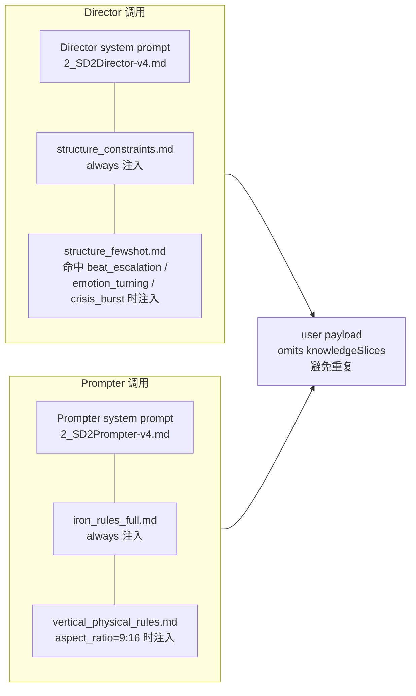

# 知识切片注入图

把 `4_KnowledgeSlices/injection_map.yaml` 翻译成人类可读形式，并给出注入时序。

## 注入架构



## 注入清单

### Director 消费

| slice_id | 文件 | max_tokens | 触发条件 |
|---|---|---:|---|
| `structure_constraints` | `director/structure_constraints.md` | 500 | **总是注入** |
| `structure_fewshot` | `director/structure_fewshot.md` | 800 | `structural_tags` 命中 `beat_escalation` / `emotion_turning` / `crisis_burst` 任一 |

### Prompter 消费

| slice_id | 文件 | max_tokens | 触发条件 |
|---|---|---:|---|
| `iron_rules_full` | `prompter/iron_rules_full.md` | 600 | **总是注入** |
| `vertical_physical_rules` | `prompter/vertical_physical_rules.md` | 400 | `aspect_ratio == "9:16"` |

## 预留位（injection_map.yaml 中已注释）

以下切片规则已在 yaml 中以注释形式预留，启用时把注释去掉并补充对应的 `.md` 文件即可：

- Director.emotion_gear （触发：`emotion_pivot` / `emotion_buildup`）
- Director.action_4phase （触发：`scene_bucket: action`）
- Director.closed_space_guide （触发：`interior_pressure` / `enclosed_space`）
- Director.hook_cliff_visual （触发：`hook_opening` / `cliff_ending`）
- Prompter.action_physical_vocab （触发：`scene_bucket: action`）

## 全局规则

| 规则键 | 值 | 含义 |
|---|---|---|
| `max_total_tokens_per_consumer` | `2000` | 单消费者切片拼接上限，超则按 priority 截断 |
| `priority_order` | `always_first_then_by_priority_asc` | always 切片优先，其次按 priority 升序 |
| `mixed_bucket_strategy` | `fskb_dual_bucket_slice_normal` | `scene_bucket == mixed` 时的处理策略 |
| `aspect_ratio_auto_append` | `true` | `9:16` 自动追加相关切片 |

## 切片命名约定

```
<slice_id>
  ↕ 一一对应
<consumer>/<slice_id>.md
  例: director/structure_constraints.md
      prompter/iron_rules_full.md
```

`slice_id` 必须和文件名（去 `.md`）一致；目录前缀 `director/` `prompter/` 决定消费者。
