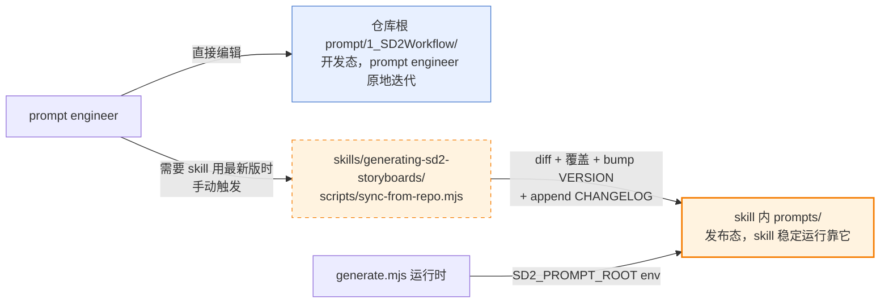

# Prompt 同步工作流

本 skill 内 `prompts/` 是一份**从仓库根 `prompt/1_SD2Workflow/` 拉进来的稳定副本**，
需要靠手动触发的同步脚本来保持与仓库根的一致。

## 架构图



## 为什么是两套，不是一套

| 维度 | 仓库根 prompt/ | skill 内 prompts/ |
|---|---|---|
| 角色 | 开发态/最新 | 发布态/锁定 |
| 改动频率 | 高（迭代中） | 低（需要时手动同步） |
| 直接使用者 | `node run_sd2_pipeline.mjs ...`（未设 env 默认值） | `node generate.mjs ...`（skill 入口） |
| 可手改 | 是 | **否**（下次 sync 会覆盖） |
| 版本号 | 无 | SemVer (VERSION 文件) |
| CHANGELOG | 无 | 有（由 sync 脚本自动维护） |

**好处**：prompt engineer 迭代时不用担心破坏 skill 的稳定运行；skill 跑出的产物可复现。

## 使用场景

### 场景 A：仓库根 prompt 改了，想让 skill 用上

```bash
# 1. 预览将要同步的文件差异（不改任何文件）
node skills/generating-sd2-storyboards/scripts/sync-from-repo.mjs --dry-run

# 2. 确认没问题后正式同步（交互确认）
node skills/generating-sd2-storyboards/scripts/sync-from-repo.mjs \
  --note "补 Director 情感切片 emotion_gear"

# 默认 bump patch (4.0.0 → 4.0.1)
# 加 --bump minor / --bump major 可以指定别的
```

### 场景 B：CI / 脚本中非交互运行

```bash
node skills/generating-sd2-storyboards/scripts/sync-from-repo.mjs \
  --bump patch \
  --note "weekly sync" \
  --yes        # 跳过交互确认
```

### 场景 C：检查当前 skill 副本版本

```bash
cat skills/generating-sd2-storyboards/prompts/VERSION

# 查最近同步历史
head -40 skills/generating-sd2-storyboards/prompts/CHANGELOG.md
```

## 版本号约定

| bump 类型 | 用在什么时候 |
|---|---|
| `patch` | 文案修订、笔误修复、等价改写；下游无需适配 |
| `minor` | 新增知识切片、非破坏性提示词调整；下游兼容 |
| `major` | 主 prompt JSON 协议变更、字段语义变更；**下游流水线需要同步改** |

## 同步脚本的不变量

1. `prompts/_deprecated/` 永不被 sync 碰（v4 不再消费的老东西归档在这）
2. `VERSION` / `CHANGELOG.md` / `README.md` / `KNOWLEDGE_GRAPH.md` / `CONSUMERS.md` 由 skill 自己维护，不从仓库根 sync
3. 仓库根 `3_FewShotKnowledgeBase/` v4 不用，sync 脚本跳过不拉
4. sync 方向永远是 **仓库根 → skill**，反向不支持

## 常见问题

**Q: 我不小心改了 `skills/.../prompts/` 里的文件，怎么办？**
A: 下次跑 `--dry-run` 会把你的改动列为"将被覆盖"。你有两个选择：
   - 如果改动有价值：把它移到仓库根 `prompt/1_SD2Workflow/` 对应文件，再跑 sync 拉回来
   - 如果改动是误操作：直接跑 `sync-from-repo.mjs` 覆盖掉

**Q: sync 会影响正在跑的 pipeline 吗？**
A: 不会。`generate.mjs` 在启动时读 prompts 到内存，之后是 stdio 透传。但**不要在 pipeline 运行期间跑 sync**，会造成同一次运行内部 prompt 版本不一致。

**Q: 能自动 sync 吗？**
A: 故意不做。自动 sync 会让 skill 跑出的产物不可复现（你不知道这次用的是哪版 prompt）。手动 sync + CHANGELOG 才是可追踪的。
